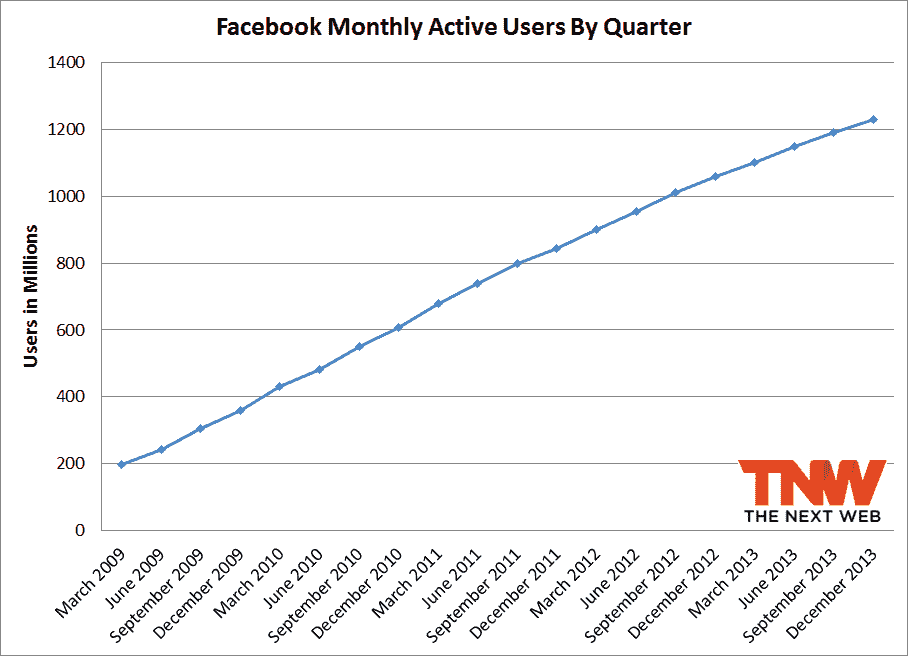
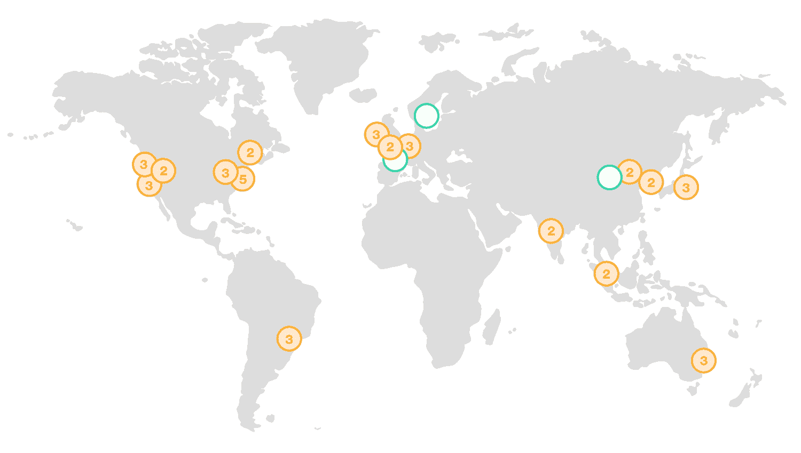
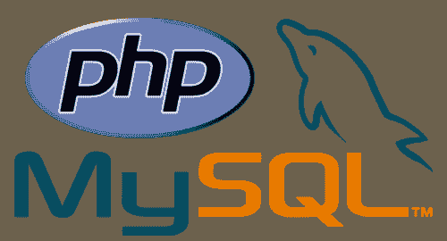

# 有可能在 AWS 上主持脸书吗？SQLizer 官方博客

> 原文：<http://blog.sqlizer.io/posts/facebook-on-aws/?utm_source=wanqu.co&utm_campaign=Wanqu+Daily&utm_medium=website>

脸书从 2004 年开始就在[左右了。自那以后的几年里，这家公司，现在是美国科技巨头](https://en.wikipedia.org/wiki/Timeline_of_Facebook)[的五大巨头之一](http://www.visualcapitalist.com/chart-5-tech-giants-make-billions/)，已经从一台在宿舍里运行的服务器发展到[遍布全球的七个](http://www.datacenterknowledge.com/the-facebook-data-center-faq/)专用数据中心。随着脸书预计其 19.4 亿的用户数量继续增长，未来几年可能还会有更多的计划。

最近关于 Snap 与[谷歌云平台](https://en.wikipedia.org/wiki/Google_Cloud_Platform)和 [AWS](https://en.wikipedia.org/wiki/Amazon_Web_Services) (亚马逊网络服务)达成 20 亿美元+10 亿美元交易的消息让我们想知道是否有可能在 AWS 上运行脸书这个庞然大物。

要回答这个问题，我们需要把它分成四个独立的部分:

*   服务器容量
*   服务器硬件性能
*   软件
*   费用

现在记住，我们不是问脸书*是否应该*在 AWS 上主持——我们只是问 T2 是否可能。

​

## 1.服务器容量

由于脸书已经有一段时间没有分享其服务器容量的确切数字，这是基于一些现有的猜测的大量猜测。用一把盐把这些数字带走。

​

### 脸书有多少台服务器？

早在 2012 年，数据中心知识估计脸书运行着 [180，000 台服务器](http://www.datacenterknowledge.com/archives/2012/08/15/estimate-facebook-running-180000-servers/)。这一估计是基于 2010 年的一组数据——最近一组可用于[精确计算](http://perspectives.mvdirona.com/2010/06/60000-servers-at-facebook/)的数据显示脸书 2010 年的服务器数量为 60，000 台。如果我们认为 2012 年的估计是正确的，脸书的服务器容量将超过 T4 的摩尔定律。

​

 *脸书的用户增长，[下一张网](https://thenextweb.com/wp-content/blogs.dir/1/files/2014/01/fb_q4_2013_total.png)*

​

我们试图计算出五年后(2012-2017 年)脸书现在有多少台服务器。为了尝试得到一些相似的精确度，我们做了三种不同的计算。

​

#### 计算一:每台服务器的用户数

我们将从“每台服务器的用户数”开始，以此来计算脸书有多少台服务器。

*   2012 年，脸书拥有 10 亿用户和 18 万台服务器。
    *   1，000，000，000 个用户/ 180，000 台服务器=每台服务器 5，556 个用户
*   2017 年，脸书拥有近 20 亿用户。
    *   每台服务器 2，000，000，000 个用户/ 5556 个用户= 360，000 台服务器

我们需要考虑到，脸书不仅有两倍的用户，而且人均创造了更多的数据-照片，视频，直播流等。此外，它现在还托管 Instagram。所以让我们把数量翻倍。

*   360，000 * 2 = 720，000 台服务器

根据这一计算，脸书在 2017 年运行约 72 万台服务器。

​

#### 计算二:每台服务器的收入

接下来是“每台服务器的收入”，这是计算服务器容量的一种方法。

*   2012 年，脸书的收入为 50.89 亿美元。如果我们将 2012 年的收入除以 2012 年的服务器数量，我们会得到每台服务器 28k 美元的收入
    *   50.89 亿美元收入/ 180，000 台服务器=每台服务器 28，272 美元收入
*   2016 年，脸书的收入为 276.38 亿美元，如果除以 28272 美元，我们得到 977575 台服务器。
    *   27，638，000，000 美元收入/每台服务器 28，272 美元收入= 977，574.98 台服务器

根据这一计算，脸书在 2017 年运行约 978K 台服务器。

​

#### 计算三:每台服务器的员工数

此计算使用员工作为服务器容量的衡量标准。

*   2012 年，脸书拥有 4619 名员工，相当于每名员工拥有 40 台服务器。
    *   180，000 台服务器/ 4619 名员工=每位员工 38.96 台服务器
*   2016 年，脸书拥有 17048 名员工。按每位员工 40 台服务器计算，大约有 681，920 台服务器。
    *   17，048 名员工*每位员工 40 台服务器= 681，920 台服务器

根据这一计算，脸书在 2017 年运行约 682K 台服务器。

​

#### 服务器带来的不同

这三种计算之间的范围是 296，000。

*   978,000 - 682,000 = 296,000

我们在中间会合，用它作为我们的最终数字。

*   296,000 / 2 = 148,000
*   68.2 万+14.8 万= 83 万**或**97.8 万-14.8 万= 83 万

**我们估计 2017 年脸书有 830，000 台服务器。**

​

### AWS 有多少台服务器？

AWS 的全球基础设施， *AWS*

​

AWS 可以细分如下:

*   区域-完全封闭的地理区域(如“欧洲”或“美国西部”)
*   可用性区域(AZs) -由一个或多个数据中心组成的区域内的区域(例如“伦敦”或“俄勒冈州”)
*   数据中心——本质上是巨大而昂贵的仓库，存放着 5 万到 8 万台服务器

截至 2017 年，AWS 已经:

*   16 个地区(还有三个地区正在筹备中)
*   42 个 az(新区域上线后还有 8 个)

自己看看 [AWS 全球基础设施](https://aws.amazon.com/about-aws/global-infrastructure/?hp=tile)明细。

如果我们假设每个数据中心平均有 65000 台服务器，每个 AZ 平均有 1.5 个数据中心，那么我们剩下 409.5 万台潜在服务器。同样，我们将四舍五入，得出 AWS 总共有 410 万台服务器。

*   (42 个 AZ * 1.5 数据中心)* 65，000 台服务器= 4，095，000 台

2014 年，Enterprise Tech 做了一些[类似的计算](https://www.enterprisetech.com/2014/11/14/rare-peek-massive-scale-aws/)(基于 28 个 az 的过时数据，但推理仍然合理)，并提出了 280 万到 560 万服务器的范围。他们估计每个 AZ 平均有三个数据中心。如果他们对每个 AZ 三个数据中心的估计是准确的，那么 AWS 可能在全球拥有超过 800 万台服务器。

​

### 纯服务器容量

就纯粹的服务器容量而言，根据上面的计算(可能不准确)，AWS 可以托管脸书 5 倍以上。

*   脸书需要 83 万台服务器
*   AWS 有 410 万台服务器
*   4,100,000 / 830,000 = 4.939

一个警告:这没有考虑 AWS 目前的能力限制。AWS 的日常运营中有多少闲置产能？AWS 有 20%的备用产能分配给脸书吗？我们将忽略这些问题，并假设 AWS 可以吸收脸书当前的需求——也许是以牺牲灵活性为代价。

至于未来的服务器需求，脸书和 AWS 都在持续投资他们的服务器基础设施，所以我们假设未来的 AWS 可以承载未来的脸书。

​

> 就纯粹的服务器容量而言，在 AWS 上托管脸书是可能的吗？

可能的答案是肯定的。

​

## 2.服务器硬件性能

我们不能只是假设 AWS 的服务器将提供与脸书相同的性能，所以服务器性能需要考虑在内。脸书在服务器基础设施上投入了数十亿美元。随着规模的扩大，它从笔记本电脑上的服务器，到从第三方租赁服务器，再到建立自己的数据中心。一旦它开始设计和构建自己的数据中心，开箱即用的解决方案就不再是一个选项。

​

施工中的脸书沃斯堡数据中心。

​

脸书七个数据中心的各个方面都是为了实现最佳性能和效率而设计的。从整体数据中心设计的大图到服务器芯片的机箱等细节元素，一切都是定制的。

“为了优化成本，我们去掉了标准服务器中的许多组件，”从头开始设计脸书服务器的阿米尔·迈克尔(Amir Michael)在 2009 年说。

​

> “我们移除了任何没有功能的东西。没有挡板或油漆。”

​

2011 年，脸书[开源](http://opencompute.org/)其所有的数据中心和服务器设计，传播对设计效率的热爱。包括谷歌在内的其他公司也做出了贡献。这产生了推动硬件成本下降的额外效果，因为第三方制造商开始生产组件，使得建造定制数据中心更加便宜。你可以在[数据中心知识](http://www.datacenterknowledge.com/archives/2016/04/28/guide-to-facebooks-open-source-data-center-hardware/)上看到脸书服务器硬件的完整列表。

因此，脸书现有的服务器基础设施得到了优化，以帮助脸书尽可能高效地运营脸书。例如，在服务器群中有一个单独的区域用于[【冷存储】](https://techcrunch.com/gallery/a-look-inside-facebooks-data-center/)，存储那些不再被观看的照片和视频(那些已经在脸书上保存了大约 10 年的照片)。只有当有人想要访问照片或视频时，存储才会“醒来”。

​

<iframe src="https://www.youtube.com/embed/X9ELENWZqLE" frameborder="0" allowfullscreen="">VIDEO</iframe>

​

脸书多年来在运行脸书方面的专业化与 AWS 形成对比，后者的存储是为多用途(尽管很重)使用而设计的。但是，像脸书和谷歌一样，亚马逊设计自己的硬件。

“是的，我们建立自己的服务器，”亚马逊首席技术官沃纳·威格尔说。“我们正在构建定制的存储和服务器来应对这些(繁重的)工作负载。我们已经与英特尔合作，使家用处理器能够以更高的[时钟频率](https://en.wikipedia.org/wiki/Clock_rate)运行

虽然 AWS 可能更通用，但它的服务器性能不太可能比脸书的差。然而，专业化和效率的提高大有可为——为什么大型科技公司要这样做呢？脸书极有可能需要更多的 AWS 服务器来获得与自己的数据中心同等的性能。考虑到这一点，并弥补真实数据的不足，我们将估计脸书将需要比目前多 10%的容量，从而将服务器数量推高至 913，000 台。

​

参观脸书的普赖恩维尔数据中心。

​

同样值得注意的是，脸书正计划将 WhatsApp 从 IBM 的公有云服务器转移到自己的服务器上。WhatsApp 目前使用 700 台裸机(类似于脸书)，高端 IBM SoftLayer 服务器，可能提供与脸书自己的硬件相同的性能。但是这个数字(700！)与我们正在讨论的数字相比微不足道，因此我们假设未来的需求将包含在未来的增长计划中。

​

### 迁移？

在现实世界中，脸书迁移到 AWS 显然没有意义。这个思想实验与从脸书到 AWS 的迁移无关——我们只是想看看它是否可行。事实上，整篇文章都假设脸书从开始构建自己的基础设施时就开始托管 AWS。

但是为了便于讨论，在我们的平行宇宙中，AWS 的迁移会有多顺利，需要多长时间？脸书在 2013 年至 2014 年间将 Instagram 从 AWS 转移到了自己的服务器上。过了一年[没人注意到](https://www.wired.com/2014/06/facebook-instagram/)。根据这一经验，很可能您可以在最终用户毫不知情的情况下进行反向迁移。

然而……这是我们正在谈论的脸书的全部，包括 Instagram，所以它可能需要更长的时间。与这种理论上的迁移相比，Instagram 的迁移相对较小——更不用说 Instagram 自那以后已经增长了*很多*。然后是网飞。[用了八年](https://media.netflix.com/en/company-blog/completing-the-netflix-cloud-migration)才把网飞完全迁移到 AWS。八年了！

基于这个轶事证据，迁移可能会相当顺利，但需要几年时间。

​

### 服务器硬件性能

AWS 和脸书都在定制数据中心和服务器的设计和实施上投入了大量资金。对于所有的开源设计来说，两者很可能在相似的性能水平上运行。

我们认为 AWS 可以轻松为脸书提供所需的计算能力和性能。但由于 AWS 并没有针对脸书的具体需求进行调整，我们会留有一些余地。脸书用 83 万台自己的服务器可以做的事情，可能需要 91.3 万台 AWS 服务器才能完成。

​

> AWS 能为脸书提供它需要的服务器性能吗？

很有可能是。

​

## 3.软件

脸书过去是(现在仍然是)使用 OSS(开源软件)开发的。像许多其他公司一样，它发展的速度如此之快，规模如此之大，以至于经常需要构建自己的工具或对现有工具进行重大修改以满足其需求。

它的应用程序代码仍然使用 PHP 开发，但为了获得更好的性能，脸书开发了 [HipHop 虚拟机](http://hhvm.com/) ( [HHVM](https://en.wikipedia.org/wiki/HHVM) )来实时(JIT)编译 PHP 代码。这意味着脸书代码可以使用 HHVM 和 nginx 的组合来服务。[脸书的整个网站在 HHVM](https://docs.hhvm.com/hhvm/FAQ/faq) (桌面、API 和移动)上运行，包括开发和生产。这就是定制软件的定义。

似乎 AWS 与 PHP 和 HHVM 有着令人担忧的历史。但是在脸书自己的 [HHVM GitHub 仓库](https://github.com/facebook/hhvm/wiki/Amazon-Linux)中，有一个链接指向 [HHVM 的 AWS Linux 服务器](https://github.com/facebook/hhvm/wiki/Building-and-installing-HHVM-on-Amazon-Linux-2016.03)。因此，我们可以假设，脸书将能够在 AWS 上成功运行 HHVM，从而运行脸书站点。

​

​

那么数据库呢？说到数据存储，在 [SQL vs NoSQL flamewars](http://blog.sqlizer.io/posts/sql-vs-nosql/) 期间流传的一个臭名昭著的例子是，脸书对 [MySQL](https://www.mysql.com/customers/view/?id=757) 进行了大量修改，用于存储[时间轴](http://mashable.com/2011/12/15/facebook-timeline-mysql/#LagKhxTsa8qJ)数据，依靠 [memcached](https://memcached.org/) 来实现快速交付。你可以广泛阅读脸书关于[高可扩展性](http://highscalability.com/blog/category/facebook)的扩展之旅。具体的脸书-MySQL [在这里](http://highscalability.com/blog/2010/11/4/facebook-at-13-million-queries-per-second-recommends-minimiz.html)。

亚马逊 RDS(关系数据库服务)会削减它吗？有一些大型科技公司在使用亚马逊 RDS，最著名的是网飞。或许，如果网飞及其所有的视频都成功地使用了 RDS，那么脸书也可以吗？不过，这是有问题的——脸书的 MySQL 集群将会非常庞大，简单的迁移可能无法解决这个问题。它甚至有自己的 MySQL 分支来处理它的负载。

如今，脸书也拥有大量的技术储备。它的 [Github 回购](https://github.com/facebook)证明了这一点。这引发了更多关于与 AWS 兼容性的担忧。

也许最能说明这有多难的信息来自网飞，他在转向分布式云运营的过程中重建了大部分技术。

​

> AWS 能否支持脸书庞大的软件阵列和复杂的数据需求？

这是有可能的，但几乎可以肯定的是，它的性能会低于标准，脸书甚至可能需要建立新的系统来做到这一点。

​

## 4.在 AWS 上托管脸书要花多少钱？

注意:这可能是本文最不准确的部分。尽管 AWS 提供了广泛的计算选项，但不可能知道脸书实际需要的数据存储和计算要求。同样，这些数字完全是猜测。

​

我们谜题的最后一块:成本。尽管 AWS 让无数公司得以快速、廉价地扩大规模，但大多数公司永远无法达到脸书的规模。在 Facebook 这样的规模下，建立自己的基础设施可能会变得更便宜(他们有，但我们正在拆除^.^).

在我们使用 AWS 自己的计算器进行计算之前，让我们先来看看全球产品的云计算成本。

在 Snapchat 的 IPO 文件中，世界暴露在 Snap Inc .承诺在 5 年内支付 30 亿美元给谷歌和 T2 的 AWS。这相当于每月 5000 万美元。大多数科技界人士对这些巨大的数字感到有点震惊。关于付费存储和计算消失内容的笑话比比皆是。

如前所述，WhatsApp 仍然托管在 IBM 的公共云服务器上，但脸书正计划很快迁移它。然而，托管 WhatsApp 的总成本一度达到了每月 100 美元 2M。对于一个仅使用 700 台服务器的应用程序来说，这是一笔不菲的月账单。

我们可以假设脸书比 WhatsApp 和 Snapchat 都有更高的使用需求。

​

### 成本计算

下面的计算很简单，基于 913，000 台服务器，分布在 EC2 compute、亚马逊 S3、亚马逊 RDS 以及照片和视频的数据存储和传输之间，每月合并数据传输量为 1，1,256.5，256，500 TB)。

这假设:

*   每天上传 3 亿张照片，平均每张照片 4MB
*   每天上传 1 亿小时的视频，平均每个视频 200MB

这绝不是一个复杂而细致的计算。

那就开始计算吧。

​

**亚马逊 EC2**

计算:Amazon EC2 实例(运行 PHP 代码等。)

*   实例:713，000
*   100%月利用率
*   r3.2xlarge 上的 Linux
*   3 年全部预付预订

​

**亚马逊 S3**

存储(照片和视频)

*   标准存储:1256.5 PB
*   上传/复制/发布/列表请求:2147483647
*   获取和其他请求:2147483647

数据传送

*   地区间数据转出:314125
*   数据转出:628250
*   数据转移输入:1256500
*   数据传输到 CloudFront: 1256500

​

**亚马逊 RDS**

亚马逊 RDS 按需数据库实例(运行脸书的时间表)

*   数据库实例:200，000
*   100%月利用率
*   数据库引擎和许可证:MySQL
*   类别:db.r3.2xlarge
*   部署:多 AZ
*   存储:通用，1TB

数据传送

*   区域间数据传出:500TB
*   数据输出:500TB
*   数据传输量:500TB
*   区域内数据传输:500TB

​

**总计**

*   一次性付款总额(3 年期预付):39.33846 亿美元(39 亿美元)
*   平均 36 个月的一次性付款:每月 1.092735 亿美元(1.09 亿美元)
*   每月费用(不包括一次性付款):389，020，939.96 美元(3.89 亿美元)
*   每月总成本:1.08 亿美元+3.89 亿美元= 4.98 亿美元
*   **年度总成本:59.79521279.52 亿美元(59.7 亿美元)**

​

> 理论上，脸书每年将花费 59.7 亿美元来托管 AWS。

​

### 巨人脸书

随着年收入超过 280 亿美元，总市值达到 4340 亿美元，全球用户超过 19.4 亿，脸书显然拥有一些庞大而复杂的基础设施。此前在 2012 年的估计是，脸书拥有价值约 40 亿美元的服务器基础设施。目前，这一数字可能会增加两倍，达到 120 亿美元左右。

然而，每年 59.7 亿美元的托管费用远远高于脸书 2017 年的全部“收入成本”(37.89 亿美元)，其中包括数据中心及其运营成本等。

值得注意的是，这个 AWS 价格不会是脸书在这种假设情况下支付的价格。就像 Snapchat 和网飞一样，脸书将是一个有影响力的重度用户，因此能够谈判并达成一笔可能非常接近主机托管成本的交易。

​

> 脸书有能力支付 AWS 的托管费用吗？

是的，但是会很贵。

​

## 有可能在 AWS 上主持脸书吗？

没有办法知道这些思想实验是否准确，但这里有一个回顾:

1.  就纯粹的服务器容量而言，AWS 似乎可以满足脸书的需求。

2.  服务器硬件可能提供不太理想的性能，但我们可以用更多的服务器和计算能力来解释这一点。

3.  软件是事情变得棘手的地方。脸书能否简单地将其现有的基础设施直接移植到 AWS 是个问题。尽管这可能意味着在 AWS 的现有基础设施上建立新的系统，但可能存在可行的解决办法。这会很痛苦，而且现在没有意义。但是如果脸书在 2010/2011 年主持 AWS，他们的技术可能会围绕这个发展。所以我们说软件不会是问题，但是会很棘手。

4.  脸书有能力支付主办费用，但这将增加他们目前每年花费的一大块。

毫无疑问，这些结论是错误的，因为我们只是没有数据来计算出我们需要知道的东西。但是…

**TL；博士:**

根据上述计算和信息，在 AWS 上托管脸书在理论上*可能吗*？**是的，很有可能。**

* * *

[SQLizer](https://sqlizer.io/?utm_source=aws_fb) 将文件转换为 SQL，REST [API](https://sqlizer.io/help/api/?utm_source=aws_fb) 帮助进一步自动化数据库迁移过程。[现在转换一个文件](https://sqlizer.io/?utm_source=aws_fb)。

**更新:** [我们的免费计划现在提供 API 访问](/posts/sqlizer-free-file-conversion-api/)。