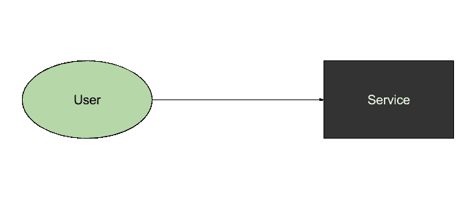
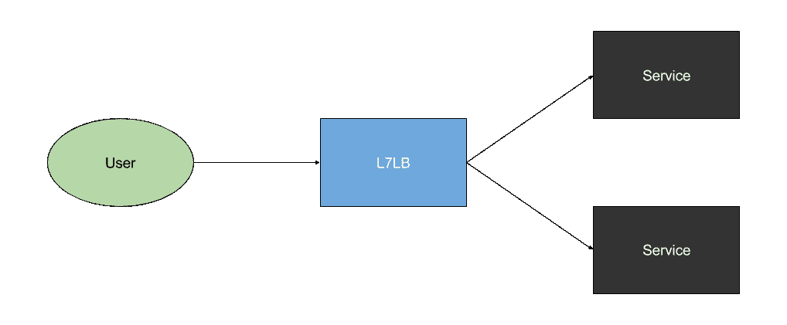
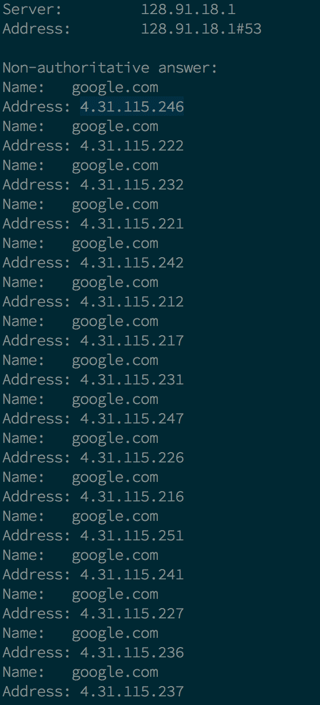
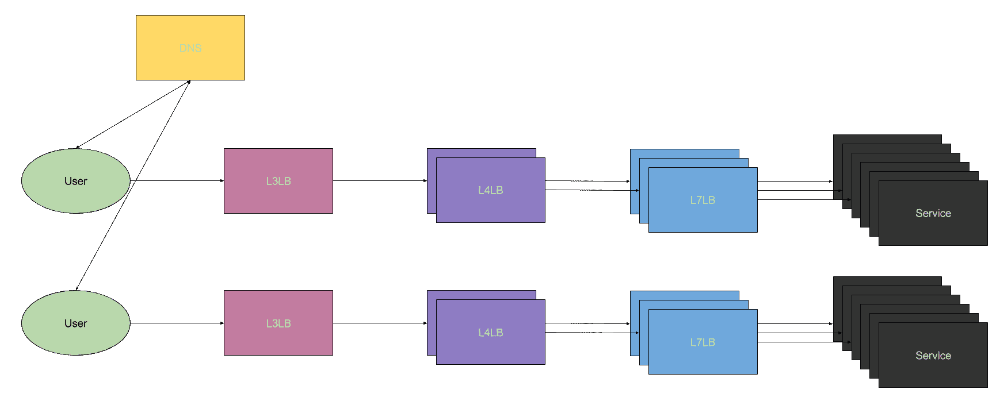

# 扩展 Web 服务:负载平衡

> 原文：<https://blog.vivekpanyam.com/scaling-a-web-service-load-balancing/?utm_source=wanqu.co&utm_campaign=Wanqu+Daily&utm_medium=website>

这篇文章将着眼于像脸书这样的网站如何处理数十亿次请求并保持高可用性的一个方面:负载平衡。

### 什么是负载平衡器？

负载平衡器是一种跨许多资源(通常是计算机)分配工作的设备。它们通常用于增加容量和可靠性。

为了概括地讨论负载平衡，我对正在扩展的服务做了两个假设:

*   我可以开始尽可能多的实例
*   任何请求都可以发送到任何实例

第一个假设意味着服务是无状态的(或者在 Redis 集群中有共享状态)。第二个假设在实践中是不必要的(因为像粘性负载平衡之类的事情)，但是我在这篇文章中假设它是为了简单起见。

下面是我将要谈到的负载平衡技术:

1.  第 7 层负载平衡(HTTP、HTTPS、WS)
2.  第 4 层负载平衡(TCP、UDP)
3.  第 3 层负载平衡
4.  DNS 负载平衡
5.  手动平衡多个子域的负载
6.  任播

最后还有一些杂七杂八的话题:

*   延迟和吞吐量
*   直接服务器返回

这些技术被模糊地归类为站点获得更多流量时要采取的“步骤”。例如，第 7 层负载平衡将是首先要做的事情(比任播早得多)。前三种技术有助于提高吞吐量和可用性，但仍然存在单点故障。其余三种技术消除了这种单点故障，同时也增加了吞吐量。

为了帮助我们理解负载平衡，我们将看一个我们想要扩展的简单服务。

**注意**:每种扩展技术都伴随着在商店购买物品的非技术性类比。这些类比是技术背后思想的简化表示，可能不完全准确。

### 服务

让我们假设我们正在构建一个想要扩展的服务。它可能看起来像这样:

该系统将无法处理大量流量，如果它宕机，整个应用程序都会宕机。

##### 类比:

*   你去商店里唯一的收银台排队
*   你购买你的物品
    *   如果那里没有收银员，你就不能购物

### 第 7 层负载平衡

开始处理更多流量的第一项技术是使用第 7 层负载平衡。第 7 层是应用层。这包括 HTTP、HTTPS 和 WebSockets。Nginx 是一个非常受欢迎且久经考验的第 7 层负载平衡器。让我们看看这将如何帮助我们扩大规模:

请注意，我们实际上可以使用这种技术在数十或数百个服务实例之间实现负载平衡。上图只是举了两个例子。

##### 类比:

*   商店的一名员工(与一名收银员)带你去特定的结账柜台
*   你购买你的物品

##### 注意事项:

*   这也是我们终止 SSL 的地方

### 第 4 层负载平衡

前面的技术将帮助我们处理大量的流量，但如果我们需要处理更多的流量，第 4 层负载平衡可能会有所帮助。第 4 层是传输层。这包括 TCP 和 UDP。一些流行的第 4 层负载平衡器是 HAProxy(它也可以做第 7 层负载平衡)和 IPVS。让我们看看它们将如何帮助我们扩大规模:

第 7 层负载平衡+第 4 层负载平衡在大多数情况下应该能够处理足够多的流量。然而，我们仍然需要担心可用性。这里的单点故障是第 4 层负载平衡器。我们将在下面的 DNS 负载平衡部分解决这个问题。

##### 类比:

*   根据会员编号，有单独的结账区
    *   例如，如果你的会员号能被 2 整除，就去电子产品附近的收银台，否则就去食品附近的收银台
*   一旦你到达正确的结账区，商店的一名员工会指引你到特定的结账柜台
*   你购买你的物品

### 第 3 层负载平衡

如果我们需要进一步扩展，我们可能应该添加第 3 层负载平衡。这比前两种技术更复杂。第三层是网络层，包括 IPv4 和 IPv6。下面是第 3 层负载平衡的情况:

为了理解这是如何工作的，我们首先需要一些关于 ECMP(等价多路径路由)的背景知识。当有多条等价路径到达同一个目的地时，通常使用 ECMP。更广泛地说，它允许路由器或交换机通过不同的链路向目的地发送数据包(允许更高的吞吐量)。

我们可以利用这一点来实现 L3 负载均衡，因为从我们的角度来看，每个 L4 负载均衡器都是相同的。这意味着我们可以将 L3 负载平衡器和 L4 负载平衡器之间的每条链路视为通往同一目的地的路径。如果我们给所有这些负载平衡器相同的 IP 地址，我们可以使用 ECMP 在所有 L4 负载平衡器之间分配流量。

##### 类比:

*   街对面有两家完全相同的独立商店。你去哪一个取决于你的惯用手
*   一旦你到了正确的商店，就会有基于会员号的单独的结账区
    *   例如，如果你的会员号能被 2 整除，就去电子产品附近的收银台，否则就去食品附近的收银台
*   一旦你到达正确的结账区，商店的一名员工会指引你到特定的结账柜台
*   你购买你的物品

*   这通常是在带有架顶式交换机的硬件中完成的

##### TL；博士:

*   除非你运行在一个巨大的规模或有自己的硬件，你不需要这样做

### DNS 负载平衡

DNS 是将名称转换成 IP 地址的系统。例如，它可以将`example.com`翻译成`93.184.216.34`。它还可以返回多个 IP 地址，如下所示:

如果返回多个 IP，客户端通常会使用第一个有效的 IP(但是，有些实现只会查看第一个返回的 IP)。

有许多 DNS 负载平衡技术，包括 GeoDNS 和循环调度。GeoDNS 根据请求者返回不同的响应。这让我们可以将客户端路由到离它们最近的服务器或数据中心。Round-robin 为每个请求返回不同的 IP，在所有可用的 IP 地址之间循环。如果有多个 IP 可用，这两种技术只是改变了响应中 IP 的顺序。

以下是 DNS 负载平衡的工作方式:

在这个例子中，不同的用户被路由到不同的集群(随机地或者基于他们的位置)。

现在没有单点故障(假设有多个 DNS 服务器)。为了更加可靠，我们可以在不同的数据中心运行多个集群。

##### 类比:

*   你在网上查了这家商店经营的购物中心的清单。清单把最近的购物中心放在第一位。你查找每一个的方向，然后去列表中第一个打开的。
*   街对面有两家完全相同的独立商店。你去哪一个取决于你的惯用手
*   一旦你到了正确的商店，就会有基于会员号的单独的结账区
    *   例如，如果你的会员号能被 2 整除，就去电子产品附近的收银台，否则就去食品附近的收银台
*   一旦你到达正确的结账区，商店的一名员工会指引你到特定的结账柜台
*   你购买你的物品

### 手动负载平衡/路由

如果我们的内容分散在许多服务器或数据中心，我们需要路由到一个特定的服务器或数据中心，这种技术可能会有所帮助。假设`cat.jpg`存储在伦敦的一个集群中，而不是任何其他集群中。类似地，假设`dog.jpg`存储在纽约，但不在任何其他数据中心或集群中。例如，当内容刚刚上传且尚未跨数据中心复制时，可能会发生这种情况。

但是，用户不应该为了访问内容而等待复制完成。这意味着我们的应用程序需要暂时将所有对`cat.jpg`的请求定向到伦敦，将所有对`dog.jpg`的请求定向到纽约。所以我们想用`https://lon-1e.static.example.net/cat.jpg`代替`https://cdn.example.net/cat.jpg`。对于`dog.jpg`也是如此。

为此，我们需要为每个数据中心(最好是每个集群和每台机器)设置子域。除了上述 DNS 负载平衡之外，还可以做到这一点。

注意:为了进行重写，我们的应用程序需要跟踪内容的位置。

##### 类比:

*   你打电话给公司办公室，询问哪些地方有猫粮。
*   您查找位置的方向，并转到列表中第一个打开的位置
*   街对面有两家完全相同的独立商店。你去哪一个取决于你的惯用手
*   一旦你到了正确的商店，就会有基于会员号的单独的结账区
    *   例如，如果你的会员号能被 2 整除，就去电子产品附近的收银台，否则就去食品附近的收银台
*   一旦你到达正确的结账区，商店的一名员工会指引你到特定的结账柜台
*   你购买你的物品

### 任播

这篇文章的最后一个技巧是任播。先来一点背景:

大部分互联网使用单播。这实际上意味着每台计算机都有一个唯一的 IP 地址。还有一种方法叫做任播。有了任播，多台机器可以有相同的 IP 地址，路由器向最近的机器发送请求。我们可以将这一点与上述技术结合起来，以获得一个能够处理大量流量的极其可靠和可用的系统。

Anycast 基本上允许互联网为我们处理部分负载平衡。

##### 类比:

*   你告诉人们你想去商店，他们会指引你去最近的地方
*   街对面有两家完全相同的独立商店。你去哪一个取决于你的惯用手
*   一旦你到了正确的商店，就会有基于会员号的单独的结账区
    *   例如，如果你的会员号能被 2 整除，就去电子产品附近的收银台，否则就去食品附近的收银台
*   一旦你到达正确的结账区，商店的一名员工会指引你到特定的结账柜台
*   你购买你的物品

### 杂项

##### 延迟和吞吐量

另外，这些技术还可以提高低延迟服务的吞吐量。不要试图让服务本身处理更多的流量，而是添加更多的流量。这样，我们将拥有一个低延迟、高吞吐量的系统。

##### 直接服务器返回

在传统的负载平衡系统中，请求通过负载平衡的所有层，响应也通过所有这些层返回。一个可以从负载平衡器卸载大量流量的优化是直接服务器返回。这意味着来自服务器的响应不会通过负载平衡器返回。如果来自服务的响应很大，这是一个非常有用的工具。

### 更多信息:

脸书、谷歌、网飞和大多数(如果不是全部)大型互联网公司大规模使用这些技术。以下是一些精彩的演讲和更多资源:

*   Patrick Shuff 做了一个演讲，解释了脸书如何使用这些技术来处理超过 10 亿的用户
*   CloudFlare 在 Anycast 上有一个简短的 [primer](https://blog.cloudflare.com/a-brief-anycast-primer/)
*   Fastly 的首席执行官阿图尔·伯格曼(Artur Bergman)做了一个关于他们如何扩展 CDN 的演讲
*   网飞的全球网络总监戴夫·坦金做了一个关于他们如何扩展网飞 CDN 的演讲

如果您有任何问题，请随时[评论黑客新闻](https://news.ycombinator.com/item?id=14680536)或[给我发邮件](https://blog.vivekpanyam.com/contact/)！

如果你想在我发表新的博客文章时得到通知，你可以在 Twitter 上关注我。

*免责声明:虽然我在这篇文章中提到了脸书和谷歌，但这里包含的任何内容都不是基于非公开信息。*

随机琐事:这个帖子大部分写于 2016 年 2 月，但是我到现在才忘记发表。

*标题图片由[鲍勃米卡](https://www.flickr.com/photos/small_realm/)T3】*

