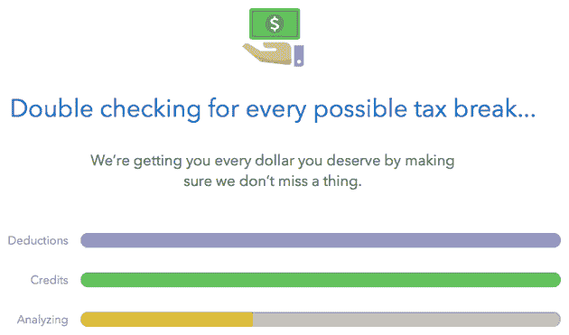
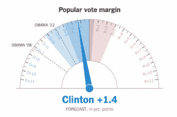

# 为什么有些应用程序使用假进度条-大西洋

> 原文：<https://www.theatlantic.com/technology/archive/2017/02/why-some-apps-use-fake-progress-bars/517233/?utm_source=wanqu.co&utm_campaign=Wanqu+Daily&utm_medium=website>

今年早些时候，出于工作效率的考虑，我进行了税务申报。它们比通常的要复杂一些，所以我留出了一些时间来点击 TurboTax，以确保我做对了一切。在整个过程中，在线税务准备程序反复向我保证，它已经帮助我确定了我有资格享受的每一项可能的税收减免，并确保我没有犯任何错误。在我等待 TurboTax 反复检查我的回报时，吸引人的动画进度条填满了。

但当我观看一个特别流畅的动画时，它显示了一个虚拟的税务表单一行行亮起——黄色或绿色——我想知道我所看到的是否真正反映了后台正在处理的真实任务的进度。难道真的要花那么长时间来“检查”我的退货的每一个细节，而这正是该页面所说的吗？我们去的时候，TurboTax 不是一直在检查我的工作吗？

我和我的同事安德鲁·麦吉尔坐在一起，想弄清楚幕后发生了什么。我们梳理了 TurboTax 网站的源代码，很快证实了我的怀疑:动画被修复了。一旦开始播放，它似乎就根本没有与网站的服务器进行通信——每个 TurboTax 用户看到的都是相同的，总是花费相同的时间来完成。(同样的情况也发生在至少另一个页面上，该页面声称用三个动画条显示了 TurboTax 检查“每一个可能的税收减免”的进度。)

但是为什么呢？为什么要歪曲完成一个过程需要多长时间，并占用不必要的时间呢？

这并不是因为 TurboTax 喜欢捉弄客户。相反，该网站人为的等待时间是密歇根大学信息和计算机科学教授 Eytan Adar 所说的“善意欺骗”的一个例子。在 2013 年与两位微软研究人员发表的一篇论文中，Adar 描述了一系列欺骗用户的设计决策——但最终让他们过得更好。

<aside class="ArticlePullquote_root__YtnHv">“Their reaction was, ‘Wow, was that it?’ That was sort of a bummer for us.”</aside>

善意的欺骗可以隐藏不确定性(比如当网飞没有带宽提供个性化服务时，它会自动加载默认推荐)，掩盖系统的停顿以平滑用户的体验(比如当进度条以一致的速度增长时，即使它可视化的过程是断断续续的)，或者帮助人们习惯一种新的技术形式(比如 Skype 在通话的安静时刻播放的人工静态信号，以说服用户电话没有掉线)。

“欺骗”这个词有负面含义，对用户撒谎通常是不被允许的。但是 Adar 说，如果正确部署，它实际上是一个有用的、有益的工具——设计者多年来一直在欺骗他们的用户，即使他们不愿意这样想。

奇怪的是，TurboTax 动画的案例偏离了 Adar 研究的大多数欺骗行为:它没有掩盖系统减速，而是引入了一个减速。事实证明，延迟是为了建立客户对产品的信心，他们刚刚将所有财务信息委托给了该产品。

TurboTax 母公司 Intuit 的发言人罗布·卡斯特罗(Rob Castro)说:“完成纳税申报的过程至少会有一定程度的压力和焦虑。“为了抵消这些感觉，我们使用了各种各样的设计元素——内容、动画、动作等。—确保我们的客户放心，他们的回报是准确的，他们得到了他们应得的一切。"

<picture class="ArticleInlineImageFigure_picture__HoflP"></picture>

TurboTax

近二十年前，Adar 在他设计的一个实验游戏中也做出了类似的决定。这个游戏让两个人在两个不同的移动设备上谈判价格，最终完成了一个复杂的步骤:参与者的出价都经过加密、无线传输和比较，一个软件程序会显示是否可以达成交易。

尽管很复杂，这一步在游戏的第一次迭代中几乎是瞬间完成的。但是速度迷惑了人。“他们的反应是，‘哇，是这个吗？’”阿达尔说对我们来说，这有点令人失望。”他设计了一个调整方案:最后一步不是立即开始，而是启动一个屏幕动画，用星号占据整个屏幕

安全剧场似乎起作用了。“他们的喜悦似乎增加了——也许他们的信心也增加了，”阿达尔说。(差异是轶事；研究人员从未正式测试参与者的反应。)

虽然设计者不总是喜欢谈论它，但是在人工等待中构建的做法并不少见。去年， *Fast Company 的* s 麦智信[发现](https://www.fastcodesign.com/3061519/evidence/the-ux-secret-that-will-ruin-apps-for-you)脸书在其安全页面上使用了同样的伎俩。他还发现了其他例子:一个贷款审批应用程序，它在提供结果之前制造悬念，以避免让客户产生怀疑；一个提供个性化电话计划建议的网站，它减缓了响应时间，以使用户相信他们实际上正在获得定制的结果。这样的例子在 Twitter 上比比皆是，比如[威瑞森网页上的这个进度条](https://twitter.com/vcsjones/status/727637393168343040)，它只是一个计时器。

威尔逊详细引用了两位哈佛教授在 2011 年发表的一篇研究这种效应的论文，他们将其命名为“劳动错觉”。他们发现，让他们的操作看起来简单的网站实际上并不令消费者满意。他们写道:“当网站通过发出努力的信号来提高运营透明度时，人们实际上可能更喜欢等待时间更长的网站，而不是那些即时返回结果的网站。”"即使那些结果是相同的."

但并不是每一个善意的欺骗都是为了让人们认为他们与之互动的系统处于完全控制之中。其中一个技巧给数据的视觉表现注入了不确定性，并在全国范围内引发了心脏病发作。

《纽约时报》上的在线选举日仪表盘包括一组横跨顶部的三个表盘，显示了该报对希拉里·克林顿和唐纳德·特朗普的普选份额、他们的选举团选票以及他们赢得总统大选的机会的最佳猜测。整个晚上，每个指标的指针都在跳动，从似乎是克林顿的地盘开始，到午夜过后很久，正好在特朗普获胜时结束。

<picture class="ArticleInlineImageFigure_picture__HoflP"><source media="(prefers-reduced-motion)" srcset="https://cdn.theatlantic.com/thumbor/NTIAlPbcwlMYp8XXitmtkkKvLY4=/0x0:553x368/553x368/filters:still()/media/img/posts/2017/02/NYT_jitter/original.gif"></picture>

Courtesy of Gregor Aisch

针在不停地运动——来来回回，来来回回——增加了此刻的焦虑。一些有事业心的读者挖掘了页面的源代码，发现指针在随机抖动，于是在 Twitter 上发泄他们的愤怒。不止一个人用了“[不负责任](https://twitter.com/tsiro/status/796185282718511104)”这个词

Gregor Aisch，选举仪表板背后的 *Times* 设计师之一，在接下来的一周在他的博客上为针的颤动[辩护。Aisch 解释说，指针只在任何给定时刻的预测误差范围内徘徊。该运动旨在强调预测的实时、不断变化的性质，同时可视化模型输出中包含的不确定性。随着时间的推移，天气预报变得越来越准确，所以指针抖动得越来越少。](http://vis4.net/blog/posts/jittery-gauges-election-forecast/)

我问 Aisch，焦虑诱导刻度盘的反作用是否使他重新考虑他的团队的任何决定。它没有。他说，可视化准确地描述了它的意图，如果他再次设计仪表板，他会使用类似的策略。他预测，负面反应可能真的是对计票结果的错误愤怒。“在选举之夜，我们只是第一个摧毁许多人希望的人，”艾什说。“因此，我们采取了火灾。”

Aisch 说，他要做的一件不同的事情是，不要用百分比来显示每个候选人的胜算。他说，对大多数人来说，克林顿 80%的胜算看起来像是一个本垒打，但事实上，她的胜利还远未确定。“如果避孕失败的几率是五分之一，没有人会相信避孕，但我们让许多人相信克林顿有明显的优势，”Aisch 说。

当推特用户拉开帷幕，艾施的骗局被揭露时，一些人觉得他们被恶意欺骗了。毕竟，欺骗在欺骗人的时候效果最好。

我问阿达尔，欺骗是否有一个从善意到恶意的临界点。他制定了三条基本原则:设计师应该更喜欢非欺骗性的解决方案，他们的欺骗应该可以显著地改善产品，用户——如果被问到的话——应该更喜欢欺骗性的解决方案。(当然，大多数设计师不会有机会问他们的用户是否想被欺骗，所以他们必须自己打电话。)

但是对用户有益的欺骗不一定会阻碍设计者。事实上，Adar 说，一个好的骗局通常会让所有参与者受益:更快乐的用户会继续使用——也许会为——一个设计良好的服务付费。

以涡轮税为例。它的设计风格可能会让顾客在纳税季减轻压力，让他们对自己的财务状况感觉更好。反过来，他们会回来，每年继续为这项服务付费。

但是涡轮税有另一个动机来阻止这一过程尽快进行。它的服务是一个友好的向导，带领我们穿过美国人每年都必须穿越的棘手的信贷、福利、扣除和表格的丛林，让这个丛林看起来尽可能棘手和不适宜居住符合 Intuit 的最大利益。该公司[定期游说](https://www.propublica.org/article/how-the-maker-of-turbotax-fought-free-simple-tax-filing)保持复杂的美国税法不变，并反对从根本上简化税法的提议。

因此，额外播放几秒钟的动画，让你感觉 TurboTax 正在努力工作，肯定会让你感觉更好——但它也会让你对 Intuit 的软件所做的事情保持敬畏。最后，当它要求你为这项工作支付 50 或 100 美元时，这几秒钟可能会让你更容易掏出信用卡。

