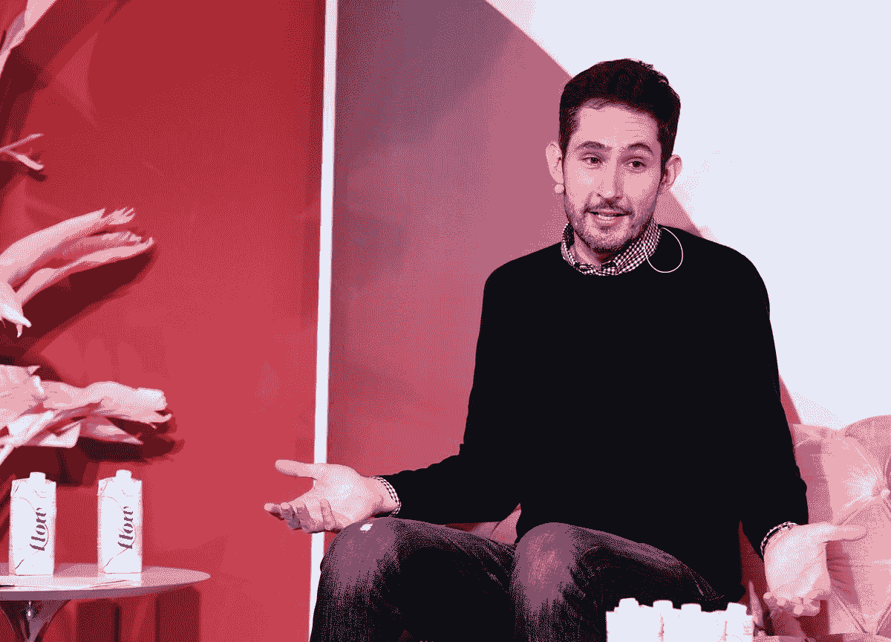
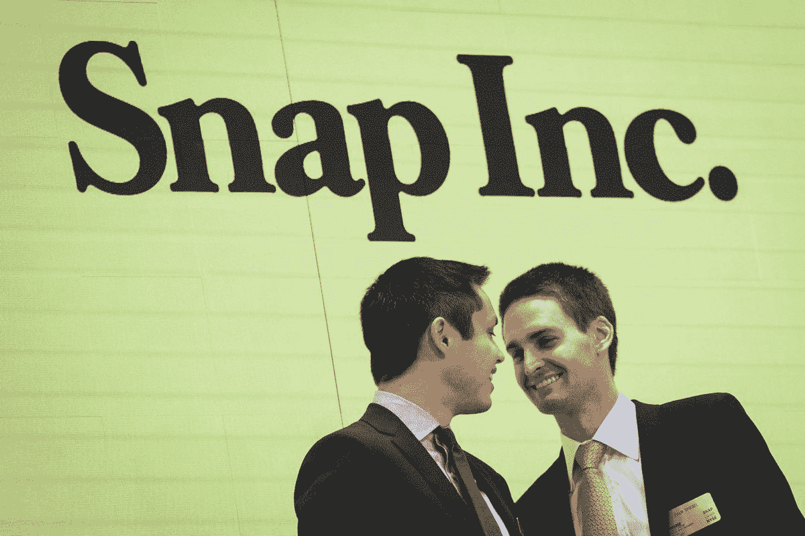
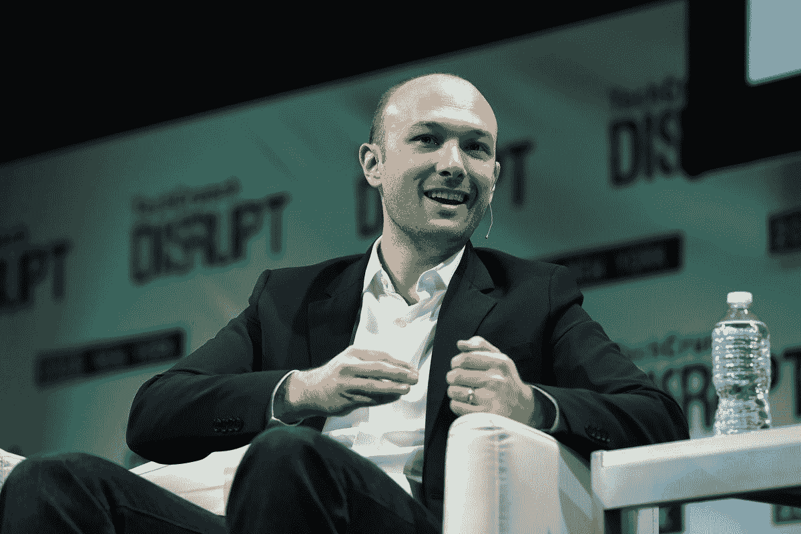
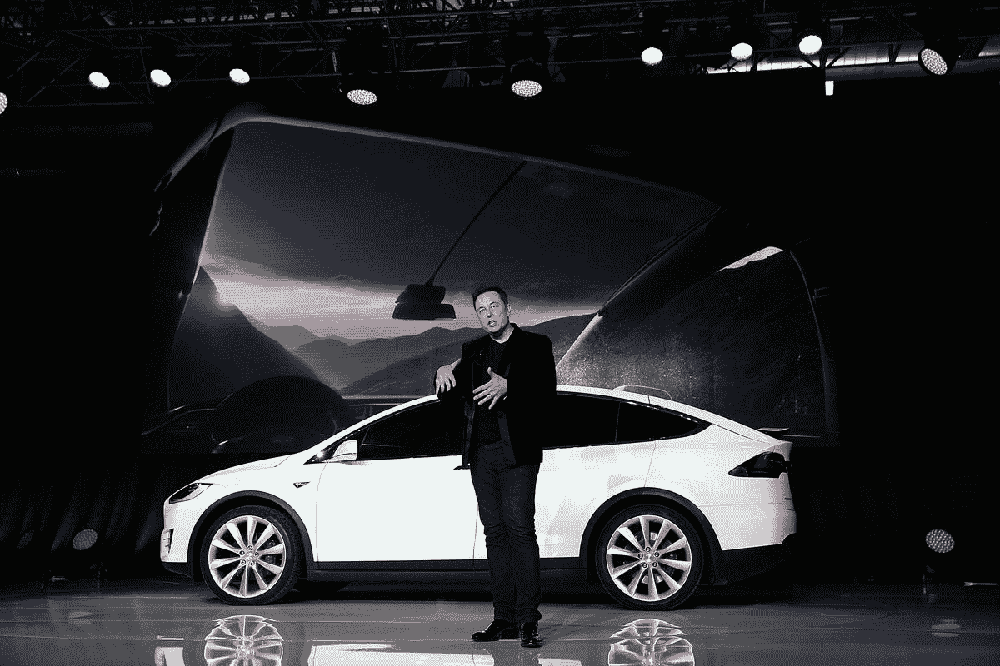

# 互联网创业的终结——Vox

> 原文：<https://www.vox.com/new-money/2017/7/11/15929014/end-of-the-internet-startup?utm_source=wanqu.co&utm_campaign=Wanqu+Daily&utm_medium=website>

硅谷应该是一个车库或宿舍里的几个人可以创办改变世界的公司的地方。苹果和微软在 20 世纪 70 年代，美国在线在 20 世纪 80 年代，亚马逊、雅虎和谷歌在 20 世纪 90 年代，脸书在 21 世纪初都是如此。

但 2010 年似乎正遭遇创业干旱。当然，人们仍在创业。但上一个真正成功的大型科技创业公司是 13 岁的脸书。

直到去年，优步似乎注定要成为硅谷最新的科技巨头。但现在，优步的首席执行官已经不光彩地辞职，公司的未来令人怀疑。过去 10 年推出的其他科技公司似乎不在一个联盟。Airbnb 是仅次于优步的最有价值的美国科技创业公司，价值 310 亿美元，约为脸书价值的 7%。其他的——像 Snap、Square 和 Slack——价值要低得多。

这是怎么回事？在最近一次去硅谷的旅途中，我向几位科技高管和初创企业投资者提出了这个问题。

硅谷公司社会资本(Social Capital)的投资者杰伊·扎维里(Jay Zaveri)说:“当我看着上世纪 90 年代的谷歌和亚马逊时，我有点觉得这是哥伦布和瓦斯科·达·伽马第一次离开葡萄牙。”。

扎维里建议，早期的互联网先驱抓住了“低垂的果实”，占据了有利可图的利基市场，如搜索、社交网络和电子商务。当 Pinterest 和 Blue 围裙等后来者出现时，选择已经变得越来越少。

但其他人告诉我，事情远不止如此。今天的科技巨头已经变得更加精明，能够预测和抢先应对对其统治地位的威胁。他们通过积极拓展新市场和在潜在竞争对手相对较小的时候收购他们来实现这一目标。一些批评人士说，他们在控制和锁定互联网基础设施的关键部分方面做得更好，切断了早期互联网公司通往大众市场的道路。

其结果是，一个曾经以变动闻名的行业开始看起来像传统的寡头垄断——由少数几家大公司主导，这些公司在行业顶端的地位看起来越来越稳固。

### 科技巨头很早就开始收购，而且经常收购

<picture class="c-picture" data-cid="site/picture_element-1668356275_7904_82064" data-cdata="{&quot;asset_id&quot;:8827323,&quot;ratio&quot;:&quot;*&quot;}"><source srcset="https://cdn.vox-cdn.com/thumbor/ihBECdEGd6r5Khvse1iO4QoJuKQ=/0x0:4135x2977/320x0/filters:focal(0x0:4135x2977):format(webp):no_upscale()/cdn.vox-cdn.com/uploads/chorus_asset/file/8827323/648082682.jpg 320w, https://cdn.vox-cdn.com/thumbor/8c1b5_kcbLhG5ZRZiqp8yqKQjCs=/0x0:4135x2977/520x0/filters:focal(0x0:4135x2977):format(webp):no_upscale()/cdn.vox-cdn.com/uploads/chorus_asset/file/8827323/648082682.jpg 520w, https://cdn.vox-cdn.com/thumbor/RZD7y2CaX_dnssxlzUAqiXK3GbM=/0x0:4135x2977/720x0/filters:focal(0x0:4135x2977):format(webp):no_upscale()/cdn.vox-cdn.com/uploads/chorus_asset/file/8827323/648082682.jpg 720w, https://cdn.vox-cdn.com/thumbor/1TXue4jNJtGPW0Bcn-ngKgjobYM=/0x0:4135x2977/920x0/filters:focal(0x0:4135x2977):format(webp):no_upscale()/cdn.vox-cdn.com/uploads/chorus_asset/file/8827323/648082682.jpg 920w, https://cdn.vox-cdn.com/thumbor/9-A51K39cCvmMxCC9mGsoq_cZbU=/0x0:4135x2977/1120x0/filters:focal(0x0:4135x2977):format(webp):no_upscale()/cdn.vox-cdn.com/uploads/chorus_asset/file/8827323/648082682.jpg 1120w, https://cdn.vox-cdn.com/thumbor/SelMClRDAMuFQlrk9JinxwLjM3U=/0x0:4135x2977/1320x0/filters:focal(0x0:4135x2977):format(webp):no_upscale()/cdn.vox-cdn.com/uploads/chorus_asset/file/8827323/648082682.jpg 1320w, https://cdn.vox-cdn.com/thumbor/orgPDfIDNDQAqMzAhOi8yp2sybw=/0x0:4135x2977/1520x0/filters:focal(0x0:4135x2977):format(webp):no_upscale()/cdn.vox-cdn.com/uploads/chorus_asset/file/8827323/648082682.jpg 1520w, https://cdn.vox-cdn.com/thumbor/gDY0ZjyRQpAL9a_1IRJxIfZcCMo=/0x0:4135x2977/1720x0/filters:focal(0x0:4135x2977):format(webp):no_upscale()/cdn.vox-cdn.com/uploads/chorus_asset/file/8827323/648082682.jpg 1720w, https://cdn.vox-cdn.com/thumbor/px05P0yWLxY7EvLwEpyErhhveyY=/0x0:4135x2977/1920x0/filters:focal(0x0:4135x2977):format(webp):no_upscale()/cdn.vox-cdn.com/uploads/chorus_asset/file/8827323/648082682.jpg 1920w" sizes="(min-width: 1221px) 846px, (min-width: 880px) calc(100vw - 334px), 100vw" type="image/webp">  </picture>   

Instagram co-founder Kevin Systrom accepted a $1 billion offer from Facebook instead of building an independent company.

<cite>Photo by Vivien Killilea/Getty Images for Girlboss</cite>

硅谷的每个人都知道像数字设备公司、太阳微系统公司、美国在线和雅虎这样的曾经伟大的公司被重大技术变革拖垮的故事。风险投资家 Phin Barnes 告诉我，今天的科技巨头已经仔细研究了他们的错误，并决心不再重犯。

巴恩斯告诉我，如今科技巨头——脸书、亚马逊、谷歌和微软——的管理团队“更善于理解存在风险”。

对脸书来说，第一次重大考验来自智能手机的推出。脸书最初是一个桌面网站，该公司很容易因向移动设备的转移而措手不及，就像雅虎一样。但是扎克伯格认识到了触摸屏移动设备的重要性，并且[推动他的工程师](https://techcrunch.com/2012/10/19/facebook-mobile-first/)让移动应用成为整个公司的重中之重。

扎克伯格还继续疯狂购物，抢购那些似乎正在移动设备上建立大量受众的公司。2012 年，他[以 10 亿美元收购了只有少数员工的 Instagram](https://dealbook.nytimes.com/2012/04/09/facebook-buys-instagram-for-1-billion/) 。两年后，他[以 190 亿美元收购了即时通讯初创公司 WhatsApp](http://money.cnn.com/2014/02/19/technology/social/facebook-whatsapp/index.html) 。

扎克伯格遵循的是谷歌开创的模式。2006 年，谷歌以 16.5 亿美元收购了 YouTube，该网站已经发展成为互联网上最受欢迎的网站之一。最重要的是，谷歌[在 2005 年收购了一家名为 Android](https://www.engadget.com/2005/08/17/google-buys-cellphone-software-company/) 的鲜为人知的移动软件公司，为谷歌最终主导智能手机操作系统奠定了基础。

事实证明，这些收购意义重大。一项排名显示，WhatsApp 和 YouTube 是仅次于脸书的顶级社交网络。如果你忽略中国网站，Instagram 就是下一个。如果这些公司保持独立，它们很容易成为谷歌和脸书的主要竞争对手。相反，他们成为了谷歌和脸书帝国的一部分。

亚马逊也采取了类似的策略。2009 年，它收购了在线鞋店 Zappos，第二年，它收购了 Quidsi，这是一家为初为人父母者开设的名为 Diapers.com 的流行网站的幕后公司。

### 保持独立的科技公司面临着激烈的竞争

<picture class="c-picture" data-cid="site/picture_element-1668356276_91_82065" data-cdata="{&quot;asset_id&quot;:8827331,&quot;ratio&quot;:&quot;*&quot;}"><source srcset="https://cdn.vox-cdn.com/thumbor/pZGv9Os1W3hHN45Qy4q_L8kyKIo=/0x0:2942x1961/320x0/filters:focal(0x0:2942x1961):format(webp):no_upscale()/cdn.vox-cdn.com/uploads/chorus_asset/file/8827331/647154742.jpg 320w, https://cdn.vox-cdn.com/thumbor/aGi32qa8LCoLLYhMUxmPxgMk33Q=/0x0:2942x1961/520x0/filters:focal(0x0:2942x1961):format(webp):no_upscale()/cdn.vox-cdn.com/uploads/chorus_asset/file/8827331/647154742.jpg 520w, https://cdn.vox-cdn.com/thumbor/4_M3AAmsCS3qWxMcoRjrROI3ZQE=/0x0:2942x1961/720x0/filters:focal(0x0:2942x1961):format(webp):no_upscale()/cdn.vox-cdn.com/uploads/chorus_asset/file/8827331/647154742.jpg 720w, https://cdn.vox-cdn.com/thumbor/BXhxGW8RqjTfON5hO5lJ9SH8_wk=/0x0:2942x1961/920x0/filters:focal(0x0:2942x1961):format(webp):no_upscale()/cdn.vox-cdn.com/uploads/chorus_asset/file/8827331/647154742.jpg 920w, https://cdn.vox-cdn.com/thumbor/KHzdAD3U3B65glJKz29XCOVFj8Q=/0x0:2942x1961/1120x0/filters:focal(0x0:2942x1961):format(webp):no_upscale()/cdn.vox-cdn.com/uploads/chorus_asset/file/8827331/647154742.jpg 1120w, https://cdn.vox-cdn.com/thumbor/n0DTpDYPRK4xGFZWBiVWicZUMfc=/0x0:2942x1961/1320x0/filters:focal(0x0:2942x1961):format(webp):no_upscale()/cdn.vox-cdn.com/uploads/chorus_asset/file/8827331/647154742.jpg 1320w, https://cdn.vox-cdn.com/thumbor/z-RvcirkCReMyGUiBO0dDW2iVC0=/0x0:2942x1961/1520x0/filters:focal(0x0:2942x1961):format(webp):no_upscale()/cdn.vox-cdn.com/uploads/chorus_asset/file/8827331/647154742.jpg 1520w, https://cdn.vox-cdn.com/thumbor/oXZMz-7zGhkucCPX0uI33onDFgo=/0x0:2942x1961/1720x0/filters:focal(0x0:2942x1961):format(webp):no_upscale()/cdn.vox-cdn.com/uploads/chorus_asset/file/8827331/647154742.jpg 1720w, https://cdn.vox-cdn.com/thumbor/LBOjb0UjE1y23Qf0R_JhbXyRr-U=/0x0:2942x1961/1920x0/filters:focal(0x0:2942x1961):format(webp):no_upscale()/cdn.vox-cdn.com/uploads/chorus_asset/file/8827331/647154742.jpg 1920w" sizes="(min-width: 1221px) 846px, (min-width: 880px) calc(100vw - 334px), 100vw" type="image/webp">  </picture>   

Snap co-founders Bobby Murphy and Evan Spiegel rejected Mark Zuckerberg’s overtures and took the company public.

<cite>Photo by Drew Angerer/Getty Images</cite>

不是每个科技初创公司都接受巨头的收购提议。例如，Snapchat 首席执行官埃文·斯皮格尔在 2013 年拒绝了马克·扎克伯格(Mark Zuckerberg)30 亿美元的收购要约，然后在 2017 年将他的公司更名为 Snap，并上市。

作为回应，脸书为 Snapchat 的许多功能开发了自己的版本。脸书旗下的 Instagram 去年推出了自己版本的 Snapchat 热门故事功能，不到六个月，Instagram stories 的日用户数就超过了 Snapchat。

Instagram 还推出了 Snapchat 镜头的[版本，允许人们拍摄古怪的兔耳和狗耳自拍。对来自 Instagram 的竞争的担忧给 Snap 的股票带来了](https://www.recode.net/2017/5/16/15643284/instagram-snapchat-facebook-face-filters-copy)[的下行压力。](https://www.usatoday.com/story/tech/news/2017/06/08/snap-shares-fall-instagram-closes/102630982/)

Yelp 首席执行官杰里米·斯托佩尔曼拒绝了谷歌和雅虎的收购提议，并于 2012 年将公司上市。谷歌的回应是开发自己的本地评论服务。而且——在斯托佩尔曼看来——谷歌利用其在搜索市场的主导地位给了其本地评论产品不公平的优势。

“谷歌开始对分销施加压力，并开始埋葬有机搜索结果，”斯托普尔曼在 6 月的一次采访中告诉我。Yelp 页面开始出现在谷歌搜索结果的更下方，这使得 Yelp 更难吸引新用户。Yelp 在美国已经足够受欢迎并蓬勃发展，但 Stoppelman 认为谷歌的策略阻碍了 Yelp 向海外扩张的努力。

激烈竞争的威胁可能是独立创业公司向现有公司出售的强大诱因。Diapers.com 背后的公司 Quidsi 最初拒绝了亚马逊的提议。亚马逊的回应是大幅降低自己的尿布价格。

《商业周刊》的布拉德·斯通写道:“Quidsi 的高管们利用他们对运费的了解，考虑到宝洁(T2)的批发价，计算出亚马逊仅在尿布一项上就将在三个月内损失 1 亿美元。”作为一家风险投资支持的初创公司，Quidsi 无法承受这种损失，因此该公司最终在 2010 年出售给了亚马逊。

### 现代消费科技初创公司需要大量资金

<picture class="c-picture" data-cid="site/picture_element-1668356276_3545_82066" data-cdata="{&quot;asset_id&quot;:8827345,&quot;ratio&quot;:&quot;*&quot;}"><source srcset="https://cdn.vox-cdn.com/thumbor/mRPKWfJHy53jN8xo9D0ezUKAKaE=/0x0:3000x2003/320x0/filters:focal(0x0:3000x2003):format(webp):no_upscale()/cdn.vox-cdn.com/uploads/chorus_asset/file/8827345/472259974.jpg 320w, https://cdn.vox-cdn.com/thumbor/nAmpI3sqzOF2Tqq__xi3C8vzA04=/0x0:3000x2003/520x0/filters:focal(0x0:3000x2003):format(webp):no_upscale()/cdn.vox-cdn.com/uploads/chorus_asset/file/8827345/472259974.jpg 520w, https://cdn.vox-cdn.com/thumbor/E9vrEwKbMB88dqnZ1tw41GJbr1c=/0x0:3000x2003/720x0/filters:focal(0x0:3000x2003):format(webp):no_upscale()/cdn.vox-cdn.com/uploads/chorus_asset/file/8827345/472259974.jpg 720w, https://cdn.vox-cdn.com/thumbor/3_VdSzwIU-xhK0N8f4YoWCjmUNo=/0x0:3000x2003/920x0/filters:focal(0x0:3000x2003):format(webp):no_upscale()/cdn.vox-cdn.com/uploads/chorus_asset/file/8827345/472259974.jpg 920w, https://cdn.vox-cdn.com/thumbor/hp6tznr1VZYSAsnkkOx2LE0jy-U=/0x0:3000x2003/1120x0/filters:focal(0x0:3000x2003):format(webp):no_upscale()/cdn.vox-cdn.com/uploads/chorus_asset/file/8827345/472259974.jpg 1120w, https://cdn.vox-cdn.com/thumbor/bcxIJAosQm_YpQUnLBLl0J8y8T8=/0x0:3000x2003/1320x0/filters:focal(0x0:3000x2003):format(webp):no_upscale()/cdn.vox-cdn.com/uploads/chorus_asset/file/8827345/472259974.jpg 1320w, https://cdn.vox-cdn.com/thumbor/tfZoe03Ip2Wfbu2U02jFK3x4Ej8=/0x0:3000x2003/1520x0/filters:focal(0x0:3000x2003):format(webp):no_upscale()/cdn.vox-cdn.com/uploads/chorus_asset/file/8827345/472259974.jpg 1520w, https://cdn.vox-cdn.com/thumbor/_poKuvgyLQxmYI5PUBL5XmlgcDw=/0x0:3000x2003/1720x0/filters:focal(0x0:3000x2003):format(webp):no_upscale()/cdn.vox-cdn.com/uploads/chorus_asset/file/8827345/472259974.jpg 1720w, https://cdn.vox-cdn.com/thumbor/abS8TqaiQVHrEUNyoaCKsf3ia30=/0x0:3000x2003/1920x0/filters:focal(0x0:3000x2003):format(webp):no_upscale()/cdn.vox-cdn.com/uploads/chorus_asset/file/8827345/472259974.jpg 1920w" sizes="(min-width: 1221px) 846px, (min-width: 880px) calc(100vw - 334px), 100vw" type="image/webp">  </picture>   

Lyft CEO Logan Green has spent hundreds of millions of dollars battling Uber for market share.

<cite>Photo by Noam Galai/Getty Images for TechCrunch</cite>

雅虎、易贝、谷歌和脸书等经典的互联网初创公司能够用少量资金启动，并在几年内实现盈利。

Floodgate 公司的投资者迈克·梅普斯(Mike Maples)说:“马克·扎克伯格在脸书那里有一个巨大的优势，因为普通人建立一家公司的压力被他只是玩玩想法的轻松所取代。”

到 2004 年扎克伯格创办脸书的时候，运营一个网站并不需要太多成本——即使是一个拥有数百万用户的网站。因此，扎克伯格能够很快实现盈利，随着脸书的持续增长，该网站变得非常盈利，给公司带来了大量资金用于收购或新举措。

但是最近几年有所不同。

随着投资者意识到占主导地位的科技公司可以变得多么有利可图，他们愿意投入越来越多的资源，以确保他们的初创公司能够主导他们的市场。具有讽刺意味的是，这使得任何人都更难实现盈利。

这就是拼车市场的情况，优步和 Lyft 展开了多年的价格战，让优步损失了数十亿美元，让规模较小的竞争对手损失了数亿美元。类似的动态也出现在食品配送等市场，公司已经花费了数百万美元来吸引顾客。

另一个变化是:现有的科技公司越来越多地控制初创公司用来接触用户的平台。

Yelp 的斯托佩尔曼告诉我，“脸书的成长基于这样一句话，‘给我你的电子邮件地址，我会发邮件邀请你的朋友来试试脸书’”。“脸书在自己的平台上允许这样做吗？当然不是。他们说‘支付我们 4 美元的安装费，我们会帮你一次获得一个用户，并在这个过程中赚很多钱。’"

因此，虽然建立在线服务的技术成本比以往任何时候都更便宜，但公司花费数百万美元做广告以将他们的应用程序或服务展示在潜在用户面前已经变得很常见。其中很大一部分资金流向了谷歌和脸书。

### 创新的本质正在改变

<picture class="c-picture" data-cid="site/picture_element-1668356276_3858_82067" data-cdata="{&quot;asset_id&quot;:8827355,&quot;ratio&quot;:&quot;*&quot;}"><source srcset="https://cdn.vox-cdn.com/thumbor/ZfLh-rZd-uPXMooFmETQGhsW7hg=/0x0:3000x2000/320x0/filters:focal(0x0:3000x2000):format(webp):no_upscale()/cdn.vox-cdn.com/uploads/chorus_asset/file/8827355/490597690.jpg 320w, https://cdn.vox-cdn.com/thumbor/0qha4lpetln9rxYRp7lCYQDKifc=/0x0:3000x2000/520x0/filters:focal(0x0:3000x2000):format(webp):no_upscale()/cdn.vox-cdn.com/uploads/chorus_asset/file/8827355/490597690.jpg 520w, https://cdn.vox-cdn.com/thumbor/ZuoKhkYf53Z3pjdFvRQTCsAUrqc=/0x0:3000x2000/720x0/filters:focal(0x0:3000x2000):format(webp):no_upscale()/cdn.vox-cdn.com/uploads/chorus_asset/file/8827355/490597690.jpg 720w, https://cdn.vox-cdn.com/thumbor/AFwTnAyry9gpGk6_Yhbn4s0w5Ok=/0x0:3000x2000/920x0/filters:focal(0x0:3000x2000):format(webp):no_upscale()/cdn.vox-cdn.com/uploads/chorus_asset/file/8827355/490597690.jpg 920w, https://cdn.vox-cdn.com/thumbor/z2Us_pc6kjL4Fj3xODF-Zj6iDLo=/0x0:3000x2000/1120x0/filters:focal(0x0:3000x2000):format(webp):no_upscale()/cdn.vox-cdn.com/uploads/chorus_asset/file/8827355/490597690.jpg 1120w, https://cdn.vox-cdn.com/thumbor/okJDnScG_x6bCs0cedOc8SUml5w=/0x0:3000x2000/1320x0/filters:focal(0x0:3000x2000):format(webp):no_upscale()/cdn.vox-cdn.com/uploads/chorus_asset/file/8827355/490597690.jpg 1320w, https://cdn.vox-cdn.com/thumbor/Rp5V6qlmhtvEw2q52eIoLaxyaNE=/0x0:3000x2000/1520x0/filters:focal(0x0:3000x2000):format(webp):no_upscale()/cdn.vox-cdn.com/uploads/chorus_asset/file/8827355/490597690.jpg 1520w, https://cdn.vox-cdn.com/thumbor/a4uN8ntBvNn5bNLT-1t7aJ52LbI=/0x0:3000x2000/1720x0/filters:focal(0x0:3000x2000):format(webp):no_upscale()/cdn.vox-cdn.com/uploads/chorus_asset/file/8827355/490597690.jpg 1720w, https://cdn.vox-cdn.com/thumbor/eJyRxeJJi0SInnlKcyLBuSZ4Qac=/0x0:3000x2000/1920x0/filters:focal(0x0:3000x2000):format(webp):no_upscale()/cdn.vox-cdn.com/uploads/chorus_asset/file/8827355/490597690.jpg 1920w" sizes="(min-width: 1221px) 846px, (min-width: 880px) calc(100vw - 334px), 100vw" type="image/webp">  </picture>   

Tesla is a Silicon Valley company, but it’s not really an internet company.

<cite>Photo by Justin Sullivan/Getty Images</cite>

所有这些批评都有一定道理，但不夸大它们也很重要。因为对于现代创业公司面临的所有挑战，毫无疑问，拥有真正革命性的大众市场产品的创业公司会找到接触客户的方法。我认为，最终，低挂水果假说有很多优点:我们没有看到任何新的大型互联网公司出现，因为建立大型、有利可图的在线服务的机会是有限的。

几个月前，互联网以一家出售高价榨汁机的初创公司 [Juicero](https://www.vox.com/new-money/2017/4/21/15376038/juicero-explained) 为代价获得了很多乐趣。这种为超级富豪设计的小玩意获得了资金，这似乎表明投资者正在努力开发更具大众市场吸引力的产品。

Juicero 是一个极端的例子。但即使是最近的互联网初创公司，如 Snap、Square 和 Pinterest，也不太可能像苹果、亚马逊和谷歌早年那样具有革命性。

这种事情以前也发生过。在 20 世纪 50 年代、60 年代和 70 年代，半导体制造业出现了创新大爆发。但最终，市场稳定下来，少数大公司——英特尔、三星、高通——主宰了市场。“硅谷”的创新没有停止；它只是转移到了硅芯片之外的东西。

在 20 世纪 80 年代，像微软、Adobe 和 Intuit 这样的大公司都是为个人电脑开发软件而成立的。这些公司仍然赚了很多钱——就像英特尔一样——但今天桌面 PC 软件创业公司没有太多空间。

在应用程序和在线服务方面，我们可能会达到类似的地步。你可以用网络浏览器或智能手机做的事情只有这么多，也许谷歌、脸书和 Snap 等公司已经锁定了最重要的市场。

当然，这并不意味着硅谷的创新会停止。但它可能看起来与我们过去 20 年看到的创新有很大不同。

以特斯拉为例。在某些方面，它是一家典型的硅谷公司。它位于帕洛阿尔托，雇佣了一大批程序员来设计从触摸屏界面到自动驾驶软件的所有东西。

但在其他方面，特斯拉代表着对硅谷规范的背离。苹果在中国生产 iPhones，而特斯拉在加州弗里蒙特运营其汽车工厂。在优步和 Airbnb 避免拥有汽车和房子的地方，特斯拉却花了数十亿美元在一家电池厂上。

因此，即使谷歌、脸书和亚马逊等在位者继续主导在线服务市场，也并不意味着它们将继续成为更广泛的技术创新的领导者。相反，创新可能会转向截然不同的方向——比如电动汽车和送货无人机，而不是智能手机应用。我们已经习惯于认为硅谷、互联网和创新是可以互换的，但下一波创新可能会与我们习惯的截然不同。

**披露:**我的 [**哥哥**](https://twitter.com/startupandrew) 作品 [**在谷歌**](https://www.firebase.com/blog/2014-10-21-firebase-joins-google.html) 。

### 

**[帮助保持这样的文章免费](http://vox.com/pages/support-now?itm_campaign=Nov-2022-midterms&itm_medium=site&itm_source=article-footer%20)**

理解美国的政治领域可能会让人不知所措。这就是 Vox 的用武之地。我们的目标是给每一个想要的人提供研究驱动的、智能的、可访问的信息。

【读者礼物】通过帮助保持我们的工作自由来支持这一使命——无论我们是为意想不到的事件添加微妙的背景，还是解释我们的民主是如何走到这一步的。虽然我们致力于保持 Vox 免费，但我们独特的解释性新闻确实需要大量资源。单靠广告不足以支撑它。[今天就为 Vox 制作一份礼物，帮助所有人保持这样的免费工作。](http://vox.com/pages/support-now?itm_campaign=Nov-2022-midterms&itm_medium=site&itm_source=article-footer)

 [是的，我会给 250 美元/年](https://vox.memberful.com/checkout?plan=) 

是的，我会给 250 美元/年

我们接受信用卡、Apple Pay 和 T2 Google Pay。您也可以通过投稿

