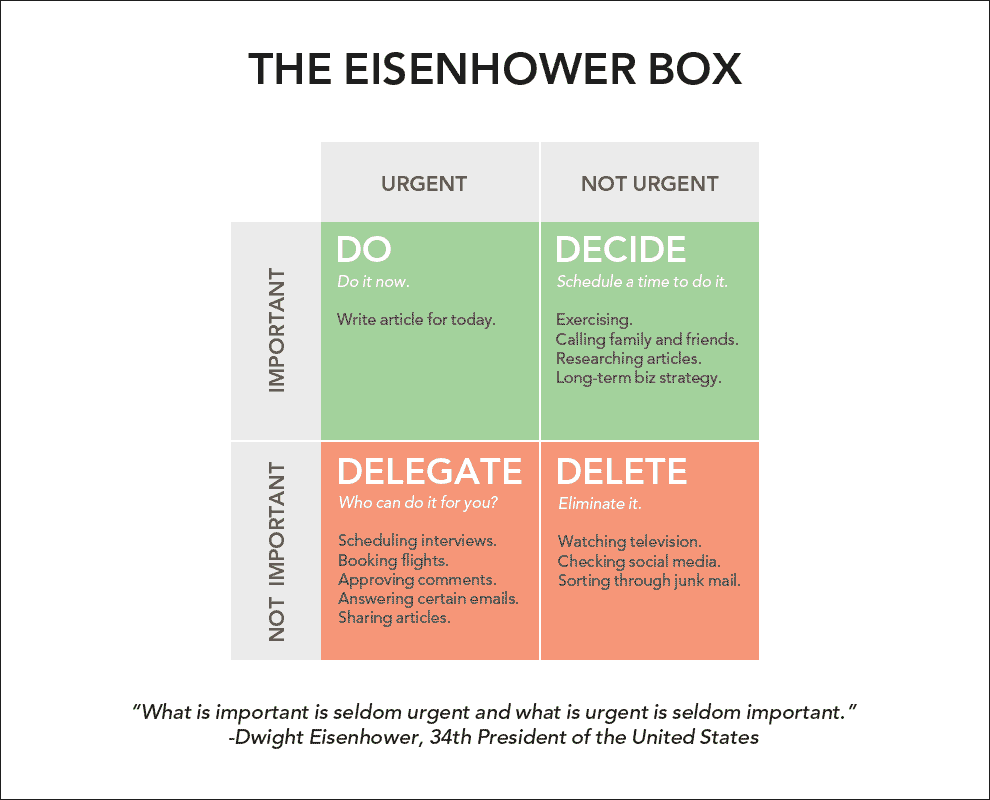

# 如何利用“艾森豪威尔盒子”提高工作效率

> 原文：<http://jamesclear.com/eisenhower-box?utm_source=wanqu.co&utm_campaign=Wanqu+Daily&utm_medium=website>

德怀特·艾森豪威尔的一生是你所能想象的最富有成效的一生之一。

艾森豪威尔是美国第 34 任总统，从 1953 年到 1961 年连任两届。在任期间，他推出了一些计划，这些计划直接导致了美国州际高速公路系统的发展、互联网的推出(DARPA)、太空探索(NASA)以及替代能源的和平利用(原子能法案)。

在成为总统之前，艾森豪威尔是美国陆军的五星上将，在第二次世界大战期间担任欧洲盟军的最高指挥官，并负责策划和执行对北非、法国和德国的入侵。

在此期间，他担任了哥伦比亚大学的校长，成为了北约的第一任最高指挥官，还不知何故抽出时间从事高尔夫和油画等业余爱好。

艾森豪威尔有一种惊人的能力，不仅仅是几周或几个月，而是几十年保持他的生产力。因此，他的时间管理、任务管理和生产力的方法被很多人研究也就不足为奇了。

他最著名的生产力战略被称为艾森豪威尔盒子(或艾森豪威尔矩阵)，这是一个简单的决策工具，你现在就可以使用。让我们来谈谈如何更有成效，艾森豪威尔的策略是如何工作的。

## 艾森豪威尔盒子:如何更有效率

艾森豪威尔采取行动和组织你的任务的策略很简单。使用下面的决策矩阵，你将根据四种可能性来划分你的行动。

1.  紧急且重要的任务(您需要立即完成的任务)。
2.  重要但不紧急的任务(您将安排在以后完成的任务)。
3.  紧急，但不重要(你将委托给别人的任务)。
4.  既不紧急也不重要(你要消除的任务)。

这个矩阵的伟大之处在于它可以用于广泛的生产力计划(“我应该如何度过每周的时间？”)以及更小的每日计划(“我今天该做什么？”).

这是我的艾森豪威尔盒子今天的样子的一个例子。

## 紧急和重要的区别

> 重要的事情很少是紧急的，紧急的事情很少是重要的。
> ——德怀特·艾森豪威尔

紧急任务是你觉得需要回应的事情:电子邮件、电话、短信、新闻报道。与此同时，用布雷特·麦凯的话说，“重要的任务是有助于我们的长期使命、价值观和目标的事情。” [1](#footnote-1-5841)

分离这些差异很简单，只需做一次，但持续做下去可能会很困难。我喜欢艾森豪威尔矩阵的原因是，它为反复做决策提供了一个清晰的框架。和生活中的任何事情一样，一致性是最难的部分。

以下是我用这种方法观察到的一些其他情况。

## 优化前消除

几年前，我在阅读有关计算机编程的书籍时，偶然发现了一段有趣的引言:

> “没有代码比没有代码更快。”凯夫林·亨尼

换句话说，完成一件事的最快方法——无论是让计算机读一行代码，还是从你的待办事项列表中划掉一项任务——就是完全取消这项任务。没有比什么都不做更快的方法了。这不是懒惰的理由，而是一个建议，强迫自己做出艰难的决定，删除任何不能引导你实现使命、价值观和目标的任务。

太多时候，我们用生产力、时间管理和优化作为借口来回避真正困难的问题:“我真的需要做这个吗？”保持忙碌并告诉自己你只需要更有效率一点或“今晚工作晚一点”比忍受取消一项你喜欢做的任务的痛苦要容易得多，但这不是对你时间的最高和最好的利用。 [2](#footnote-2-5841)

正如蒂姆·菲利斯所说，“忙碌是一种懒惰——懒惰的思维和不加选择的行动。”

我发现艾森豪威尔矩阵特别有用，因为它促使我质疑一项行动是否真的有必要，这意味着我更有可能将任务移到“删除”象限，而不是无意识地重复它们。老实说，如果你简单地消除了你每天浪费时间的所有事情，那么你可能就不需要任何关于如何在重要的事情上更有效率的建议了。

## 这有助于我实现目标吗？

最后一点:如果你不确定自己在朝着什么方向努力，就很难消除浪费时间的活动。根据我的经验，有两个问题可以帮助澄清艾森豪威尔盒子背后的整个过程。

这两个问题是…

1.  我努力的方向是什么？
2.  驱动我生活的核心价值观是什么？

这些是我在我的[年度回顾](https://jamesclear.com/2013-annual-review "annual review")和我的[诚信报告](https://jamesclear.com/2014-integrity-report "integrity report")中问过自己的问题。回答这些问题帮助我理清了生活中某些任务的类别。当你清楚什么对你来说是重要的时候，决定哪些任务该做，哪些任务该删除就变得容易多了。

艾森豪威尔矩阵并不是一个完美的策略，但我发现它是一个有用的决策工具，可以提高我的生产率，消除那些占用精神能量、浪费时间、很少让我朝着目标前进的行为。我希望你也会觉得有用。 [3](#footnote-3-5841)