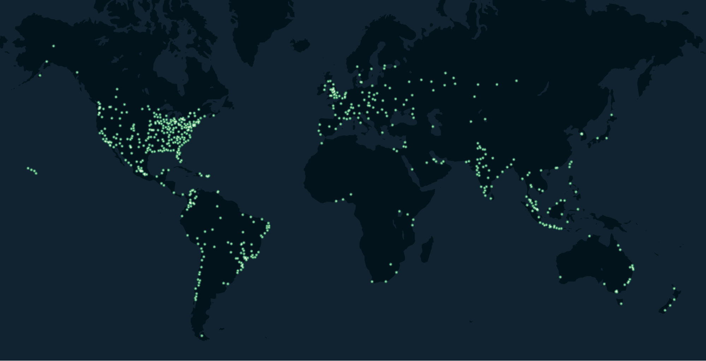
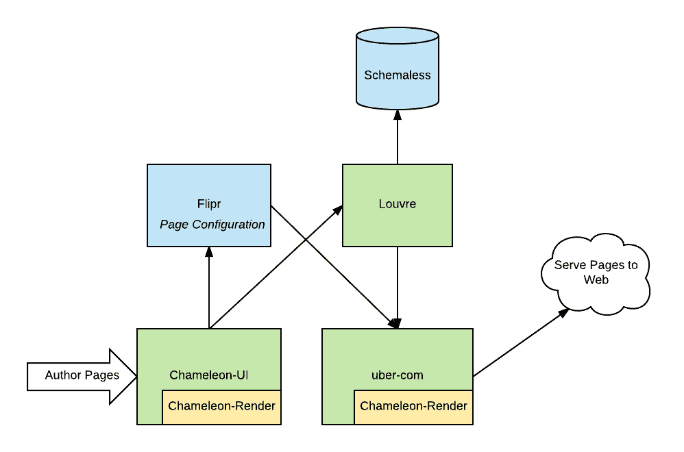
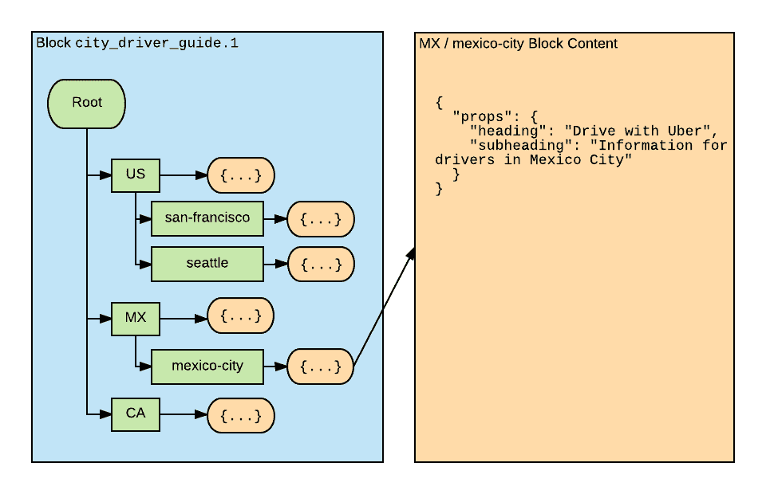
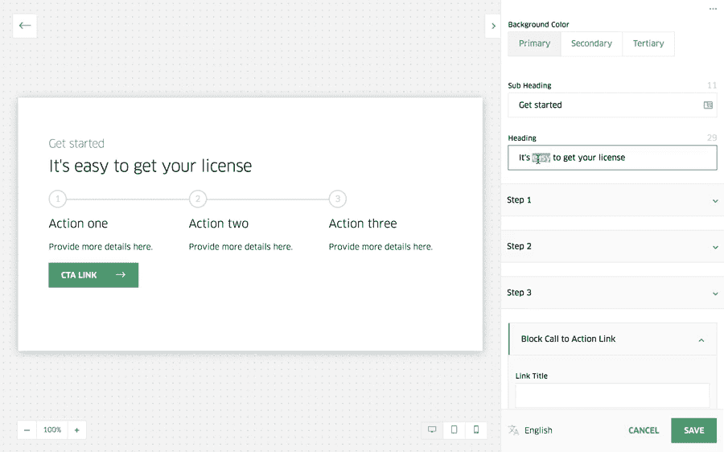
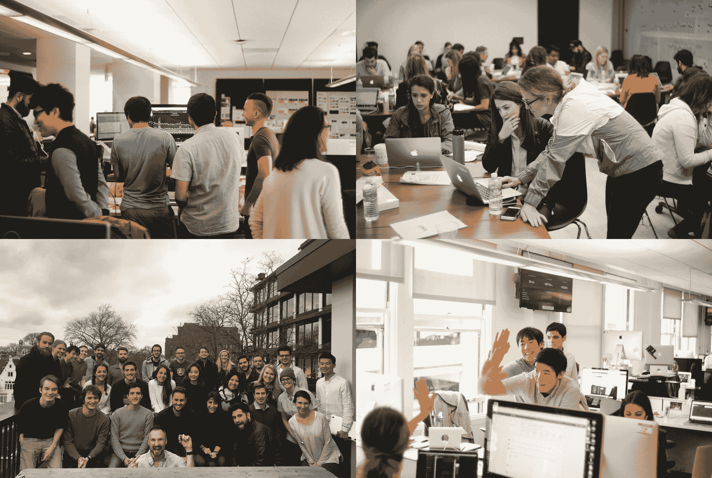

# 介绍变色龙:来自优步工程|优步博客的全球 CMS

> 原文：<https://eng.uber.com/chameleon/?utm_source=wanqu.co&utm_campaign=Wanqu+Daily&utm_medium=website>

优步的 [技术栈](https://eng.uber.com/tech-stack-part-two/) 由一组不同的移动和后端系统组成，它们协同工作，在全球范围内提供可靠的运输。骑手和司机都在网络和移动浏览器上使用我们的网站 来了解最新的物流信息，例如如何报名参加优步或从某个机场到哪里申请行程，以及监管合规要求和其他特定地区的信息。

为了有效地服务于优步的全球用户群，当地团队专门为他们所在城市或地区的车手和司机创建和发布内容。为了使内容创建过程简化和可扩展，Uber.com 内容平台团队开发了 Chameleon，这是一个用于的全球内容管理系统(CMS)。变色龙以一种以适应环境的能力而闻名的彩色爬行动物命名，它允许团队提供适合其区域市场的内容，并提供一个直观的用户界面(UI)，以便优步的任何人都可以轻松地建立一个定制的网页。

在本文中，我们将深入探讨 Chameleon 及其多层架构，以及它如何帮助全球的区域运营和营销团队发布时尚、品牌化且易于导航的网页。

Chameleon delivers web content to a large and diverse set of Uber users in cities across the world, depicted by the above map rendered on July 5.

### 变色龙背后的动机

【2016 年初，Uber.com 还在手工编码[React](https://facebook.github.io/react/)and效率低下[I](https://facebook.github.io/react/)n 跟上公司日益壮大的规模，无论是运营能力还是区域量身定制的内容。

为了跟上运营增长的步伐，许多地区运营团队正在多个平台上创建自己的微型网站。最高峰时，网上有多达 1500 个优步微型网站。

对于从优步寻找官方信息的用户来说，这种方法被证明是有问题的和令人困惑的。这些微型网站还降低了业务效率和搜索引擎优化(SEO)价值，同时削弱了可见性和控制。

为了解决这些问题，内容平台团队构建了一个解决方案，将所有微型网站内容集成到 Uber.com 域中。然而，为了鼓励迁移到我们的 CMS，我们需要确保解决方案能够与我们城市团队已经使用的工具整体集成，从而实现无缝采用。

#### 为什么要从零开始构建 CMS？

在 Chameleon 之前，Uber.com 托管了几个功能，当我们过渡到一个更大的系统，可以支持我们数百个城市团队使用它时，这些功能需要保持高性能。其中包括与现有的优步后端服务、 [Morpheus](https://eng.uber.com/tech-stack-part-one/#attachment_479) 的集成实验，以及统计和监控，以帮助内容平台工程师发现并解决制作问题。

当我们考虑现有的开源工具时，我们决定最好在优步网络平台技术的基础上创建一个内容管理系统。使用开源技术构建 CMS 将需要我们构建许多功能——度量、监控、安全和后端服务集成——这些功能已经成为优步现有 web 框架的标准。另一方面，从头开始创建一个内部 CMS 让我们有机会构建一个足够简单的 UI，让城市团队可以轻松上手并开始使用。

构建我们自己的 CMS 也给了我们一个定制的解决方案，能够与我们现有的网站灵活集成。我们选择使用 React，这样我们就可以构建交互式内容块，并将它们与 Uber.com 域上的现有组件紧密集成。我们还定义了 JSON 文档格式，并构建了 Chameleon-Render 来将 JSON 文档呈现给 React 组件。与优步工程公司的一些遗留 CMSs 相比，这使我们能够更好地支持内容，后者允许作者将 HTML 和模板代码直接写入系统。通过 React 组件和 JSON 文档，内容平台工程师可以制作补丁来增强可访问性、应用品牌更新和提高页面加载性能，而无需接触内容，从而使我们更容易在发布后继续改进 CMS。

变色龙还支持 [地理化内容。](https://en.wikipedia.org/wiki/Geotargeting) 这意味着变色龙使运营商不仅能够创建适合当地的内容，还能在一般的 Uber.com 页面上推广当地内容。以我们的墨西哥城微型网站为例:用户登录我们的墨西哥 [顶级驱动程序页面](https://www.uber.com/es-MX/drive/) 时，系统会提示用户点击将用户导向 [墨西哥城驱动程序指南](https://www.uber.com/es-MX/drive/mexico-city/) 的宣传块。(我们将在后面更详细地介绍这个系统是如何工作的。)

接下来，我们来看看变色龙架构，确定关键组件以及它们如何协同工作来满足我们用户的全球和地区需求。

### 架构概述

变色龙架构由四个关键产品领域和大量底层服务组成。从高层次来看，存储、通用呈现器、web 编辑器应用程序和网站本身是我们 CMS 解决方案的基础:

*   **储存。** 存储层将内容存储为一系列的块，这些块在用户看来是每页的水平切片。存储由卢浮宫处理，这是一个优步架构的服务，用 [Go](https://golang.org/) 编写，位于我们的 [无模式](https://eng.uber.com/schemaless-part-one/) 数据存储之上。
*   **变色龙——渲染。** 实现了一个通用渲染器，称为 Chameleon-Render， ，用于在编辑器和实时网站中将块内容渲染到 React 组件中。由于 Chameleon-Render 必须在多个下游服务中使用，所以它被开发为一个内部 JavaScript 库。
*   **变色龙-UI** 。我们开发了 Chameleon-UI 作为我们的 web 编辑器应用程序。该服务读取 Chameleon-Render 中定义的块模式，并生成一个编辑器，其中包含正在编辑的内容的实时预览。Chameleon-UI 还提供了一个编辑页面级配置数据的界面，比如页面标题和描述。此配置存储在 Flipr 中，这是一个优步配置服务。
*   **Uber.com 网站** 。最后，我们将卢浮宫和变色龙渲染整合到我们的网站上，向全世界的车手伙伴和车手提供内容。我们的网站服务叫做 uber-com。使用 [GeoIP](https://www.maxmind.com/en/geoip2-services-and-databases) 检测位置，本地化内容由卢浮宫提供。

下面，我们提供变色龙架构的概述:

Figure 1: In our CMS content pipeline mix of Chameleon components (in green) and Uber’s existing tech stack (in blue) render, configure, and store pages hosted in Go on the Uber.com site.

#### 关键系统组件

为了理解这些不同的部分是如何组合在一起的，我们必须解释在 Chameleon 中存储和呈现内容的基本原理。首先，我们访问优步的卢浮宫，解释在我们的系统环境中什么是块和块内容。我们还将评估无模式如何让我们能够轻松可靠地在世界任何地方阅读和编辑内容。

##### 卢浮宫

我们将我们的内容数据库命名为卢浮宫，因为与著名的法国艺术博物馆一样，它存储了我们的杰作。如前所述，卢浮宫以无模式方式存储内容，并使用 [频道](https://github.com/uber/tchannel) 与其客户端通信，客户端大多是 CMS 编辑器和 web 服务器。

卢浮宫的内容是根据块和块内容来定义的。在我们的系统中，block 编码了一个层次结构，将具体的页面和地理位置与 block 内容相关联，这代表了一个 JSON 文档，通常使用 Chameleon-Render 进行渲染。每个块内容都有一个草案版本和一个发布版本。

当向卢浮宫发出解析内容的请求时，它会读取请求的参数，并按照层次结构查找正确的块内容。例如，旧金山 的 [驱动程序注册页面上的第一个块可能被命名为city _ driver _ guide . 1 .网站将请求使用地理定位参数 【美国】【旧金山】 来解析city _ driver _ guide . 1如果请求是针对](https://www.uber.com/drive/san-francisco/) [墨西哥城司机注册页面](https://www.uber.com/es-MX/drive/mexico-city/) ，网站将请求解析具有地理定位参数 ["MX】【墨西哥城】] 的相同块 城市 _ 司机 _ 指南. 1 ，并将在响应中接收不同的块内容。卢浮宫还负责检查请求内容中的每个字符串是否都有翻译，并将它们插入到结果中。

图 2 示出了一个示例块的内容层次，在这种情况下为 城市 _ 驾驶员 _ 向导。1 ，如下:

Figure 2: Chameleon’s content hierarchy consists of blocks (in blue) and block contents (in orange). In the above example, the city_driver_guide.1 block’s geolocalization parameters (in green) inform the block content’s regional scope.

这种块和块内容的系统允许我们为新城市网页创建模板，而不必首先编写内容。当一个新的城市启动时，它会自动在 Uber.com 的上分配一个网站，城市团队可以定制该网站，为当地的车手和车手提供高度相关的内容。该功能确保内容平台和城市团队可以快速创建和发布网络内容，促进优步的持续增长和可扩展性。

##### 变色龙-渲染

一旦块内容被解析，应用程序将其传递给 Chameleon-Render，该解决方案的 JavaScript 库，以呈现为 React [虚拟 DOM](https://stackoverflow.com/questions/21965738/what-is-virtual-dom) 。变色龙渲染有几个关键的特点，使其有助于建立一个 CMS。例如，它针对通用 JavaScript，允许我们在浏览器中创建交互式组件或渲染服务器端以提高性能和 SEO。Chameleon-Render 的另一个重要特性是样式封装，这意味着几乎所有 Chameleon 的样式和布局都是用 JavaScript 内联编写的，并与库打包在一起。通过[Styletron](https://github.com/rtsao/styletron)实现，样式封装有助于我们保证内容在 Uber.com 上看起来与在 Chameleon-UI 实时预览器中一样。

变色龙页面的设计是通过选择区块，从上到下一个接一个地把它们排列起来，就像一个俱乐部三明治。每个变色龙渲染块或块类型负责布局三明治一层内部的内容。广告牌、促销、行动号召和免责声明等广告块类型必须支持 Uber.com 的所有功能，包括完全响应的设计、可访问性、高性能动画和从右到左的本地化。由于块类型是预先编写和模板，优步的员工可以很容易地在变色龙创建高质量的网页。

如果渲染内容是它所能做的一切，那么变色龙渲染作为一个通用的块库将不会非常有用。为了使内容创建体验尽可能无缝，我们还需要确保每个块类型都可以用编辑器中的表单进行编辑，并且该表单为每个字段提供直观的控件。

一个显而易见的选择是为每个单独的块实现一个新的表单，但是这种方法本身就容易出错，并且难以扩展。相反，我们选择用一个描述所有可编辑属性的模式 JSON 文件来描述每个块类型。然后，UI 根据模式生成适当的表单。这样，我们可以构建相关的、用户友好的表单，用于编辑用模式而不是代码编写的新块类型。此外，这些模式在 Chameleon-Render 构建中被自动验证，这确保了编辑器能够为任何给定的用例生成正确的表单。

##### 变色龙-UI

变色龙-UI 是变色龙的网页编辑器应用。优步的员工使用这个工具为他们团队的特定网页创建和编辑内容。下面，我们描述用户如何利用 Chameleon-UI 创建微型网站和网页:

Chameleon makes it easy for users to create and edit their own web pages on the Uber.com domain.

Chameleon-UI 的几个特性使得启动和定制特定的网页变得容易。其中包括与 Chameleon-Render 和块编辑器的集成，以生成用于编辑块类型的表单，在页面上线前预览页面的能力，以及对页面的 SEO 相关属性(如标题和描述)和操作设置(如页面是否上线或是否应被搜索引擎索引)的控制。)Chameleon-UI 与后端翻译服务相集成，因此可以翻译内容以满足优步全球车手和司机群体的需求。

### 优步变色龙:现在和未来

变色龙的设计、开发和上市时间很紧，以跟上优步的发展步伐。在仅仅六个月的时间里，我们从最初的设计和原型制作，发展到在全球各大城市全面上市。但是发布平台只是旅程的第一部分。下一步也许是最重要的一步是让优步的员工熟悉使用 Chameleon，这样他们就可以放心地将他们的微型网站过渡到 Uber.com 的。

为了实现这一目标，我们首先在旧金山办事处为来自北美的员工举办了一次变色龙培训峰会，帮助他们熟悉该系统。接下来，我们进行了巡回演出，拜访了墨西哥城、阿姆斯特丹和新加坡的办公室，在这些地区培训城市团队。除了以平易近人、亲自动手的方式介绍平台之外，这些会议还是寻找不同观点和积累用户反馈以供未来改进的绝佳机会。

Clockwise from top left: Engineers monitoring the site launch; training new Chameleon users in Mexico City; engineers celebrating a successful launch; Chameleon users at a summit in Amsterdam.

根据这些反馈，我们实现了额外的功能来改进 Chameleon 的用户界面，使创建更加动态和数据驱动的页面变得更加容易。新功能的例子包括:

我们打算在 Chameleon 上推出的其他特性和功能包括:

*   将 Chameleon-Render 块迁移到 Web 内容块，这是我们的下一代渲染系统，AMP 网站也使用该系统。
*   构建高级配置工具，使 Uber.com 站点更易于操作。
*   开发一个平台，以便其他优步网站可以使用 Chameleon 的 CMS 技术。

如果帮助团队创建定制的网站(并且丰富多彩！)因为变色龙对你有吸引力，所以考虑申请 Uber.com 内容平台团队的一个职位。我们旧金山办事处目前正在招聘 [前端](https://www.uber.com/careers/list/19701/) 和 [后端](https://www.uber.com/careers/list/19479/) 职位的工程师。

肯·西德罗是旧金山 Uber.com 内容平台团队的工程师。当他不创造令人愉快的前端体验时，你可以发现他在探索城市的餐馆或在公园里做瑜伽。T3】

*照片片头片尾:[变色龙](https://www.flickr.com/photos/rod_waddington/35348811240/in/photostream/)* *由* [*杆沃丁顿*](https://www.flickr.com/photos/rod_waddington/) *，授权下*[*CC-BY-SA 2.0*](https://creativecommons.org/licenses/by-sa/2.0/)*。为页眉尺寸裁剪的图像。*