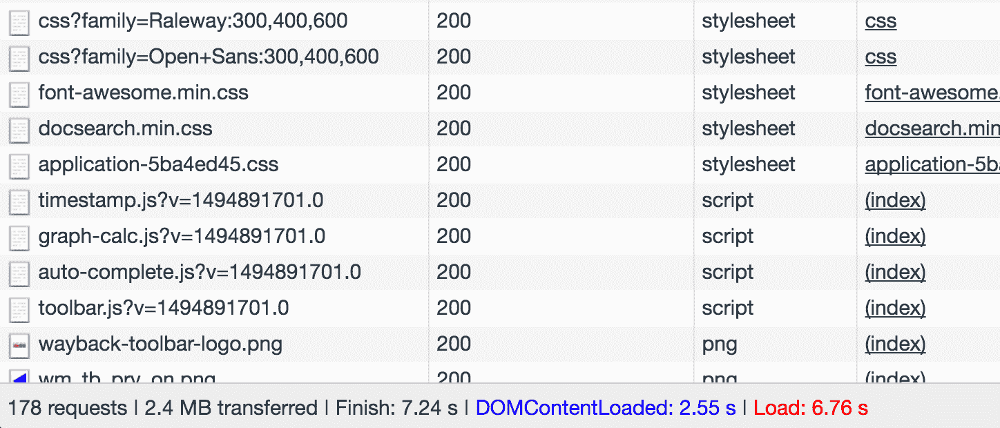
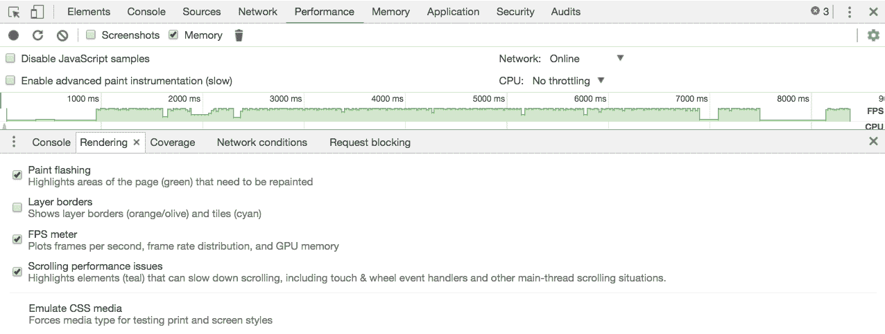
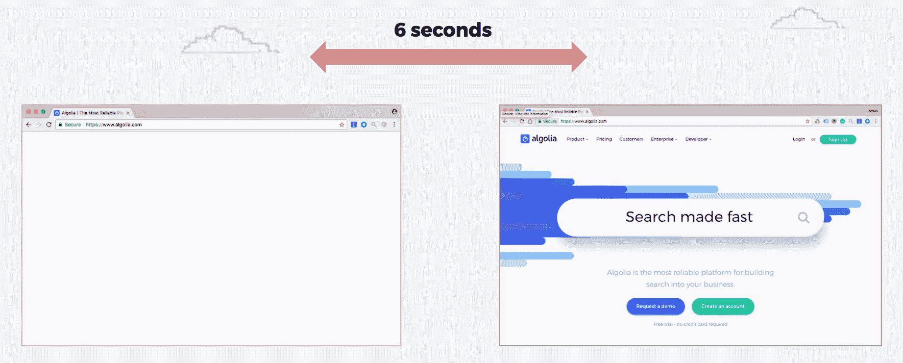
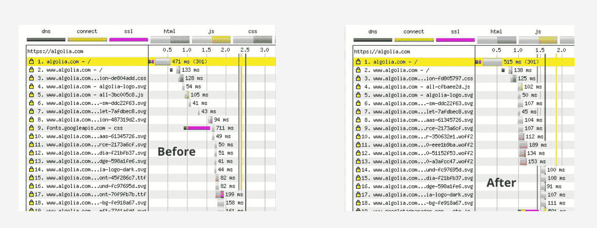
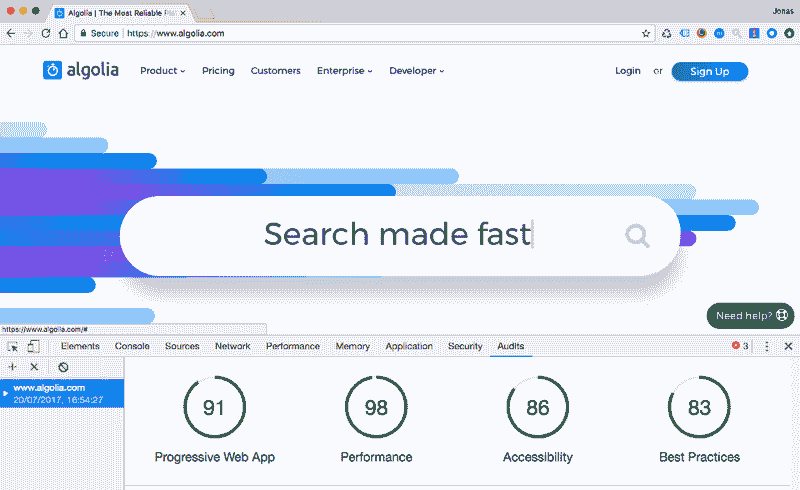

# 提高 Web 性能以反映引擎速度- Algolia 博客| Algolia 博客

> 原文：<https://blog.algolia.com/improving-web-performance-to-mirror-engine-speed/?utm_source=wanqu.co&utm_campaign=Wanqu+Daily&utm_medium=website>

性能是 Algolia 的核心特色。我们的搜索引擎可以在数百万条记录中提供毫秒级的结果。它最初是为资源非常有限的移动设备设计的，但后来被转化为在线 API，现在作为 NGINX 模块运行。我们的前端库的编写方式允许我们在客户端上表达相同的速度，并确保跨设备的高质量体验。 Algolia 的引擎和集成是一个伟大的基准和性能的灵感，所以我们想反映我们网站的卓越性能。

我们的网站是我们产品的代言人。它是用来展示我们自己和产品的媒介。这是许多人对阿尔戈利亚的第一印象。为了体现速度这一核心特征，我们还想确保我们在网站上做得更好。

### 减少有效载荷

*没有比特比没有发送的比特快；发送较少的位。* *——*伊利亚·格里戈利克，谷歌的网页性能工程师；W3C Webperf 工作组的联合主席。

正如 Ilya 所说，拥有一个快速网站的最快方法是发送尽可能少的数据。我们的网站依赖于大量的外部依赖，这增加了需要传输的总大小，并延迟了加载时间。总共有 180 个请求和 2.4 兆字节被我们的网站访问者转移。

*  * * 总有效载荷为 2.4MB，约 180 个请求发送到加载网站*

### 掉落 JavaScript 依赖

移除依赖项，如 jQuery、和其他一些，将我们的 JS 总大小减少到初始大小的 20%左右。这对我们编写前端代码的方式没有太大影响，但它迫使我们使用本机浏览器 API 来编写它，例如使用 jQuery 的[query selector API](https://developer.mozilla.org/en-US/docs/Web/API/Document/querySelector)。

为了简化这个过程，我集成了我们代码的编译，这样我们就可以编写 ES6 代码，并使用 [Babel 编译它。](https://babeljs.io/) 这使得编写代码更加高效和快速。

### 运行时性能

为了避免 [jank](https://codeplanet.io/what-is-page-jank/) 行为一旦网站被加载并准备好供用户交互，剖析 JavaScript 代码以发现瓶颈是非常有用的。

Chrome Developer Tools 的控制台抽屉里有一个非常有用的渲染标签，可以显示你网站上定期更新的区域，这些区域可能是 jank 的原因。

 *使用 Chrome 开发工具分析页面性能*

这主要意味着使用新的[intersect observer](https://developer.mozilla.org/en-US/docs/Web/API/Intersection_Observer_API)API 来重写我们的滚动事件监听器，确保我们的 DOM 操作不会过于频繁，并且我们的动画仅导致复合浏览器操作 (有关更新属性所需的操作列表，请参见[CSS triggers](https://csstriggers.com/))。这减少了浏览器绘制和重绘屏幕所需的繁重工作，反过来为您的用户提供了丝滑流畅的体验。

### **缩小 CSS 尺寸**

因为前端团队没有一个真正的编写 CSS 的惯例，当我们添加新页面时，它的规模和特性会快速增长。为了解决这个问题，我们编写了一小组自己的助手类，并采用了一种使用这些类编写 HTML 的方法。这样做可以将 CSS 文件大小减少到初始大小的 60%,并且为在不进一步增加 CSS 大小的情况下向站点添加新页面铺平了道路。    那些烦人耗时的部分被做完了；现在是时候确保用户尽可能快地看到页面了。

### **优先先画**

确定优先顺序 [首先绘制](https://developers.google.com/web/tools/lighthouse/audits/first-meaningful-paint) 我需要确定哪些资产对我们的网站渲染至关重要。这意味着异步加载所有渲染块资产，除了一些非常小的图像，如我们的徽标和我们的主 application.css 文件，该文件重约 50KB。

这样做的目的是通过在后台加载其余资源，更快地在屏幕上显示网站。

下面是关键资产优化前的装载情况。

优化后的体验:

这种优化带来了更快的 [感知性能](https://www.smashingmagazine.com/2015/09/why-performance-matters-the-perception-of-time/) 体验，而总加载时间保持不变。

除了拥有尽可能少的关键资产，将这些资产托管在您的域中也是一个很好的优化。否则，向不同域发出的每个请求都必须经过 DNS 查找、连接和 SSL 协商阶段，这将累积执行请求所需的往返时间。

例如，如果你使用谷歌 CDN 中的字体，并且你的服务器支持 HTTP/2 协议，那么你最好将这些字体放在与初始请求相同的域中。这将为来自移动网络的访问者带来显著的改善，因为移动网络的信号质量很差，往返时间更长。

在我们的例子中，自托管字体而不是从谷歌字体 CDN 加载字体，在 3G 连接上提高了大约 1s 的加载时间。

 *之前(从 fonts.googleapi 加载字体)与之后(自托管相同字体)*

如果您仔细观察，还可以看到 fonts.googleapis 请求实际上请求一个 CSS 文件，该文件包含@font-face 规则，然后创建加载字体文件的实际请求。这意味着，通过在我们的 application.css 文件中包含@font-face 规则，我们还节省了一个额外的请求——这是一个双赢的结果。如果你想深入了解字体加载策略，FilamentGroup 的 Zach Leat 写了一篇非常有帮助的文章 [概述](https://www.zachleat.com/web/comprehensive-webfonts/) 介绍了你现在可以做的改进。

### **添加 WebP 支持**

WebP 是一种新型的图像格式，支持更好的无损和有损压缩。 [支持](https://caniuse.com/#feat=webp) 因为它正在成长，所以我决定测试一下。

*40KB WebP vs 57KB JPG*

我运行了一些压缩测试，发现它能够将文件大小平均压缩到原来的 75%,这为我们节省了数百千字节。

当希望将 WebP 支持集成到我们的构建过程中时，我发现了一种简单的方法，使用[cloud flare](https://medium.com/@CloudflareBlog)和他们的改进选项。我看到他们通过自己完善的特性允许自动的 WebP 图像压缩，这使得集成 WebP 的复杂性超出了范围；启用它就像点击一个按钮一样简单。

启用 Polish 选项和 WebP 压缩后，Cloudflare 会执行繁重的工作。它检查图像请求是否包含值为*image/webp*或**/**的 ，如下所示。如果头匹配，它将原始图像转换为 WebP 格式，并添加一个值为 *行内* 的 [内容-处理](https://developer.mozilla.org/en-US/docs/Web/HTTP/Headers/Content-Disposition) 头；*filename = " path/to/image . webp "*指示浏览器将文件内联显示在页面上，并为其提供资源的文件路径。

*接受带有 webp 支持的报头— img/webp 和*/**

*带有内容处置的响应报头*

在我们的案例中，Cloudflare 的解决方案运行良好，这意味着我不必在构建时更新服务器配置和集成 WebP 转换。然而，如果你不是这种情况，并且你想要更多的灵活性，伊利亚·格里戈利克写了一个示例 [配置](https://github.com/igrigorik/webp-detect) 用于检测 WebP 支持，并且有多个库可以用来将图像转换为 WebP 格式。    **使用 HTTP/2 服务器推送**

HTTP/2 的一个伟大之处是它具有类似于 [多路复用连接](https://hpbn.co/http2/#request-and-response-multiplexing) 和 [服务器推送](https://w3c.github.io/preload/#server-push-%28http/2%29) 的特性，这些都是对 HTTP/1.1 的实质性性能改进。

多路连接允许浏览器通过单个连接发送多个请求，这大大减少了客户端和服务器之间所需的连接数。

服务器推送是一种功能，它允许服务器开始发送客户端尚未请求但知道客户端将需要的资产，因此它消除了客户端解析响应和请求资产所花费的额外时间。

您可以通过添加自定义 HTTP 头，或者通过添加链接 [rel="preload "和 as=" < type > "](https://w3c.github.io/preload/#x2.link-type-preload) 到您的 HTML 中的资产源来实现服务器推送，在这种情况下，您需要多填充行为。

为了进一步缩短首次绘制的时间，我决定避免多填充链接*rel = " preload "*并为我们剩余的渲染阻塞资产设置链接头。这加快了资源的加载速度，并将首次绘制的时间缩短了约 400 毫秒(取决于连接质量)。

要验证资产是由服务器推送的，请检查 developer tools network 选项卡，在这里您可以看到，解析文档后，请求不是由浏览器发起的，而是由 index.html 请求推送的。

*发起方—推送/(索引)表示资产被服务器推送*

如果你正在寻找一个具有 HTTP/2 服务器推送等高级功能的好的托管解决方案，看看[Netlify](https://www.netlify.com/)——他们刚刚增加了服务器推送支持，他们的托管非常稳固。

### **隐藏瓶颈**

当我在优化我们的网站时，我寻找明显的立竿见影的效果，但是有一件事我没有真正注意 HTML 文档的大小。

我们的 index.html 压缩后的大小是 60KB。

原因是内联 SVG 资产。由于它的灵活性，内联 SVG 在 web 社区中经常被推荐。有很多文章支持它，但是它们经常有缺陷，因为它们推荐它作为一个通用的解决方案，而它应该依赖于用例。比起直接将 SVG 资源内联到文档中，加载内联 SVG 资源通常有更好的方法。

内嵌 SVG 文件有两个主要后果:

*   文件尺寸增加
*   资产未被缓存

如果你正在访问一个 index.html 文件大小约为 60KB 的网站，获取文件本身需要时间，完成后，你仍然需要关键请求的其余部分来呈现页面。

通过将 SVG 合并到一个存储中，异步加载并注入到文档中，我能够将 HTML 文件的大小从 60KB 减少到大约 15KB +,作为一个额外的好处，我们现在可以缓存这些文件了——这又是一个双赢的结果。

### **测量结果及变化**

在整个开发过程中，我使用了两个主要工具来衡量我们工作的性能影响—[Chrome light house](https://github.com/GoogleChrome/lighthouse)和[web page test](https://www.webpagetest.org/)。第一个工具——light house——可以通过审计选项卡下的 Chrome 开发者工具访问，作为 CLI 工具或 Chrome 扩展。它提供有价值的信息和前端指标，而 webpagetest 可用于更深入地了解网络审计本身。

## 结果

我们已经看到加载性能有了很大的提高:我们的网站现在加载速度更快，即使在连接不良的情况下，也能确保我们的访问者在浏览我们的内容和使用我们的引擎时获得快速体验。

与最初的 2.4MB 相比，网站的总大小现在约为 700KB，其中约 300KB 的外部依赖项我们决定暂时保留。与大约 180 个请求相比，现在请求总数在 70 个左右。

此外，我们的团队能够提高运行时性能，并在不影响页面性能的情况下为网站添加更多逻辑和动画。

## 总而言之

这些改进有助于为我们所有的用户和访问者提供统一和快速的体验(我们的 [文档](https://www.algolia.com/doc/) 和我们的 [社区](https://community.algolia.com/) 页面也已经更新，以考虑性能)。

我有机会向我的 Algolia 同事介绍这个主题，提高公司内部的绩效意识。几周后，我在巴黎办公室举办的一次 PWA 巴黎聚会上做了同样的演讲。有兴趣的可以在[YouTube](https://www.youtube.com/watch?v=fyC3gnSEty0&t=2s)上看视频。

最后但并非最不重要的，我很想听到你对这个话题的评论和建议:[@ JonasBadalic](https://twitter.com/JonasBadalic)。感谢阅读🙂