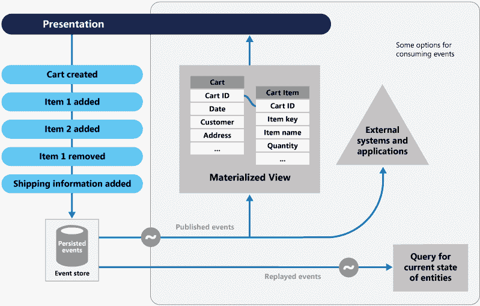
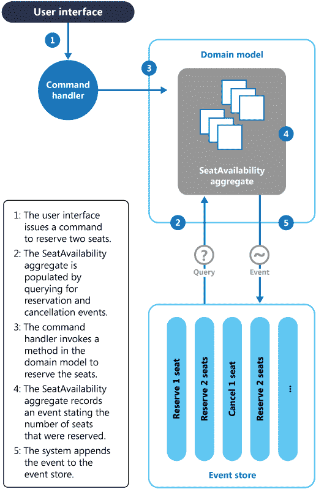

# 事件采购模式- Azure 架构中心| Microsoft Learn

> 原文：<https://docs.microsoft.com/en-us/azure/architecture/patterns/event-sourcing?utm_source=wanqu.co&utm_campaign=Wanqu+Daily&utm_medium=website>

不要只存储域中数据的当前状态，而是使用只附加存储来记录对该数据采取的一系列完整的操作。存储充当记录系统，可用于具体化域对象。这可以通过避免同步数据模型和业务领域的需要来简化复杂领域中的任务，同时提高性能、可伸缩性和响应能力。它还可以为事务性数据提供一致性，并维护完整的审计跟踪和历史记录，以便采取补救措施。

## 背景和问题

大多数应用程序处理数据，典型的方法是应用程序通过在用户处理数据时更新数据来维护数据的当前状态。例如，在传统的创建、读取、更新和删除(CRUD)模型中，典型的数据流程是从存储中读取数据，对其进行一些修改，并使用新值更新数据的当前状态—通常通过使用锁定数据的事务。

CRUD 方法有一些限制:

*   CRUD 系统直接对数据存储执行更新操作。由于所需的处理开销，这些操作会降低性能和响应速度，并限制可伸缩性。

*   在有许多并发用户的协作域中，数据更新冲突更有可能发生，因为更新操作发生在单个数据项上。

*   除非有另一种审计机制在单独的日志中记录每个操作的细节，否则历史记录就会丢失。

## 解决办法

Event Sourcing 模式定义了一种处理由一系列事件驱动的数据操作的方法，每个事件都记录在一个只加存储中。应用程序代码将一系列事件发送到事件存储区，这些事件强制性地描述了数据上发生的每个操作，事件存储区保存了这些事件。每个事件代表一组数据的变化(比如`AddedItemToOrder`)。

事件保存在事件存储中，事件存储充当有关数据当前状态的记录系统(权威数据源)。事件存储通常会发布这些事件，以便用户可以得到通知，并在需要时处理它们。例如，消费者可以启动将事件中的操作应用到其他系统的任务，或者执行完成操作所需的任何其他相关操作。请注意，生成事件的应用程序代码与订阅事件的系统是分离的。

事件存储发布的事件的典型用途是在应用程序中的操作改变实体的物化视图时维护它们，以及与外部系统集成。例如，系统可以维护所有客户订单的物化视图，该视图用于填充部分 UI。该应用程序添加新订单，添加或删除订单上的项目，并添加运输信息。描述这些变化的事件可以被处理并用于更新[物化视图](/en-us/azure/architecture/patterns/materialized-view)。

在任何时候，应用程序都有可能读取事件的历史。然后，通过回放和使用与实体相关的所有事件，您可以使用它来具体化实体的当前状态。这个过程可以在处理请求时根据需要具体化一个域对象。或者，该过程通过一个调度任务发生，以便实体的状态可以存储为物化视图，从而支持表示层。

该图显示了该模式的概况，包括使用事件流的一些选项，如创建物化视图、将事件与外部应用程序和系统集成，以及重放事件以创建特定实体的当前状态的投影。

事件来源模式具有以下优势:

*   事件是不可变的，可以使用仅追加操作来存储。启动事件的用户界面、工作流或流程可以继续，处理事件的任务可以在后台运行。这个过程，再加上在事务处理过程中没有争用的事实，可以极大地提高应用程序的性能和可伸缩性，特别是对于表示层或用户界面。

*   事件是简单的对象，描述发生的一些动作，以及描述由事件表示的动作所需的任何相关数据。事件不会直接更新数据存储。它们只是被记录下来，以便在适当的时候处理。使用事件可以简化实现和管理。

*   事件通常对领域专家有意义，而对象关系阻抗不匹配会使复杂的数据库表难以理解。表是代表系统当前状态的人工构造，而不是发生的事件。

*   事件源有助于防止并发更新导致冲突，因为它避免了直接更新数据存储中的对象的要求。然而，域模型仍然必须设计成保护自己免受可能导致不一致状态的请求的影响。

*   事件的仅附加存储提供了审计跟踪，可用于监控对数据存储采取的操作。它可以通过随时重放事件将当前状态重新生成为物化视图或投影，并且它可以帮助测试和调试系统。此外，使用补偿事件来取消更改的要求可以提供被撤销的更改的历史记录。如果模型存储了当前状态，就不会有这种能力。事件列表也可用于分析应用程序性能和检测用户行为趋势。或者，它可以用来获取其他有用的商业信息。

*   事件存储引发事件，任务执行操作来响应这些事件。这种任务与事件的分离提供了灵活性和可扩展性。任务知道事件的类型和事件数据，但不知道触发事件的操作。此外，多个任务可以处理每个事件。这使得与其他只监听由事件存储引发的新事件的服务和系统的集成变得容易。然而，事件源事件往往是非常低级的，可能有必要生成特定的集成事件。

> 事件源通常与 CQRS 模式相结合，通过执行数据管理任务来响应事件，并从存储的事件中具体化视图。

## 问题和考虑

在决定如何实现此模式时，请考虑以下几点:

只有在创建物化视图或通过重放事件生成数据投影时，系统才会最终保持一致。在作为处理请求的结果向事件存储添加事件的应用程序、发布的事件和处理它们的事件的消费者之间存在一些延迟。在此期间，描述实体进一步更改的新事件可能已经到达事件存储区。

事件存储是信息的永久来源，因此事件数据不应更新。更新实体以撤消更改的唯一方法是向事件存储区添加一个补偿事件。如果持久事件的格式(而不是数据)需要更改，可能在迁移过程中，很难将存储中的现有事件与新版本相结合。可能有必要遍历所有进行更改的事件，以便它们符合新格式，或者添加使用新格式的新事件。考虑在事件模式的每个版本上使用版本标记，以维护新旧事件格式。

多线程应用程序和应用程序的多个实例可能会在事件存储中存储事件。事件存储中事件的一致性至关重要，影响特定实体的事件顺序也是如此(实体发生更改的顺序会影响其当前状态)。为每个事件添加时间戳有助于避免问题。另一种常见的做法是用递增的标识符来注释请求产生的每个事件。如果两个操作试图同时为同一实体添加事件，事件存储可以拒绝与现有实体标识符和事件标识符匹配的事件。

没有标准的方法或现有的机制(如 SQL 查询)来读取事件以获取信息。唯一可以提取的数据是使用事件标识符作为标准的事件流。事件 ID 通常映射到单个实体。实体的当前状态只能通过相对于该实体的原始状态重放与其相关的所有事件来确定。

每个事件流的长度会影响系统的管理和更新。如果流很大，请考虑以特定的时间间隔(如特定数量的事件)创建快照。实体的当前状态可以从快照中获得，也可以通过重放该时间点之后发生的任何事件来获得。有关创建数据快照的更多信息，请参见[主从快照复制](/en-us/previous-versions/msp-n-p/ff650012(v=pandp.10))。

即使事件源最大限度地减少了数据更新冲突的可能性，应用程序仍然必须能够处理由最终一致性和缺少事务导致的不一致性。例如，指示库存减少的事件可能在订购该商品时到达数据存储。这种情况要求通过通知客户或创建延期交货来协调两种操作。

事件发布可能至少有一次是*，因此事件的消费者必须是幂等的。如果事件被处理多次，他们不得重新应用事件中描述的更新。一个消费者 cn 的多个实例维护和聚合一个实体的属性，比如下订单的总数。当发生下订单事件时，只有一个人必须成功递增聚合。虽然这个结果不是事件源的关键特征，但它是通常的实现决策。*

 *## 何时使用这种模式

在下列情况下使用此模式:

*   当您想要捕捉数据中的意图、目的或原因时。例如，客户实体的变更可以被捕获为一系列特定的事件类型，例如*搬回家*、*关闭账户*或*去世*。

*   当最大限度地减少或完全避免发生数据更新冲突至关重要时。

*   当您希望记录发生的事件、重放这些事件以恢复系统状态、回滚更改或保留历史记录和审核日志时。例如，当一项任务涉及多个步骤时，您可能需要执行一些操作来恢复更新，然后重放一些步骤来将数据恢复到一致的状态。

*   当你使用事件时。这是应用程序操作的一个自然特性，几乎不需要额外的开发或实现工作。

*   当您需要将输入或更新数据的过程与需要应用这些操作的任务分离时。这种改变可能是为了提高 UI 性能，或者是为了将事件分发给其他在事件发生时采取行动的侦听器。例如，您可以将工资单系统与费用提交网站集成在一起。由事件存储库响应于在网站中进行的数据更新而引发的事件将被网站和工资单系统消费。

*   如果您希望在需求发生变化时能够灵活地更改物化模型和实体数据的格式，或者当与 CQRS 一起使用时，您需要修改读取模型或显示数据的视图。

*   当与 CQRS 一起使用时，在更新读取模型时，最终的一致性是可接受的，或者从事件流中重新组合实体和数据的性能影响是可接受的。

这种模式在下列情况下可能没有用:

*   小的或者简单的领域，很少或者没有业务逻辑的系统，或者自然地与传统的 CRUD 数据管理机制配合良好的非领域系统。

*   需要数据视图的一致性和实时更新的系统。

*   不需要审计跟踪、历史记录以及回滚和重放操作能力的系统。

*   底层数据很少发生更新冲突的系统。例如，主要添加数据而不是更新数据的系统。

## 例子

会议管理系统需要跟踪已完成的会议预订数量。这样，当潜在的与会者试图预订时，它可以检查是否还有座位。该系统可以以至少两种方式存储会议的预订总数:

*   系统可以将关于预订总数的信息作为一个单独的实体存储在保存预订信息的数据库中。随着预订的进行或取消，系统可以适当地增加或减少这个数字。这种方法理论上很简单，但是如果大量与会者试图在短时间内预订座位，可能会导致可伸缩性问题。例如，在预订期结束前的最后一天左右。

*   该系统可以将有关预订和取消的信息作为事件存储在事件存储中。然后，它可以通过重放这些事件来计算可用座位的数量。由于事件的不变性，这种方法更具可扩展性。系统只需要能够从事件存储中读取数据，或者将数据追加到事件存储中。关于预订和取消的事件信息永远不会被修改。

下图说明了如何使用事件源实现会议管理系统的座位预订子系统。

预订两个座位的操作顺序如下:

1.  用户界面发出为两个参与者预订座位的命令。该命令由单独的命令处理程序处理。一个与用户界面分离的逻辑，负责处理作为命令发布的请求。

2.  通过查询描述预订和取消的事件来构建包含关于会议的所有预订的信息的集合。这个集合称为`SeatAvailability`，包含在一个域模型中，该模型公开了查询和修改集合中数据的方法。

    > 要考虑的一些优化是使用快照(这样您就不需要查询和重放完整的事件列表来获取聚合的当前状态)，以及在内存中维护聚合的缓存副本。

3.  命令处理程序调用域模型公开的方法来进行预订。

4.  `SeatAvailability`集合记录了包含预订座位数的事件。下次聚合应用事件时，所有预订将用于计算剩余座位数。

5.  系统将新事件附加到事件存储中的事件列表。

如果用户取消座位，系统会遵循类似的过程，只是命令处理程序会发出一个命令，生成一个座位取消事件，并将其附加到事件存储中。

除了提供更大的可扩展性，使用事件存储还可以提供会议预订和取消的完整历史记录或审计跟踪。事件存储中的事件是准确的记录。不需要以任何其他方式保存聚合，因为系统可以轻松地重放事件并将状态恢复到任何时间点。

> 您可以在[介绍事件源](/en-us/previous-versions/msp-n-p/jj591559(v=pandp.10))中找到关于此示例的更多信息。

## 后续步骤

*   [物体相关阻抗不匹配](https://en.wikipedia.org/wiki/Object-relational_impedance_mismatch)

*   [数据一致性入门](/en-us/previous-versions/msp-n-p/dn589800(v=pandp.10))。当您对单独的读取存储或物化视图使用事件源时，读取的数据不会立即保持一致。相反，数据只会最终保持一致。本文总结了维护分布式数据一致性的相关问题。

*   [数据分区指导](/en-us/previous-versions/msp-n-p/dn589795(v=pandp.10))。当您使用事件源来提高可伸缩性、减少争用和优化性能时，通常会对数据进行分区。本文描述了如何将数据划分到离散的分区中，以及可能出现的问题。

*   马丁·福勒的博客:

在实现此模式时，以下模式和指南可能也是相关的:

*   [命令和查询责任分离(CQRS)模式](/en-us/azure/architecture/patterns/cqrs)。为 CQRS 实现提供永久信息源的写存储通常基于事件源模式的实现。描述如何通过使用不同的接口将读取应用程序中的数据的操作与更新数据的操作分开。

*   [物化视图模式](/en-us/azure/architecture/patterns/materialized-view)。基于事件源的系统中使用的数据存储通常不太适合高效查询。相反，一种常见的方法是定期或在数据发生变化时生成数据的预填充视图。

*   [补偿交易模式](/en-us/azure/architecture/patterns/compensating-transaction)。事件来源商店中的现有数据不会更新。相反，会添加新条目，将实体的状态转换为新值。要撤销更改，需要使用补偿条目，因为不可能撤销之前的更改。描述如何撤消上一个操作所执行的工作。*