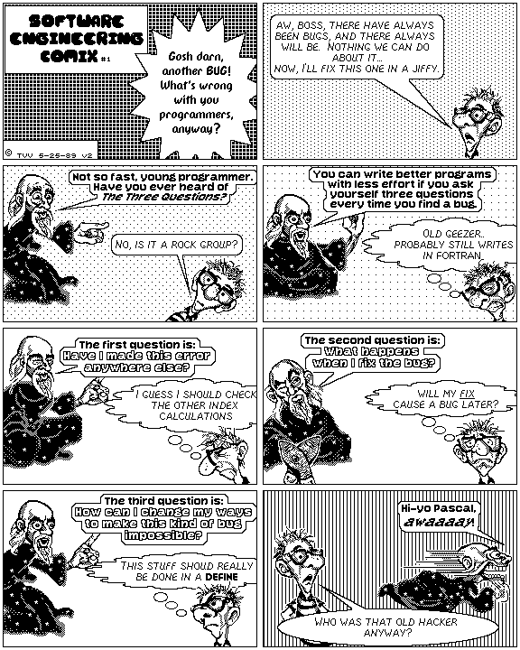

# 关于你发现的每个 Bug 的三个问题

> 原文：<http://www.multicians.org/thvv/threeq.html?utm_source=wanqu.co&utm_campaign=Wanqu+Daily&utm_medium=website>

软件工程故事

# 关于你发现的每个 Bug 的三个问题

Tom Van Vleck

你有时会修复一个 bug，然后发现另一个 bug 与第一个 bug 或你修复它的方式有关吗？当我修复一个 bug 时，我会问自己三个问题，以确保我已经仔细考虑了它的重要性。每当你认为你已经找到并修复了一个 bug 的时候，你可以用这些问题来提高生产率和质量。

这些问题背后的关键思想是每个 bug 都是潜在过程的症状。你必须治疗症状，但是如果你只是治疗症状，你会永远看到更多的症状。你需要找出是什么过程产生了 bug，并改变这个过程。一旦您确定发生了什么以及是什么导致了它的发生，导致您的 bug 的潜在过程可能是非随机的，并且是可以控制的。

在你问这三个问题之前，你需要克服你对仔细检查 bug 的自然抗拒。查看代码并解释哪里出错了。从可观察到的事实开始，反向工作，反复问为什么，直到你能描述 bug 背后的模式。通常，你应该和同事一起这样做，因为解释你认为发生了什么会迫使你面对你对程序的假设。

"它爆炸了，因为下标 J 超出了范围。"
“为什么？”
“J 是 10，但是顶部数组下标只有 9。”
“为什么？”
“J 是字符串长度，数组原点是 0，所以长度为 1 的字符串最后一个字符是索引 0。”

在发现 bug 的时候，寻找情况中额外的惊喜。检查失败时的关键程序变量，看看能否解释它们的值。

“为什么名字是空的？”
“为什么它试图输出一个错误信息？”

记下你做了什么和发生了什么。你需要知道到底发生了什么，这意味着保持测量和历史。

当这些步骤完成后，你就可以问第一个问题了。

## 1.这个错误在其他地方也存在吗？

在代码中寻找同样模式适用的其他地方。系统地改变模式，寻找相似的错误。

"我还能在哪里使用长度作为下标？"
“我所有的数组都有相同的原点吗？”
“长度为零的字符串会发生什么？”

试着描述在代码的这一部分应该是正确的，但是 bug 没有遵守的本地规则；您对这个不变量[1]的搜索将帮助您发现其他潜在的错误。

"起始偏移量加上长度，减去 1，就是结束下标..除非长度为零。”

为你发现的每一个 bug 修复几个 bug 会更有效率。试图用一般的术语来描述 bug 也提高了你对程序正在做什么的理解水平，并帮助你避免在编程时引入更多的 bug。

## 2.这个 bug 后面还藏着什么 bug？

一旦你想出如何修复这个 bug，你需要想象一旦你修复了它会发生什么。失败的语句后面的语句可能也有错误，但是程序以前从来没有这么严重:或者由于您的修复，可能第一次输入了一些其他代码。看一下这些未经测试的语句，寻找其中的漏洞。

“下一句话有用吗？”

当你考虑控制流的时候，是时候问一下程序中是否还有其他未触及的部分。

“有我从未测试过的功能组合吗？”

检测一个程序并不需要太多的工作，所以你可以在执行它的各个部分时进行检查；而且令人惊讶的是，在构建者说程序已经过测试之后，程序的大部分根本无法运行。

“我能在测试中显示所有的错误信息吗？”

小心不要在一个地方做了改变，导致了其他地方的错误。对某个变量的局部更改可能会违反执行中进一步做出的假设。

“如果我只是从 J 中减去 1，那么当字符串长度为 0 时，后面的 move 语句会尝试移动-1 个字符。”

如果您已经对程序做了很多更改，请仔细考虑添加另一个本地补丁是否是正确的，或者是否是时候重新设计和实现了。

## 3.我该怎么做才能防止这样的 bug？

问问你如何改变你的方式，使这种错误从定义上来说是不可能的。通过改变方法或工具，通常有可能完全消除一整类故障，而不是一个一个地找出错误。

首先问一下 bug 是什么时候引入的:在开发生命周期中的什么时候可以防止 bug？

“设计还可以；我在编码中引入了这个 bug。”

详细检查错误的原因。考虑在引入 bug 时正在进行的过程，并询问如何改变它以防止 bug。

"偏移量和长度的独立数据类型在编译时会捕捉到这个错误。"
“每个文本项可以用一个宏输出，该宏隐藏了下标计算。然后我就可以解决这个问题了。”

不要满足于油嘴滑舌的回答。假设你对一个 bug 的解释是，“我只是忘记了。”流程怎么改才不需要记忆？可以更改语言，以便完全隐藏您忽略的细节，或者您的忽略被检测到并导致编译器诊断。你可以为这个问题域使用一个语言预处理程序，或者一个聪明的编辑工具，它可以填充缺省值，检查错误，或者提供提示和快速文档。该错误可能是编程团队中沟通问题的征兆，或者是需要讨论的冲突设计假设的征兆。

考虑发现 bug 的方式，并询问如何更早发现它。怎样才能使测试更加严密？测试可以自动生成吗？可以添加内嵌的检查代码来一直捕获错误吗？

“我应该在我的单元测试中尝试零长度字符串。”
“我可以启用下标检查并更快地捕捉到它。”

用于编译、构建和测试的系统方法和自动化工具总是值得创建的。通过消除长时间的调试和事实调查，他们很快就收回了成本。

## 该技术的应用

养成一个习惯，每次发现一个 bug 就问这三个问题。你甚至不用等一个 bug 来使用这三个问题。

在设计和实施评审期间，您得到的每条意见都可以用三个问题来处理。评审意见是您可以改进的潜在沟通过程的结果。例如，如果您觉得读者对规范的评论是错误的，您可能会问是什么使您的文档无法被理解，以及您如何才能更好地与审阅者沟通。

设计和代码检查[2]是发现许多 bug 的有力手段。你可以就检查过程中发现的每个缺陷提出三个问题。如果检查过程是彻底的，前两个问题不会出现很多新的错误，但是第三个问题可以帮助找到防止将来出现错误的方法。

致谢:我感谢许多朋友和同事，他们教会了我这些课程，丰富了我的生活和工作。杰伊·奥戴尔、里克·伯曼、对本文之前的版本提出了宝贵的批评和建议。

## 参考

[1]霍尔，C. A. R,《程序的证明:发现》,<cite>《美国计算机学会通讯》第 14 卷，第 39-45 页，1971 年 1 月。</cite>

[2]m . e .法甘，减少程序开发中错误的设计和代码检查， <cite>IBM 系统杂志 15(3)，1976。</cite>

[3]索尔特泽，J. H .， [修复了 Multics](http://mit.edu/saltzer/www/publications/rfc/csr-rfc-005.pdf "new window: http://mit.edu/saltzer/www/publications/rfc/csr-rfc-005.pdf") ，<cite>麻省理工学院 CSR-RFC-5，1973 年 2 月 27 日。</cite>

ACM SIGSOFT 软件工程笔记，第 14 卷第 5 期，1989 年 7 月，第 62-63 页。