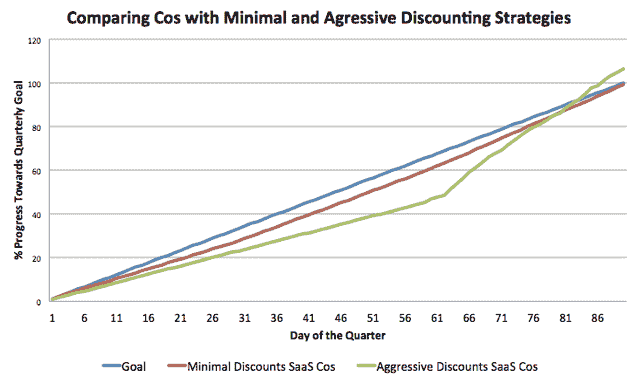
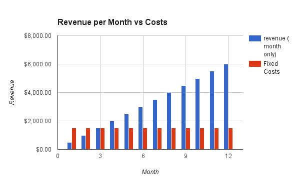
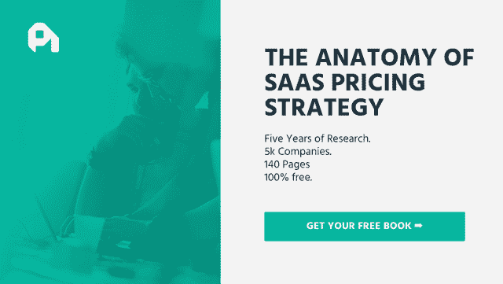

# 一份全面的数据指南，告诉你为什么不应该打折

> 原文：<http://www.priceintelligently.com/blog/discount?utm_source=wanqu.co&utm_campaign=Wanqu+Daily&utm_medium=website>

 为了吸引人们购买他们的产品，许多 SaaS 公司转向打折定价来增加购买量。他们认为，一旦这些客户看到了产品的价值，他们就可以提高价格。但是通过贴现，你已经伤害了这个价值。

 <video id="wistia_simple_video_184" crossorigin="anonymous" poster="https://fast.wistia.com/asseimg/blank.gif" src="blob:https://preview.hs-sites.com/22fe4869-7b10-4a03-9059-d15c3b6f05ee" controlslist="nodownload" playsinline="playsinline" preload="metadata" type="video/m3u8">嗨！我们是威斯特亚。我们提供商业视频托管来吸引、吸引和愉悦客户

感谢您报告问题。我们将附上关于本次会议的技术数据，以帮助我们解决这个问题。以下哪一项最能描述问题？

<select class="w-report-a-problem__category" title="Problem Category"><option value="">Choose one</option> <option value="stuttering">Video plays but frequently stutters</option> <option value="low_quality">Video has poor quality</option> <option value="fails_to_play">Video fails to play</option> <option value="other">Other</option></select>

还有其他细节或背景吗？

消息</video> 

在本系列中，我们讨论了定价是一个专注而耐心的过程。在花了这么多时间完善你的定价之后，你不应该把打折作为一种“权宜之计”，通过低估你产品的价值来吸引更多的顾客。让我们从数据的角度来看为什么这是如此痛苦，以及如果你需要使用折扣，你应该如何使用它们。

[T2】](/developing-your-saas-pricing-strategy)

## 打折的顾客不太愿意付钱，所以不会留下来

在零售业，提供折扣可以带来更多的生意，因为品牌可以限制供应。然而，在 SaaS，顾客会不断看到如此多的促销和折扣，如果你只提供“两天”的折扣，他们知道还会有更多的折扣。

为了研究不同折扣策略的效果，我们比较了来自 88 家 SaaS 公司 (55 家为最小规模，33 家为积极规模)的[数据，并跟踪了一个季度内实现目标的进度。

在整个季度中，最小组一直接近预期目标，而激进组则越来越落后，直到最后几周。此时，为了确保实现季度目标，销售团队将开始积极使用折扣。

当只看目标的时候，看起来咄咄逼人的策略可能是更好的选择，因为他们最终超过了目标。然而，将我们的视野局限于这一小段时间意味着我们错过了如此激进的折扣策略的重大影响。

我们更深入地研究了这些指标，以了解随着时间的推移，每种策略如何影响公司。
我们看到，通过积极的折扣，客户:](//www.priceintelligently.com/blog/saas-discounting-strategy-lowers-ltv-by-over-30-percent)

*   **支付意愿降低。**他们的价格门槛已经定得很低，因此当价格回升时，他们对价格的敏感度更高，不太可能续约。

*   **高[流失率](https://www.profitwell.com/customer-churn/calculate-churn-rate)。随着价格的上涨，消费者更有可能流失并寻找更便宜的替代品，而不是续购。**

*   **降低[生命值(LTV)](https://www.profitwell.com/recur/all/average-revenue-per-user) 。**如此多的客户不再续约，你甚至没有体验到任何收入，就失去了为获得他们所做的投资。

通过提供积极的折扣而没有适当的保留策略，企业看到了高离职率和收入损失。

## 打折低估了你的产品在外部和内部的价值

公司经常提供折扣，认为这将有助于获得更多的客户，从而增加现金流。然而，从长远来看，它最终反而会伤害你，因为你必须花更长的时间来恢复 CAC，随着客户的增加，CAC 甚至会更高。

为了比较折扣对 CAC 的不利影响，我们研究了 20%的折扣(最常见的折扣之一)对购买价格为 6000 美元的 500 美元/平方米客户的影响。
20%的折扣使您客户的 MRR 降至 400 美元，并将收回[客户获取成本(CAC)](https://www.profitwell.com/recur/all/calculate-and-reduce-cac) 的时间延长了 3 个月。这相当重要，尤其是考虑到我们已经知道折扣客户的流失率甚至更高。即使折扣最初带来了更多的生意，你可能永远也不会为这些折扣客户追回 CAC，最终损失更多的钱。

虽然折扣直接影响你的实际收入，但它也会通过训练你的客户和团队贬低你的产品来扼杀你作为一家公司的动力。

*   你的客户认为这不值得。通过以折扣价提供同样的产品，你的潜在客户可能认为你的产品不值你的原价。

*   您的销售团队只想完成交易。他们可能会利用折扣作为达成销售的阻力最小的途径，削弱你希望公司关注的[利润文化](//www.priceintelligently.com/blog/bid/177799/How-Your-Culture-is-Destroying-Profits-and-pricing-strategy)。

不对你的产品进行适当的估价会导致利润在你有机会注意到它们消失之前就像洪水一样从折扣水龙头中流失。

## 你应该什么时候打折？

我们不是说你不应该提供折扣。事实上，在特定的时间和事件中，它们对促销和交易尤其有用。但是在你决定提供折扣之前，你应该确保你遵守了这些规则:

1.  **离散。不要向所有人宣扬你以更低的价格提供同样的产品。那些支付全价的人可能会觉得被低估了。**

2.  **细分市场折扣。**只瞄准那些需要额外推动力来达成交易的人。不要向那些愿意付全价的人出价，否则你会错过那些机会。

3.  **在范围和时间上的限制。**打折的目的是降低人们成交所需的初始激活能量，但之后你的产品应该让他们相信全价是值得的。通过只在一定时间内提供折扣，你可以增加紧迫感，让顾客觉得有必要现在就购买。

4.  改变你的报价。让您的优惠具有可预测性会让客户期待它，并等待折扣生效，而不是现在就支付全价。

如果你决定提供折扣，你可以通过在你的年度计划中提供折扣来最大化你的初始回报。年度计划是提前获得现金的好方法，尤其是对 SaaS 的新兴公司来说。

假设一家公司每月有 1500 美元的固定成本，我们看到该公司至少需要 4 个月才能开始盈利。
把这比作提供年度订阅的公司。我们看到，该公司将在第一个月内实现收支平衡，并比只有月度计划的情况下更快地开始盈利。与每月订阅相比，拥有年度计划可以让你有更多的钱投资于你的业务，并在一年中不断发展，而不是等待每个月都有更多的现金。通过对你的年度计划而不是月度计划提供折扣，你可以吸引更多的客户，使他们有可能停留更长时间，并且在年初给你带来更多的现金流。即使只有 10%的客户注册了打折的年度计划，也会对你的收入产生巨大的影响。

[T2】](/developing-your-saas-pricing-strategy)