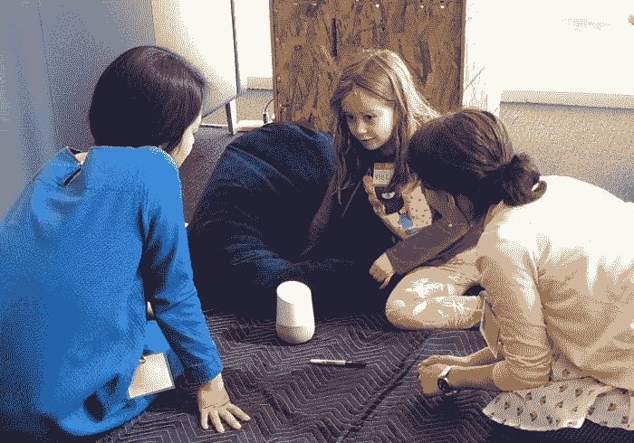

# 与 Alexa 一起成长|麻省理工科技评论

> 原文：<https://www.technologyreview.com/s/608430/growing-up-with-alexa/?utm_source=wanqu.co&utm_campaign=Wanqu+Daily&utm_medium=website>

汉娜咯咯地笑着，鼓掌着，在房间里跳舞。我觉得这种获得音乐点播的能力也很整洁，我不想无礼，所以我和她一起跳舞。但与此同时，我也在想，在电脑的陪伴下长大对她来说意味着什么。

研究公司 eMarketer 估计，今年美国将有 6050 万人——略低于总人口的五分之一——每月至少使用一次数字助理，大约 3600 万人将在亚马逊 Echo 或谷歌 Home 等基于扬声器的设备上使用数字助理。这些东西在 25 岁到 34 岁的人群中最受欢迎，其中包括许多有小孩的父母和准父母。

这些技术助手不仅会越来越受欢迎；它们在回应查询和订单方面也会变得更好，听起来也会更像人类。与此同时，像汉娜这样的年轻用户将变得更加舒适和成熟，而不仅仅是告诉 Alexa 播放一首歌。他们会要求家庭作业或家中控制设备方面的帮助。

有点令人担忧。抛开孩子告诉联网计算机各种事情的隐私影响不谈，我们不太清楚这种与人工智能和自动化的互动将如何影响孩子的行为和他们对计算机的看法。他们会因为要求 Alexa 和它的同行做事情和买东西如此容易而变得懒惰吗？或者混蛋，因为许多这些互动迫使你命令周围的技术？(或者两者都有？)

Children in the MIT Media Lab study using a Google Home device. The researchers hope to eventually design such digital agents so that kids will be able to tinker with them.

其中一些可能会发生。然而，似乎更有可能的是，就像在此之前的许多技术一样，数字助理的效用将超过它们的缺点。他们已经将数量惊人的数据和计算机辅助能力直接提供给孩子们——甚至那些还没有上幼儿园的孩子——用于学习、玩耍和交流。有了 Alexa，孩子们可以获得各种问题的答案(严肃的和愚蠢的)，听故事，玩游戏，控制应用程序，甚至在他们还不能触及墙壁开关的情况下打开灯。而这仅仅是儿童人工智能革命的开始。

#### 【Alexa 有感情吗？

我不确定汉娜是否知道 Alexa 是不是人类。所以我问了，这是她告诉我的:Alexa 是“一种机器人”,住在她的房子里，她推断，机器人不是人。但她确实认为 Alexa 是有感情的，有开心的，也有难过的。汉娜说如果阿利克夏离开她会很难过。这是不是意味着她必须对 Alexa 好？是的，她说，但是她不确定为什么。

她对她的数字助理的兴趣与麻省理工学院最近的一项研究中的一些发现不谋而合，研究人员观察了 3 至 10 岁的儿童如何与 Alexa、Google Home、名为 [Cozmo](https://anki.com/en-us/cozmo) 的小型游戏机器人以及名为 [Julie Chatbot](https://play.google.com/store/apps/details?id=com.ndidevelopment.bot.julie&hl=en) 的智能手机应用互动。研究中的孩子们认为这些设备总体上是友好和值得信赖的，他们问了一系列问题来了解这些技术(“嘿，Alexa，你多大了？”)并弄清楚它们是如何工作的(“你体内有电话吗？”).