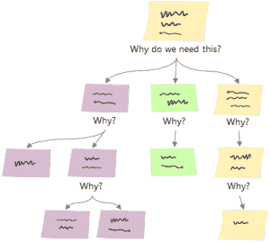

# 你的产品经理超级权力——关注产品

> 原文：<https://www.mindtheproduct.com/2017/08/product-manager-super-power-not-knowing-everything/?utm_source=wanqu.co&utm_campaign=Wanqu+Daily&utm_medium=website>

最近，一个刚成为产品经理的朋友问我这个问题。她继承了一个技术产品，在这个产品中，工程师们已经对方向和所需的交付成果有了看法。尽管它被分成了几个阶段，但每个阶段的范围都很大，并且包含了许多无意识的假设。在规划研讨会期间，工程师们提到了许多她不熟悉的工具、方法、流程和概念。Lizzie 发现自己阅读了大量详细的技术资料，不知道自己到底需要理解多少。作为产品经理，她在团队中的角色应该是什么？她怎样才能最好地增加价值？在这种情况下，很容易让人觉得自己是个骗子。觉得自己不配待在那里，觉得自己随时会被发现。这是一个众所周知的现象，叫做

[imposter syndrome](https://www.mindtheproduct.com/tag/imposter-syndrome/)

，连登月第一人尼尔·阿姆斯特朗都经历过！

## 产品经理应该了解多少？

事实是，作为产品经理，你不应该什么都知道。你是指挥。你不需要会演奏每一种乐器。你的工作是对乐曲整体的感觉，并帮助音乐家诠释音乐。然后，和他们一起生活和呼吸每一个音符。我认为，不管一个产品经理变得多么有经验，好的产品经理的标志是一种健康的冒名顶替综合症。

## 我有问题，也不怕使用它们

不知道一切的力量在于，它让你能够提出问题，挑战假设。作为产品经理，它可以帮助你避免匆忙下结论和匆忙寻找解决方案的陷阱。它给了你充分探索问题的力量。

[Dave Wascha](http://davewascha.com/)

建议尽早养成提问的习惯:

*“Relish being the new person, take advantage of it, and ask questions to the point of being annoying”* 

对你的产品建立详细的知识显然是被鼓励的，但是有一个好奇的心态也是如此。有了经验，你会知道什么时候问问题最好，什么时候让团队去钻研细节最好。然而，牢记产品目标有助于这一点。Lizzie 在计划会议中的关键是让每个人都专注于目标，并明确范围。与其问技术细节，不如问问题来引导工程师，比如“我们为什么需要它？”“没有这些，我们能创造价值吗？”“这能让我们实现什么？”“如果我们有一半的时间，我们可以不建什么？”，等等。

阅读更多关于与利益相关者打交道时的 5 个为什么。

询问组件的价值(而不是它们的功能)可以让你对它们如何帮助你实现产品的愿景有一个大致的了解。你还会感觉到最大的价值在哪里。此时，如果您觉得需要稍微改变方向或者缩小第一个可交付成果的范围，您可以和团队一起进行“五个为什么”的练习。这不仅能帮助你分解它，还能让整个团队与你一起，这样每个人都能理解基本原理(如果项目已经在进行中，这一点尤其重要)。目的是拿着每一个组件，问你为什么需要它。然后，对于给出的每一个答案，再问一次“为什么”，直到你找到了根本动机。现在，找出最小的、独立的可交付成果是什么。它们需要以特定的顺序完成还是可以并行进行？哪些部分增加了价值(哪些需要一起交付)？

一旦 Lizzie 的团队将所有东西分解成离散的价值块，并决定他们将首先解决哪个，她的技术主管就想知道“这对我们的首席技术官来说是否足够令人印象深刻”。每个人都喜欢一个大的，戏剧性的揭示，但大爆炸交付是有风险的。任何事情都可能阻止你完成它，即使你完成了，也不能保证它会成功。要问的问题是“如果我们发布这个更小的部分，我们会交付任何价值(或者学到任何有价值的东西)吗”？只要你专注于这一点，不断发货，把你的产品放在人们面前，向他们学习，并不断适应，总是更好。不要忘记这只是许多步骤中的第一步。如果将来优先级改变了，每个人仍然可以对发布一些有用的东西感觉良好。

## 关注基本面

根据马斯洛的[产品]需求层次理论来考虑这一点可能会有所帮助。关注最基本的交付成果，对实现你的产品愿景至关重要的交付成果。一旦你有了这个基础价值层，你就可以开始构建金字塔的下一层价值。每一层都越来越复杂。当你从核心问题的基本解决方案转移到优化和前沿功能时，人们会对你的产品产生深刻的个人联系。这一切都从问几个简单的问题开始。

[了解更多关于产品管理技能的内容。](https://www.mindtheproduct.com/category/product-management-skills/)