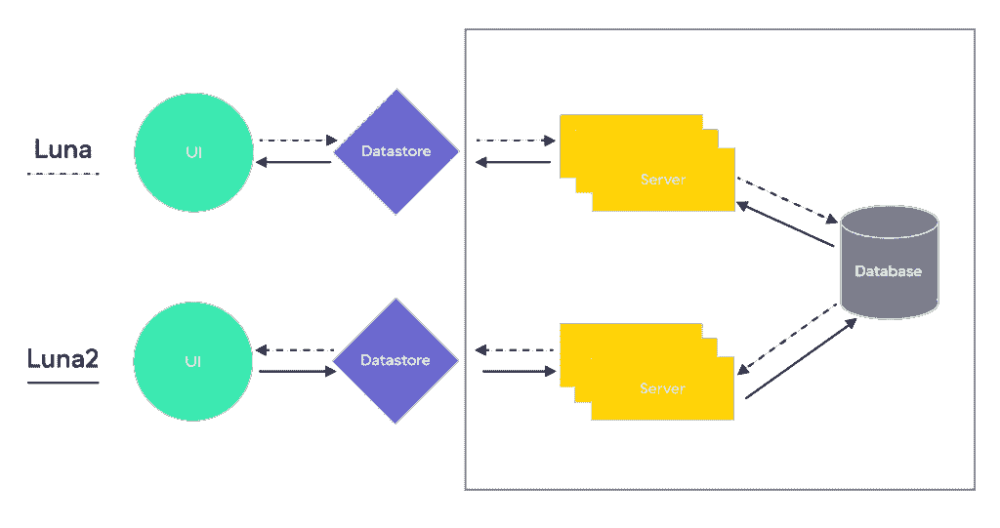
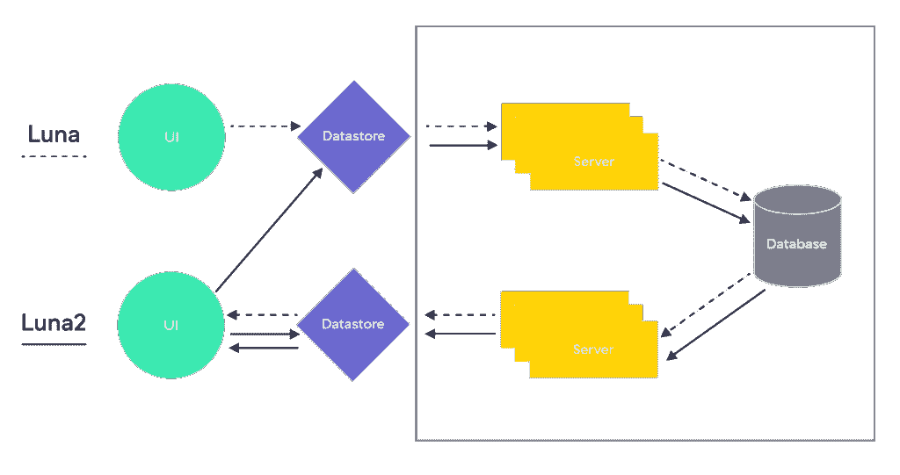

# 体式如何提高表现的技术故事

> 原文：<https://blog.asana.com/2017/08/performance-asana-app-rewrite/?utm_source=wanqu.co&utm_campaign=Wanqu+Daily&utm_medium=website>

### 月神的起源

#### Asana 产品愿景

当开发最初的 Asana 应用程序时，联合创始人达斯汀·莫斯科维茨和贾斯汀·罗森斯坦设想了一个像纸一样容易使用的网络应用程序。Asana 的早期愿景是用户可以以思维的速度创建和更新任务，并立即与队友分享。为了实现这个梦想，我们必须设计一个桌面质量的应用程序。

然而，对于我们当时的规模来说，为每个平台构建一个原生应用程序是不可行的。因此，我们决定尝试构建一个可以部署到每个平台的 web 应用程序。

#### 缺乏选择

当我们在 2009 年开始开发时，几乎没有富 web 应用程序存在。而且例子如此之少，没有最佳实践可循。大多数交互式应用程序使用 AJAX 和模板的组合来实现反应。这种方法导致数据丢失、多次往返以及不一致的用户体验。但是我们的创始工程师从他们在谷歌和脸书的工作经验中学到，为了确保一个高性能和稳定的应用程序，他们需要建立自己的框架。他们将这个框架命名为 [Luna](https://blog.asana.com/2015/05/the-evolution-of-asanas-luna-framework/) (以达斯汀的猫命名)。

#### 关键设计决策

为了实现我们的目标，我们设计了一个针对开发人员生产力进行优化的系统。开发人员可以像在 React 中一样编写视图，并且数据是可用的。在 Luna 中写作，当它表现良好时，几乎是神奇的。开发复杂的特性只需要传统模型-视图-控制器方法的一半时间。我们的数据存储和反应抽象确保了一致的产品用户体验。

为了在开源环境中实现这一点，我们开发了 Firebase、RxJS 和 React 的内部版本。当时的开源替代方案是 Backbone、Knockout 和 Angular 1。一些开发者对这个框架深信不疑，他们离开了 Asana 与其他几个贡献者一起，他们根据 Luna 的原则创建了 Meteor。

但是这种魔法也有一些主要的缺点。首先，我们将应用程序逻辑和数据获取结合起来。确定向客户机发送什么数据需要服务器呈现整个视图。这意味着我们为每个用户运行一个有状态的流程来模拟 UI。为了使整个系统工作，我们还必须将我们的专利反应系统与我们的数据存储相结合。最终结果是，改变一个方面需要改变所有方面。

### 决定 Luna2

#### 皈依的需要

到 2013 年，随着我们添加更多功能和代码的增长，应用程序开始感觉变慢。与此同时，Asana 不仅仅是一个简单的团队共享任务列表:我们正在成长为一个成熟的工作跟踪应用程序，100 人甚至 1000 人的团队都依赖它来达到截止日期、实现目标并一起完成工作。

我们——更重要的是，我们的客户——已经注意到性能随着时间的推移而下降，Asana 不再像我们的创始人最初想象的那样是桌面质量的应用程序。几个性能团队花了几个月的时间来改进应用程序的不同部分。虽然每个团队都取得了递增的胜利，但是框架的基本缺陷仍然存在。我们需要尝试激烈的措施来达到我们想要的表现。

在 2013 年[感恩节期间，一些工程师讨论了如何解决核心问题。目标是将应用程序逻辑与数据提取分离。这将允许我们的基础设施工程师编写更新、更快的后端。因此，我们组建了一个团队，将现有的产品代码转换成新的范例。但到 2014 年 3 月，这个团队意识到 Luna 的深度耦合使得这种方法不可行。在我们的下一次黑客马拉松中，我们在](https://blog.asana.com/2012/11/thankshacking/) [TypeScript](https://blog.asana.com/2014/11/asana-switching-typescript/) 中原型化了一个新的前端，并做出了反应。黑客马拉松的设计既熟悉又兼容新的后端。我们将前端和后端的新组合命名为 Luna2。

#### 技术选择

在为最后一个 Luna 表演团队配备人员后，我们决定在 2014 年 8 月进行转型。我们听说过公司因重写而未能实现业绩目标的轶事。我们也听到了初创企业因这种努力而内爆的轶事。为了避免这些结果，我们严格挑战我们的原则和策略。这个过程定义了我们对 Luna2 的愿景。

我们根据 Luna 的经验为 Luna2 选择了一些核心原则。

首先是偏向于**开源**。我们以前写过许多核心实用程序，随着时间的推移，它们的替代品出现在开源社区中。我们决定使用开源替代方案，而不是维护每个内部库。这种方法也让我们为开源社区做出了贡献。我们的主要贡献是 [React 类型定义](https://github.com/Asana/DefinitelyTyped/tree/master/react)和 [typed-react](https://github.com/Asana/typed-react) 。

下一个原则是偏向于显性的**而不是隐性的**。我们的许多工程问题都来自 Luna 的固有特性。我们努力招募新的工程师，因为产品开发需要理解我们的框架。此外，开发人员不会因为性能而[落入成功的陷阱](https://blog.codinghorror.com/falling-into-the-pit-of-success/)。

最后的原则是**简单胜于容易**。与 Luna monolith 相比，我们构建了清晰的单一用途抽象。这些抽象避免了卢娜的魔力。Luna abstractions 试图处理所有情况，并依赖于特定领域的语言。相比之下，Luna2 使用强不变量和一致的编码风格。

#### 增量重写

我们决定增量转换应用程序，以避免我们听说过的轶事噩梦。我们注意到重写诱发的噩梦有一个共同的主题。每一次，该公司都在没有一致支持的情况下下了大赌注。他们还试图避免同时运行两个框架。自然的结果将是一个“停止世界”重写和没有新的产品功能。

我们的策略允许我们尽早并经常验证新框架。每个特性都可以更快地提高性能，并告知项目时间表。与创建新的“v2”应用程序相反，我们维护了整个特性集。与编写新应用程序相比，这增加了成本，但避免了功能和性能之间的折衷。事后看来，我们选择了正确的取舍。

该战略需要两个新的技术特征。第一个是从我们现有的数据存储到新 API 的适配器。这个适配器允许我们在没有 Luna2 后端的情况下构建 Luna2 前端功能。这种适配器不仅速度慢，而且需要几个月的时间来制造和生产。但是我们已经从卢娜身上学到了分离我们的建筑的经验。

第二个是连接 Luna 和 React 的抽象。每个框架都有一组类似的 DOM、事件处理程序等抽象。这两个框架之间的桥梁看似简单，但却是错误的最大来源。Luna 有细致复杂的行为来支持古老的浏览器和我们的功能。这种行为经常与 React 的假设相冲突。在两个框架之间建立和谐是最困难的技术挑战之一。

### 我们战略的成本

#### 产品变更和重写

我们决定转换的第一个大规模组件是产品的导航[侧栏](https://asana.com/guide/help/fundamentals/navigating-asana)。我们在 Luna2 中创建了一个新的侧边栏，其中有一个未经测试的新 UX。我们发货的时候用户就反感了。我们打破了用户创建和依赖的特定于侧边栏的工作流。我们还在重要的功能上妥协，因为框架还不成熟。

在运行了一个 [5 个为什么](https://wavelength.asana.com/workstyle-ask-5-whys-to-get-to-the-root-of-any-problem/)之后，我们学到了重要的一课。将产品变更与重写结合在一起同时存在太多的变量。所以我们进化了我们的策略。首先是重写项目将不再包括产品变更。第二个是关注与使用成比例的重写工作。这使我们的客户能够更快地享受到最大的性能优势。为了实施这一战略，我们组建了两个团队。一组转换[列表视图](https://asana.com/guide/help/views/list)，另一组转换[细节视图](https://asana.com/guide/help/tasks/fields#gl-description)。

#### 大脑分裂问题

一旦我们启动了 Luna2 后端，我们注意到 UI 的不同部分有不同的数据。这两个框架现在通过 PubSub 而不是 Luna2/Luna 数据存储适配器进行同步。这意味着列表视图中的更改可能需要一分钟才能出现在详细视图中。尽管性能有所提高，但产品运输成本太高。

我们最初试图逐个解决每个 bug。这种努力需要时间，也正是我们想要阻止 Luna 的做法。我们用一个新的解决方案 DoubleWriteDatastore 缓解了这个问题。该适配器通过以正确的顺序对每个框架应用更改来保持两个框架的同步。

这解决了“裂脑”错误系统，而不是单独。我们认为这是列表/详细视图的临时解决方案。然而，DoubleWriteDatastore 至今仍是基础设施的核心部分，因为有许多不常用的 Luna 视图我们还没有重写。

Before the DoubleWriteDatastore

After the DoubleWriteDatastore

#### 优先考虑功能

另一个产品问题是 Luna 和 Luna2 之间缺乏拖放支持。用户无法将任务从列表视图拖到侧边栏。这种缺失的功能一直存在，直到我们转换了现有的侧边栏。相比之下，我们知道从列表到细节的拖放更常见。我们决定在显示 Luna2 列表视图时使用 Luna2 细节视图。这种平衡使我们能够在保持重要功能的同时提高性能。

#### A/B 测试假设

在增量转换的同时，我们也逐渐降低了页面加载性能。因为我们的捆绑包在两个框架中都包含产品功能，所以评估时间增加了。Luna2 还依赖代码生成，这加剧了问题。由于 Luna2 依赖 Luna 作为我们重写策略的一部分，我们最后获取 Luna2 数据。我们通过运行 A/B 测试发现了这个问题。

A/B 测试是工程领域众所周知的最佳实践。在这种情况下，A/B 测试告诉我们，新框架仍然存在关键问题。尽管应用程序中的动作明显更快，但 A/B 测试是负面的(可能是由于页面加载速度变慢)。为页面加载性能团队配备人员缓解了这些问题，并发现了其他机会。在页面加载性能提高之后，我们重新运行了 A/B 测试，得到了积极的结果。

### TL；速度三角形定位法(dead reckoning)

#### 开发者效率

在整个重写过程中，框架团队应用了合理的原则，并听取了内部开发人员的意见。最终的结果是一个比 Luna 更高效的框架。在表演的同时，我们设法保持了露娜的精神和愿景。由于 Luna2 的解耦特性，新的框架功能很容易实现。我们增加了 i18n 支持、自动性能跟踪等等。比起 Luna，开发人员现在更喜欢在 Luna2 中做产品工作。

#### 更好的性能

大约 85%的真实用户导航现在都在 Luna2 中。这意味着用户始终感受到真正的性能优势。该框架也通过真实世界的测试变得成熟。这意味着我们现在可以将产品和性能改进结合起来。

在最近的一项调查中，客户表示性能不再是他们最大的痛点(几年来一直如此)。这不仅是工程团队的巨大解脱和成就，更重要的是我们客户生活的巨大改善。随着 Asana 继续快速发展，越来越多的团队和公司开始依赖 Asana 来更清晰、更高效地跟踪和管理他们的工作，我们将继续把绩效视为一种产品，以帮助他们实现目标和抱负。