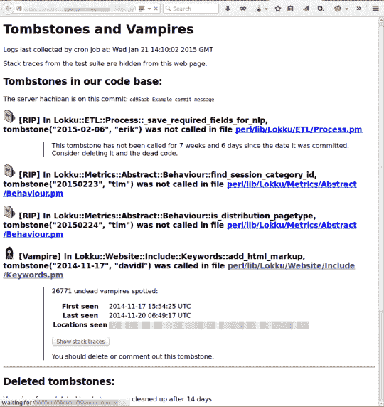

# Nestoria Dev 博客:死亡代码的墓碑

> 原文：<http://devblog.nestoria.com/post/115930183873/tombstones-for-dead-code?utm_source=wanqu.co&utm_campaign=Wanqu+Daily&utm_medium=website>

你身边有死代码吗？你当然知道。但是你从经验中知道，即使一些代码看起来死了，盲目地删除它也会在生产中引起真正的问题。有什么解决办法？墓碑。

我们第一次听说这个想法是在看到 Box 的 David Schnepper 的这个演示时。这是一个短小精悍的五分钟长的视频，我强烈建议在阅读这篇文章的其余部分之前观看它。

<center><iframe src="https://www.youtube.com/embed/29UXzfQWOhQ" frameborder="0" allowfullscreen="allowfullscreen">VIDEO</iframe></center>

这个演讲启发我们用 Perl 实现它。它是这样工作的:你怀疑的每一段代码都是死的，你用这样的墓碑来标记:

```
package Example;

use Lokku::Tombstone qw(tombstone);

sub example_possibly_dead_code {
   tombstone('2015-04-02', 'davidl');

   # possibly dead code follows:
   ...
} 
```

`tombstone`子例程只是记录它被调用过，这就是它所做的一切。如果在紧循环中调用，它试图尽可能快地避免生产系统变慢。它有几个安全措施，比如当日志文件变得太大时会自动失败。

下面是`tombstone`子例程，穿插了解释文本:

```
sub tombstone {
    my $yyyy_mm_dd_of_tombstone = shift;
    my $author = shift; 
```

传递给`tombstone`的两个参数只是关于墓碑的简单数据:谁在何时添加的。它们对生成关于墓碑的报告很有用。我们本可以连接 Git 来自动提取这些信息，但是我发现将这些信息放在代码中非常有用。

```
 make_path("$ENV{LOKKU_COMMON}/tombstone/vampires", { err => \my $ra_err });
    if ($ra_err && @$ra_err) {
        for my $error (@$ra_err) {
            warn "Error making path $ENV{LOKKU_COMMON}/tombstone/vampires: $error";
        }
        return;
    }

    my @now = gmtime();
    my $filename = "$ENV{LOKKU_COMMON}/tombstone/vampires/vampires_"
                    . strftime("%F", @now)
                    . "_${USERNAME}_${yyyy_mm_dd_of_tombstone}_${author}.log"; 
```

`tombstone`记录到名为日期、进程用户名和逻辑删除 ID 的本地文件。这将使以后读取和清理文件更加简单。

从目录名可以看出，事实上*没有死*的逻辑删除代码被称为“吸血鬼”:-)

每个 tombstone()调用有一个单独的文件允许每个 tombstone 有一个单独的磁盘空间配额，我现在将解释这一点。

```
 open my $fh, ">>:encoding(UTF-8)", $filename
        or do { warn "Could not open '$filename' $!"; return; };

    my $size_in_bytes = tell($fh);
    if ($size_in_bytes == -1) {
        warn "tell failed: $!";
        return;
    }
    elsif ($size_in_bytes > $SIZE_IN_BYTES_THRESHOLD) {
        return;
    } 
```

重要的是我们不能意外地填满磁盘，所以每个文件都有一个最大大小，作为一个简单的磁盘配额机制。过多的事件被简单地丢弃——知道一个吸血鬼被呼叫 100 次还是 100 万次并不重要。

在任何时候，如果发生错误，子例程只是返回，而不是抛出异常，以避免破坏调用代码的功能。

```
 flock($fh, LOCK_EX | LOCK_NB) or return; # non-blocking 
```

让几个进程并发地写入一个文件可能会很棘手，所以这里我们使用一个 Linux 文件锁来避免竞争情况。我们在非阻塞模式下调用它，这样如果一个进程不能获得锁，子例程只是返回，而不是挂起或抛出异常。

```
 # OK, using JSON::XS may slow this subroutine down a little bit, but it makes
    # parsing so much easier, so forgive me.
    state $JSON = JSON::XS->new;
    my $StackTrace = Devel::StackTrace->new(skip_frames => 1, no_args => 1);
    my $FirstFrame = $StackTrace->frame(0);
    my $SecondFrame = $StackTrace->frame(1) || $StackTrace->frame(0);
    my $rh_message = {
        gmtime                  => [@now],
        stack_trace             => $StackTrace->as_string(),
        author                  => $author,
        yyyy_mm_dd_of_tombstone => $yyyy_mm_dd_of_tombstone,
        filename                => $FirstFrame->filename,
        line                    => $FirstFrame->line,
        subroutine              => $SecondFrame->subroutine,
    };
    my $eval_rv = eval {
        my $string = $JSON->encode($rh_message);
        say $fh $string or warn "Could not print to '$filename': $!";
       1;
    };
    if (! $eval_rv || $@) {
        warn $@;
    } 
```

我们写入文件的日志行实际上包含相当多的数据。它包含 tombstone ID(日期和作者)、完整的堆栈跟踪、调用时间和调用位置。当稍后查看报告时，所有这些数据都非常有用:例如，如果我们想要的话，最好知道不同的堆栈跟踪是什么，以便能够干净地重构或删除代码。

```
 # close will unlock the file:
    close $fh or warn "Could not close file '$filename': $!";

    return;
} 
```

子程序结束了！

我们有一个 cronjob 定期将所有日志文件复制到一个中心位置，还有一个 cronjob 删除旧的日志文件。这个代码对我们的基础设施来说是非常特殊的，所以请原谅我们没有在 CPAN 上分享或发布它。

最后一部分是显示结果的网页。



自从我们开始使用这种技术，它被证明是非常有用的。我们已经删除了大量真正死了的代码，并且我们已经设法避免删除那些我们认为已经死了但并没有死的代码。我强烈推荐。

大卫·洛