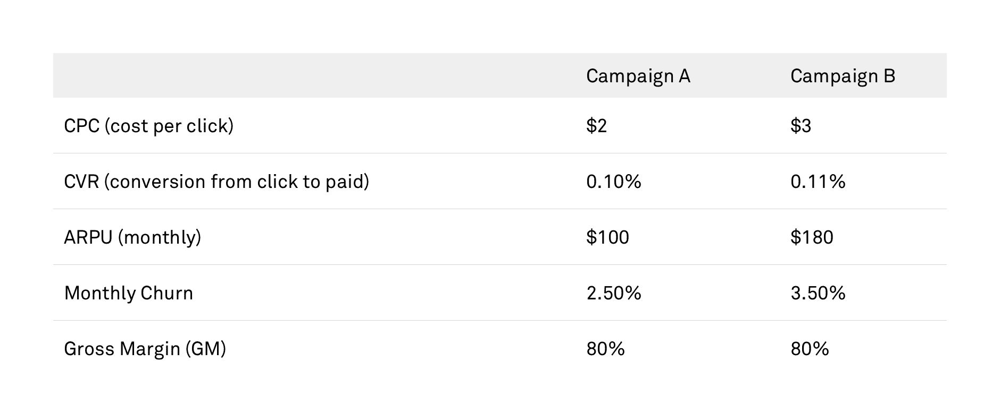
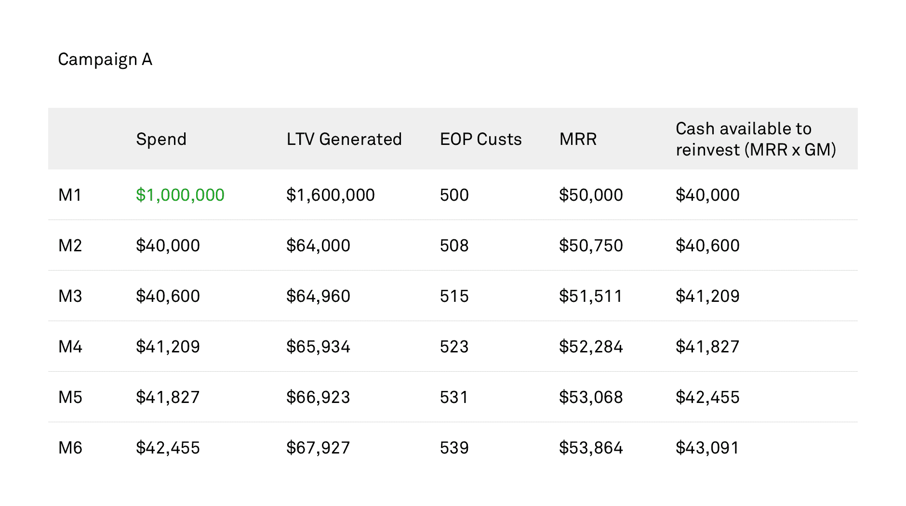
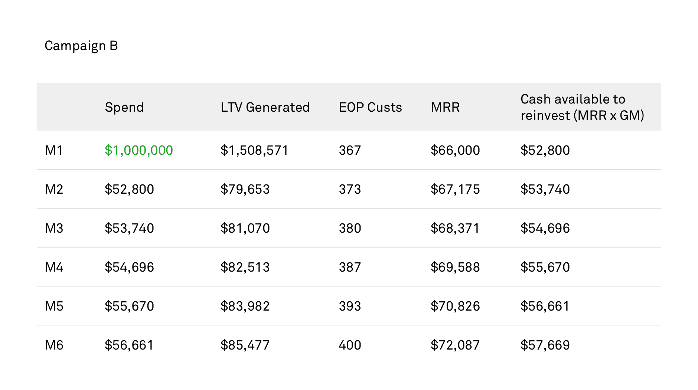
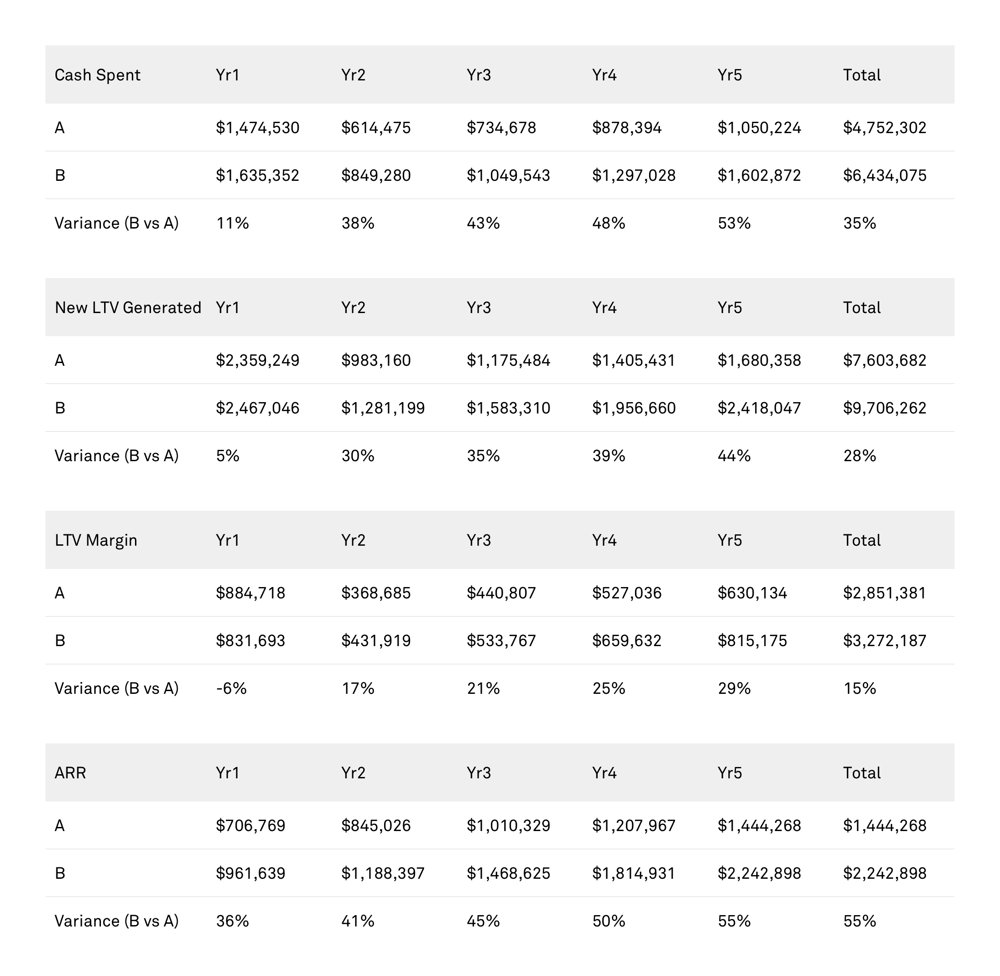
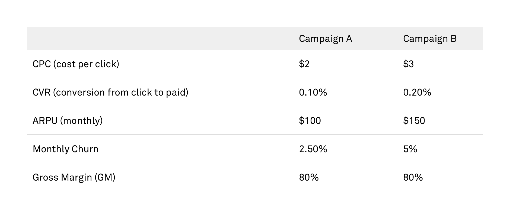
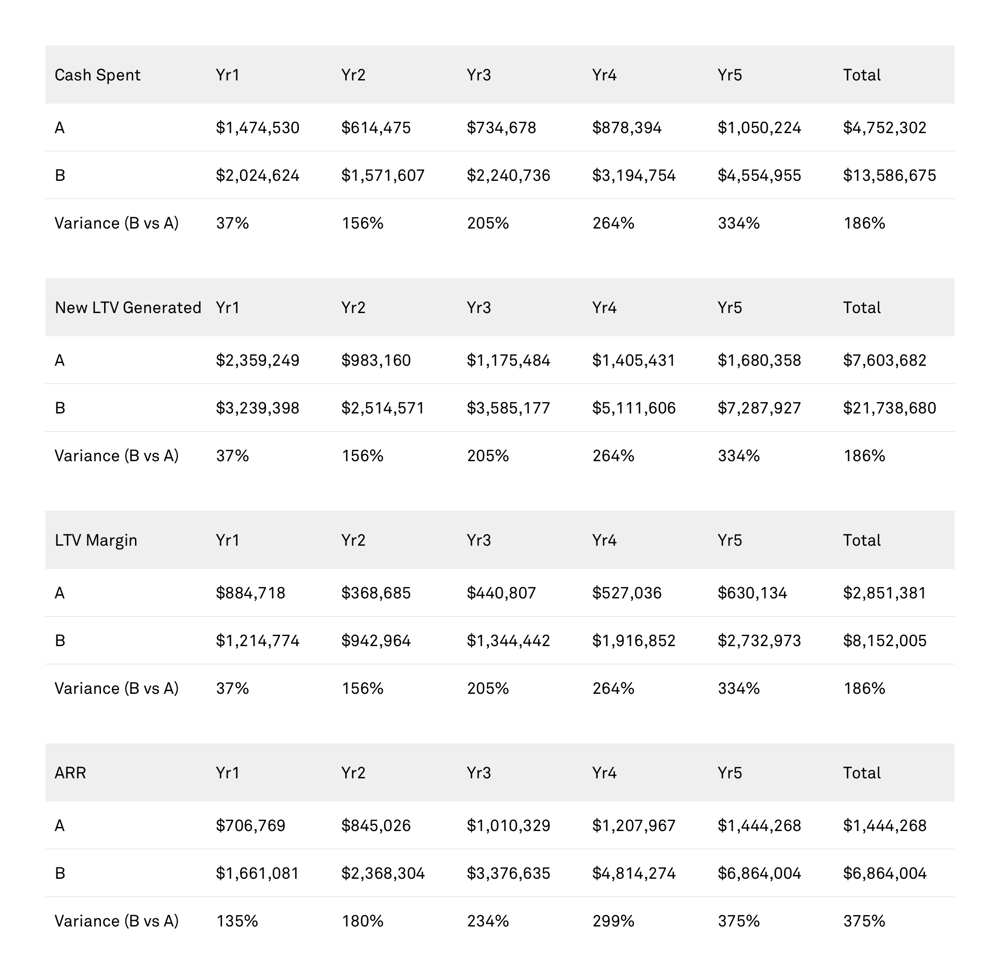
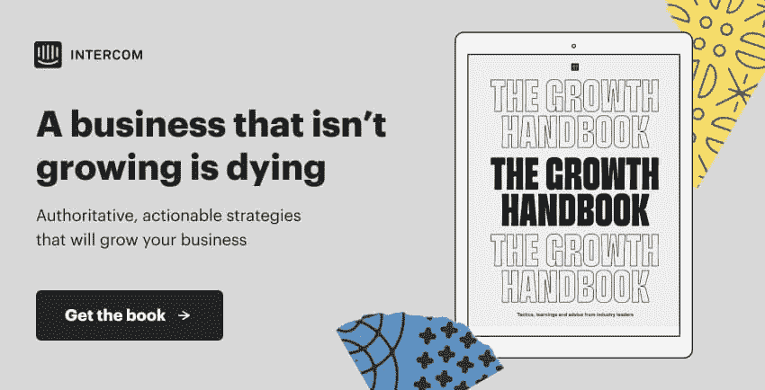

# 在线广告回收期的力量-内部对讲机

> 原文：<https://blog.intercom.com/the-power-of-payback-periods-in-online-advertising/?utm_source=wanqu.co&utm_campaign=Wanqu+Daily&utm_medium=website>

SaaS 营销人员和分析师对衡量在线广告活动的成功有一个普遍的误解，这可能会限制他们的增长。

大多数 SaaS 营销人员和分析师用终生价值(LTV)、[获得客户的成本(CAC)](https://www.intercom.com/blog/what-is-customer-acquisition-cost/) 以及两者之间的利润率来衡量他们营销活动的成功。在分析任何活动时，这是正确的第一步。毕竟，LTV 利润率是证明一个活动是否可持续的基本指标。

然而，当选择如何在两个 LTV 盈利的活动之间分配有限的资本时，大多数人没有做任何超出第一步的分析。他们只是对利润最高的活动进行优化。

不幸的是，只关注 LTV 利润会给客户增长、收入和盈利能力带来巨大损失。决定最佳营销活动的关键，也是大多数营销人员未能考虑的，是营销活动的资本回报率，也称为回收期。

这篇文章的灵感来自于我雇佣在线营销人员和分析师的经历。我用下面例子的简化版本作为面试筛选。绝大多数候选人都不及格——超过 90%的人(包括经验丰富的 SaaS 营销人员和分析师)从未发起过关于回收期的讨论。

通过下面的两个例子，我展示了许多人通过简单地优化 LTV 利润率而付出的代价，以及通过理解回收期而可能得到的好处。

## 每个例子的前提

想象一下，你是 SaaS 一家公司的[在线营销主管，给了你 100 万美元去获得客户。你在为增长而优化。你只有两次成功活动的数据，你只能在一次活动中投入 100 万美元。](https://seo.co/saas-online-marketing/)

要做出正确的决定，你需要遵循以下三个步骤:

1.  了解你所在单位的经济状况(LTV、CAC、利润)。
2.  了解你的投资回收期。
3.  考虑投资回收期如何影响你对企业的再投资能力。

现在我们来看第一个例子。

## 例子 1:较高的 LTV 利润并不总是成功的

您可以从以下两个活动(A 和 B)中选择一个:

使用我们的框架，我们知道第一步是计算我们的单位经济。因此，我们采取以下措施:

活动 A:

*   如果你花了 100 万美元，你将获得 **50 万次点击**[100 万美元消费/2 美元点击费]
*   如果你获得 50 万次点击，你将获得 **500 名客户** [50 万次点击 x 0.10% CVR]
*   每位客户的 LTR(终身收入)为 **$4，000** [$100 ARPU / 2.5%的月流失率]
*   因此，你创造的总 LTV 为**、160 万美元** [、4，000 美元 LTR x 500 名客户 x 80% GM]

你花了 100 万美元在 LTV 得到了 160 万美元，因此你赚了 60 万美元。

这与活动 B 相比如何？

*   如果你花费 100 万美元，你将获得 333，333 次访问
*   如果你得到 333，333 次点击，你将得到 **367 个客户** [333，333 次点击 x 0.11% CVR]
*   每位客户的 LTR 为 **$5，143** [$180 ARPU / 3.5%的月流失率]
*   因此，您产生的总 LTV 为**$ 150.9 万** [$5，143 LTR x 367 客户 x 80% GM]

你花了 100 万美元在 LTV 得到 150.9 万美元，因此你赚了【1.509 万美元的利润。

比较两个选项:

从这个角度来看，活动 A 是两个选项中更有利可图的。大多数分析就此打住，选择活动 A。然而，停在那里是一个严重的错误。我们还必须评估投资回收期。

活动投资回收期:

如果你花 100 万美元获得 500 个客户，你已经为每个客户支付了**2000 美元**。每个客户每月给你 80 美元(100 美元 ARPU x 80%通用汽车)，所以你在大约 **25 个月**内达到收支平衡。

活动 B 回收期:

如果你花 100 万美元获得 367 个客户，你已经为每个客户支付了**2727 美元**。每个客户每月给你 144 美元(180 美元 ARPU x 80%通用汽车)，所以你在大约 **19 个月**内达到收支平衡。

活动 A 和活动 B 之间的回报差只有 6 个月。听起来还不错，对吧？无论如何，活动 A 产生了更多的 LTV 和更多的客户，并且具有更低的流失率和更高的盈利能力。我们用选项 A 吧！

糟糕的选择。原因如下。

正如你可能已经猜到的，这又回到了你看到投资回报的速度。在活动 B 中，你可以更快地收回投资。如果你把这些现金再投资到客户获取上，你实际上可以加速增长。你会看到选项 B 很快超过了选项 a。

假设你继续再投资，下面是前 6 个月的数据:

这是 5 年来的情况:

如果您选择活动 b，看看您在 5 年后得到的差别。您将能够:

1.  将 35%以上的资金重新投入到客户获取中
2.  产生 28%以上的 LTV
3.  将 LTV 整体利润提高 15%
4.  以 55%的高 ARR 结束

我们最初的 LTV 数学告诉我们选择活动 A——现在你明白我为什么用它来筛选面试者了。通过采取额外的步骤将回收期考虑在内，我们得到了一个显著不同的结果，对业务产生了重大影响。

我想再举一个例子来说明这一点(所有的数学计算都已经完成)。

## 示例 2:相同的 LTV 边距会产生截然不同的结果

我们将使用相同的概念。想象一下，你是一名营销人员，获得了 100 万美元来获得客户并建立业务。除了在这个例子中，活动 B 略有不同，有 0.20%的 CVR，150 美元的 ARPA 和 5.0%的月流失率。

按照我们的框架，我们计算得到以下单位经济学。

这一次，你可以看到两个选项产生了相同数量的 LTV 和 LTV 利润。也许你应该无动于衷，但现在你更清楚了。让我们看看回报率！

活动 A 在 25 个月内收回成本(100 万美元支出/ 500 名客户= 2K CAC…$ 2K CAC/$ 80/月= 25 个月)。

活动 B 在 13 个月内收回成本(100 万美元支出/ 666 个客户= 1.5 万美元 CAC…$ 1.5 万 CAC/$ 120/月= 13 个月)。

好的，那么 B 大概用一半的时间就收回了:13 个月对 25 个月。现在，让我们将现金重新投入到客户获取中，看看这两项活动进展如何。

不，你没有看错。这就是复合增长的美妙之处:开展活动 B 5 年后，你的业务规模将是实施活动 A 的近 5 倍。单位经济学告诉你，它们是一样的(甚至比活动 A 略胜一筹)，但投资回报率告诉你，它们是截然不同的。如果你想发展业务，活动 B 显然是更好的选择。

* * *

当衡量你的在线广告活动时，仅仅看 LTV 和成本单位经济学是不够的。这可能导致重大疏忽和错失良机。你从客户那里收回现金并将其再投资到业务中的速度决定了你增长的速度。当你权衡如何投资你的血汗钱时，请记住这一点。

对于公司来说，彻底改变投资回收期的最简单的方法之一就是让客户每年提前付款。既然你已经理解了回收期的力量，想象一下预先收集现金会对你的成长产生什么样的影响！

[T2】](https://www.intercom.com/books/growth-handbook?utm_source=ii-blog&utm_medium=blog-horizontal-cta&utm_campaign=201810-GrowthHandbook&utm_content=footer-graphic)