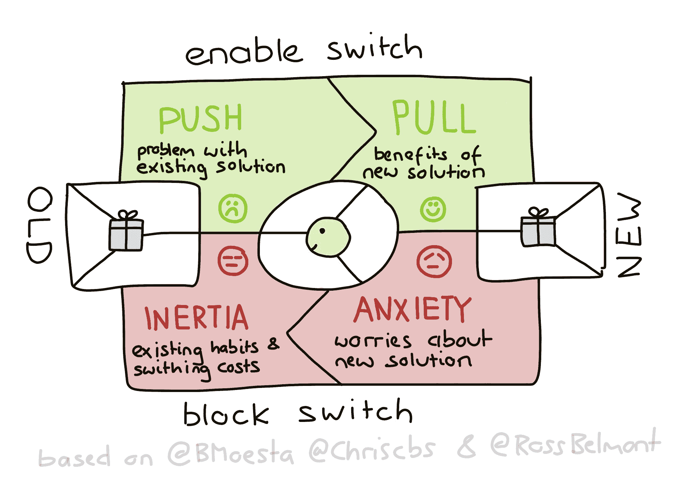

# 客户如何采用产品

> 原文：<http://blog.strategyzer.com/posts/2017/9/11/how-customers-adopt-products?utm_source=wanqu.co&utm_campaign=Wanqu+Daily&utm_medium=website>

 **这是一个名为“影响力图”的工具，可以帮助您理解为什么客户可能会转向或不会转向新的价值主张或解决方案。我们发现这个概念和工具非常有价值，因为它与我们的 Strategyzer 工具集很好地配合。它确实有助于理解新价值主张的采用或潜在采用。**

这个工具是由 Bob Moesta 和 Chris Spiek 开发的，他们深入参与了“工作要做”运动。该工具强调了采用新价值主张的两种对立力量:

1.  是什么促使人们转向新的解决方案？

2.  是什么阻碍了人们转向新的解决方案？

## **A)开关的激励器**

激励力量有两个驱动因素:

**推动:**调查是什么促使人们寻找不同的解决方案？可能是现有解决方案的问题，也可能是不愉快的经历。将这些激励因素视为使用当前产品或服务的痛苦。

**拉:**这就是鲍勃和克里斯所说的“新的磁力”解决方案；它是新产品或服务吸引顾客的原因。在价值主张画布的客户档案中，这些是新价值主张的收益创造者，与客户寻求的收益紧密相关。这些是新解决方案最吸引人的好处。

## **B)阻塞开关**

阻碍力有两个阻碍或抑制变革的驱动因素:

**惰性:**现有的解决方案有什么会阻止人们转换？是什么让一个人很难转行？我想到的一个例子是 Nespresso 咖啡系统。一般来说，一旦你买了机器，你就被锁定在系统中了(咖啡包只适用于 Nespresso 机器)。如果你想换，你必须买一台全新的机器。也可能仅仅是现在的习惯阻止了客户的转变。

**焦虑:**这里你强调了客户对新解决方案的担忧。这将是一个难以采用的服务或产品吗？这种新产品或服务真的像承诺的那样有效吗？靠谱吗？这些类型的问题会让人焦虑，阻碍采用新产品的能力。

我们非常相信商业人士一起使用几种工具，这里我们有一个很好的工具来思考人们如何采用新的解决方案。它与价值主张画布完美融合。