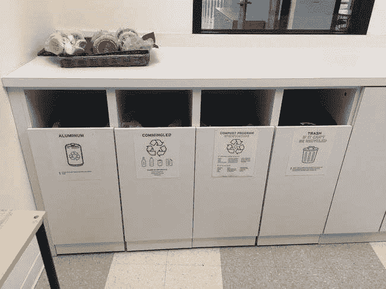
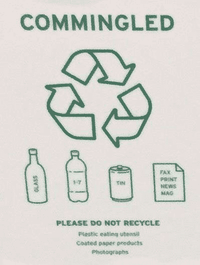
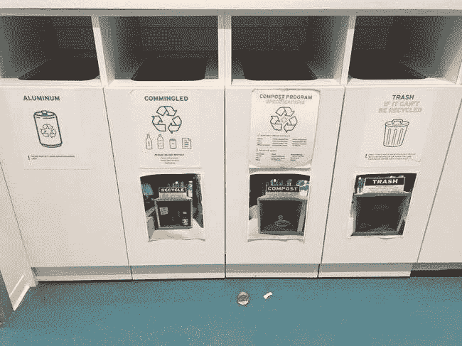
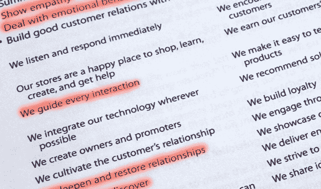
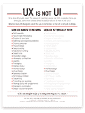

# 在垃圾堆里找到 UX

> 原文：<https://f2.svbtle.com/ux-in-the-trash?utm_source=wanqu.co&utm_campaign=Wanqu+Daily&utm_medium=website>

<time datetime="2017-09-01" class="article_time">September 1, 2017</time>

## *UX 的重点是让事情变得毫不费力* [#](#emthe-point-of-ux-is-making-things-effortless_2)

我通常拒绝分享我对如何制作软件的看法，出于一些骗子综合症的无聊谦虚的东西。但这实在太有趣了，不能不写下来和大家分享。

用户体验是当今任何软件产品成功的关键。然而，我发现我们行业中有太多的人并不真正了解 UX 到底是什么。让我们先把软件放在一边，用一个崇高的例子来说明这一点。

# 垃圾话 [#](#trash-talk_1)

[T2】](https://svbtleusercontent.com/24yiqr8soemiq.jpg)

这个垃圾桶显然是由一位好心的工程师设计的。它考虑到了每一种可能性……每次你接近它的时候，它都会让你玩 10 个问题。叉子可以堆肥吗？是的，原来他们在这栋楼里。正如所有涉及 UX 的案例一样，问题的关键并不是拯救环境(或者让你的网络设置正确)不值得努力。UX 的观点是让这些有价值的目标变得不费力。

前两个垃圾桶的**和**都有易拉罐的图标，这让我每次想扔掉可乐的时候都会抽搐。当然，21 世纪所有的罐头都是铝制的，正如[鸭道奇队](https://www.youtube.com/watch?v=60-etRy0dg8)会傲慢地指出的那样。但是如果你发现一个锡罐包裹着你的汤，它会被放进不同的垃圾桶。它在标志里，所以有什么问题？

[T2】](https://svbtleusercontent.com/polfonm0bhxqrg.jpg)

传真(真的？)、印刷品、报纸和杂志放入 2 号箱。但不是照片或铜版纸产品，它们不是通过指示而是通过排除进入箱#4。*呃*。

就像与任何手机应用程序或现代网站的交互一样，扔垃圾是一种本能和快速的动作。不要让我思考。但是不了解 UX 的人真的看不到这一点——通常他们是固执的类型。*很明显*，你不明白这个垃圾行业是如何运作的，所以让我们再一次用图片展示一下每个垃圾箱里都有什么！

[T2】](https://svbtleusercontent.com/sl04s1hur4sipg.jpg)

人们没有阅读垃圾桶的 4 页文件。聪明的是，这里的想法是 7 页将为我们解决问题。不太可能。但是添加文档不是 UX 的风格。文档是好的，就像拯救环境一样。但 UX 也不是。如果你不相信我的话，请相信那些管理着数百万 StackOverflow 用户的人:

这对于回收利用来说更加重要，UX 不仅仅是“仅仅”节省人们的时间，因为被坏 UX 打败的用户变得不合规，将垃圾扔进任何垃圾桶。UX 正在把那四个箱子变成两个(或者一个！)并与单一溪流回收供应商签约。UX 拿走了选择，却以某种方式做出了正确的事情。

现在，让我们停止玩垃圾——这很有趣，但不是我们想要纠正的。让我们回到软件。您在您的家庭网络中。当我使用 Ctrl-P 时，没有 IP 路由的工作中的打印机应该是提供的选择吗？仅仅因为它是我最后使用的一台打印机？

Windows 选择最后使用的打印机。没什么大不了的，对吧？只需一拉就能改变它。几十年来，OS X 一直选择使用我的打印机的 IP 地址带来的信息来提供本地打印机，只要它能够根据子网的变化来区分什么是本地的。

第一种是*设计的*体验。第二种是*设计的*体验。高度可用的设计已经成为移动领域的标杆，并由此影响着其他地方的人们对软件的看法。UX 正在吃软件。

# 革命者的规则 [#](#rules-for-revolutionaries_1)

让你开始的三条规则。还有更多，但是…让我们把一些 UX 也应用到这个博客上。

### 1.让事情变得简单就是去掉选项 [#](#1-making-things-simple-is-about-taking-option_3)

苹果产品不会给那些想要摆弄每一个设置的用户留下数百个暴露的设置。苹果在任何可能的时候都积极地取消选项，但如果他们只是这样做，他们将在市场上失败，不会被誉为设计和可用性的典范，因为那里有 12 亿 iPhone 用户。约翰·梅达说得好:

## "简单就是减去明显的东西，加上有意义的东西." [#](#ldquosimplicity-is-about-subtracting-the-obvi_2)

苹果让正确的事情在其产品中自动发生，而无需你做任何事情。也许你会失去 100 个旋钮，但对大多数人来说，iPhone 上的一个按钮和软件为你做出的聪明选择是比“一桶螺栓”更好的设计。

我合作过的最好的设计师称之为有*自以为是的*产品。您有一个清晰、一致的观点，并且隐藏在幕后的自动化使用这个观点做出所有正确的选择。

### 2.设计整体，而不仅仅是部分 [#](#2-design-the-whole-not-just-the-parts_3)

苹果没有专注于通过额外的设置来实现每一个小角落，而是通过确保从用户访问苹果商店到产品退役的时间，每一步都得到考虑、规划，甚至编排来取得成功。

[T2】](http://gizmodo.com/5938323/how-to-be-a-genius-this-is-apples-secret-employee-training-manual)

“我们指导每一次互动”和“丰富他们的生活”反对在第 2 层添加一个开关来启用巨型帧。想想吧。

### 3.没有快捷方式 [#](#3-no-shortcuts_3)

让事情变得简单实际上是你能被分配的最难的任务之一。它总是涉及到做出选择，这是企业组织中短缺的一种货币。肯定会让一些用户失望的选择(希望)最终会让所有其他人高兴。这需要付出大量的努力，因为它通常会破坏您现有的代码库，并直接跨越已建立的流程。这种破坏也不会增加一个适销对路的功能——*它不会再吸了*不是你的公关团队可以使用的信息。另一方面，当你的产品类别提供良好的 UX，所有的竞争对手突然觉得不可挽回地过时了。就竞争优势而言还不错，你不觉得吗？

很多时候，不理解 UX 的人会采取一种简单的方法。让我抓狂的一句话是“我们需要让它变得简单，让我们在上面放一个用户界面”。跟我重复。UX 不是 UI。UX 正在完善将用户引向解决方案的路径设计中的无形资产。更好的是，在你获得开悟之后，打印一份[埃里克·弗劳尔斯的海报](http://www.uxisnotui.com)，把它放在人们可以看到的地方，并思考它的深刻智慧。

[T2】](https://svbtleusercontent.com/aib3j4ryomxlmw.png)

# 一种心态 [#](#a-state-of-mind_1)

我们在 UX 没有的东西上扩展了很多，这适合于通过拿走东西来获得的短暂的财产。作为我们领域的专家，我们不认为这些东西是垃圾，我们认为它们是我们所理解的系统的自然属性。诀窍是走出自己的皮肤，认识到典型的移动电话用户不需要了解像 IP 子网这样的东西，只要我们能够自动将正确的设置放在适当的位置。当马克·舒托沃尔斯在 Canonical 领导 Ubuntu PM 团队时，他将这种从 *UNIX 体验*到*苹果体验*的转换称为,这也是一种方便的方式来记住我们通常可以将专家选项留在单独的 CLI 中，而不会影响图形用户体验。

有些人，在阅读垃圾的例子时，把它作为“第一世界的问题”一笔勾销，因为你肯定能抽出几秒钟把垃圾放进正确的垃圾箱。它甚至让你觉得你是一个伟大事业的一部分。是的，事实上你也可以选择合适的打印机，尽管没有经历那种宣泄的时刻。伟大的 UX 就是一次又一次地节省这几秒钟——在垃圾情况下，它们不会显著增加，但在软件中，你可以在几乎每个任务中节省几秒钟(有时甚至几分钟),复合结果是戏剧性的:人们*感觉到*不同，他们甚至不必分析或解释它。

寻找不一致。寻找外部性。最重要的是寻找烦恼。可用性是没有 5 秒超时的 10 位数会议访问代码。可用性是指通过修正许多侵蚀用户或团队生产力和享受产品的小事情来做出大的改变。反复做，你的产品就会是一个不同世界的生物。而且*那个*绝对值得所有的努力。

评论？在[黑客新闻](https://news.ycombinator.com/item?id=15269253)上讨论。

**更新:**
我们进入了[【黑客新闻】](https://twitter.com/0xF2/status/909433938640334851)排行榜第四名。

评论中有趣的争论，一半的读者关注实际的垃圾 UX，而不是我写的软件问题。他们分享了关于当前单流处理的[限制的有趣事实，以及通过](http://www.waste360.com/mrfs/10-points-explain-mixed-waste-processing)[使用机器学习](https://blogs.nvidia.com/blog/2016/06/10/three-startups-find-new-ways-to-help-the-planet/)来推进现有机械分拣方法的努力。

无聊的埃隆也评论了这个话题——当然，他也关注垃圾，而不是 UX 软件。哦好吧。

[Seth Godin](https://seths.blog) 也发表了这篇见解深刻的每日[博客](https://seths.blog/2021/09/gift-cards-serial-numbers-and-hard-technology/)，对 UX 话题进行了评论:

## “不能为使用者解决问题的技术还没有完成。” [#](#ldquotechnology-that-doesnt-solve-a-problem-f_2)

Five hundred and seventeen

荣誉

Five hundred and seventeen

荣誉

