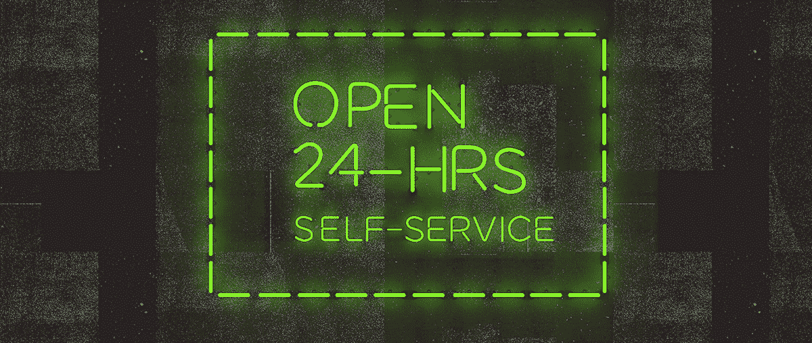

# 你从未听说过的最重要的商业理念

> 原文：<https://www.sequoiacap.com/article/the-most-important-business-idea/?utm_source=wanqu.co&utm_campaign=Wanqu+Daily&utm_medium=website>

科技界保守得最好的秘密之一是一种大多数人从未听说过的商业模式:自助销售(或产品驱动型销售)。自助服务的核心理念是，顾客可以自助购买他们想要的产品，而不是通过销售人员。自助服务是谷歌、脸书、LinkedIn 和 Atlassian 等公司成功的原因。今年夏天早些时候，Snap 成为了最新加入这一游戏的公司，它推出了自助式广告管理器。自助服务是高效商业模式的圣杯。

但是如果产品驱动的销售这么伟大，为什么不是每个公司都追求呢？因为它需要两种很难找到组合的关键成分。 **1)能够自助服务的直观产品，以及 2)巨大的内部需求。**

首先，你需要一个足够简单的产品，任何人都可以自己使用和购买。我于 2002 年加入谷歌，就在他们推出 AdWords 开始自助服务革命后不久。AdWords 绕过了销售人员，让客户只需点击几下就能轻松购买广告。你只需要一张信用卡，就能利用数字广告中最有效的系统——不管你有 20 美元还是 20，000 美元。

与脸书类似，企业只需要 15 分钟就可以制作广告，这些广告可能会触及数十亿用户，并利用社交网络的复杂定位。(例如，珠宝商可以确保只有已经订婚的人才能看到他们的广告。)

一个更现代的例子是亚特兰蒂斯。得益于一流的工具和固有的病毒式核心产品，Atlassian 现在是一家标志性的 SaaS 公司。他们甚至[发布了](https://www.atlassian.com/it-unplugged/knowledge-management/self-service-not-just-for-it)关于自助服务的好处:效率、省钱、顾客喜欢这种体验。

但是，无论一个产品多么简单，只有当公司拥有其他东西时，它才能成为自助的成功:一个巨大的忠诚用户群。

AdWords 推出时，每天有数千万人使用谷歌进行搜索。因此，即使没有销售人员的帮助，谷歌也可以立即接触到数百万潜在客户。众所周知，马克·扎克伯格决定推迟引入广告，直到脸书变得无处不在。

以 [Dropbox](https://www.sequoiacap.com/companies/dropbox) 为例，它凭借自身实力迅速成为自助服务巨头。(我承认我有偏见:我的公司 Sequoia 是 Dropbox 的早期投资者，我也是他们的董事。)虽然 Dropbox 与我提到的公司在不同的行业和不同的规模上竞争，但它能够利用自助服务模式，因为它向大量现有用户群提供直观的产品。

使用 Dropbox，只需点击几下鼠标，就可以开始共享文件或与同事协作。如今，有 5 亿人拥有 Dropbox 账户，可以自己测试它的运行效果。正如首席执行官德鲁·休斯顿所说，这意味着该公司实际上拥有 5 亿销售人员。越多的用户开始依赖 Dropbox(在家或在办公室)，他们就越有可能采用其付费产品——并鼓励他们的朋友和同事也这样做。如今，Dropbox 的绝大部分收入来自自助销售。

自助式科技公司确实有销售团队，但他们相对较小，有针对性。因此，当人们问 Atlassian 是否有足够大的销售队伍，或者 Dropbox 是否能与传统企业公司竞争时，他们没有抓住要点。对于采用自助服务模式的公司来说，黄金机会是增加其在线销售业务的比例，而不是减少。

最后，重要的是不要把公司的自助式商业模式和它的使命混为一谈。脸书和谷歌的使命都没有提到“广告”，同样，Dropbox 的使命也省略了“软件订阅”自助服务可以支付账单，让这些公司自由投资于创新和大赌注，从而推进他们的价值主张。(例如，脸书押注 WhatsApp 和 Instagram 等收购最终将帮助它们连接地球上的每一个人，而 Dropbox 押注 Paper 等新的协作产品将让它们改善团队合作的方式)。对于任何公司来说，长期成功首先取决于提供领先的产品和服务。也就是说，如果历史可以借鉴的话，自助服务是应该努力实现的原型销售模式。