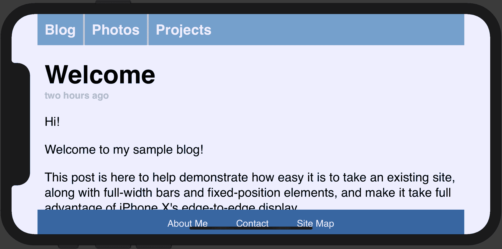
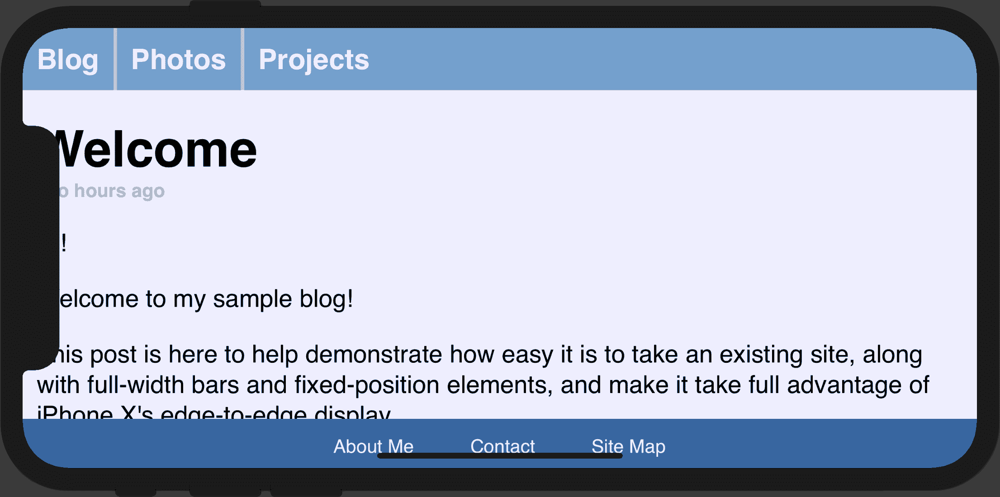
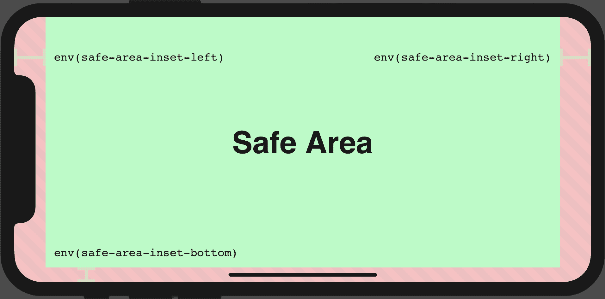
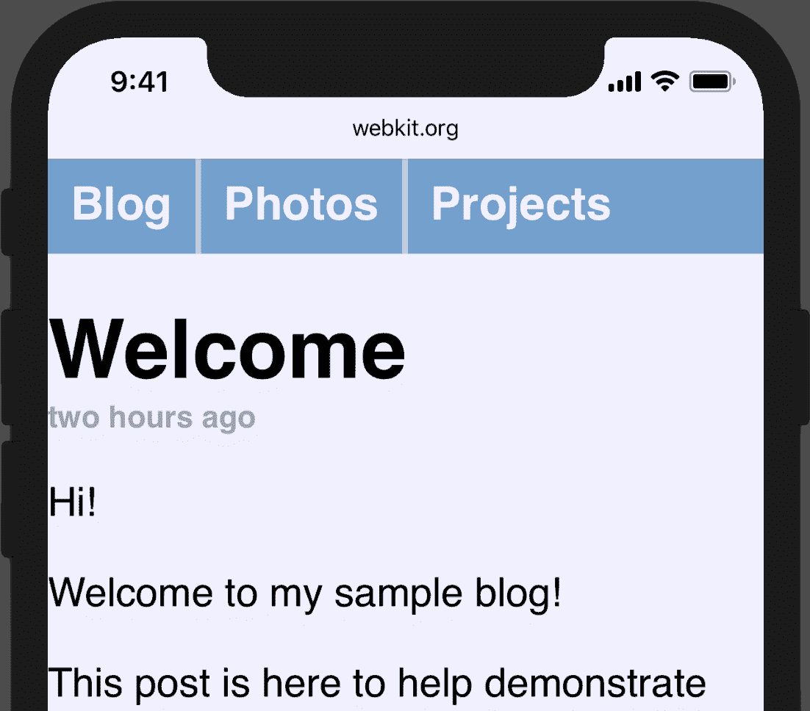
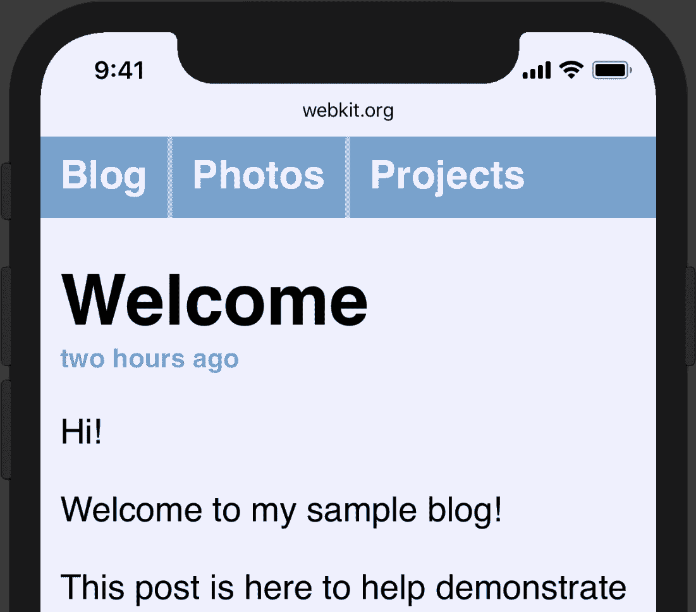

# 为 iPhone X | WebKit 设计网站

> 原文：<https://webkit.org/blog/7929/designing-websites-for-iphone-x/?utm_source=wanqu.co&utm_campaign=Wanqu+Daily&utm_medium=website>

下面关于安全区域插入的部分于 2017 年 10 月 31 日更新，以反映 iOS 11.2 测试版中的变化。

开箱即用，Safari 可以在新款 iPhone X 的窄边框显示屏上漂亮地显示现有网站。内容会自动嵌入显示屏的安全区域，因此不会被圆角或设备的传感器外壳遮挡。

嵌入区域被页面的`background-color`(在`<body>`或`<html>`元素上指定)填充，以与页面的其余部分融合。对于很多网站来说，这就足够了。如果你的页面只有纯色背景上的文字和图片，默认的插图看起来会很棒。

其他页面——尤其是那些设计有全宽水平导航栏的页面，如下页所示——可以选择更进一步，以充分利用新显示的功能。iPhone X 人机界面指南详细介绍了一些需要记住的一般设计原则，T2 ui kit 文档讨论了本地应用程序可以采用的具体机制，以确保它们看起来不错。你的网站可以利用 iOS 11 中引入的一些类似的 WebKit API，以充分利用显示的边到边特性。

在阅读这篇文章时，你可以点击任何一张图片来访问相应的现场演示页面，并偷看一下源代码。

[](/demos/safe-area-insets/1-default.html)

Safari’s default insetting behavior.


## 使用整个屏幕

第一个新特性是对现有的名为 [`viewport-fit`](https://www.w3.org/TR/css-round-display-1/#viewport-fit-descriptor) 的`viewport` meta 标签的扩展，它提供了对插入行为的控制。`viewport-fit`在 iOS 11 中可用。

`viewport-fit`的默认值是`auto`，这导致了上面看到的自动插入行为。为了禁用这种行为并使页面布局到屏幕的最大尺寸，您可以将`viewport-fit`设置为`cover`。这样做之后，我们的`viewport` meta 标签现在看起来像这样:

```
<meta name='viewport' content='initial-scale=1, viewport-fit=cover'> 
```

重新加载后，导航栏看起来好多了，从一边跑到另一边。然而，很明显为什么尊重系统的安全区域很重要:页面的一些内容被设备的传感器外壳遮住了，底部的导航栏很难使用。

[](/demos/safe-area-insets/2-viewport-fit.html)

Use `viewport-fit=cover` to fill the whole screen.


## 尊重安全区

在采用`viewport-fit=cover`之后，使我们的页面再次可用的下一步是有选择地对包含重要内容的元素应用填充，以确保它们不会被屏幕的形状所掩盖。这将导致页面充分利用 iPhone X 上增加的屏幕空间，同时动态调整以避开角落、传感器外壳和用于访问主屏幕的指示器。

[](/demos/safe-area-insets/safe-areas.html)

The safe and unsafe areas on iPhone X in the landscape orientation, with insets indicated.


为了实现这一点，iOS 11 中的 WebKit 包括了一个[新 CSS 函数](https://github.com/w3c/csswg-drafts/pull/1817)、`env()`，以及一组[四个预定义的环境变量](https://github.com/w3c/csswg-drafts/pull/1819)、`safe-area-inset-left`、`safe-area-inset-right`、`safe-area-inset-top`和`safe-area-inset-bottom`。当组合在一起时，它们允许样式声明引用每一侧安全区域插入的当前大小。

iOS 11 中附带的 env()函数名为 constant()。从 Safari Technology Preview 41 和 iOS 11.2 beta 开始，constant()已被移除，并替换为 env()。如有必要，您可以使用 CSS 回退机制来支持这两个版本，但应该更喜欢 env()向前发展。

`env()`在`var()`工作的任何地方都工作——例如，在`padding`属性中:

```
.post {
    padding: 12px;
    padding-left: env(safe-area-inset-left);
    padding-right: env(safe-area-inset-right);
} 
```

对于不支持`env()`的浏览器，包含它的样式规则会被忽略；因此，继续使用`env()`为任何声明单独指定回退规则是很重要的。

[](/demos/safe-area-insets/3-safe-area-constants.html)

Respect safe area insets so that important content is visible.


## 通过最小()和最大()将它们结合在一起

本节介绍 Safari Technology Preview 41 和 iOS 11.2 beta 版中提供的功能。

如果你在网站设计中采用安全区域插入，你可能会注意到，除了安全区域插入的之外，指定你想要的最小填充*有点困难。在上面的页面中，我们用`env(safe-area-inset-left)`替换了左边的 12px 填充，当我们旋转回纵向时，左边的安全区域插入变成 0px，文本紧靠屏幕边缘。*

[](/demos/safe-area-insets/3-safe-area-constants.html)

Safe area insets are not a replacement for margins.


为了解决这个问题，我们希望指定我们的填充应该是默认的填充或安全区域插入，以较大者为准。这可以通过[全新的 CSS 函数`min()`和`max()`](https://drafts.csswg.org/css-values/#calc-notation) 来实现，它们将在未来的 Safari 技术预览版中提供。这两个函数都接受任意数量的参数，并返回最小值或最大值。它们可以在`calc()`内部使用，或者嵌套在彼此内部，并且两个函数都允许在它们内部使用类似`calc()`的数学。

对于这种情况，我们想使用`max()`:

```
@supports(padding: max(0px)) {
    .post {
        padding-left: max(12px, env(safe-area-inset-left));
        padding-right: max(12px, env(safe-area-inset-right));
    }
} 
```

使用@supports 来检测最小值和最大值是很重要的，因为它们并不是在任何地方都受支持，而且由于 CSS 的

[treatment of invalid variables](https://drafts.csswg.org/css-variables/#invalid-variables)

，到

**not**

请在@supports 查询中指定一个变量。

在我们的示例页面中，在纵向方向，`env(safe-area-inset-left)`解析为 0px，因此`max()`函数解析为 12px。在横向模式下，当`env(safe-area-inset-left)`因传感器外壳而变大时，`max()`功能将改为解析到该尺寸，确保其中的重要内容始终可见。

[](/demos/safe-area-insets/4-min-max.html)

Use max() to combine safe area insets with traditional margins.


有经验的 web 开发人员可能以前遇到过“CSS 锁”机制，这种机制通常用于将 CSS 属性限制在特定的值范围内。一起使用`min()`和`max()`使这变得容易得多，并且在将来实现有效的响应式设计时非常有帮助。

## 反馈和问题

你现在就可以开始采用适合视口和安全区域的插入，通过使用 iPhone X 模拟器中的 Safari，包括 [Xcode 9](https://developer.apple.com/xcode/) 。我们很想知道你对所有这些功能的采用情况如何，所以请随时向推特上的【web-evangelist@apple.com】T2 或 [@webkit](https://twitter.com/webkit) 发送反馈和问题，并在 [WebKit 的错误跟踪器](https://bugs.webkit.org/)上提交你遇到的任何错误。