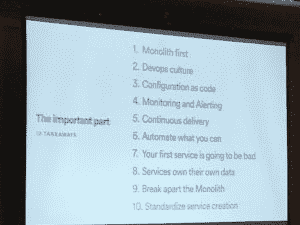
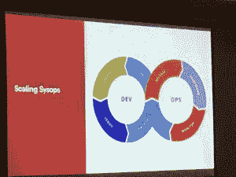
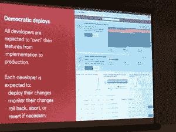

# Airbnb 从移动到微服务的 10 个收获——新堆栈

> 原文：<https://thenewstack.io/airbnbs-10-takeaways-moving-microservices/?utm_source=wanqu.co&utm_campaign=Wanqu+Daily&utm_medium=website>

Airbnb 软件工程师 Melanie Cebula 分享了经验教训

在最近于纽约举行的 2017 年 FutureStack 上，Airbnb 的软件工程师 Melanie Cebula 讲述了她的公司所经历的旅程，并从他们的经历中总结了 10 点。

家庭共享服务在 191 个国家的 65，000 个城市运营。今年夏天见证了他们的第 400 万次上市。仅今年夏天，就将有 4500 万客人入住 Airbnb 房源，自 2008 年以来，总共有 2 亿客人入住。

为了实现这一目标，他们每周部署 3500 个微服务，每年总共部署 75000 个产品。该公司现在有 900 名工程师，并且正在招聘。

“我们基本上想要百分之百的可用性，我们也想要百分之百的生产力，”Cebula 说。“百分之百的可用性意味着我们的网站对我们的客人、主人和员工完全可用。百分之百的生产力意味着产品中的每个人都可以轻松地创建、更改和发布功能。”

以下是她从整体服务到微服务的经历:

## 1.首先是整体

Airbnb 10 个外卖

不要从一个微服务开始。他们仍然有一个在 MonoRail 中维护的整体 Ruby on Rails 应用程序。这种方法在很长一段时间内有效，让他们能够专注于基础设施建设。她说，从微服务开始是预优化，没有必要。

但是当你的公司成长时，重要的是制定一个计划开始投资微服务。对于 Airbnb 来说，临界点是 50 万行代码，而且还在快速增长。他们意识到每年增加一倍的代码行是没有意义的。

Cebula 说:“很早就有这种洞察力，并在那时开始构建所需的组件，这很重要。

## 2.DevOps 文化

Airbnb 扩展系统操作

她说，DevOps 文化的同时创造“真的非常巨大”。“你希望每个工程师都准备好支持他们的服务，因为现在我们每个微服务有三个工程师的比例，而且这一比例还将继续增长。”对于 Airbnb 来说，DevOps 文化的兴起来自于他们的 SysOps 组。

在发生事故时，SysOps 团队有三项主要责任。他们首先对问题进行分类，协调应对措施，并将应对措施传达给相关人员

内部服务所有者、产品团队、基础设施专家以及第三方服务所有者。

Cebula 说，随着时间的推移，SysOps 小组“出人意料地成为了一个巨大的杠杆，在一个历史上以产品为导向的公司建立了 DevOps 文化。这在以后您尝试扩展大型服务时变得非常重要。”

SysOps 培训对所有工程师开放，他们可以自愿随叫随到。据 Cebula 说，他们已经向所有的工程师开放了培训，而且培训变得非常受欢迎，到目前为止已经有超过 33%的工程师参加了培训。与会者了解基础设施、当前架构及其如何随着时间的推移而发展，如果他们感兴趣，如何为他们的团队安排随叫随到，如何成为一名有效的随叫随到人员。他们还有一个动手实验环节，每个人都会收到传呼。据她说，工程师们认为这是一个亮点。

她说:“我们已经培养了一种文化，在这种文化中，每个工程师都可以频繁而生动地独立构建、测试和发布他们的软件。”。

## 3.配置为代码

Cebula 说，开发人员不擅长跟踪所有这些工具。但是开发人员确实理解代码。

所以代码的配置变得非常重要。她解释说，把你的配置作为代码使推理变得非常容易。“什么配置当前正在生产中，配置是否已回滚，对配置进行了更改，这些对他们来说都是正确的。”

## 4.监控和警报

她说，每项服务都应该使用像 New Relic 这样的标准化工具。这将允许开发人员跨应用程序以相同的方式进行监控和警告。

同样重要的是，让工程师能够在编写特性代码的同时编写指标，让开发人员能够轻松编写他们自己的业务指标。Cebula 说，警报被配置为代码。他们有自己的领域特定语言(DSL ),用于根据这些指标编写警报。创建新警报就像打开一个拉取请求一样简单。

她说，只要有可能，他们就给开发者免费的东西，比如把统计数据捆绑到一个拉取请求中。

## 5.连续交货

Cebula 说，对一群工程师来说，扩展部署非常困难。但是如果你做对了，每一个新的服务都将会有相同的流程和相同的功能。成功的关键是标准化和自动化。

## 6.自动化，自动化，自动化

她说，手动步骤非常困难，而且容易出错。所以尽你所能自动化一切。

她建议，当你开始提供这些服务时，“确保你开始考虑它们有什么共同点，它们都应该有什么，我们能为效果构建我们的配置吗？”

应用程序的代码也很重要。代码位于代码提要的存储库中。作为持续集成过程的一部分，它被自动测试和验证。基本上，它是自己的一个小构建，作为一个工件被部署和使用。他们已经标准化了格式和默认值。“所以简单的事情对开发者来说是正确的，”她说。

提醒一下，不要雪花。

## 7.你的第一次服务=糟糕

这将是一个漫长而艰难的过程，她说，并指出网飞花了十年时间从整体服务完全过渡到微服务。她说，你的第一次服务可能会很糟糕。这非常具有挑战性，你必须提醒自己一切都会好的。

## 8.服务拥有它们的数据

Airbnb 民主部署

他们有“民主部署”，Cebula 说。从实现到生产，所有的开发人员都应该拥有自己的特性。从开发到生产，每个开发人员都应该部署他们的变更，监控他们的变更，回滚，中止，或者在必要时恢复。"

## 9.打破巨石

当你创建微服务一段时间后，你会看到速度和自动化的提高。“会变得很棒的，”她说。这时候你就会意识到你还有数百万行的代码卡在你的大石块里。为了移动代码，你将不得不与构建微服务的基础设施团队合作，并引入产品团队来开始打破这一整体。引入产品工程师是关键。“你可以向他们展示这些非常棒的图表，告诉他们如何部署他们想要的任何东西，并且非常快，这将非常棒，”她说。但你必须得到所有人的认同，并真正投资于转型。

## 10.标准化服务创建

这是 Airbnb 正在进行的工作。目标是使所有的配置都容易访问，这样开发者就可以用一个拉请求创建一个服务。他们创建回购，同时创建配置。

理想的情况是，您也只需要定义您的服务的独立之处。

<svg xmlns:xlink="http://www.w3.org/1999/xlink" viewBox="0 0 68 31" version="1.1"><title>Group</title> <desc>Created with Sketch.</desc></svg>