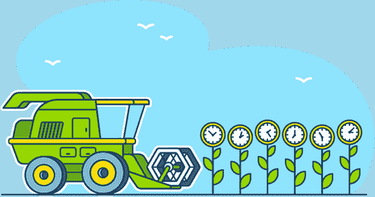
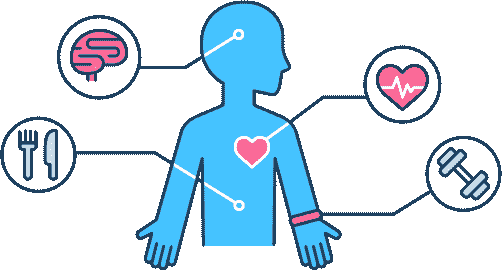
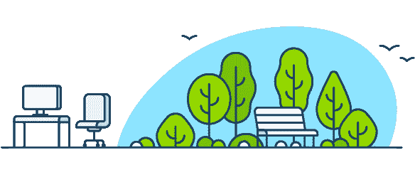
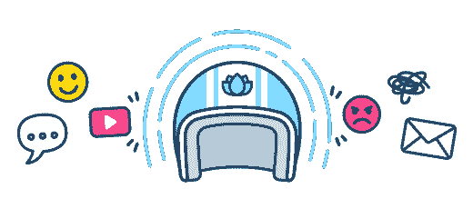

# 我如何达到一个月 200 个工作小时

> 原文：<https://qotoqot.com/blog/improving-focus/?utm_source=wanqu.co&utm_campaign=Wanqu+Daily&utm_medium=website>

# 我如何达到一个月 200 个工作小时

2017 年 9 月 19 日由[伊万·米尔](https://twitter.com/ivmirx)

两年前，我可以一周不工作，因为我在逃避一些任务。一年前，每月的工作时间是 100 到 120 小时。现在，我每个月大约工作 200 个小时，每天超过 6 个小时。这段时间我一直在家工作，大部分时间都在做同一个项目。

本指南描述了我是如何实现这些结果的。作为一名前游戏设计师，我运用与创造视频游戏体验相同的行为心理学原理来组织我的日常事务。我的一些建议是琐碎的，你以前肯定听过，但当以正确的方式使用时，它将创建一个健壮的框架来改变无效的习惯。

这个框架由三层构成:环境、身体和思想。它完全按照这个顺序进行，因为一个保养良好的身体在分心污染的环境中不能做太多事情，而一个训练有素的头脑不会帮助一个疲惫的身体。你不需要在开始下一个元素之前完善每一个元素，但是把它们看作是彼此的基础，并相应地指导你的努力。

虽然这是我个人的技巧，但我相信它也会对你有用。我很有可能患有未确诊的多动症:由于注意力不集中导致的行为问题，我已经被两所学校开除了，我仍然符合大多数症状。因此，如果你有更好的自然注意力持续时间，这种方法会更有效地提高你的注意力。

注意:提到的工作时间对于那些为他人的[虚幻的股票期权](https://tldroptions.io)工作的人来说是不可取的，没有加班费。超过这个数字也没有意义，因为每周工作超过 50 小时实际上[会降低生产率](https://www.economist.com/blogs/freeexchange/2014/12/working-hours)。在“工作与生活的平衡”中，生活应该放在第一位

## 环境

一个适当组织的环境塑造了一条通往你目标的道路，同时防止了导致拖延的意外转折。因为我们的意志力、动机和自我意识水平不是恒定的，所以提前设置一个安全措施对于克服低谷是必不可少的。

高效环境的核心原则是增加进入分散注意力的活动所需的摩擦，这样就需要很大的努力才能分散注意力。一个基本的例子是从你的互联网历史中删除休闲网站，并开始在一个单独的浏览器中使用它们——这既可以防止自动完成功能对你造成伤害，又可以增加你转移注意力所需的动作数量。或者，如果你玩游戏有问题，每次游戏结束后卸载所有程序，这样下次你想玩的时候就需要等待游戏下载完毕。

但以我的经验来看，与消除从你的工作站分散注意力的一切事物并在另一个房间使用单独的休闲设备相比，这是无效的。这就是行为心理学出现的地方:你用[经典条件作用](https://www.verywell.com/classical-vs-operant-conditioning-2794861)将不同类型的行为定位。它们没有重叠，你的大脑很清楚你在哪里做什么。整天坐在“休闲的地方”也更容易觉得不对劲。甚至乔治·R·R·马丁[也有类似的写书方式](http://time.com/99432/george-rr-martin-game-of-thrones-computer/)。

你还可以优化你的休闲设备，取消订阅过多的电子邮件，取消关注过于活跃的海报或将其静音，并设置过滤器来隐藏无用的信息，包括所有非专业新闻。这样的新闻实际上并没有通知我们，而是传播耸人听闻、负面情绪和赤裸裸的谎言来吸引注意力。你从最近的政治危机或丑闻中获得了什么？你不能对这些事件做任何有意义的事情。它们只会压抑你，占据你头脑中的空间。最好把你的注意力放在我们能真正影响和改善的事情上。

下一步是驯服你的口袋怪物。这意味着禁用所有非关键的推送通知，并卸载你可以从休闲设备上使用的所有应用程序。除非你是记者，否则你真的不需要脸书、推特或任何手机新闻。消息应用足以保持联系；当你无事可做时，从保存在[口袋](https://getpocket.com)中的文章中学习新的东西是消磨时间的好方法。此外，把手机放在远离工作场所的地方:你不应该盲目地拿起手机，以“快速检查”来逃避当前的任务。

> 让一个应用程序向你发送推送通知就像让一个商店店员抓住你的耳朵，把你拖进他们的商店。你让别人随时在你的生活中插播广告。
> ——[大卫·皮尔斯](https://www.wired.com/story/turn-off-your-push-notifications)

如果这个想法让你不舒服，这意味着你已经对无限的娱乐节目上瘾了，这些娱乐节目被优化成像老虎机一样工作。这些信息背后的营销人员并不关心你的幸福或生产力——他们的目标是利润最大化。他们通过滥用我们对[不确定回报](https://www.psychologytoday.com/blog/brain-wise/201311/use-unpredictable-rewards-keep-behavior-going)的古老弱点来尽可能多地吸引你的注意力。因此，你需要在获得自由和完成任务之间做出选择，或者[在这些注意力陷阱中浪费掉你的生命](http://www.adweek.com/digital/mediakix-time-spent-social-media-infographic/)，这些陷阱的卖点是“有趣”和“保持联系”

说到计划，我的方法很简单:

*   把大任务分成小任务，这样就没有什么看起来势不可挡，每天的进展都是可见的
*   把一些无聊的简单任务留到晚上大脑疲劳的时候
*   睡觉前调整任务顺序，这样早上总会有一个清晰的计划

我不安排我的日子，但让它们保持同样的结构:两个街区，每个大约三个小时，被下午的散步和杂务分开。有些人报告说番茄工作法[很成功，但我发现它太短了，无法深入工作。最好尝试不同的方法，坚持最适合你的方法。](https://en.wikipedia.org/wiki/Pomodoro_Technique)

这些工作区应该不受干扰:所有的聊天和信使都关闭了，门都关了，你周围的人被告知他们不应该打扰你。如果你没有这个机会，一个共同工作的空间会有所帮助；此外，这将有助于上述位置分离。

> 仅仅是对被分散注意力的预期就像一条皮带，阻止我们深入工作。我们的内心告诉我们，在任何时候，我们都可能被拍肩膀，或被要求参加会议，或我们的孩子可能闯入办公室。
> ——[肖恩·布兰克](https://thefocuscourse.com/quick-wins-for-being-creative-and-productive/)

### 摘要

1.  删除手机和工作站上的所有娱乐和新闻。
2.  关闭所有不重要的推送通知，把手机放在工作场所之外。
3.  获得一个单独的休闲设备，在远离工作场所的地方使用它来培养基于位置的行为
4.  清理或消除干扰你而无助于你实现目标的社交网络和政治新闻等嘈杂信息。
5.  把大任务拆分成小任务，提前安排好第二天的任务，把一些繁琐的任务留给累得不想思考的时候。
6.  当你不能被打扰的时候，把你的一天分成几块。

### 资源

*   免费的浏览器扩展来限制每天在分散注意力的网站上的时间:[stay focused](https://chrome.google.com/webstore/detail/stayfocusd/laankejkbhbdhmipfmgcngdelahlfoji)(Chrome)[LeechBlock](https://addons.mozilla.org/firefox/addon/leechblock-ng/)(Firefox)[WasteNoTime](http://www.bumblebeesystems.com/wastenotime/)(Safari)
*   在系统层面安排站点屏蔽的应用:[冷火鸡](https://getcoldturkey.com/pricing/) (Windows，Android)[焦点](https://heyfocus.com)(Mac)[关于:空白](https://itunes.apple.com/us/app/about-blank/id1239181721?mt=8) (iOS Safari)
*   QB serve——我们的 Mac 自动时间跟踪器，我用它来测量工作时间
*   一个类似于 Windows 的应用程序
*   [安卓版 App 使用](https://play.google.com/store/apps/details?id=com.a0soft.gphone.uninstaller)；在 iOS 上，使用统计可在“设置→电池→时钟图标”中找到
*   [口袋](https://getpocket.com) —将文章加入书签，以便日后从手机上阅读
*   我用来做计划的工具: [Scapple](https://www.literatureandlatte.com/scapple.php) (大图，创意草稿) [Trello](https://trello.com) (项目的具体计划)

## 身体

为了一些短期的最后期限而耗尽身体是没有好处的。睡眠不足、缺乏运动、垃圾食品和大量含咖啡因的饮料都是工作流程失败的迹象。紧缩是没有生产力的——它是通过良好的计划和敏锐的关注来弥补实际生产力不足的紧急努力。

睡眠是更好地感觉和思考的燃料:至少七个小时是必须的，但有些人需要八个小时，这完全没问题。睡眠不足不仅影响注意力的集中，还会对身体和精神造成损害，无论如何都要避免。如果我在中午感到“脑雾”,我会小睡 30-60 分钟，因为[睡眠会冲走大脑毒素](https://www.nih.gov/news-events/news-releases/brain-may-flush-out-toxins-during-sleep),让头脑清醒。再多的咖啡也不会有同样的效果。顺便说一句，我更喜欢一周只摄入几次咖啡因——它能保持较低的耐受性，所以即使是少量的咖啡因也能让我在最困难的任务中极大地提高注意力。

作为一个夜猫子，我花了很多年的时间通宵工作，并在随机时间醒来。那是一个巨大的错误。对于一个夜猫子来说，在早上 9 点到 10 点之间起床没什么大不了的，但它能让你保持纪律性:你在同一时间工作和睡觉。好的纪律比千变万化的动力更具有可持续性。

如今，可能每个人都知道缺乏运动会杀死我们，但如果这还不够，它还会影响你的 T2 记忆和思维。当我们的祖先为了生存而大量迁移时，我们的身体就进化了，所以[他们期望](https://www.scientificamerican.com/article/why-do-you-think-better-after-walk-exercise/)更高的血流量以获得最佳表现。这就是为什么一周去两次健身房没有帮助——我们需要一整天都有规律地活动，以保持高效和健康。

> 研究人员发现，在坐着不动的三个小时里，动脉对血流的反应变宽了。然而，在此期间起床散步五分钟阻止了这种情况的发生。
> ——[英国国民健康保险制度](https://www.nhs.uk/news/lifestyle-and-exercise/regular-walking-breaks-protect-arteries/)

在你的桌面上安装一个应用程序，强制每小时休息 3-5 分钟。重要的是:让它完全挡住屏幕，隐藏所有的“跳过”或“推迟”按钮，否则你会忽略这些休息时间。有时候，在实施某个想法的过程中被锁在电脑前可能会很烦人，但是散散步、做做伸展运动或者做减肥运动会帮助你在接下来的一个小时里集中注意力。

中午在公园散步会立刻带来多重好处——身体活动、新鲜空气、[改善心情](http://news.stanford.edu/2015/06/30/hiking-mental-health-063015/)——并且让你暂时不去想工作(理想情况下，不去想任何事情)。我们的大脑需要时间从思考中抽身出来放松。相对恶劣的天气不是借口:我住在一个连续三个月下雨的[城市](https://valdiviaguide.com)，除非遇到暴风雨，否则我每天都要步行。我还建议注册一个游泳池——它比普通的健身房省力得多，而且能很好地拉伸和放松久坐工作造成的肌肉紧张。

最后，营养。你的内脏是你的第二个大脑，产生 50%的多巴胺和 95%的血清素；它直接影响你的[动机](https://hbr.org/2014/10/what-you-eat-affects-your-productivity)和[心情](https://www.health.harvard.edu/blog/nutritional-psychiatry-your-brain-on-food-201511168626)。生产力的饮食并不复杂；简单的规则就足够了:拒绝深度加工的垃圾食品，注意糖和盐的摄入量，注意总热量，喝水和茶而不是含糖饮料，尽可能坚持家常饭，主要使用植物作为配料。

密切关注你身体的反馈，找出对你最有效的方法。在寒冷的季节，还要安装一个室内 CO₂水平监测器——通风不良也会影响认知能力。

### 摘要

1.  睡七个小时或更多，每天在同一时间睡觉和醒来。
2.  当你下午感到头脑发昏时，小睡一下而不是喝咖啡。
3.  每小时休息 3-5 分钟，如果可能的话，活动一下，伸展一下或者锻炼一下。
4.  每天至少在绿色的地方散步 30 分钟来放松你的大脑。
5.  每周去几次游泳池放松肌肉，尤其是背部。
6.  保持高质量的饮食，不吃垃圾食品和加工食品；喝水而不是含糖饮料。
7.  监控室内 CO₂水平。

### 资源

## 头脑

我们被习惯所塑造。日复一日，有益的和有害的都在为我们思想的方向盘而相互争斗。但是由于神经可塑性，它们都不是静态的。仅凭纪律和意志力，就有可能抛弃无用的习惯，改变你的行为。这就是为什么环境和身体层次如此重要——它们为侵入我们的思想创造了舒适的条件。

关键是坚持。通常你需要几个月才能看到结果，所以不要过早投降。在这种情况下，习惯追踪应用程序真的很有帮助——它们既能提醒你做事，又能激励你坚持每天跑步。如果某项活动太难开始，试试名为“没有零时差”的方法:每天至少朝这个方向做一件小事。

通过定期观察你的思维，你可以开始注意到循环模式，这可能与你身体的生物节律有关。它们像海浪一样涌来，经过实验，你可以学会冲浪。有时候，这是做大量创造性笔记或回顾战略计划的最佳时机。有时候你的脑袋完全是空的，做一些乏味的工作是令人愉快的，否则这些工作会令人恐惧。或者，在当前项目上工作可能毫无成效，学习一些不相关的东西会更有用。但核心思想是，你可以让你的工作流适应这些状态，而不是抵制它们。

因为这个原因，我也很注意我的大脑对音乐的反馈。为了在早上或长时间休息后进入高效的状态，我会用相对较快的节奏来提高注意力。后来，由于高认知负荷，我可以切换到较低的节奏([例子](https://suduayamusic.bandcamp.com/album/venus-24bits))，放松的东西([例子](https://www.youtube.com/watch?v=ch5BqDrqqo4))或者完全关掉音乐。但是当没有什么能帮助你集中注意力时，找一个真正自由的时间，这样你的大脑可以休息。不要打电话或消费任何内容——只是散步、锻炼或小睡一会儿。

拖延症本身可能有不同的原因——也许任务太复杂或太无聊，害怕失败或简单的懒惰。即使是这些负面因素的轻微存在，也会让我们去追求即时的回报，而不是做一些从长远来看会创造更好未来的事情。传统的方法是试图了解原因并加以解决。但是这并没有解决我的问题——我仍然在拖延，尽管我非常清楚我为什么要这样做。

几年前，我有一个强迫性思维的问题，但是我自己成功地解决了这个问题。关键是我意识到这些想法总是存在于我的脑海中，试图用思维打败它们就像试图用汽油灭火一样——它们只会变得更强大。所以我退一步，完全拒绝参与这场争斗。如今，我不在乎脑子里是否出现了一些强迫性的想法——我只是把注意力转移到更重要的事情上。

逃避工作也是类似的——这些只是你不喜欢你的任务的想法，以及你希望你能做些什么来代替。这种获得即时回报的欲望只是对多巴胺的自然渴求。但是你不是你的思想，它们对你没有力量，除非你用注意力去喂养它们。你可以把注意力集中在你的目标上，像忽略背景噪音一样忽略它们。

这种方法的缺点是，你需要让自己的自我意识足够强大，以便定期逃离无效的思维模式，恢复专注。这就是为什么我从 150 小时到 200 小时的主要突破之一发生在我最终让自己每天冥想 20 分钟的时候——没有例外。流行的现代对冥想的误解说冥想是为了“减压”或“活在当下”，但[最初的目标](http://www.vipassana.com/meditation/mindfulness_in_plain_english_5.php)是训练注意力，并因此对正在发生的事情有更多的自我意识。

> 冥想是对正念或觉知的直接而渐进的培养。它在几年的时间里一点一点地进行。学生的注意力被小心翼翼地引向对自身存在的某些方面的深入审视。冥想者被训练去注意越来越多自己流动的生命体验。
> ——[班特·古纳拉特纳](http://www.vipassana.com/meditation/mindfulness_in_plain_english.php)

类似于散步，这是又一次跳出你的日常事务的机会，然后带着一个新鲜的头脑回来。冥想也有助于学习如何释放有压力的想法和情绪，这样它们也不会耗尽你的大脑。不要因为“企业正念”时尚或有问题的现代教师而简单地拒绝这种做法。有很多科学证据表明，定期冥想有助于我们的大脑，你完全可以自己学会。

集中注意力的最后一个障碍是:你在做一些徒劳的事情吗？把你的一生花在毫无意义的事情上是一条通往倦怠的道路，即使是一份不错的薪水也不会阻止它。我不是建议“辞掉工作，追随你的激情”这种陈词滥调——这是不成熟的，而且不是每个人都有激情。而是找到值得做的事情，觉得自己努力的结果对世界是有帮助的。你的工作仍然不应该优先于你所爱的人，但当你开始看清它们的本质时，扔掉上瘾的网站或游戏就变得容易了:它们只是完成有价值的事情的障碍。

### 摘要

1.  坚持不懈地改变你的习惯:跟踪它们，试着长时间坚持。
2.  观察你的日常思维周期，在情绪波上冲浪；为他们准备好音乐播放列表。
3.  通过不断将注意力转移到你的长期目标上来逃避拖延。
4.  每天冥想以增强注意力和自我意识。
5.  做一些真正对世界有益的事情。

### 资源

## 编后记

当提高你的生产力时，不要期望它在一周内提高，因为大脑需要很多时间来重组新的行为。相反，设定一个小的绩效目标，比如“每月提高 5%”追求更快的结果会让你压力过大，而生产力需要冷静的头脑和休息好的身体。对你无效的习惯要严厉，但请对自己宽容。

我很乐意在 Twitter 上收到你的来信。

插图作者:伊琳娜·米尔