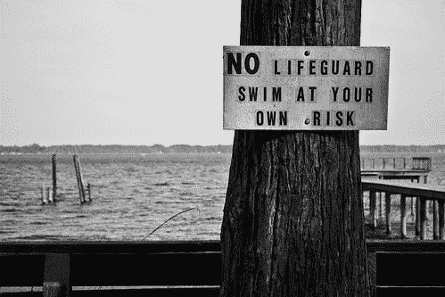

# 风险的特权——Ed Techie

> 原文：<http://blog.edtechie.net/asides/the-privilege-of-risk/?utm_source=wanqu.co&utm_campaign=Wanqu+Daily&utm_medium=website>

[T2】](https://www.flickr.com/photos/toddwshaffer/2085887252/in/photolist-4bjHBj-xcN58-dpNKGf-rRD7wY-kMGmwV-qdifZE-9MZEo1-58Liw7-PkNSyW-qSGcRS-JpxCiY-gq9gWd-8Goq9Y-8JSFnC-hhTn4o-GP4Yc5-8JSBaQ-eTJ6bt-birPEz-ekiwaQ-PDVUrA-rk8oNE-MPNxEq-f5pwBC-9F9Wez-5TiSPA-sbfkDT-vApjed-wiuM4-kmNQKM-hSqC4S-4Cssjj-9HMVPr-8Sj4E4-prEvgs-dBLyS9-cxTkCu-dH23vC-9xm72h-ghhBx-7KYLtK-cXgFHo-4C9q9q-jMu3e2-f57GnS-q7B2rj-C3Maa-M9dgR2-Jvzd95-BQ2CKU "Swim at your own risk")

从创业文化渗透到日常生活中的另一个价值观是珍视风险。你知道人们喜欢在 Twitter 上发布的励志名言“最大的风险是不冒险”，“那些不冒险的人不会赢”等等。我明白，从个人和职业角度来说，冒险是有益的。但我也被这种对风险的神化实际上是证明特权正当的代理人所震惊:这是我应得的，因为我愿意承担风险。但风险本身就是一种特权。

得出企业家没有冒险倾向的研究支持了这一观点，他们只是有富裕的父母。如果你能在创业过程中得到支持，并有退路，那么创业的风险就会小一些。但这并不局限于拿自己的职业冒险，这意味着他们也乐于拿别人的福利冒险。 [Sherri Spelic](https://edifiedlistener.blog/) 强调了这篇文章，其中一位美国参议员谈到他不知道[医疗改革会如此困难](https://theintercept.com/2017/09/27/lindsey-graham-on-obamacare-repeal-i-had-no-idea-what-i-was-doing/)，并且没有做这件事的经验。但他还是继续尝试了。你只知道围绕风险的言论会流传开来，“我们只能通过承担巨大的风险来实现巨大的改变”，诸如此类的事情。但是当然，他没有冒任何风险。他冒着许多美国人的生命危险。一位高级经理曾告诉我，他们喜欢冒险，我记得当时我在想，“但你不会受到它的影响”。他们会去其他地方找一份高薪的工作，不仅不会受到任何失败风险的影响，还可能提升他们的地位。他们成为一个愿意承担风险的人，这增加了货币。对于那些可能在 50 多岁时失业的人来说，情况并非如此，因为他们试图引入的变革几乎没有重新就业的机会。

风险也是年龄的特权。当我在 OU 的大型电子学习课程 T171 上工作时，我没有得到 OU 的批准。成功之后，约翰·诺顿公开称赞我这么做的风险，因为我当时签的是临时合同，本可以走更安全的途径获得永久职位。虽然我对被描绘成勇敢的人感到受宠若惊，但事实是我还年轻，还没有结婚，也不知道我应该做什么不同的事情。与其说我勇敢，不如说我天真。我相信我们都有类似的故事。然而，当你变老的时候，很容易赋予它荣耀的地位，这是不值得的。

风险成为特权自我强化的工具——只有特权者才能承担风险，也只有风险才能得到回报。这并不是说我们都应该谨慎，人们或机构永远不应该冒险做不寻常的事情。但当人们赞美风险并问“谁真的处于风险中？”时，我总是感到怀疑

