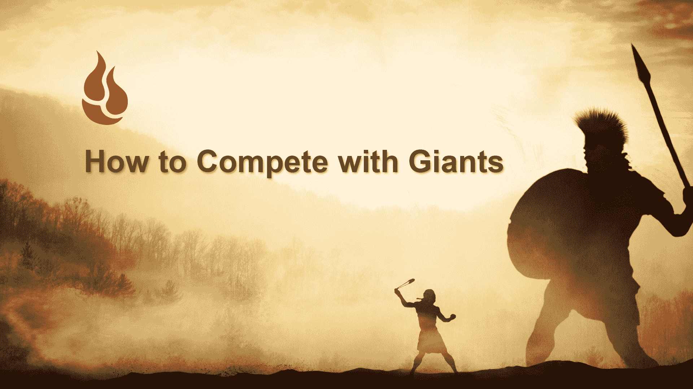

# 创业优势:如何战胜更大的竞争对手

> 原文：<https://www.backblaze.com/blog/how-to-compete-with-giants/?utm_source=wanqu.co&utm_campaign=Wanqu+Daily&utm_medium=website>

也许你的企业正在一个全新的领域竞争，没有现成的竞争对手。然而，我们中的大多数人创办的公司会与现有的大公司竞争。你的工作是想出一个更好的捕鼠器，而不是第一个捕鼠器。

这就是 Backblaze 面临的挑战。在这篇文章中，我想分享我从那次经历中学到的一些经验。

## Backblaze 对巨人

与大几个数量级的老牌公司竞争可能会令人生畏。怎么才能成功？

我将通过提供几组与我们竞争的巨头来搭建舞台:

*   当我们开始 Backblaze 时，我们在一个公司已经提供“在线备份”至少十年的市场上提供了[在线备份](https://www.backblaze.com/cloud-backup.html)，甚至新进入者也已经筹集了数千万美元。
*   当我们构建存储服务器时，替代产品是 EMC、NetApp 和戴尔，它们的市值都超过 100 亿美元。
*   当我们推出我们的云存储服务 B2 时，我们的直接竞争对手是亚马逊、谷歌和微软。你可能听说过他们。

我们从与这些巨头的预算竞争中学到了什么？让我们来看看。

### 确定成功意味着什么

很长一段时间，苹果认为苹果电视是一种爱好，而不是值得关注的真正的 T2 产品，因为它没有产生 10 亿美元的收入。对于一家年收入 100 亿美元的公司来说，一个能产生 5000 万美元收入的新业务不会改变现状，通常也不值得关注。然而，对于一家初创公司来说，获得 5000 万美元的收入可能是一家大获成功的企业的开始。

吸取的教训:不要让巨头设定你的成功标准。

## 创业公司的优势

巨头有很多优势:更多的钱、人、规模、资源、通路等。遵循他们的战术手册并迎头痛击意味着你只是在武器上落后。失败的常见途径是试图建立更多的功能，进入更多的市场，加大营销支出，以及其他类似的方法，其中规模和资源是成功的主要决定因素。

但作为一家初创公司，它提供了许多大多数巨头都会垂涎的优势。作为一个灵活的创业公司，你可以利用这些来取得成功。让我们来分析一下我们用过的九个你也可以使用的竞争优势。

#### 1.驱动焦点

只做一件事很难建立 100 亿美元的收入业务，大多数巨头都有广泛的业务组合，每种业务都有大量产品，并针对多个市场的各种客户群。这增加了复杂性，分散了管理层的注意力。

初创公司的好处是，公司的每个人都非常专注于一个单一的使命、产品、客户群和市场。虽然我们的竞争对手出售从广告到 Zantac 的一切产品，并投资于杂货和航运，但 Backblaze 一直专注于云存储。这意味着我们所有最优秀的人(即每个人)都专注于我们的云存储业务。你的注意力都去哪里了？

吸取的教训:让公司里的每个人都专注于一个目标，以显著超越大型团队。

#### 2.将缺乏规模作为一项优势

你可能听过保罗·格拉厄姆说[“做不可扩展的事情。”](http://paulgraham.com/ds.html)你可以具体做很多事情，因为你没有和巨人一样的规模。利用这一点。

当我们寻找数据中心空间时，我们比最大的竞争对手有更多的选择，因为容纳 100 个机柜的空间比容纳 1，000 个机柜的空间多。通过一些搜索，我们可以找到更好/更便宜的数据中心空间[。](https://www.backblaze.com/blog/data-center-design/)

当泰国的洪水摧毁了工厂，导致世界硬盘供应量骤降，价格上涨两倍时，我们开始了硬盘农业。巨人当然不能。这有点疯狂，但它让我们为客户保持价格不变。

我们的首席云计算官 Tim 曾经在 Adobe 工作。由于其规模，任何新产品都需要以多种语言在全球市场推出。一经推出，它们就有了规模。但是，推出任何新产品都极具挑战性。

吸取的教训:利用规模不足来开发对巨头关闭的机会。

#### 3.打造更好的产品

这一条大概很明显。如果你要以同样的价格向同样的顾客提供同样的产品，为什么要这么做呢？请记住，更好并不总是意味着更多的功能。这里有一种方法可以让我们不需要成为一个更大的公司就能制造出更好的产品。

所有在线备份服务都要求客户选择备份内容。我们发现这对用户来说很复杂，因为他们通常不知道需要备份什么。我们翻转了模型以备份所有内容，并允许用户根据需要排除，但这不是必需的。这减少了功能/选项的数量，同时对用户来说更容易和更好。

这不需要大公司的资源；这只需要更深入地了解客户，并从不同的角度思考解决方案。打造更好的产品是最经典的创业公司竞争优势。

吸取的教训:深入了解你的客户，并提供更好的捕鼠器。

#### 4.提供更好的服务

你如何提供更好的服务？利用你的优势。从您的客户服务人员到工程人员的升级可以通过更少的关卡。解决问题和发货会更快。在推特或脸书上获得真实的答案会更有效。

我们做出的一个战略决策是让所有客户支持人员成为我们总部的全职员工。这确保了他们与整个公司保持密切联系，以便快速获得双向反馈。

拥有更小的团队和更少的层级可以实现更快的内部沟通，从而提高客户满意度。选择做不可扩展的事情——例如在特殊情况下帮助客户——对建立客户忠诚度大有帮助。

经验教训:通过建立清晰的内部沟通来更好地服务你的客户。

#### 5.去掉不必要的

在确定行业标准的 EMC/NetApp/Dell 存储服务器过于昂贵，无法构建我们自己的云存储后，我们决定构建自己的基础架构。许多人说，我们与这些价值数十亿美元的公司竞争是疯狂的，并且不可能建立一个成本更低的存储服务器。然而，它不仅被证明不是不可能的，甚至也没有那么难。

一个关键技巧？去掉不必要的。虽然 EMC 和其他公司为各种各样的使用情形构建了服务器并出售给其他公司，但 Backblaze 需要的是只有 Backblaze 才能运行的服务器，而且只能用于单一使用情形。因此，我们可以通过消除每个服务器的冗余(因为我们将运行冗余服务器)，并使用低性能组件(因为我们将通过运行并行服务器获得高性能)，来定制满足我们需求的服务器。

你的客户和用例不需要什么？这可以削减成本和复杂性，同时经常为您的用例改进产品。

吸取的教训:不要想“我们能给巨人提供什么”——想一想“我们能去掉什么”

#### 6.放松点

有多少次你访问了一个大公司的网站，尤其是一个不是以消费者为中心的网站，结果只是说，“啊？我不明白你是做什么的。”保持你的网站清晰，你的产品和价格简单，将大大提高转化率和客户满意度。如果你能让它变得简单 2 倍，从而让你的转化率增加 2 倍，你就等于让自己花了同样多的钱去获得一个客户。

提供无限制的数据备份并不是为了提供更多的存储，而是为了让它更容易。由于用户不知道他们需要备份多少数据，每千兆字节收费意味着他们不知道成本。提供无限制的数据备份意味着他们可以放松了。

顾客喜欢简单的东西——更小的东西使得 T2 更容易交付。在你的网站、营销材料、定价、产品和其他客户互动中，把这作为一个优势。

经验:易用性不是一句口号:它是一种竞争优势。像对待你产品的其他特性一样认真对待它

#### 7.不要害怕风险

显然不必要的风险是不必要的，有些风险不值得冒。然而，那些给华尔街提供每股收益 0.01 美元区间指导的大公司本质上是非常厌恶风险的。利用风险容忍度来创造机会，并随着规模的扩大调整你的容忍度。在你的第一年，你的企业可能会有无数种方式蒸发；当上升趋势是曲棍球棒增长时，不要太担心承担可能有 20%下降的风险。

在我们的服务器中使用消费级硬盘可能会给我们带来多年的痛苦，但它们的定价大约是[企业级硬盘](https://www.backblaze.com/blog/enterprise-drive-reliability/)的 50%。巨人队不会考虑这个选择。事实证明，消费者驱动对我们来说表现很好。

吸取的教训:将计算风险作为一种优势。

#### 8.开放

公司规模越大，就越想隐藏信息。其中一部分是由上市公司的监管要求推动的。但这大部分是文化上的。分享一些东西可能会引起问题，所以我们不要这样做。所有外部交流都被视为重要的新闻稿，由多个团队和批准进行一轮又一轮的编辑。然而，客户通常渴望获得信息。此外，分享信息可以建立信任、理解和支持。

在我们推出之前，我就开始在 Backblaze 写博客了。当我们写博客介绍我们的[存储舱](https://www.backblaze.com/b2/storage-pod.html)并开源设计时，许多人认为我们分享这些信息是疯狂的。但这对我们来说是变革性的，确立了 Backblaze 作为存储领域技术思想领袖的地位，并让人们了解我们如何能够以如此低的成本提供服务。

多年来，我们已经形成了一种对内对外开放的文化，在我们的博客和媒体上，以及在 Hacker News 和 Reddit 等社区中。经常有人问我们，“你为什么要分享它！?"—但正是持续的开放建立了信任。这种开放的文化对巨头们来说极具挑战性。

吸取的教训:过度分享以建立信任和品牌，而巨头不会。

#### 9.做人吧

随着公司规模的扩大，创始人和高管与客户互动的比例通常会降低。创建公司的人变得更加隐蔽，语言感觉“公司化”，客户开始觉得他们在和陈词滥调“没有面孔、没有名字的公司”交流。利用你的人性。从第一天开始，Backblaze [关于页面](https://www.backblaze.com/company/about.html)列出了所有的创始人，以及我的电子邮件地址。虽然联系我们不应该是客户支持问题的第一条途径，但我想明确一点，我们支持我们提供的服务；如果我们做错了什么，我想知道。

要进行扩展，拥有流程和程序是很重要的，但有时情况不在完善的流程之内。虽然我们希望我们的员工遵循流程，但仍然鼓励他们像人一样“努力做正确的事情”你如何取得这种平衡？西蒙·西内克对此做了一次精彩的演讲:让你的员工有安全感。如果员工感到安全，他们就会是人。

如果你的顾客是消费者，他们会感激被当作人对待。即使你的客户是一个公司，购买决策者仍然是人。

吸取的教训:成为人类是不知名公司的终极对立面。

## 建立文化来维持你的规模优势

大概目标不是一直和巨人竞争，而是有一天成为巨人。这是否意味着你将失去所有这些优势？是的，有一些——但不是全部。这些优势中有一些是文化上的，如果你从一开始就将这些融入文化中，并在你扩大规模时努力保持这些优势，你就可以在成为巨人时保持这些优势。

特斯拉仍然给人以人类的印象，埃隆·马斯克经常在 Twitter 上与人互动。苹果继续通过他们的天才吧提供优质服务。而且，最糟糕的情况是，如果你在规模上失去了这些，你仍将拥有作为巨头的其他优势，如资金、人员、规模、资源和渠道。

当然，一些新的创业公司会带着远大的抱负瞄准你，所以一定不要自满。；)