# Salesforce 如何从 CRM 建立一个 130 亿美元的帝国[完整历史]

> 原文：<https://producthabits.com/salesforce-built-10-billion-empire-crm/?utm_source=wanqu.co&utm_campaign=Wanqu+Daily&utm_medium=website>

2000 年，马克·贝尼奥夫上演了硅谷有史以来第一次戏剧性的抗议。

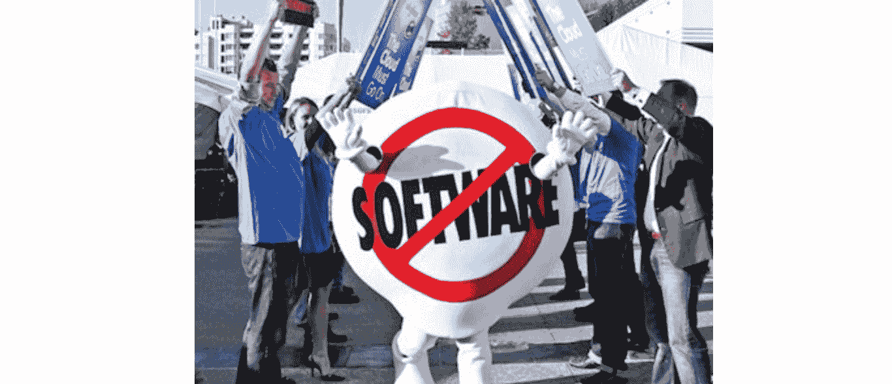

一家没人听说过的小型创业公司的 CEO 付钱给演员，让他们举着“反软件”的牌子。他们在销售客户关系管理软件的 Siebel Systems 的用户会议前游行。那年晚些时候，贝尼奥夫举办了一场军事主题派对，客人们将“软件碎片”扔进垃圾桶。

这些特技引起了人们的注意，但没有人真的相信贝尼奥夫的初创公司 Salesforce 能够与大型软件公司抗衡。Business Insider 写了一篇关于抗议的文章，称 Salesforce 为野餐中的蚂蚁。

野餐中的蚂蚁帮助创造了 2500 亿美元的全球市场。贝尼奥夫的公司是围绕一个主要理念建立的:软件应该通过云全天候交付给人们。Salesforce 是第一家这样做的公司。在 20 世纪 90 年代末，像 Oracle 和 SAP 这样的公司向企业出售必须在内部安装和更新的软件。现在，甲骨文、SAP 和世界其他公司正在迟来的构建云产品，试图赶上 Salesforce 发起的运动。

Salesforce 建立了第一批云产品之一的 CRM 工具，并积极宣传公司的愿景。他们围绕一个相对简单的产品向用户推销云的概念。然后，他们开始构建其他产品，并寻找培育不断增长的生态系统的方法，最理想的是将收入带回 Salesforce。现在，他们正在通过建立更多的用例并改进自己的产品来直接应对竞争对手，从而捍卫自己的地位。

软件业的独特进入和发展引发了一些问题:

*   Salesforce 是如何用一种前所未闻的模式如此成功地扰乱了现有的本地软件提供商的市场的？
*   Salesforce 是如何在一个竞争激烈的行业中保持如此成功，并继续增加收入和创新产品的？
*   Salesforce 如何在保持品牌连续性的同时继续发展和创新？

让我们更深入地看看最初的 SaaS 庞然大物是如何起步的，以及它将向何处发展。

## 1999-2004 年:让人们更容易使用软件

Salesforce 将所有软件带入云的愿景是革命性的。但是你不能一蹴而就，在过去的 18 年里，Salesforce 一直致力于实现他们的愿景。一开始，云的概念是抽象和笨拙的。要真正建立他们的愿景，他们必须从一个产品开始。

在 20 世纪 90 年代末，客户关系管理软件行业有很多活动。甲骨文和思爱普等大型企业之间的竞争促使企业为其产品添加越来越多的功能和产品，使产品变得庞大而复杂。但公司仍然使用它们，因为他们需要一个集中的系统来跟踪销售和客户数据。

Salesforce 的联合创始人都有从事 CRM 和销售队伍自动化的经验。Salesforce 着手制造一种比现有的笨重产品更简单易用的产品。他们的系统可以很快建立，很容易与现有系统集成，很容易为每个用户付费，并且总是运行很快。

早期的产品开发和营销围绕着一个简单的想法:让 CRM 软件更容易使用。以下是该公司如何将这一简单想法付诸实践的时间表:

1999 年: Salesforce 联合创始人马克·贝尼奥夫(Marc Benioff)离开了数据库公司甲骨文(Oracle)的副总裁职位，此前他在客户支持部门工作了 13 年。在此期间，他与甲骨文创始人拉里·埃里森建立了密切的工作关系。他还形成了关于如何改进 CRM 软件和一般软件的想法:

> “这种[云交付]模式使软件类似于公用事业，类似于支付每月电费。为什么客户不能每月支付一笔费用来购买随时随地运行业务应用的服务？”**——马克·贝尼奥夫**T3】

当贝尼奥夫离开甲骨文时，他从自己投资的一家初创公司招募了三名顾问，与他一起研究“更好的 CRM”:帕克·哈里斯、戴夫·莫伦霍夫和弗兰克·多明戈斯。他们以前都曾一起工作过，并建立了良好的关系，有些人甚至还开发过非 SaaS 的 CRM 产品。从一开始，这个团队在技术上就非常有能力，并与更高层次的愿景保持一致。他们一起创建了 sales force CRM 的第一个版本。它看起来像这样:

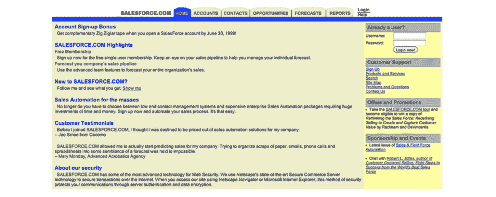

2000 年至 2002 年: Salesforce 围绕他们的 CRM 推出了一项积极的营销战略。它始于 Siebel 抗议和“软件终结”派对。根据他们的“反软件”营销信息，软件(或现有的内部软件)让在客户关系管理系统中工作的销售人员的生活变得更加困难。当时 Salesforce 网站上的消息显示了团队对更好的产品、更快的设置和更易访问性的关注。

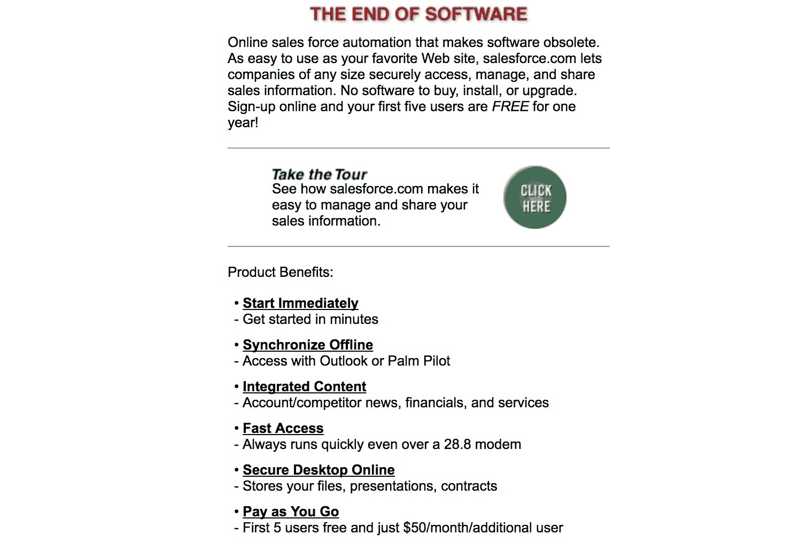

A product description from the Salesforce website in 2000\. [Source: Web Archive](http://web.archive.org/web/20000510041906/http://salesforce.com:80/)

2003 年: Salesforce 显示出他们愿意做出有争议的举动来宣传他们的产品并开发一个社区。他们发出邀请，邀请 10 万名 Salesforce 用户参加以达赖喇嘛为主题的庆祝活动。它受到了强烈的批评，贝尼奥夫被迫道歉。

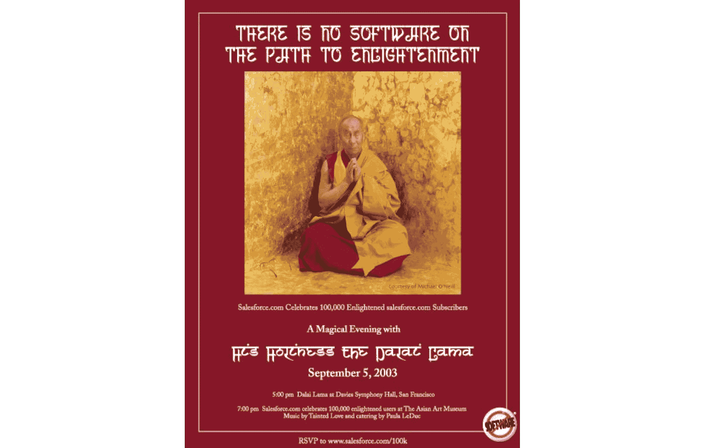

An invitation to a Salesforce event featuring the phrase “There is no software on the path to Enlightenment.” [Source: ahrefs.blog](https://ahrefs.com/blog/creative-marketing/)

同年，该公司还举行了首次年度 Dreamforce 用户大会。他们开创了每年在会议上宣布新产品和新想法的传统。这是正式建立 Salesforce 社区并激发对云的热情的下一步。

2004 年:Salesforce 宣布上市。在交易的第一天，该公司成为头条新闻，因为他们的股票[上涨了 55%以上](https://www.wsj.com/articles/SB108800363785245318)。成功的首次公开募股证明了 Salesforce 如何建立了一个人们喜爱的产品，如何在互联网泡沫破裂后幸存下来，如何继续增长，以及如何成功地开始向人们推销他们对云的愿景。

这些年来，Salesforce 通过保持产品、营销和销售策略的紧密结合而发展壮大。虽然云中产品的想法对用户来说是全新的，但其价值主张是他们的目标受众，销售人员，可以很容易地支持的:更好的 CRM。

这正是 Salesforce 的目标。尽管该团队认为他们的早期产品“非常简单”，但这正是客户所期待的。与 Siebel 和 SAP 的复杂和有缺陷的 CRM 相比，Salesforce 的工具是精简和简单的。

这些早期用户是销售人员，而不是客户公司中的任何其他角色，这是 Salesforce 营销策略的关键部分。对于大多数公司来说，销售是收入中心——如果新技术意味着更有效地实现收入目标，销售团队通常愿意投资新技术。因此，Salesforce 可以直接展示其产品如何帮助公司赚更多的钱。

Salesforce 实际上发明了免费试用和销售软件的新模式。该产品是一种通过云交付的软件即服务产品，它在这些早期用户中创建了一个强大的病毒式分发渠道。由于该产品不需要任何设置，Salesforce 免费提供该工具在技术上是可行的。因此他们制定了一个计划，任何公司的前五名用户都可以免费使用 CRM。

一旦团队成员尝试并喜欢上它，由于 Salesforce 的直接定价计划，扩展团队就变得很容易。他们可以通过座位或升级到更多功能来扩大规模。为客户提供两种扩张方式也帮助 Salesforce 实现了收入的几何级增长。

通过病毒式分销模式向顺从的市场销售易于使用的产品，帮助 Salesforce 实现了高资本效率。这使得该公司能够继续投资于他们的增长引擎。

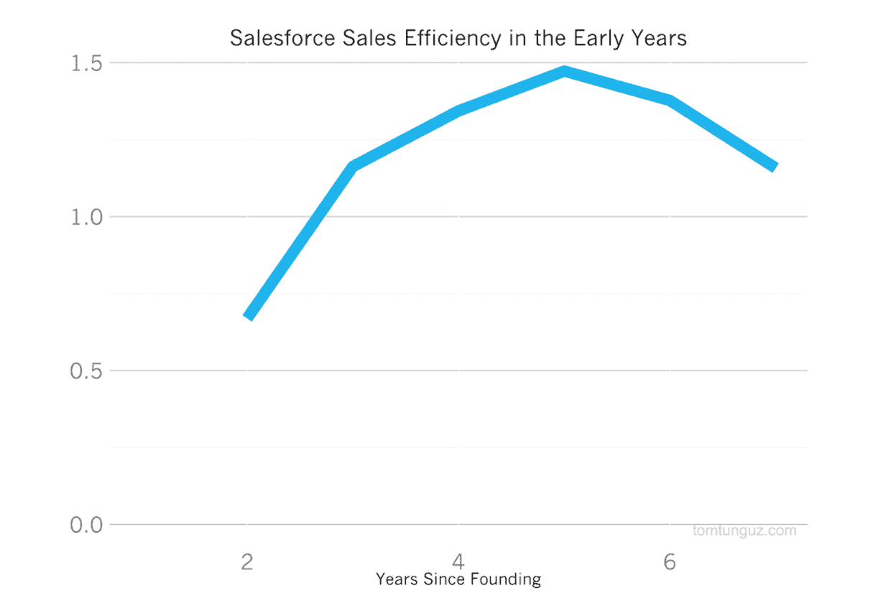

From 2002 to 2006, Salesforce’s sales efficiency metric was >1, meaning the company made $1 or more on every dollar of sales and marketing than they spent. [Source: Tom Tunguz](http://tomtunguz.com/salesforce-s-1/)

这些销售和营销实践也推动了异常高的收入增长。从 2001 年到 2003 年，该公司的复合年增长率超过了 100%。

用户友好的产品和病毒式分销渠道的结合帮助公司从 2001 年的 590 万美元增长到 2003 年申请首次公开募股时的 5090 万美元。在他们 2004 年的首次公开募股中，该公司获得了 9600 万美元的收入，其估值为[11 亿美元](https://www.crunchbase.com/ipo/d7878c9281f1ebc426fc313e5e9c4d69)。

Salesforce 将该公司打造成云中的 CRM 颠覆者，并且仍然依赖他们的 CRM 作为主要产品。但贝尼奥夫的愿景远不止 CRM。

## 2005-2014 年:扩展到平台即服务

当 Salesforce 开始销售云中的 CRM 时，他们是第一家也是唯一一家 SaaS 公司。他们的竞争对手是现有的本地 CRM 软件。但随着公司的发展，这种情况发生了变化。

Salesforce 的早期成功预示着许多新的云业务的崛起。公司看到这种交付模式允许他们更快地为更多的用户生产和销售产品。

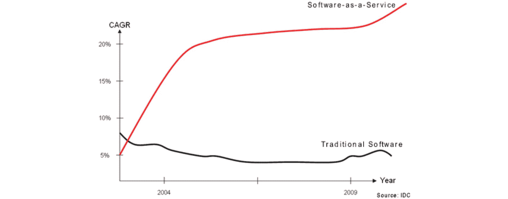

After Salesforce’s IPO in 2004, the compounded annual growth rate of the SaaS industry was at a historical high around 15%, and would only continue growing. Meanwhile, the CAGR of traditional software was around 5% and dropping. [Source: CRM Landmark](http://www.crmlandmark.com/crmlabsindustrytrends.htm)

Salesforce 没有对这些新的 SaaS 公司采取敌视的态度，而是向他们靠拢。他们构建了一个平台，开发人员可以在 Salesforce 上构建自定义应用程序，并创建了一个中心社区，Salesforce 用户可以在其中构建和销售他们的应用程序。他们还通过收购其他 SaaS 公司并在自己的产品套件中重新利用它们，开始将核心产品扩展到 CRM 之外。

通过扩展以提供更多的云产品，如支持和协作工具，他们撒下了更大的网，将用户带入 Salesforce。这使得生态系统对开发人员更具吸引力，从而增加了 Salesforce 产品的价值。云越发展，Salesforce 越发展。

2005 年: Salesforce 建立了 AppExchange。在这里，第三方开发者可以创建他们自己的应用程序，并将其出售给其他 Salesforce 用户社区。

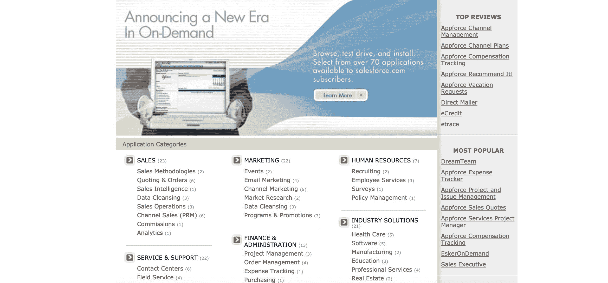

The AppExchange page in 2005\. [Source: Web Archive](http://web.archive.org/web/20051013063035/http://www.salesforce.com:80/appexchange)

这是培育不断增长的云计算产业的下一个合乎逻辑的步骤，因为它给了开发者一个支持的社区和观众。

2006 年:Salesforce 团队发布了 Apex，这是一种按需编程语言，允许第三方程序员在 sales force 的多租户共享架构上编写和运行代码。Parker Harris 还创建了 Visualforce，它允许用户创建他们想要的任何用户界面，并构建表单、按钮、链接和嵌入任何东西。

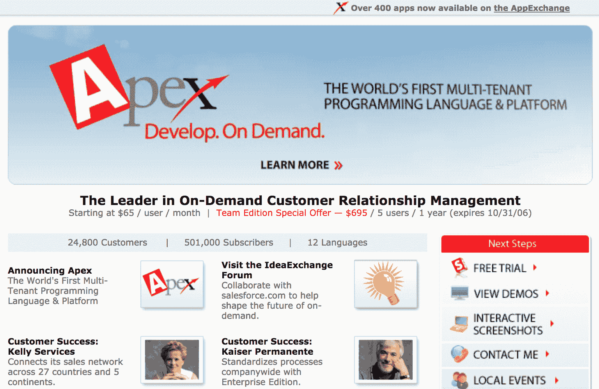

From a 2006 version of the Salesforce homepage. [Source: Web Archive](http://web.archive.org/web/20061010122412/http://www.salesforce.com/)

2008 年: Salesforce 发布了开发者官方平台 Force.com。这是世界上第一个平台即服务。它允许第三方在 Salesforce 的架构上部署应用程序。它还为 Salesforce 创造了新的收入来源，因为第三方需要为使用该平台的每次登录付费。

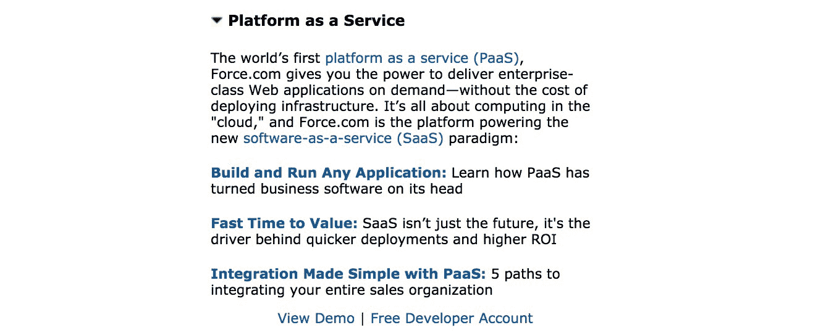

From a 2008 version of the Salesforce homepage. [Source: Web Archive](http://web.archive.org/web/20081009050040/http://www.salesforce.com:80/)

2011 年: Salesforce 将收购的众包数据公司 Jigsaw 更名为 Data.com。像这样的收购帮助 Salesforce 通过不同的分支扩展了他们在 SaaS 行业的影响力，同时增加了新的收入中心。

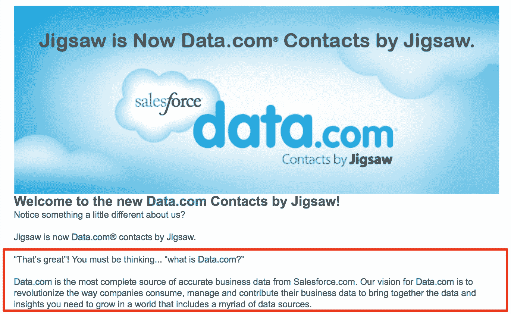

Data.com announcement in 2011\. [Source: Data.com](http://community.jigsaw.com/t5/Blogs/Welcome-to-the-new-Data-com-Contacts-by-Jigsaw/ba-p/51338)

**2012:** Salesforce 将收购的社交客户服务工具 Assistly 重新用作 Desk.com。Salesforce 此前对这家初创公司进行了投资，最终在 2011 年以 8000 万美元的价格将其收购。这次收购帮助 Salesforce 将 Desk.com 的 T2 变成了一个社交服务台。该工具可以利用来自 Salesforce CRM 的数据，为客户提供更加集成的体验。这一新产品继续扩大了他们产品的使用案例和公司的收入中心。

**2013:** Salesforce 将收购的社交媒体监测平台 Radian 6 重新定位为【Social.com】的以允许客户整合社交媒体数据和 CRM 数据。该公司继续扩展其营销云产品。

同年，Salesforce 达到了一个里程碑，AppExchange 上下载和安装了 200 万个应用程序。这证明了该公司作为平台提供商的成功和发展，而不仅仅是 CRM 提供商。

这些年来，在围绕 CRM 的早期营销开始产生对云的兴奋之后，Salesforce 开始构建其他产品。现在，他们不仅仅是在销售 CRM 的同时销售云愿景。他们正在向其他开发者宣传这一愿景，这些开发者也开始通过 Salesforce PaaS 构建云应用。与此同时，他们投入巨资收购其他 SaaS 公司。这帮助他们为人们创造了更多使用 Salesforce 的方式。

该公司的新平台产品在 SaaS 尚属首次。它提供了恰到好处的功能和支持，为新的云项目开了个头。凭借他们的平台，Salesforce 为外部开发者合法化了 SaaS，并激励人们开始建设。数字清晰集团的艾伦·佩尔茨-夏普是这样说的:

“On demand 和 ASP(应用服务提供商)都曾试图推动我们现在所说的云模式，但都没有成功。但一个开放的 B2B 交易平台，向开发者开放底层平台，意味着可用应用的数量激增。”

Salesforce 的价值主张迅速膨胀——除了通过云为您提供优秀的产品，他们还帮助您构建和运行*您自己的*优秀的云产品。[sales force 网站上写着](http://web.archive.org/web/20061010122412/http://www.salesforce.com/):

Salesforce.com 提供的不仅仅是一个功能强大、易于使用的客户关系管理(CRM)产品。我们提供完整的[架构](http://web.archive.org/web/20061010122412/http://www.salesforce.com/products/ondemand-architecture.jsp)，使每个企业都能在整个组织中体验到按需服务的好处。

这一价值主张展示了 Salesforce 在 SaaS 行业的领导地位，以及他们对使软件更易访问的持续承诺。

与他们的第一款产品 CRM 一样，Force.com 的入门友好型定价推动了收购和分销。每次登录只需 99 美分，这个价格标签让公司很容易在 Force.com 开始建设和部署。定价根据使用情况而定，这意味着随着客户的应用变得更加成功，Salesforce 也获利了。

Salesforce 有意利用他们的 CRM 产品在 Force.com、Data.com、Desk.com 和 Social.com 建立许多收入中心。在此期间，他们的收入增长比公开的 SaaS 中值高出数亿美元。

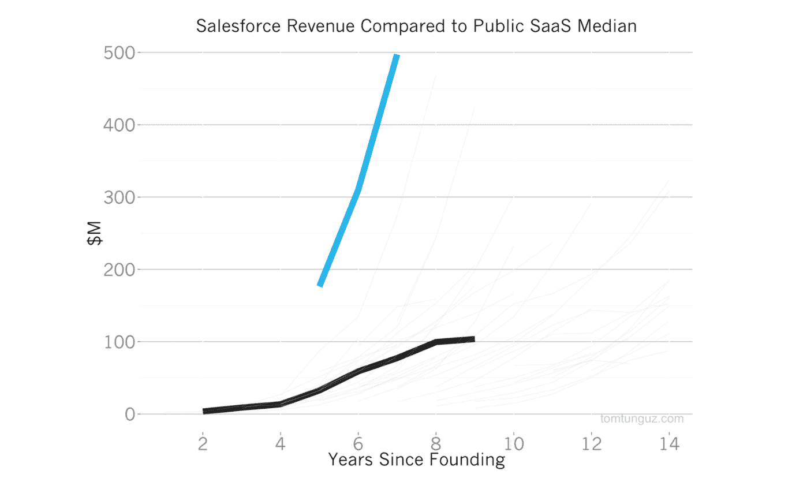

Salesforce revenue growth from 2004-2006.

现在，该公司正在超越 CRM 产品，帮助客户获得多种服务。CRM 只是为贝尼奥夫和 Salesforce 一直以来的设想提供了一个切入点:一个没有软件、完全基于云的世界。

## 2015 年至今:创新，即使是在任者

到 Salesforce 大约 15 岁时，该公司已经成为他们开创的行业中的现任者。随着他们的前进，他们看到更小、更灵活的创业公司进入他们的地盘。他们也看到了来自其他现有公司的竞争，如微软和甲骨文，他们现在已经把他们的产品转移到了云上。

为了抵御来自微软和甲骨文等公司的竞争威胁，Salesforce 改变了策略。他们没有培育有前途的 SaaS 公司，而是与威胁 Salesforce 增长的公司进行正面竞争。他们不再主要关注于创建工具、资源和社区，其他人可以在那里进行构建。相反，他们加倍努力利用最新技术改进自己的产品，以直接应对竞争对手的行动。

这导致了横向和纵向的扩张。他们专注于通过快速采用和集成最新技术来改进他们的 CRM，并将其提供给各种规模的客户。与此同时，他们需要不断添加新的云服务来服务广泛的使用案例，并与其他企业提供商(如微软和甲骨文)竞争。

**2015:** Salesforce 发布了面向小企业的 SalesforceIQ。随着 Salesforce 成长为企业解决方案，他们为其他公司进入并占领 SMB 市场留下了空间。为了应对这一点，Salesforce 在 2014 年收购了关系情报平台 RelateIQ，并将其更名为 SalesforceIQ。价值主张听起来类似于 sales force 1999 年的原始 CRM:一个易于使用的开箱即用的解决方案，团队可以在几分钟内免费试用。

**2016:** [Salesforce 收购了生产力软件公司 Quip](https://stratechery.com/2016/uber-didi-follow-up-salesforce-buys-quip/) ，该公司允许用户创建文档和电子表格。这个生产力部门提供了一个巨大的新的使用范围，并与微软 Office 和谷歌文档直接竞争。

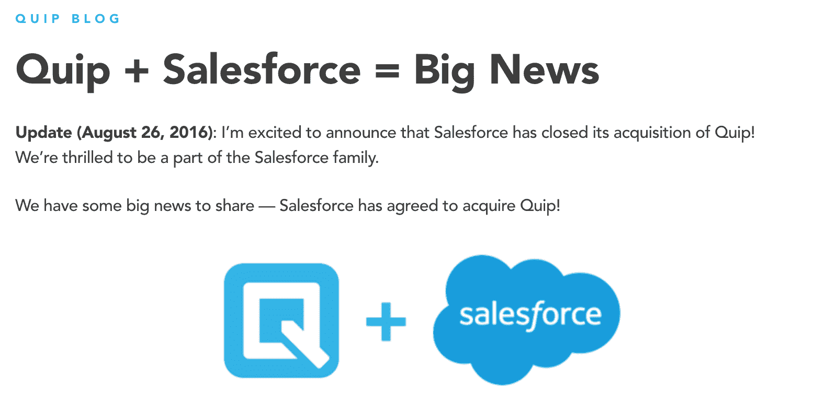

From a 2016 announcement on the Quip blog. [Source: Quip](https://quip.com/blog/salesforce)

同年，Salesforce 收购了电子商务平台 Demandware。这帮助他们构建了商务云，并开始在 Salesforce 套件中提供电子商务服务。

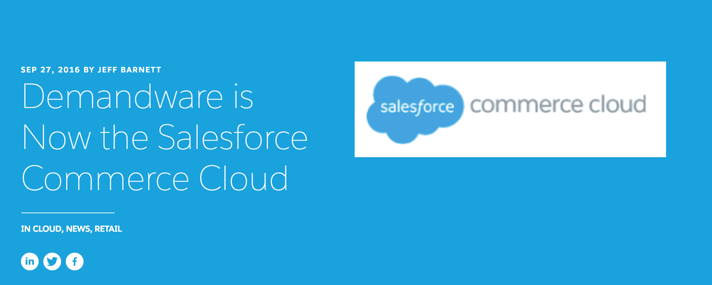

From a 2016 announcement on the Salesforce blog. [Source: Salesforce](https://www.salesforce.com/blog/2016/09/demandware-salesforce-commerce-cloud.html)

2016 年，Salesforce 还发布了 [Salesforce Einstein](https://www.salesforce.com/company/news-press/press-releases/2016/09/160919.jsp) 。这给他们现在庞大的产品系列带来了人工智能技术，并允许 Force.com 的[用户构建人工智能驱动的应用程序。Salesforce 宣布 Einstein 的同一周，Oracle 发布了一项人工智能计划，用于他们的 CRM 及其自适应智能应用。几个月后，微软宣布了他们的 CRM 中的人工智能开发与微软动态 365。](http://force.com)

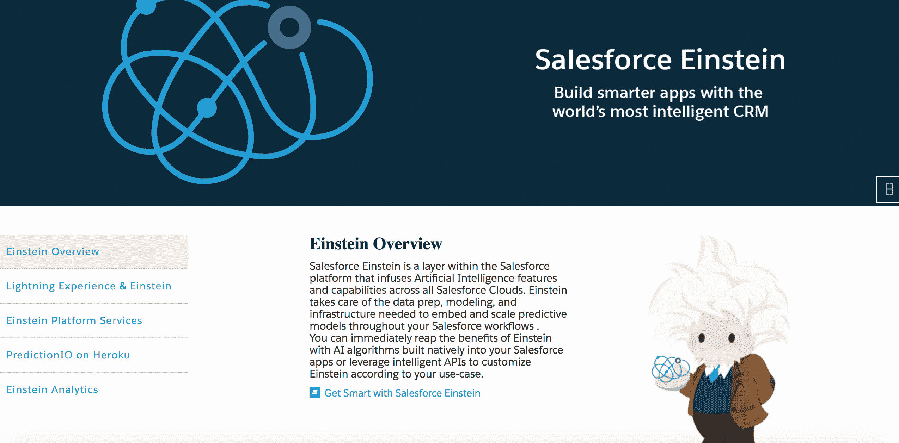

随着 Salesforce 面临来自其他 CRM 和其他商业软件的竞争，他们不断创建更多的“云”，或提供特定功能的产品，以使用户进入 Salesforce suite。一旦他们开始使用一种产品，就更容易在其他产品上交叉销售。产品蔓延也是与其他大型云 CRM 竞争的必要条件。

通过利用人工智能等新技术改进现有产品，并为开发人员提供构建人工智能应用的工具，Salesforce 可以继续让人们更容易使用真正强大的技术。

这并不意味着像人工智能这样的新技术足以保持 Salesforce 的竞争力——特别是因为其他公司也在大力推动人工智能的应用。但结合他们的其他云收购，使他们能够向用户提供更多的产品，Salesforce 可以继续加强自己作为一个平台和套件的实力，这已经远远超过了 CRM。

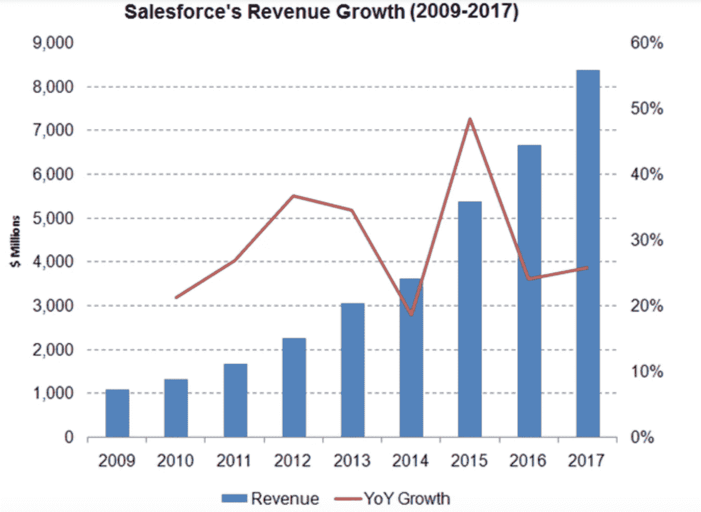

Salesforce’s revenue growth and growth rate. As of 2017, their revenue for the year is exceeding $8 billion and their growth rate is just under 30% YoY.

该公司面临着来自多方面的威胁，但他们仍在奋力向前。

## Salesforce 将何去何从

Salesforce 现在是首要的云 SaaS 现任者。这意味着他们会有很多损失。尽管他们在 SaaS 生态系统上投入了大量资金，并在许多方面帮助了其他公司的发展，但他们也为其他公司将他们的传统产品转移到云上创造了空间，并为更小更便宜的解决方案留下了机会，以蚕食他们的客户群。

但是因为 Salesforce 已经成长为一个多用途的云服务提供商，而不仅仅是一个企业 CRM，他们仍然有很大的扩展空间。他们可以:

*   在他们的云产品套件中提供网络服务。收购帮助 Salesforce 扩展到全新的类别。但 Salesforce 尚未对网络进行重大扩张——他们去年在收购 LinkedIn 的竞标中输给了微软。他们已经通过他们的 Dreamforce 会议和他们的 AppExchange 和 Force.com[T3 平台为一个强大的社区网络奠定了基础。在内部创建网络可以帮助他们在销售、营销和协作云之上拥有数据和网络层。](http://Force.com)
*   **为客户带来更好的 AI 效用。** Salesforce 已经在将人工智能融入其许多产品的过程中。这部分是由于 2017 年与 IBM 的合作，以[结合爱因斯坦和沃森](https://www.salesforce.com/blog/2017/03/ibm-salesforce-strategic-partnership.html)，允许客户增加他们已经在 Salesforce 中的数据。但是随着更多的数据而来的是更多的复杂性，很多人已经认为 Salesforce 太复杂了。与此同时，许多新产品都注重易用性。Salesforce 可以使用 AI 让用户更容易从他们的产品中获得他们需要的信息，尤其是他们已经有了一个名为 Optimus Prime 的内部工具来组织和清理数据。这将是围绕用户在 Salesforce 中已经拥有的所有数据添加服务的大好机会。
*   关注国际市场。 Salesforce 通过专注于美国而成长，但他们现在有机会通过海外扩张更积极地成长。就在去年，他们与 AWS 达成协议，扩大合作关系；现在，Salesforce 不必在有数据主权法律的国家从零开始建立数据中心。然而，他们仍然在有意义的地方建立自己的数据中心；今年早些时候，他们在日本建立了第二个数据中心，以应对亚太地区日益增长的使用量。在持续增长的国际地区，建立自己的数据中心给 Salesforce 带来了更多优势，使他们能够更好地服务更多地理区域，而不依赖于从亚马逊和微软等公司租赁的资源。

Salesforce 在云 SaaS 的持续统治地位将取决于他们如何保持产品创新并提供更多云解决方案。这是他们的剧本，也是过去 18 年来给用户带来最大利益和成功的剧本。

## 我们可以从 Salesforce 学到的 3 个关键经验

Salesforce 将整个软件行业完全转移到云的方式是革命性的。但是如果他们一直在卖一个蹩脚的产品，用户永远不会关注他们或者关心他们的云运动。

Salesforce 创建了一个 CRM 并将其放在云中，这样他们就可以让用户对云产品感到兴奋。然后，他们利用自己作为云领导者的地位，开发出更多(更好)用户想要的产品，从而推动了自身的发展。如果你正在开发自己的产品，你可以从 Salesforce 的旅程中学到很多东西。

**1。你如何改进当前的工具或流程？**

Salesforce 的云 CRM 和他们的“无软件”活动完全基于这样一种想法，即内部软件太难安装和升级，用户会想要更简单的东西。

要创造一个人们会关注的产品，你必须解决一个比当前解决方案更好的问题。以下是你如何找到减少产品摩擦的方法:

*   **逐步分解客户的体验。**亚马逊音乐的产品负责人 Kintan Brahbhatt 认为，产品中的摩擦点比开发产品的人意识到的要多得多。[他建议](http://producthabits.com/5-mental-models-help-product-managers-acquire-retain-users/)产品经理“列出客户为了完成你产品中的一项任务而需要做出的所有决定。然后每一个都质疑。”
*   通过评估功能与你的产品的相关性来删减功能。你开发的一些功能可能没有达到你预期的效用或受欢迎程度。重要的是要评估并移除那些给用户增加更多困难的功能——即使你很喜欢它们。[我推荐](http://producthabits.com/look-beyond-existing-customers-building-product/)德·特雷纳的评估要削减的特征的框架:[他建议问自己](https://blog.intercom.com/talk-product-strategy-with-massive-impact/)，“如果你当时知道你现在知道的，你还会有……”
    *   建立了那个功能？
    *   运输集成吗？
    *   选择了那个建筑？
    *   设计了那个屏幕？

**2。你公司的品牌是什么，这对你的产品有什么影响？**

Salesforce 强调让事情变得更简单，强调被视为创新者，这在他们成长的过程中影响了他们的产品决策。一个定义明确的品牌有助于保持产品开发的重点。

正如 Salesforce 通过其广泛的产品套件所展示的，这不一定是限制性的。然而，一个定义明确的品牌将帮助你从竞争中脱颖而出，它告诉用户他们可以从你的公司期待什么。以下是如何识别和进一步定义你的品牌:

*   发送一份 NPS 调查，重点关注定性答案。除了要求用户提供一个数字分数，还要为用户留下一个开放式的字段，让他们留下对你的品牌体验的书面反馈。然后你可以用单词云生成器[来组织你的调查回复，就像我在这里用 Slack](https://hitenism.com/slack-product-market-fit-survey/) 所做的那样。
*   创建一个电子表格来对价值进行分类。在电子表格中，将你的每一项产品与用户价值以及你的品牌价值联系起来。像这样将你的产品形象化，可以让你看到你的产品是如何与你想传达给顾客的主要营销信息相联系的。

**3。随着竞争的加剧，你如何让自己变得更有价值？**

正如 Tom Tunguz 解释的那样，SaaS 公司的三个持久竞争优势是网络效应、数据网络效应和生态系统创造。Salesforce 创建了一个生态系统，因为它最适合当时新兴的 SaaS 市场。

根据你的公司，有很多方法可以让你建立竞争优势。下面是如何评价:

*   理解用户为什么会选择竞争对手。在论坛上发帖问真实用户“为什么有人在用[X]产品？”选择一个对你的产品有竞争力的产品。问这个问题也可以让你知道竞争产品的*而非*用户是什么。这有助于你开拓出一个独特的利基市场，给用户一些他们还没有得到的东西，并且以一种独特的方式有价值。
*   发布免费工具，让人们亲眼看看你的产品有多有用。在竞争激烈的环境中，你可以从中获益良多，或者客户可能不会立即了解你的产品的价值，仅仅让他们尝试一下是很困难的。免费工具或免费层，如 Salesforce 的第一个 CRM，可以帮助您的产品出现在广大受众面前，并允许用户自己探索您产品的价值。

贝尼奥夫在他的《云背后的*一书中写道:*

 *一个想法本身是一种策略，但是如果它可以以多种不同的方式执行，它就会成为一个伟大的战略

我总喜欢说，没有捷径可走。增长技巧和镐在短期内有效，但它们不能让你实现 Salesforce 已经实现的那种增长。为此，你需要一个愿景和永无止境的实现愿景的方法。

如果 Salesforce 只是兜售 CRM 的话，他们不可能取得今天的成就。他们的 CRM 是撬棍，让他们撬开通往云空间的道路。但让他们成功的是，他们不断寻找新的方式来执行云产品并宣传他们的愿景。

1999 年，Salesforce 开始发展，并且没有停止，这无疑为 SaaS 公司设立了一个高标准。现在，它们需要实践自己的先例，否则就有被超越的风险。如果他们继续寻找新的方法来执行他们从 1999 年开始的战略，他们将继续成为 SaaS 行业的主要参与者之一。*