# 社交证明:你更好营销的秘密武器

> 原文：<https://blog.usefomo.com/social-proof/?utm_source=wanqu.co&utm_campaign=Wanqu+Daily&utm_medium=website>

什么是社会证明？

当你还是个孩子的时候，你的母亲可能会问你这样一个反问:如果你所有的朋友都从桥上跳下，你会吗？

即使在当时，这个问题似乎也很荒谬。从桥上跳下来是完全不理智的，即使你所有的朋友都在这么做。

但是当你仔细研究你母亲的问题时，你会发现在它的背后有一些深刻的、强大的社会心理学。不管你母亲知不知道，她在援引社会证据的原则。正如我们将在今天的文章中看到的，当你将它应用到你的营销工作中时，它可以像你母亲暗示的那样强大(但不那么危险，别担心)。

因此，请跟随我们来到隐喻桥的边缘，大胆探索什么是社交证明，它在现实世界中是什么样的，以及如何利用它来推动公司的营销。

我们走吧！

## 社会证明解释

为了理解社会证明，我们需要回到人类史前史。在部落社会中，保持较高的社会地位是极其重要的。为了确保这一切发生，你不想做任何社会不接受的事情，这可能会让你被回避或被踢出部落(因为这基本上是被狮子吃掉的一个配方)。

当然，在社交场合下做什么并不总是很清楚，尤其是你从未遇到过的社交场合。因此，为了帮助解决这个问题，我们的大脑开发了一个便捷的思维捷径:看看其他人都在做什么。如果大多数人都这样做，那么它可能是社会可以接受的。也就是说，这可能不会让你被踢出部落。

这是社会证明。当社会规范模棱两可时，我们会寻求他人来决定什么是合适的。即使我们不再生活在部落狩猎采集的社会中，社会证明的原则仍然伴随着我们。

而且，在很大程度上，它继续很好地为我们服务。无论是在家庭聚会、家庭聚会，还是在国外，随大流都是一个非常有效的策略。

正如社会心理学家罗伯特·恰尔蒂尼在他的书《影响:说服心理学》中所说的:“通常，我们按照社会证据行事会比违背它犯更少的错误。通常，当很多人都在做某件事时，这是正确的做法”(第 88 页)。

在这篇文章中，我们特别感兴趣的是社会证明在影响客户行为方面的力量。购买的后果不太可能像激怒部落首领那样戏剧性地影响我们的生存能力，但它们对我们史前进化的大脑来说*感觉*同样重要。

因此，如果你想让顾客对他们的购买有信心，或者只是说服他们尝试你的产品，社交证明是一个非常强大的工具。

既然我们已经定义了社交证明，让我们来分解一下对你来说重要的部分:*如何使用社交证明来推销你的业务。*

## 使用社会证明的 5 个原则

取决于你问谁，大约有 5 到 6 种社会证明。但是，与其纠结于如何对现有的种类进行分类，我们认为更有用的是关注如何在你的营销中实际使用社交证据。

我们将很快进入一些例子，但首先这里有一些如何(和如何不)使用社交证明作为你的营销策略的一部分的一般准则。

### 1.避免负面的社会证明

由于本文大部分都在讨论社交证明的积极作用，所以有一点很重要:如果你使用不当，社交证明可能会对你不利。这被称为“负面社会证明”，你想不惜一切代价避免它。

什么是负面社会证明？任何表明人们认为你的产品不好的东西。这可以采取不同的形式。它可以是一些显而易见的东西，如一星评价，也可以是一些更隐蔽的东西，如社交分享图标。正确使用的话，社交分享图标可以展示你的品牌的受欢迎程度，但是如果你的帖子只有 10 次分享...嗯，最好把它拿掉。

综上所述，没有社会证明比消极的社会证明更好。不要为了追求提升而损害你企业的形象。

### 2.将社会证明与权威相结合

社会证明本身是强大的，但是当你将它与营销心理学的其他原则结合起来时，你可以增强它的力量。最强有力的组合之一是社会证明与[权威](https://en.wikipedia.org/wiki/Authority_bias)原则。人们更容易信任和追随他们认为是专家的人。因此，如果你能让一位专家(或者更好的是，专家)认可或使用你的产品，你就大大增加了在客户中建立信任的机会。

您如何使用权限将取决于您的产品和资源，但以下是一些常见的方式:

*   名人代言

*   行业领导者认可

*   来自一个有影响力的行业团体的认证

*   知名公司的代言

我们很快就会看到以上所有的例子，但同时请记住，社会证明+权威=客户信任的巨大潜在增长。

### 3.把社会证明和稀缺性结合起来

恰尔迪尼的另一个影响原则是[稀缺性](https://en.wikipedia.org/wiki/Scarcity_heuristic)。正如社会证据一样，它可以追溯到我们的根源，追溯到资源极度匮乏的时代。如果你在史前大草原上发现了浆果，最好现在就把它们都吃掉，因为你的下一餐还不确定。

因此，我们倾向于认为稀缺资源更有价值。作为营销人员，你可以利用这种趋势，限量销售你的产品或提供限时折扣。但是除了仅仅使用稀缺本身，你还可以将它与社会证明结合起来，真正鼓励客户购买、订阅或采取任何你可能想要的行动。

### 4.社交证明对相似的人最有效

我们已经探讨了人们如何更容易信任专家，但重要的是要注意，他们也更容易信任他们认为与自己相似的人。罗伯特·恰尔迪尼是这样解释的:

“当我们观察像我们一样的人的行为时，社会证明的原则发挥了最大的作用。正是这些人的行为给了我们最深刻的洞察力，让我们知道什么是正确的行为。因此，我们更倾向于跟随相似个体的领导，而不是不相似的个体。(恰尔迪尼，*影响力，*第 107 页)”

有很多方法可以将上述信息应用到你的营销中。无论是将地点或职业作为[客户证明](https://fomo.com/customers)的一部分，还是获得与你的客户有共同之处的专家的认可，请记住，当社交证明来自相似的人时，它会更加有效(即使这种相似性小到来自同一个城市或从事相同的工作)。

### 5.利用用户生成的内容增强社交证明

考虑以下哪一个更有说服力:

1.  一条推文说“世界上超过 100 个国家的人都在使用我们的产品”(甚至可能附有一张漂亮的小信息图)

2.  一位客户在推特上盛赞您的产品如何改善了他们的生活(手里拿着您产品的照片)

毫无疑问，第二个例子赢了。这就是用户生成内容(UGC)的力量。正如 Fomo 在我们与 Yotopo 合写的书中所探讨的，UGC 是在你的营销中运用社会证据的最有效的方式之一。以下是一些可能的用户生成内容类型:

除了感觉比你说的任何关于你的产品的话都更真实这一事实，UGC 还受益于潜在的相似性(一个用户可能与另一个用户有更多的共同点，而不是与你这个产品的创造者)。

如果你密切关注，你会发现，如果你能设法找到一位你的客户认为相似的专家来制作和分享涉及你的产品的内容，还有巨大的潜力。这就把我们带到了下一节:如何在营销中使用社交证明的例子。

抓紧了，因为这是一个庞大的列表。

## 如何在营销中使用社交证明的 21 个例子

下面你会找到 21 个如何在营销中使用社交证明的例子。

以下是 21 个例子的概览:

1.  [客户评论](#customerreviews)

2.  [客户评级](#customerratings)

3.  [策划社交媒体帖子](#curatedsocialmediaposts)

4.  [案例分析](#casestudies)

5.  [感言](#testimonials)

6.  [客户生成的 Q & A](#customer-generatedq&a)

7.  [建立社区](#buildacommunity)

8.  [社交媒体关注者和分享者](#socialmediafollowersandshares)

9.  [电子邮件用户数量](#emailsubscribercounts)

10.  [客户数量](#customercounts)

11.  [客户统计数据](#customerdemographics)

12.  [公司财务信息](#companyfinancialinformation)

13.  [社交媒体朋友和关注者](#socialmediafriendsandfollowers)

14.  [推荐活动](#referralcampaigns)

15.  [实时用户活动](#realtimeuseractivity)

16.  [专家](#experts)

17.  [名人](#celebrities)

18.  [影响者](#influencers)

19.  [认证](#certifications)

20.  [媒体报道](#mediacoverage)

21.  [品牌联想](#brandassociation)

为了使这个列表更容易浏览，我们根据每个人所属的社会证明的一般类型将它分成几个部分。

以下是供您参考的部分(单击链接可跳转到每个部分):

## 用户生成的内容

正如我们上面提到的，用户生成内容(UGC)是让潜在客户信任你的品牌的一个非常强大的方法。UGC 利用了相似性的力量，因为它展示了一个“像他们一样的真实的人”以一种有机的、非销售的方式使用产品。这比你对你的产品说的任何话都更有关联。因此，无论你的业务卖什么，UGC 都值得探索。

以下是一些在营销中利用用户生成内容的方法:

## 顾客评论

积极的顾客评价是任何生意成功的关键。他们为潜在客户提供了一个未经过滤的视角，让他们了解其他人对你产品的看法。假设评论通常是积极的，它们可以成为一种强有力的社会证明。

* *示例:* *亚马逊有力地提醒了电子商务中社交证明的重要性。他们不仅为购物者提供了一个评论列表，还根据读者的反馈指出了哪些评论被认为是最有帮助的。这使得客户可以轻松浏览相关信息的评论:

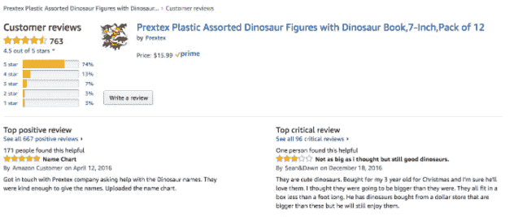

此外，亚马逊在每个产品页面的侧边栏中按新近度对评论进行排序。研究表明[消费者倾向于认为最近的评论比旧的更值得信赖](https://www.brightlocal.com/learn/local-consumer-review-survey/#10)，这是一个非常明智的用户界面设计选择。

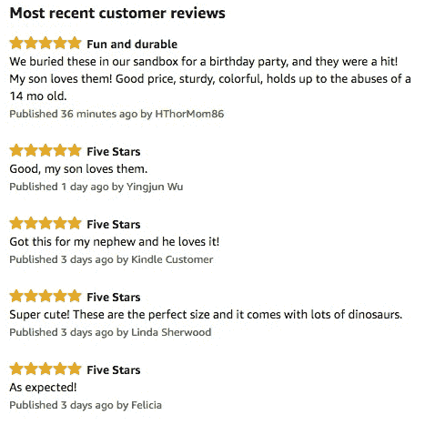

最后，每条评论还指出购买是“经过验证的”，这有助于缓解消费者的普遍担忧，即[在线评论不一定值得信任](http://www.pewinternet.org/2016/12/19/online-shopping-and-e-commerce/pi_2016-12-19_online-shopping_2-02/)。

即使你不从事电子商务，让客户有机会通过 [Product Hunt](https://blog.producthunt.com/how-to-launch-on-product-hunt-7c1843e06399) 等渠道或直接在你的网站上评论你的产品或服务，也可以让你使用这种形式的社交证明。

## 客户评级

与客户评论密切相关的是客户评级。它们为潜在客户提供了一种方式，让他们一眼就能看出人们对你的企业有什么看法。评级也可以作为评论的“引子”，促使购物者深入挖掘和阅读更多内容(当然，前提是评论通常是正面的)。

例子: Yelp 的业务建立在对实体企业的评级和评论之上。即使你的企业位于网上，你也可以从 Yelp 如何在他们的平台上使用评级学到很多东西。特别是，注意他们如何突出显示评级。对于每个商业页面，这是你在商业名称后看到的第一件事。

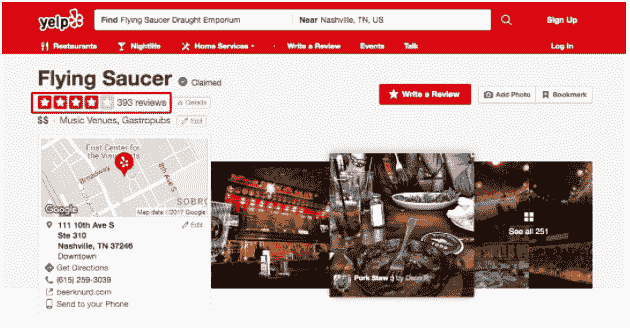

你可以在你的业务中利用这种形式的社交证明，只要有可能，允许客户留下评级，无论是在商业脸书页面上还是直接在你的网站上。如果你[使用 Fomo](https://fomo.com/product-tour) ，你甚至可以实时显示客户评级，并允许用户点击它们来了解更多信息，确保人们知道你的评级是最新的。

## 策划社交媒体帖子

如果管理得当，你客户的社交媒体活动可以成为社交证明的圣杯。唯一比阅读满意顾客的评论更好的事情是看到有人以最有机的方式分享他们对你的业务的热情:**社交媒体。**如果内容包含照片或视频，可获得额外积分。

**例子:**显而易见的实施是分享或转发你的客户关于他们对你的业务的热爱的帖子和推文。虽然这肯定是一个好策略，但我们鼓励你探索不那么传统的平台来使用这种强大的社交证明形式。

例如，看看化妆品公司丝芙兰策划的 Pinterest 板块。通过为顾客提供展示指甲设计的机会，丝芙兰创造了一种高度互动的社交证明形式，让潜在顾客和现有顾客获得灵感和更多购买理由。

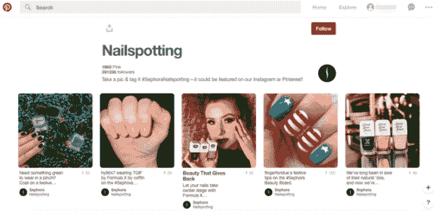

## 个案研究

严格地说，案例研究不是用户生成的内容，因为它们涉及到贵公司的大量编辑和制作工作。尽管如此，它们是社会证明的有力工具，可以向潜在客户展示与你合作或使用你的产品是什么感觉。

总部位于密尔沃基的品牌战略和设计工作室 Grain & Mortar 在其网站上发布了大量的案例研究。例如，他们对 Google Cardboard 的案例研究显示了他们如何解决 Google 在网站设计和用户体验方面的具体挑战，同时也强调了他们解决客户问题的一般方法。

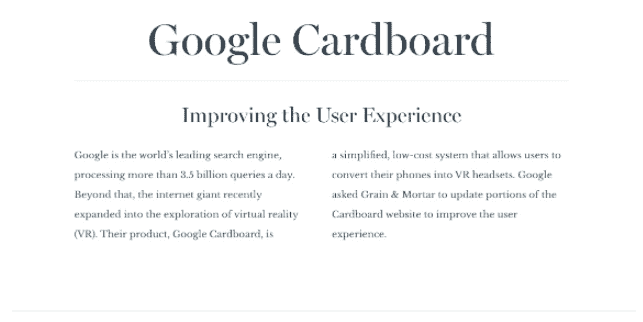

这种特殊性和更广泛的含义之间的平衡是成功案例研究的关键，无论是对于像 Grain & Mortar 这样的服务型企业、SaaS 公司，还是您的企业所解决的任何问题。该案例研究还因使用了来自与谷歌等行业领导者合作的权威社会证据而获得加分。

## 证明书

案例研究是一个强有力的工具，但是它们也有不利的一面，那就是你制作和你的潜在客户阅读起来很费时间。为了平衡这一点，你可以使用推荐让网站访问者快速体验你的业务是如何帮助其他客户的。

例如:便携式立式办公桌制造商 StandStand 在其主页上展示了许多作家、企业家和其他客户的推荐。这些推荐包括指向客户网站、评论文章和业务的链接(如果适用)，成功地将推荐策略与影响者的社会证明和媒体报道相结合。

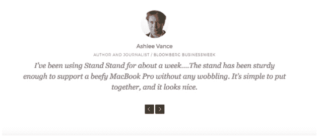

## 客户生成的问答

这种策略不像本文中讨论的其他一些策略那样常见，这意味着如果你正确使用它，它可能是一个包抄竞争对手的好机会。这种形式的社交证明利用了问答和 FAQ 页面的力量，但增加了提供答案的真实客户的可信度。

我们发现的最好的例子来自亚马逊。他们的许多产品页面都包含“客户问答”部分。虽然这给了产品销售者回答顾客问题的机会，但也允许其他顾客插话。

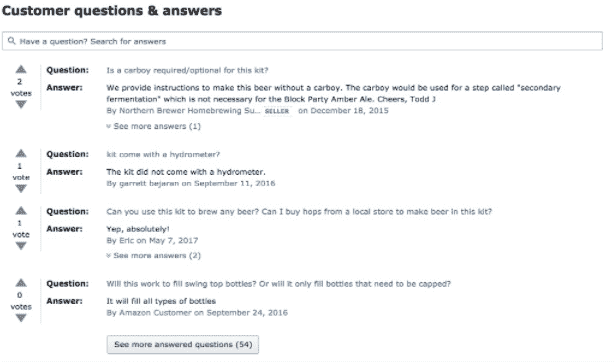

这可能是一把双刃剑，因为存在客户提供不准确信息的危险。但是，如果顾客提供的信息是正确和积极的，这种社会证明可以补充顾客的评论和评级，让潜在顾客对他们的任何购买保留意见得到放心、可信的回应。

如果你能让你现有的客户为你提供大量的社交证明，创造一个自我延续的社交证明生态系统会怎么样？这就是围绕你的企业建立社区的力量。这可以是任何事情，从创建一个社区 Pinterest 板到创建你自己的 subreddit 到组织一个本地 Meetup 群。

博客平台 WordPress 的母公司 Automattic 通过他们的全球 WordPress 会议提供了大量的社会证据。这些会议不仅允许产品的用户联系和分享他们的知识，而且他们也为潜在的 WordPress 客户提供了强大的社交证明，证明了平台的易用性、有效性和全球影响力。

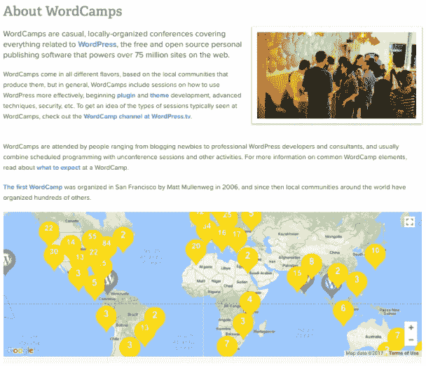

### 统计数字

正确使用的话，关于你公司的数据可以成为有力的社会证明。更重要的是，你可以从你的网站分析中自动提取这些信息，让你可以创建一个低维护、最新的公司形象。

我们将从最容易实现的开始。在你的网站和博客文章上显示这些统计数据非常容易，只需要一个插件或小部件。在我们对这篇文章的研究中，我们发现了一些有趣的事情:显示关注者数量是非常不寻常的。事实上，我们无法找到一个有影响力的博客(甚至在关于社交媒体的博客上也找不到)。因此，我们建议不要采用这种方法。

然而，展示社交分享是相当普遍的。如果你获得了大量的分享，这不仅可以炫耀你的内容的受欢迎程度，还可以鼓励其他人分享它。

**例子:**国外金发女郎的旅游博主 Kiersten 在她网站的每个页面上突出显示了总的和个人的渠道社交份额。因为她的追随者数量通常很高，这可以作为积极的社会证明，提高她的内容的可信度，同时鼓励进一步的分享。

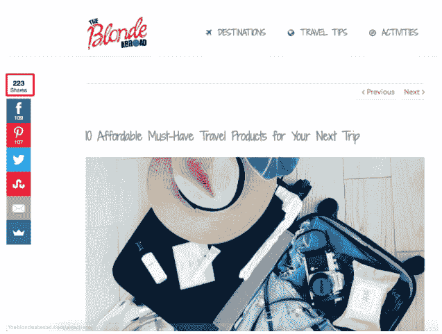

* *警告:* *如果使用不当，社交分享和关注人数是具有负面社交证据高风险的领域。所以，如果没有人分享你的帖子，或者你只有 10 个 Twitter 粉丝，就不要在你的网站上发布。记住，*没有社会证明比消极的社会证明更好。*

## 电子邮件订户计数

电子邮件订阅者数量与社交分享和关注者数量密切相关，但它们对你的业务甚至更有用。毕竟，订阅你的邮件列表的人比那些只是喜欢或分享你的帖子的人更有吸引力(更不用说他们更容易联系)。因此，如果你试图说服人们注册你的电子邮件列表，在注册行动号召中显示当前订户的数量可以有效地利用社交证据。

**示例:**营销策略管理软件 CoSchedule 在其电子邮件注册表单中突出显示了用户数量。他们目前超过 20 万的用户群是一个令人信服的社会证据，证明他们的时事通讯值得一读。

## 客户数量

营销文案，如“加入超过 100 万满意的客户”是常见的原因。如果你的公司有大量的客户，这对于潜在客户来说是一个很好的信号，表明你的公司正在做正确的事情。请注意，你不一定要有大量的客户才能做到这一点——只要有一个对你的行业来说听起来令人印象深刻的客户就可以了。

例如:电子商务解决方案 Shopify 的主页强调让你知道他们的活跃用户数量和使用他们平台的企业数量。对于潜在客户来说，这一庞大的当前用户群是极具吸引力的社交证明。

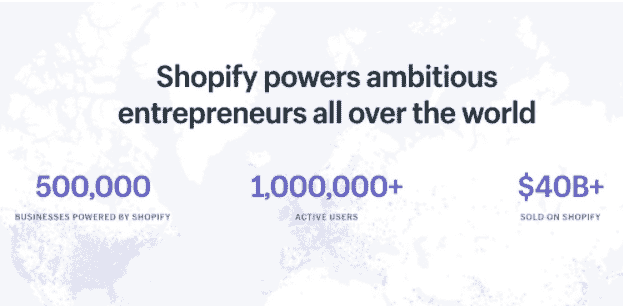

## 客户人口统计

在文章的前面，我们提到了相似性在社会证明中的力量。提供客户的一般人口统计信息是利用这一点的有效方法。如果潜在客户可以看到“喜欢他们”的人从你的企业购买，他们会更乐意购买自己的产品。这种策略在你和推荐一起使用时效果最好。

您可以选择包含哪些确切的信息，但以下信息是常见的:

**例子:**云会计应用 Xero 在他们的主页上使用这种形式的社交证明，展示他们客户群的多样性。当鼠标悬停在每张图片上时，它还会提供一段简短的评价。

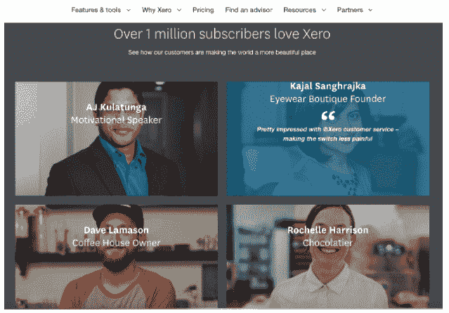

## 公司财务信息

不是每个企业都想公开分享这一点，但在某些市场，这可以作为一种强有力的社会证明。您可以包括收入、处理的付款数量或管理的资产数量等信息。

**例子:**投资公司 Vanguard 在他们的“Fast Facts”页面上列出了他们管理的资产。对于潜在客户来说，看到该公司管理着约 4 万亿美元的资产，就提供了一个社会证据，证明他们可能是一家值得信赖的公司。

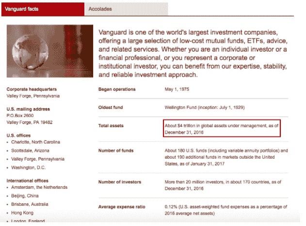

### 朋友、家人和同龄人

越来越多，搜索引擎正在成为在生活的各个领域获得推荐的主要方式。尽管如此，朋友、家人和同龄人的影响仍然很大。如果你的朋友告诉你一家餐馆很棒，那份推荐会胜过 Yelp 说的任何话，更不用说这家餐馆对自己的任何评价了。以下是你可以在广告和产品中建立这种社会证明的方法。

如果你曾经浏览过脸书的网页，你可能会注意到这个网页显示了你的哪些朋友也喜欢这个网页。这是社交媒体上社交证明的一个微妙例子。这个原则很可靠(如果不总是准确的话):如果你的朋友喜欢某样东西，很可能你也会喜欢。至少，看到你的一些朋友喜欢某个页面会引起你的注意。基本上每个社交媒体平台都使用某种形式的社交证明。

**举例:**你不一定要成为一个社交媒体平台才能使用这种技巧。你可以使用脸书的[页面插件](https://developers.facebook.com/docs/plugins/page-plugin)这样的工具向网站访问者展示他们的哪些朋友喜欢你的页面，从而增加你的社交证明。

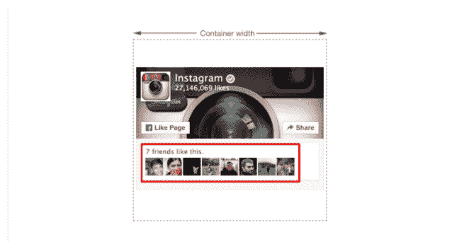

## 推荐活动

“X 个人中的 X 个人会向朋友推荐这个产品”是一个经典的广告口号，这是有原因的。通过推荐活动，你将这一原则提升到了一个全新的高度，允许人们直接推荐朋友、家人或任何人使用你的产品。如果使用得当，这种形式的社交证明可以极大地拓展你的业务。

**例子:**拼车应用 Lyft 允许客户向应用推荐朋友，以换取免费乘车积分。这种技巧结合了经济激励和个人推荐的社会证明。但你不需要 Lyft 复杂的工程资源来为你的业务实现这一点——它可以简单到通过现有的[附属网络](https://en.wikipedia.org/wiki/Affiliate_network)提供一个推荐链接。

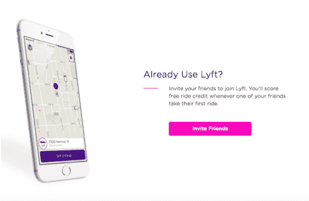

## 实时用户活动

回到我们的第一个例子:看到人们与你的网站实时互动是一种非常强大的社交证明。这是一家顾客在人行道上排队的企业和一家看起来几乎不开门的企业之间的区别。

您可以显示任何类型的实时用户活动，以吸引网站访问者，但这里有几个我们最喜欢的:

*   购买

*   电子邮件订阅

*   社交媒体紧随其后

*   产品更新

这种策略很好地结合了客户人口统计。

**示例:**房地产活动商务房地产财富博览会实时展示购买活动的信息，包括客户的名字、原产国、预订国。这项活动通过展示人们现在正在使用网站，以及通过稀缺性原则创造一种紧迫感，增加了客户的信任。

### 权威

在我们的最后一节，我们将考虑使用权威提供社会证明的不同方式。从专家到名人，再到行业认证，这些都是与权威机构合作可以增加对你品牌信任的方式。

## 专家

专家是在某一领域值得信赖的有经验的人。专家不一定要出名(尽管有些人很出名)。重要的是，你的客户将他们视为专家，并认真对待他们的意见。展示一个专家使用或认可你的产品可以作为强有力的社会证明。

**例子:**银行和储蓄应用 Qapital 雇佣了著名的行为经济学家丹·艾瑞里。他们在“关于”页面上利用了 Ariely 的专家身份，包括一个视频，显示他解释他们应用程序背后的行为心理学原理。这种专业知识旨在增加潜在客户的信任，最终提高应用下载量。

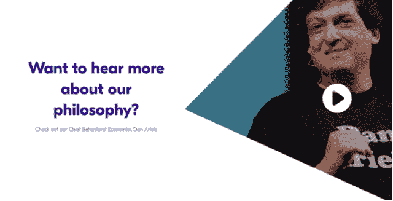

## 名人

名人社交证明和营销本身一样古老。P&G、耐克和士力架等大公司的广告都利用了名人的力量。名人代言将你的企业与名人拥有的财富、名望、美貌或其他可取的品质联系在一起。

如果你没有吸引大牌明星的预算，不要烦恼。在互联网时代，“名人”的定义发生了巨大的变化。例如，在他们的核心粉丝群中，在 YouTube 上拥有 100 万订户的人是“名人”。这个人不一定要在国内或国际上出名才能有效地帮助你推销你的产品，只要在合适的人群中足够出名就行。

例子:优图伯·柯林·福尔泽通过创作疯狂的 DIY 视频赢得了赞誉，比如世界上最快的婴儿车和喷火器吉他。Furze 可能不是好莱坞知名人士，但他在 YouTube 上的 5，368，369 名订户(截至本文撰写之时)使他成为足够的名人，获得了谷歌和育碧等标志性品牌的赞助。考虑与 YouTubers 或其他网络名人合作，为你的业务增加社交证明...只需让索菲亚·维加拉代言你的一小部分费用。

## 影响者

影响者可以是专家或名人，但不一定。如果他们以某种方式(直接或间接)影响人们的购买决策，那么他们就是我们的影响者。像专家一样，人们信任有影响力的人。但更重要的是，影响者通常是人们在做出购买决定时所关注的对象。如果你能找到一个有影响力的人来推广你的业务，结果会令人印象深刻。

**举例:**家庭焦点博客是“妈妈博客”空间中一个很有影响力的网站。除了育儿建议，该网站还评论产品。下面，你可以看到一个明信片设计应用的评论，但是这个网站评论所有种类的产品，只要它们与母亲/父母有关。

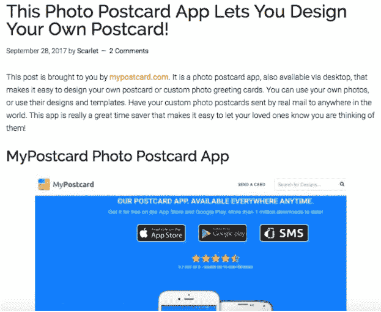

在这样的网站上推广你的业务是一个很好的方式，可以利用来自影响者认可印章的社会证明。你当然可以为这种赞助帖子付费，但你也可以尝试给有影响力的人发送免费样品或订阅你的产品，以鼓励积极的评论。

## 证书

远离个人的影响，走向组织的影响，认证是一种有效的方式来显示你的企业的社会证明一目了然。可能的认证包括以下内容:

以上只是一个尝试，你应该寻找与你的特定行业相关的认证。

**例如:**服装公司 Patagonia 推出了一系列公平贸易认证产品。对于有社会意识的消费者来说，公平贸易认证是公司致力于道德商业实践的有力社会证明。

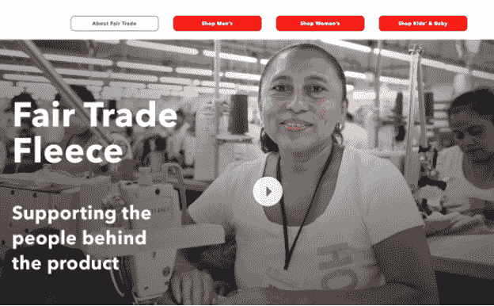

媒体报道表明你的生意有一定的重要性。可以是在当地报纸上被提及，也可以是在全国脱口秀上露面，或者是在《纽约时报》上发表文章。不管怎样，在你的网站上以徽章或博客链接的形式展示你的媒体报道可以增加客户的信任。

**例子:**待办事项和任务管理器 app Todoist 在他们的主页上有一个“被世界顶级媒体称赞”的版块。除了链接到整篇文章的出版标识，他们还为浏览者提供每篇文章的简短广告。这结合了媒体报道策略和客户评价。

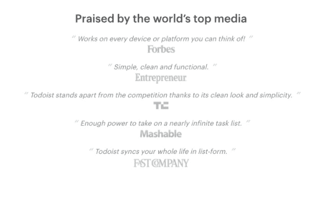

## 品牌联想

品牌协会类似于专家，除了你使用公认品牌的社会证明，而不是权威的、受人尊敬的个人。展示这种社会证明的最常见方式是将公司的标志放在网站的相关部分，尽管你也可以将它整合到其他策略中，如案例研究或推荐。

商业信息应用 Slack 在其主页上展示了使用其产品的知名品牌，包括 Airbnb、Ticketmaster 和哈佛大学。请注意，除了所有被认可的品牌名称之外，包含的品牌还涵盖了各种行业。这有助于展示 Slack 产品的广泛潜在用途。

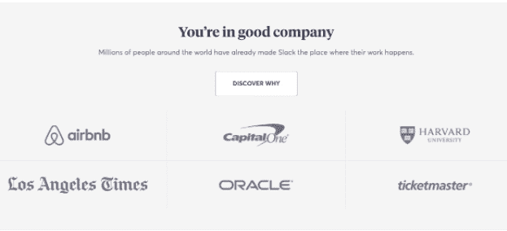

## 结论

感谢你和我们一起深入探索社会证明的世界。我们希望你学到了一些新的策略，可以作为你营销策略的一部分。

回顾一下，这是我们探索的四个社会证明的一般类别:

社会证据的说服力是 Fomo 产品的核心。无论您选择实现本文中的哪种策略，Fomo 都可以提供帮助。

要了解更多信息，请访问 fomo.com。

