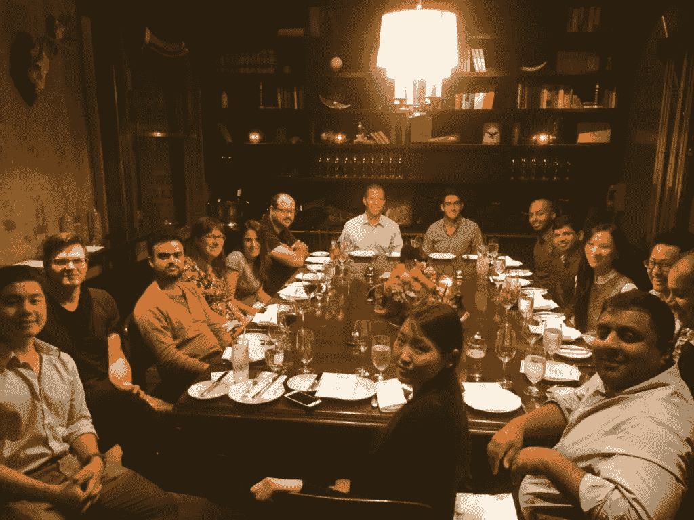
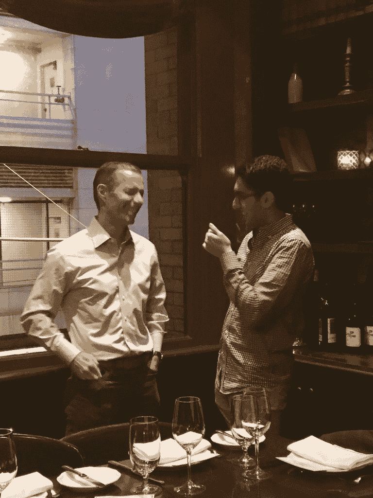

# HashiCorp 创始人阿蒙·达德加尔的 10 大经验——做多

> 原文：<http://goinglongblog.com/top-10-lessons-hashicorp-founder-armon-dadgar/?utm_source=wanqu.co&utm_campaign=Wanqu+Daily&utm_medium=website>

昨天，我有幸采访了 HashiCorp 的联合创始人兼首席技术官阿蒙·达德加尔(Armon Dadgar ),与几位激动人心的创业公司创始人共进晚餐。

在 2014 年首次投资 HashiCorp 的 A 轮融资后，我们 GGV 很高兴看到该公司在两位年轻的联合创始人 Armon 和 Mitchell Hashimoto 的带领下取得了非凡的增长。该公司广受欢迎的开源软件，如 vagger、Consul、Terraform、Nomad 和 Vault，现已在所有主要行业和地区的公司中部署。

在谈话中，艾蒙坦率地分享了哈希公司的历程和他在这一路上学到的经验教训。以下是从对话中总结的十点，将对其他创始人和公司创建者有所帮助。

**1。社区是关键。**

当 Armon 和 Mitchell 开始参与西雅图的 Ops 社区并接触到他们的操作挑战时，HashiCorp 的第一批产品就诞生了。在参加了配置管理社区的聚会后，他们看到了让所有社区成员聚集在一起的巨大力量。

HashiCorp 在过去三年中一直在为 DevOps 社区举办名为“HashiConf”的年度会议，规模从 2015 年的 250 人增长到今年 9 月的 800 多人。

在这些活动中，房间里有令人难以置信的能量，团队从实践者那里得到有价值的反馈。开发者可以从其他开发者那里了解 HashiCorp 的产品；那些可能不确定是否使用 HashiCorp 产品的人会向其他人学习，因为他们听说了其他公司对该公司产品的信任程度，所以经常会改变主意。

“这比我们自己说的任何话都要可信得多，”艾蒙说。“我们将我们的产品带到所有会议。我们希望他们能与用户交流。”

**2。从第一天开始就要弄清楚谁是你的客户。**

一开始，艾蒙和米切尔专注于开发解决方案，并认为他们不必选择谁是他们的客户。"为什么我们不能在任何情况下满足所有人的所有要求？"

但事实证明，了解他们的受众是很重要的。信息、定价和包装都需要为不同的用户群量身定制。该团队进行了大量的自我反省，才明白他们应该专注于企业客户，因为 HashiCorp 的价值主张在于大规模解决问题。例如，HashiCorp 的产品之一 Vault 解决了合规治理的问题——这是只有大公司才有的问题。

回想起来，艾蒙说，他希望自己早点考虑清楚哈希公司的目标客户。不要只是专注于解决问题，试着想想你在为谁解决问题。

**3。适度的天真是有帮助的。**

艾蒙说，一开始，这个团队非常天真。“我们想:为什么我们不能改变人们进行资源调配的方式呢？能有多难？我们甚至没有意识到这个想法有多么大胆。”

这是必要的，因为它引导他们直接投入行动。就像艾蒙说的，如果你把所有的“如果”和“但是”加起来，做所有的失败分析，你永远做不到。

但是天真也导致了很多痛苦:公司不知道谁是他们的客户。那是“被一千张剪纸杀死”

有时闭上双眼会有帮助，但是当你站在悬崖上时闭上双眼并不是最好的。

**4。销售和营销之间存在权衡**

当你是开源的时候，营销是容易的。社区成为你的营销人员。但是当你有来自开源的免费营销时，销售通常是非常困难的，因为没有人愿意为你的产品付费。让一个习惯开源产品的社区开始付费，需要很大的精力。开源是一把双刃剑。

**5。最初的用户增长是一个漫长而缓慢的过程。**

在早期，Mitchell 和 Armon 花了大量的时间在 meetup 小组、网络研讨会和会议上发言，以便为他们的第一个开源产品 vagger 赢得第一批几百个客户。太累人了。正如艾蒙所证明的，“开始一个开源项目真的能让你少活几年。”

随着时间的推移，vacator 被 Chef 员工和公共云社区所采用。然后，它更广泛地传播到配置社区，然后是操作社区，最后是更大的开发社区。这是一个连锁反应。

增长曲线从一条平坦的线开始，然后演变成一条缓慢的线性路径。只是在用户变成福音传播者之后，游民才开始经历指数级增长。HashiCorp 的大多数其他开源产品都经历了相同的增长曲线——一个漫长的渐进增长，然后在某个不可预测的点上出现一个急转弯。

**6。拥有一个地理上分散的团队可能是一个优势，但也需要“过度沟通”**

HashiCorp 的团队从一开始就分散在多个地理位置，所以他们总是对所有事情进行详细记录、存档和索引。一切都存在于他们使用的一个工具中，无论是 Github、Zoom 还是 Slack。这很好地确保了每个人都在同一个页面上，该公司实际上不允许同一产品团队的成员共处一地，因为那样会在真正共享的公共渠道之外发生太多的交流。

虚拟交流的缺点是你失去了情感背景。它需要更多的“过度沟通”，这有时意味着大量的缩放调用。该公司还需要为员工组织更多的身体聚会，以建立团队成员之间的融洽关系。

**7。掌握付费与不付费客户的心理。**

艾蒙说开源社区有很高的期望——你不会因为开源是免费的就获得免费通行证。例如，非付费用户希望 HashiCorp 全天候提供客户服务。“我们意识到，我们面对的是一个敏感的群体，需要培养和倾听，”他说。

当该公司推出商业产品时，该团队也认识到人们对损失有着特别强烈的厌恶，所以他们不能从用户那里拿走任何免费的开源功能。艾蒙和米切尔需要弄清楚，尽管给了用户这么多免费的东西，他们如何收费。

从产品库开始，艾蒙说他们意识到某些功能只有受法规约束且财力雄厚的小部分客户才需要。因此，他们创建了一个特殊的企业版，并对这些功能进行收费。

“当你从免费到 99 美分时，心理上有一个惊人的转变，”艾蒙说。“只要它不是免费的，人们就会突然对你的产品抱有很多期望。”

**8。你对复杂开源软件的企业版收费是合理的。**

HashiCorp 的早期客户之一是一家大型金融服务公司。当团队第一次试图向这家金融服务巨头推销开源支持时，该公司表示，其政策是不为开源产品付费。“我们告诉他们，我们的政策是不支持非付费客户，”艾蒙说。

金融服务公司大吃一惊。但是一个简单的开源项目和一个复杂的开源项目是有区别的，前者任何程序员都可以在几分钟内完成，后者你可以在上面运行一个银行。HashiCorp 预计将在企业版中增加功能并解决性能问题。“这花了一段时间，但最终很明显，他们应该支付我们，”艾蒙回忆说。

**9。如果你想做活动，雇一个全职的活动人员。**

人们总是倾向于低估举办一场活动所花费的时间和精力。起初艾蒙和米切尔认为他们可以在业余时间自己组织一个 HashiConf。“我们的活动顾问给了我们一份需要做的事情的清单，实际上有一千多项。”他们很快意识到他们需要一个专注于活动的全职员工，HashiCorp 现在有一个 3 人活动团队。

10。不要试图雇佣一个超人。针对特定优势进行招聘。

当公司显然需要高级人才时，艾蒙和米切尔起初想要一个“无所不能”的人——并很快意识到这样的人并不存在。每一个招聘决定都涉及权衡。

“所以我们问自己:如果这个人必须有一种超能力，那会是什么？财务、营销还是销售？”他们得出结论，营销人员是最合适的人选。

最终，两位联合创始人让 HortonWorks 的前 CMO 戴夫·麦克詹尼特(Dave McJannet，前 VMware 高级营销总监和 GitHub 营销副总裁)担任首席执行官。

艾蒙说，雇佣首席执行官的过程是他一生中压力最大的时期。我记得当时接到他一个紧张的电话。我告诉他，不管发生什么，HashiCorp 永远是他和 Mitchell 的公司。聘请首席执行官并不是每个创始人的正确决定，但我认为艾蒙和米切尔做出了勇敢的决定，带着聘请首席执行官的想法来到董事会。时间会证明他们做的是正确的，因为雇用戴夫使艾蒙和米切尔能够专注于产品、路线图和社区，这对哈希公司未来的成功至关重要。

(编译:扎拉·张)

