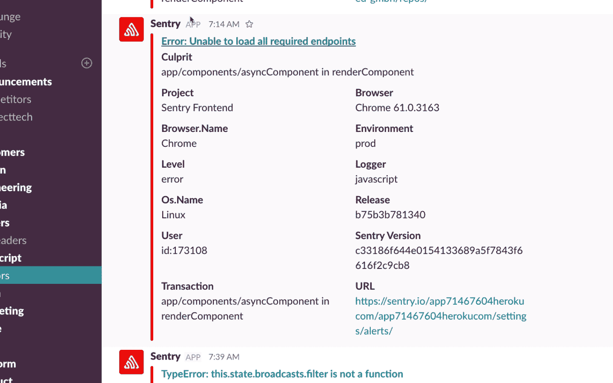
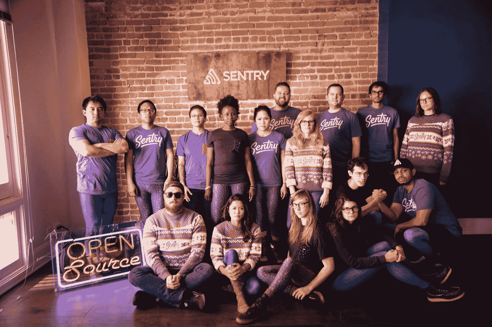

# Sentry 如何每月接收 200 亿个事件，同时准备处理两倍的事件- Sentry 技术堆栈

> 原文：<https://stackshare.io/sentry/how-sentry-receives-20-billion-events-per-month-while-preparing-to-handle-twice-that?utm_source=wanqu.co&utm_campaign=Wanqu+Daily&utm_medium=website>

*由[詹姆斯·坎宁安](https://github.com/jtcunning)，操作工程师，[哨兵](/sentry)。*

* * *

## 关于哨兵

除非你的工程团队是由每天早上从天堂到办公室的天使组成的，否则我们非常确信你在生产中开发和迭代你的应用程序时会遇到很多问题。 [Sentry](https://sentry.io) 提供所有您需要的工具，在您的用户意识到有问题之前，找到、分类、重现和修复应用程序级问题。额外的好处是，在欢乐时光，你不会再受到支持工程师的白眼。

通过自动化错误检测、聚合和向堆栈跟踪添加重要上下文，Sentry 可帮助您更高效、更持久地主动纠正对您的业务造成最大损害的错误，并将中断降至最低。缩小产品团队和客户之间的差距可以提高生产率，加快整个开发过程，并帮助工程师专注于他们最擅长的事情:构建让用户生活更美好的应用。

在我成为雇员之前，我个人就是一名哨兵。在我之前的公司，我的任务是升级开源错误跟踪服务，这个服务已经有一段时间没有真正维护或使用了。我寻求帮助，并收到了大卫(Sentry 的联合创始人)和马特(Sentry 的第二工程师)的回复，在我还没有见到他们的脸的几年前，我就在 IRC 上见到了我未来的两位同事(protip: [在 LinkedIn 上与马特](https://www.linkedin.com/in/mattrobenolt/)联系)。

**这是马特**

他们非常有帮助，当我去找新工作时，我想，“嘿，这是一个非常好的软件，运行它的人真的很关心他们的社区。我很乐意成为其中的一员。”今天，我在醒着的时候开心地让 Sentry 的托管服务保持运行、可用，并对我们呈指数增长的事件量做出响应(*编者注:当他没有在 Slack 上钓新员工来品尝嘻哈音乐和水果喷壶*)。

#### 强大的副业项目

Sentry 最初是(现在仍然是)一个开源项目，由 David 在 2008 年开发的错误日志记录工具发展而来。即使在那时，他也展示了一个真正精明的品牌概念，给这个项目起了一个吸引人的名字，至今仍为世界各地的公司所嫉妒: *django-db-log* 。很长一段时间，哨兵在 GitHub 上的副标题[是“一个简单的 Django 应用程序，用爱构建。”稍微准确一点的描述可能包括《星际争霸》和《联盟》以及《爱》；无论如何，这抓住了哨兵是怎么回事。](https://github.com/getsentry/sentry)

九年前的那个原始构建是 [Django](/django) 和[芹菜](/celery) (Python 的异步任务代码库)，以 [Postgres](/postgresql) 为数据库，以 [Redis](/redis) 为芹菜背后的动力。

#### 快速发展的公司

如你所料，在过去的十年里，哨兵的使用呈指数级增长，基础设施也发生了变化，变得更加成熟，可以适应大规模的应用。我们现在将开源项目作为 SaaS 的产品。Sentry 拥有几乎所有框架、平台和语言的 SDK，并与最流行的开发工具集成，这有助于使其非常容易采用。如今，Sentry 是全球数万家组织和超过 100，000 名活跃用户的错误跟踪和解决工作流的核心，其中许多人支持互联网上一些最大的属性的实现:Dropbox、优步、Stripe、Airbnb、Xbox Live、HubSpot 等等。仅托管服务一项，每周就有**50 亿**的活动。

当客户向 Sentry 发送事件时，他们不会收到一系列通知，他们会收到一系列问题，包括事件发生的频率以及哪些用户遇到了问题。在 Sentry 中，这些都非常简单明了地呈现出来，但是如果用户想要单独的事件，我们也会提供。我们保存我们接受的每一个事件，这在传统的关系数据库中是非常昂贵的。

Sentry 解决可伸缩性的第一个改进是将所有这些事件存储在分布式键值存储中。有各种各样的键值存储，都有它们的承诺和缺陷，但是在评估解决方案时，我们最终选择了 [Riak](/riak) 。我们的 Riak 集群做了我们希望它做的事情:将事件数据写入多个位置，根据请求增加或减少大小，并在正常的故障场景中持续存在。

加入 Sentry 时，我参与的第一个主要基础设施项目是横向扩展我们执行离线任务的能力。随着 Sentry 全天运行，我们执行大约 50 个不同的离线任务——从“请处理这个事件”到“给所有这些酷人发一些电子邮件”有些我们一天执行一次，有些每秒执行数千次。

管理这种多样性需要可靠的高吞吐量消息传递技术。我们使用 Celery 的 [RabbitMQ](/rabbitmq) 实现，我们偶然发现了一个名为[联邦](https://www.rabbitmq.com/federation.html)的伟大特性，它允许我们在任意数量的 RabbitMQ 服务器上划分我们的任务队列，并让我们相信，如果任何一个服务器出现积压，其他服务器将会参与进来，并将一些积压的任务分配给它们的消费者。

我们经历的另一个项目是在我们的应用程序前设置安全措施，以防止不可预测和不想要的流量。当接受事件时，我们会疯狂地将 Python web 过程暴露给公共互联网，并说，“好吧，把你所有的都给我！”相反，我们使用两种不同的代理服务，它们位于我们的 web 机器前面:

*   我们的产品感知代理 NGINX 处理许多我们认为合理的上限。它负责各种界限，但它最受欢迎的一个是保护 Sentry 免受过大事件量的影响。用户经常会遇到这样的问题:他们将代码部署到了深渊中，而他们的事件量比他们注册时高了几个零。
*   -在 NGINX 之前，我们使用另一个名为 [HAProxy](/haproxy) 的代理服务，它充当连接的 delta，没有任何产品感知逻辑，并且具有更高的吞吐量。它所做的就是接受连接，并把它们发送到不同的 NGINX 服务器，允许我们在合适的时候添加或删除 NGINX 服务器。

## 不断发展的建筑

Sentry 最初是一个传统的 Django 应用程序，此后经历了几次架构迭代。目前的 Sentry 仪表板是客户用来浏览和调试他们的生产问题的，已经发展成为用 [React](/react) 和 [Reflux](/refluxjs) (一个早期的 flux 库)编写的单页应用程序。我们使用 [Babel](/babel) 和 [Webpack](/webpack) 编写 [ES6](/es6) 并转换成 [JavaScript](/javascript) 。为了获取和提交数据，我们通过一个简单的基于 REST 的 HTTP API 与 Django 后端进行通信。

事件处理管道主要是用 [Python](/python) 编写的，它负责处理所有接收到的事件数据，这些数据将传递给我们的离线任务处理。对于特别密集的代码路径，比如我们的源地图处理管道，[我们已经开始在 Rust](https://blog.sentry.io/2016/10/19/fixing-python-performance-with-rust.html) 中重写那些位。 [Rust 的](/rust)没有垃圾收集，这使得它成为嵌入 Python 的一种特别方便的语言。它允许我们轻松地构建一个 Python 扩展，其中所有的内存都是从 Python 端管理的(如果 Python 包装器被 Python GC 收集了，我们也清理了 Rust 对象。)

## 简单的部署工作流程

在很大程度上，Sentry 仍然是一个经典的单一应用程序。这在一定程度上是因为 Sentry 仍然是开源的，我们希望让我们的社区能够轻松安装和运行服务器。为了做到这一点，我们为 Docker 映像提供了[安装细节，该映像在一个地方包含了 Sentry 的所有核心服务。这种独一无二的性质使得贡献和部署哨兵相对简单。](https://docs.sentry.io/server/installation/docker/)

当有人想要提交对代码库的更改时，它会作为 pull 请求提交给我们在 [GitHub](/github) 上的公共项目。从那里， [Travis CI](/travis-ci) 运行一组并行构建，其中不仅包括单元和集成测试，还包括通过 [Percy](/percy) 管理的可视化回归测试。由于我们仍然是一个支持不同关系数据库的开源项目，我们不仅为 Postgres 运行测试套件，还为 MySQL 和 SQLite 运行测试套件。

一旦所有测试都是绿色的，代码已经被审查，并且任何检测到的 UI 更改已经被批准，代码就通过 GitHub 被合并。然后，我们使用一个名为 [Freight](https://github.com/getsentry/freight) 的内部开源工具来构建我们的 [Docker](/docker) 映像并将其部署到生产中。此外，运费注入了 Sentry 唯一的封闭源代码，即我们的计费平台。一旦映像投入生产，我们就触发每个 Sentry 容器的滚动重启来获取新映像。

## 不可预测的世界

我们最大的挑战之一是 Sentry 的流量天生不可预测，根本没有办法预见用户的应用程序何时会崩溃并向我们发送大量事件。在裸机上，我们通过为最坏的情况(ish)做准备和在事件泛滥的情况下过度配置机器来处理这个问题。不幸的是，随着需求的增长，我们需要新机器的时间窗口缩小了。我们开始向我们的提供商提出更多要求，在需要之前就请求机器，并让普通机器连续几天闲置，等待查看哪个组件最需要它。

出于这个原因，我们在 2017 年 7 月飞跃到[谷歌云平台](/google-compute-engine) (GCP)，给我们自己更大的灵活性。称之为“飞跃”听起来很冲动，但这一转变实际上花了几个月的计划。无论我们花多长时间预测 Google Compute Engine 中的资源使用情况，我们都无法预测我们增加的吞吐量。由于 GCP 的默认微体系结构 Haswell，我们注意到我们的 CPU 密集型工作负载(即源地图处理)的性能立即提高。运营团队在接下来的几周内对我们的基础架构进行了保守的缩减，但仍设法将我们的成本削减了大约 20%。没有花哨的云技术，没有庞大的基础设施建设——只有更擅长数学的新石头。

你可以在谷歌云平台博客上找到更多关于它的细节。

## 可观察性和行动

我们能够支持 Sentry 的一个重要原因是，它属于需要大量资源的可观察性工具。我们自己放哨，因为我们已经很擅长了。我们依靠 Sentry 来跟踪生产应用程序中的错误，并根据用户体验和影响帮助我们设置迭代的优先级。

但当涉及到我们监控堆栈的其余部分时，我们应用与每天注册 Sentry 托管服务的用户相同的思维:“以美元支付正常运行时间比以工程时间支付更好。”(如果你没有使用过 [Sentry 的托管服务](https://sentry.io/signup/)，只需要几分钟和几行代码就可以设置好。)

我们在生产环境之外使用一些工具链。我可以写一篇文章详细介绍每一个问题(我可能会这样做)，但是让我们概述一下我将如何得到通知，我们已经倒退到了 95%的请求延迟:

*   运行 web 服务器的每个主机将请求的时间发送给条带的 [Veneur](/veneur)
*   Veneur 创建请求计时的直方图，并将这些直方图转发给[数据狗](/datadog)
*   一个[数据狗阈值警报](https://docs.datadoghq.com/guides/monitors/)检测到我们已经超过 500 毫秒
*   阈值警报被配置为通知[松弛](/slack)通道和[页面负载](/pagerduty)旋转
*   传呼机值班轮流通知当前待命的两个操作工程师

**我们向每位新员工介绍他们自己的欢迎礼物**

## 出色的同事

我们的工程组织分为两个项目的四个团队:产品和基础设施。他们的名字很好地描述了他们的目的，但是:

*   产品分为工作流程和成长团队。工作流特别关注我们的用户在他们自己的工作流和开发过程中如何与 Sentry 交互。Growth 着眼于我们可以做出的调整，这将增加新用户发现 Sentry 相关的可能性，有效地使用它，并坚持使用它越来越多。

*   基础架构分为平台和运营团队。平台专用于支持我们的 API 的所有 Sentry 代码，包括事件摄取。我住在运营部，我们致力于构建、部署、维护和监控保持 sentry.io 稳定的所有组件。

我们还有一个非官方的第五团队，它在 Sentry 的开发中发挥了很大的作用，并且总是超过其他人:我们的开源贡献者。Sentry 的整个代码库就在 GitHub 上，全世界都可以看到，我们服务的许多改进都是由不在这里工作的用户和社区成员介绍的。

## 其他堆栈

正如 Sentry 是许多软件团队堆栈的一部分一样，我们也依赖许多额外的商业和开源服务来帮助运营我们的业务。我们使用 [Stripe](/stripe) 处理客户账单，使用 [SendGrid](/sendgrid) 进行可靠的电子邮件交付，使用 [Slack](/slack) 进行团队沟通，使用 [Google Analytics](/google-analytics) 进行基本的 web 分析，使用 [BigQuery](/google-bigquery) 进行数据仓库，使用[吉拉](/jira)进行项目管理。

在开源方面，我们的增长和 BI 团队使用 [Redash](/re-dash) 从我们的数据中获得有用的统计数据。我们使用[杰基尔](/jekyll)发布[哨兵. io](https://sentry.io) 和其他在线营销内容，比如我们的[博客](https://blog.sentry.io)。

## 关闭

开源，开放公司。这是我们的信条，它真正抓住了我们的全部。正如我前面提到的，我申请了 Sentry 的一份工作，因为这是一个非常好的软件，而且管理公司的人很注意社区的作用。由于在这里工作的每个人都是开源社区的成员，这种正念延伸到了员工之间。

这里的增长是不可避免的。艰难的决定不是扩大什么规模，而是何时扩大。运营团队有责任将工程时间投入到正确的计划中，并在安全性、可靠性和生产效率之间取得平衡。也许你想为我的团队做一些艰难的决定？

或者也许运营不是你的事，但你想建立一些开源的东西。想为 Sentry 做贡献而不仅仅是代码吗？我们几乎在整个组织内招聘,如果你已经阅读了整篇文章，并认为你可能和我一样是哨兵，我们很乐意和你谈谈。