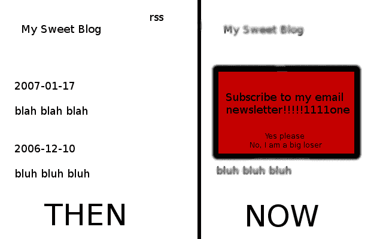

# RSS:没有比这更好的了

> 原文：<https://davidyat.es/2017/05/18/rss-nothing-better/?utm_source=wanqu.co&utm_campaign=Wanqu+Daily&utm_medium=website>

**“一个 RSS 源？那太 2007 了！”**

“好吧，那你有什么建议？”

“如今，每个人都通过他们的脸书订阅获取最新消息！做个脸书页面就行了！”

“听起来很棒！然后，在扎克伯格选择更多地根据新闻而不是朋友的照片来衡量算法的几周内，我的一半订户将会看到我一半的更新。此外，每个人都必须有一个脸书帐户。"

是的，好的，我明白了。无论如何，Twitter 更好:它完全公开，不强迫人们登录才能看到订阅源，而且它的订阅源不受算法操纵。”

“精彩！有了 Twitter，人们可以随时更新夹杂着猫咪照片、偷来的笑话、转发的笑话和名人的政治观点！多个网站的订阅者可以享受用户友好性，将它们全部融合在一起，或者不得不费力地访问每个商店的页面，以查看他们在细枝末节中错过的新更新！"

“任何想这么做的人都可以使用 Twitter 列表！”

“只要 Twitter 没有用一种令人兴奋的新的和不同的方式来隐藏这一功能，来测试他们的网站/应用程序。”

“我想是吧。”

“Twitter 是一个辅助的推广媒介，但我不想让它成为我的主要发布平台。这就好比杂志订阅是通过藏在垃圾邮件里的方式来投递的。”

**“嘿！我有一个主意，让我们去老学校。”**

“是的，终于！”

“让我们制作一份电子邮件简讯吧！我们可以让人们注册一个模态弹出窗口！你知道，他们真的能提高参与度！”

"这意味着世界上的垃圾邮件还不够多."

“但是会有用的！每个人都有电子邮件，现在大多数人在收到电子邮件时甚至会在他们的设备上收到实时通知！更新是不可能被算法操纵的，因为没有算法，而且有了电子邮件，更新不会在噪音中丢失！”

“东西不会在噪音中丢失吧？我想要你的收件箱。不管怎样，这个解决方案比 Twitter 或脸书好不了多少。人们会因为各种原因收到很多邮件。我的收件箱里大部分都是毫无价值的营销垃圾邮件，惩罚我忘记取消选中藏在注册表底部的一些“我想接收关于这项服务的更新”复选框。如果没有我懒得设置的大量邮件规则，电子邮件简讯——即使是我重视的邮件简讯——也会在我阅读之前完全丢失。”

**“该死。要是有一个系统能让你跟踪你关心的博客和网站的更新，确保你不会错过任何更新，一眼就能发现新的更新，而不必费力地通过大量的噪音来这样做就好了。…嘿，这对创业公司来说是个好主意！”**

“我想你会发现已经有人做过了。”

**“真的吗？谁干的。你怎么不早点提这个？”**

“这是一个非常酷的开放标准，叫做 Really Simple Syndication，简称 RSS。它已经集成到主要的博客平台，如 Wordpress 和 Blogger，以及大多数静态网站生成器中，并且得到了所有在过去几年中没有完全改造过网站的主要新闻网站的支持。为了在自己的站点中支持它，您所要做的就是生成一个符合[简单模式](http://cyber.harvard.edu/rss/rss.html)的最近帖子的 XML 文档。

“尽管谷歌阅读器不合时宜地消亡了，但个人仍然可以使用各种各样灵活的现代云应用程序来跟踪、监控和聚合 RSS 订阅源，这些应用程序包括[in Reader](https://www.inoreader.com/)、 [Feedly](https://feedly.com) 和[The Old Reader](https://theoldreader.com/)——所有这些都允许你以强大的方式聚合订阅源，而不会错过更新。

“编写代码或使用像[这样的服务也是小事一桩，如果这样，那么](https://ifttt.com/)就可以用新内容自动更新像脸书和推特这样的东西。因为 RSS 是一个简单、开放的标准，它不会突然关闭或倒闭并立即停止存在。”

**“但是，但是，XML 太恶心了！RSS 死了！2007!"**

“是的，这项技术已经过时了，但它仍然是我们所做的最好的技术，并且不封闭源代码，也不依附于某个硅谷公司。它仍然有效，得到了广泛的支持，并且比后来出现的任何替代方案都做得更好。有时候，更新并不是更好。有时候问题已经解决了。任何博客或新闻网站都不应该太新或太小而不支持 RSS。”

十年的进步

如果你还没有，你可以使用 RSS 订阅这个博客。

* * *

# 后记(2017-11-14)

这篇文章[登上了 2017-11-11](https://news.ycombinator.com/item?id=15675582) 的黑客新闻头条，并引发了不少讨论。我想谈谈在那里和其他地方反复提出的几个问题:

**RSS/Atom 之争。**当我说 RSS 时，我指的是 RSS 或 Atom feeds 它们非常相似。这个网站使用 Atom 提要而不是 RSS 提要。我喜欢使用术语 RSS，因为人们会立即知道这是真正简单的聚合，而一个题为“Atom:没有比这更好的了”的帖子会吸引一大堆人的评论，“哈哈，我还以为你指的是 [Github 文本编辑器](https://atom.io/)！”(加上几个被否决的反电子刮板)。Atom 可能是高级规格，但它绝对是[的低级名称](https://en.wikipedia.org/wiki/Atom_(disambiguation))。

**JSON feed 怎么样？**我粗略地了解了一下 [jsonfeed](https://jsonfeed.org/) ，但我不认为它比 RSS/Atom 好到值得转而使用。作为一个非常新的标准，它也没有像 RSS/Atom 那样得到广泛的支持。我也不认为 JSON 是处理大量复杂正文的好格式——转义变得很糟糕。

