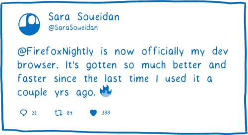
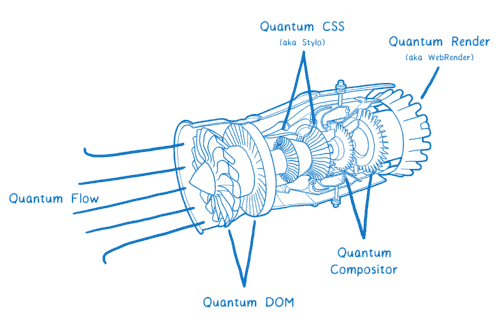
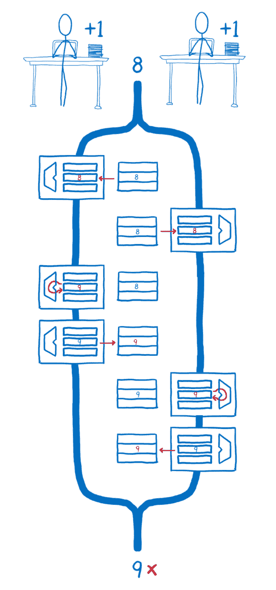
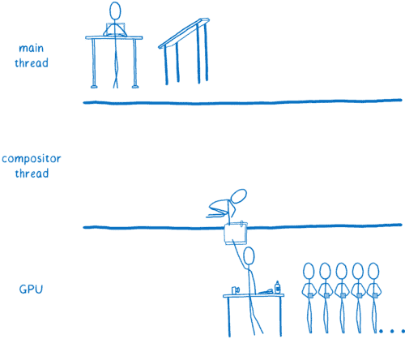
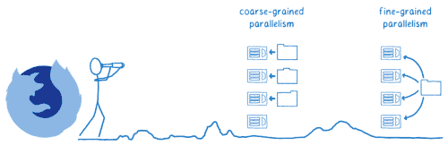
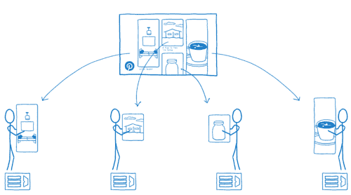
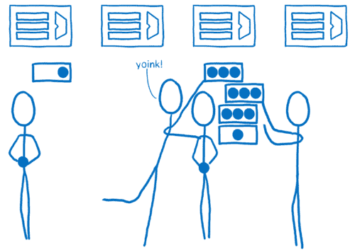
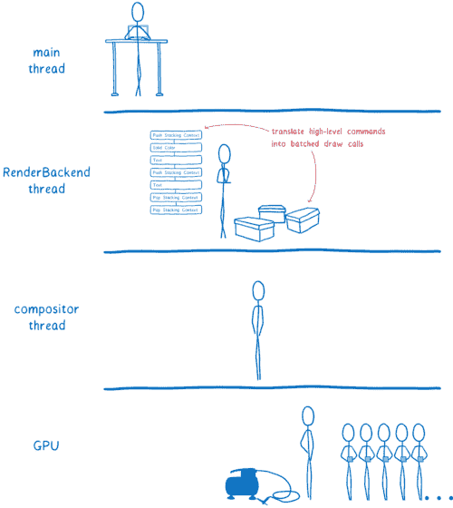

# 进入量子时代 Firefox 如何再次变得更快，它将在哪里变得更快——Mozilla Hacks——网络开发者博客

> 原文：<https://hacks.mozilla.org/2017/11/entering-the-quantum-era-how-firefox-got-fast-again-and-where-its-going-to-get-faster/?utm_source=wanqu.co&utm_campaign=Wanqu+Daily&utm_medium=website>

人们注意到火狐又快了。

[T2】](https://hacks.mozilla.org/files/2017/11/tweet3.png)

在过去的七个月里，我们一直在快速更换引擎的主要部件，将 Rust 和部分伺服系统引入 Firefox。另外，我们有一支浏览器性能突击队在代码库中搜索性能问题，有明显的也有不明显的。

我们称这个项目为 Quantum，重生的 Firefox Quantum 的第一个通用版本将于明天发布。

[T2】](https://hacks.mozilla.org/files/2017/11/engine01.png)

但这并不意味着我们的工作已经完成。这并不意味着今天的 Firefox 已经达到了它未来的速度和响应速度。

所以，让我们看看 Firefox 是如何变得更快的，以及它将在哪里变得更快。

### 用粗粒度并行奠定基础

为了获得更快的速度，我们需要利用硬件在过去 10 年中的变化。

我们不是第一个这样做的人。Chrome 刚推出时比 Firefox 更快，反应更灵敏。原因之一是 Chrome 工程师看到硬件正在发生变化，他们开始更好地利用新硬件。

[T2】](https://hacks.mozilla.org/files/2017/11/scope02.png)

一种新型的中央处理器开始流行。这些 CPU 拥有多个内核，这意味着它们可以彼此独立地执行任务，但同时也是并行的。

不过这可能有点棘手。使用并行性，您可以引入难以发现和调试的细微错误。例如，如果两个内核需要在内存中为同一个数字加 1，如果不特别小心，一个很可能会覆盖另一个。

[T2】](https://hacks.mozilla.org/files/2017/11/race_condition_atomic18.png)

避免这类错误的一个非常简单的方法就是确保你正在做的两件事不需要共享内存——把你的程序分成不需要太多合作的大任务。这就是粗粒度并行。

在浏览器中，很容易找到这些粗粮。让每个标签作为它自己独立的一部分工作。还有网页周围的东西——浏览器 chrome——也可以单独处理。

这样，页面可以以各自的速度同时工作，而不会互相阻塞。如果您在后台标签中有一个长时间运行的脚本，它不会阻止前台标签中的工作。

这是 Chrome 工程师预见到的机会。我们也看到了，但是我们有一条更崎岖的路要走。由于我们有一个现有的代码库，我们需要计划如何分割代码库，以利用多个内核。

[T2】](https://hacks.mozilla.org/files/2017/11/scope04.png)

花了点时间，但我们还是到了。在电解项目中，我们最终让多重处理成为所有用户的默认设置。Quantum 在其他一些项目中更好地利用了粗粒度并行。

[T2】](https://hacks.mozilla.org/files/2017/11/graphs-draft01.png)

#### 电解

电解为量子工程奠定了基础。它引入了一种类似 Chrome 的多进程架构。因为这是一个如此大的变化，我们慢慢地引入了它，从 2016 年开始在小群体用户中进行测试，然后在 2017 年年中向所有 Firefox 用户推出。

#### 量子合成器

[T2】](https://hacks.mozilla.org/files/2017/11/16.png)

Quantum Compositor 将合成器移动到自己的进程中。最大的胜利是它使火狐更加稳定。拥有一个独立的进程意味着如果图形驱动崩溃了，也不会让整个 Firefox 崩溃。但是拥有这种独立的进程也使得 Firefox 的响应速度更快。

#### 量子 DOM

即使您在内核之间分割内容窗口，并为每个内核分配一个单独的主线程，主线程仍需要完成大量任务。其中一些比另一些更重要。例如，响应按键比运行垃圾收集更重要。Quantum DOM 为我们提供了一种区分这些任务优先级的方法。这使得 Firefox 的响应速度更快。这项工作的大部分已经完成，但我们仍然计划通过一种叫做先发制人的调度来进一步推进这项工作。

### 通过细粒度并行充分利用硬件

然而，当我们展望未来时，我们需要超越粗粒度并行。

[T2】](https://hacks.mozilla.org/files/2017/11/scope05.png)

粗粒度并行更好地利用了硬件…但它没有充分利用硬件。当你把这些网页分割成不同的内核时，其中一些就没有工作可做了。因此，这些核心将处于闲置状态。与此同时，在新内核上启动一个新页面所花费的时间与 CPU 是单核处理器的时间一样长。

[T2】](https://hacks.mozilla.org/files/2017/11/core_splitting06.png)

如果能够在加载新页面时使用所有这些内核来处理它，那就太好了。那么你可以更快地完成工作。

但是使用粗粒度并行，您不能将任何工作从一个内核拆分到其他内核。工作之间没有界限。

借助细粒度并行，您可以将这个较大的任务分解成较小的单元，然后发送到不同的内核。例如，如果您有类似 Pinterest 网站的东西，您可以将不同的固定项目分开，并将其发送给不同的核心进行处理。

[T2】](https://hacks.mozilla.org/files/2017/11/core_splitting_fine03.png)

这不只是像粗粒度并行那样有助于延迟。这也有助于纯速度。页面加载速度更快，因为工作分散在所有内核上。随着您添加更多内核，您添加的内核越多，页面加载速度也越快。

所以我们看到这是未来，但还不完全清楚如何到达那里。因为要快速实现这种细粒度并行，通常需要在内核之间共享内存。但是这给了你我在 T1 之前谈到的那些数据竞争。

但是我们知道浏览器必须做出这种转变，所以我们开始投资研究。我们创造了一种没有这些数据竞争的语言——Rust。然后我们创建了一个浏览器引擎——Servo——它充分利用了这种细粒度的并行性。通过这一点，我们证明了这是可行的，你可以在运行更快的同时减少错误。

[T2】](https://hacks.mozilla.org/files/2017/11/graphs-draft02.png)

#### 量子 CSS(又名 Stylo)

[T2】](https://hacks.mozilla.org/files/2017/08/18.png)

借助 [Stylo](https://hacks.mozilla.org/2017/08/inside-a-super-fast-css-engine-quantum-css-aka-stylo/) ，CSS 样式的计算工作在所有 CPU 内核上完全并行化。Stylo 使用一种称为工作窃取的技术来有效地在内核之间划分工作，以便它们都保持忙碌。有了这个，你会得到一个线性加速。你用你拥有的内核数来划分 CSS 样式计算的时间。

#### 量子渲染(以 WebRender 为特色)

[T2】](https://hacks.mozilla.org/files/2017/10/32.png)

另一部分高度并行化的硬件是 GPU。它有成百上千个内核。但是，您必须做大量的规划，以确保这些内核尽可能地保持忙碌。这就是 WebRender 做的事情。

WebRender 将于 2018 年登陆，并将利用现代 GPU。同时，我们也从另一个角度探讨了这个问题。高级图层项目修改了 Firefox 现有的图层系统，以支持批量渲染。它通过优化 Firefox 当前的 GPU 使用模式为我们带来了立竿见影的效果。

#### ？？？

我们认为渲染管道的其他部分也可以从这种细粒度的并行性中受益。在接下来的几个月里，我们将进一步研究这些技术的其他用途。

### 确保我们继续变得更快，永远不再变慢

除了这些我们知道必须要做的主要架构更改之外，一些性能错误也在我们不注意的时候溜进了代码库。

因此，我们创建了 Quantum 的另一部分来解决这个问题…基本上是一个浏览器性能打击力量，它将发现这些问题并动员团队来解决它们。

[T2】](https://hacks.mozilla.org/files/2017/11/graphs-draft03.png)

#### 量子流

量子流团队就是这支突击队。他们没有关注特定子系统的整体性能，而是专注于一些非常具体、重要的用例——例如，加载你的社交媒体订阅——并跨团队工作，以找出为什么 Firefox 的响应速度比其他浏览器慢。

量子流给我们带来了许多重大的性能胜利。在此过程中，我们还开发了工具和流程，使发现和跟踪此类问题变得更加容易。

那么现在量子流会怎么样呢？

我们正在采用这一如此成功的流程——一次识别并专注于一个关键用例——并将其转变为我们工作流程的一个常规部分。为了做到这一点，我们正在改进我们的工具，这样我们就不需要一支专家突击队来搜索问题，而是可以让整个组织中的更多工程师找到问题。

但是这种方法有一个问题。当我们优化一个用例时，我们可能会优化另一个用例。为了防止这种情况，我们增加了许多新的跟踪功能，包括对 CI 自动化运行性能测试的改进，跟踪用户体验的遥测技术，以及缺陷内部的回归管理。有了这个，我们期待火狐 Quantum 继续变得更好。

### 明天只是开始

明天对我们 Mozilla 来说是个大日子。在过去的一年里，我们一直在努力让火狐变得更快。但这也只是开始。

在接下来的一年里，我们将不断提供新的性能改进。我们期待与您分享它们！

试试 Firefox Quantum 的版本或[开发者版](https://www.mozilla.org/firefox/developer/)，确保你得到最新的更新。

