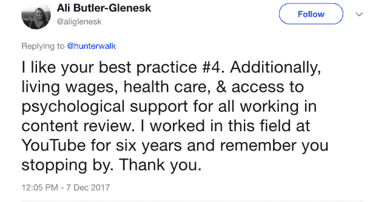

# 互联网内容审核 101 |猎人漫步

> 原文：<https://hunterwalk.com/2017/12/05/internet-content-moderation-101/?utm_source=wanqu.co&utm_campaign=Wanqu+Daily&utm_medium=website>

由于脸书、Twitter 和 YouTube 都(在不同程度上)强烈要求增加其内容审核团队的人力资源，这里有一些关于这些系统通常如何工作的事情需要了解。这大部分是基于我在 YouTube 的时间(大约五年前结束，所以这里没有什么应该被认为是对当前运营的明确陈述)，但我发现我们的同行公司采取了类似的方法。请注意，我将重点关注用户生成/共享的内容，而不是广告政策。广告通常都有自己独立的标准。这更多是关于普通用户会创建、上传和发布的文本、图像和视频/音频。

<noscript>T3】</noscript>

**什么是内容审核**

内容审核是一个术语，适用于用户在社交平台上上传、发布或分享的内容(文本、图像、音频、视频)。它不同于广告或社论(例如，如果一个组织中存在这样的功能，则在网站上找到内容进行宣传/推广)，后者通常有单独的团队和审查内容的指导方针。

大多数内容审核团队的目标是执行产品的社区标准或服务条款，这些标准或条款规定了什么可以在平台上共享，什么不可以共享。正如您可能猜到的那样，所有这些都有黑白和灰色区域，这意味着对于人类评审员有指导方针、培训和升级政策。

**人类何时参与到这个过程中**

人类很少(也不希望)审查一个网站上分享的所有内容，以及(b)审查发布前的内容——也就是说，当用户试图分享一些东西时，在它在网站/应用程序上发布之前得到人类的“批准”。

相反，公司依赖内容审查算法来完成大量繁重的工作。这些算法试图“理解”正在创建和共享的内容。在创建时，信号是有限的——谁上传了它(账户历史或缺乏历史)，从哪里上传，内容本身和其他元数据。随着内容存在于产品中，获得了更多的数据——谁在消费它，它是否被用户标记，它是否被用户共享等等。

这些更丰富的信号会影响算法，继续调整其关于某个内容是否适合该网站的结论。这些系统中的大多数都有用户标记工具，这些工具在内容是否应该被提升以供审查的算法评分中起着重要作用。

更广泛地说，你可以认为一个内容在任何时候都是绿色、黄色或红色的。绿色表示算法认为它可以存在于网站上。黄色表示有问题。红色表示它不应该出现在网站上。这些名称都是可变的，并不完美。一直都有假阳性和假阴性。

将内容策略的有效性仅仅视为技术的质量是不完整的。这实际上是一个由人决定的政策问题，并在代码级别执行。管理层需要设定绿色、黄色和红色之间的界限。它们决定未知的新用户是否应该默认为可信。他们总结了如何优先考虑绿色、黄色或红色桶中的项目的人工审查。这也是人类发挥作用的地方…

什么是审核队列？

人类评论者帮助为算法创建训练集，但他们的主要功能是不断为算法为他们提供的内容的评论队列配备人员。队列通常根据审查的优先级(如紧急、24-7 实时审查)以及审查者的特征(接受过不同类型的内容审查培训、会说不同的语言等)分为不同的类别。这是一个复杂的工厂式系统，内置了许多逻辑。

进入平台的内容量和触发人工审核所需的算法阈值会影响进入审核队列的内容量。审查人员的数量、他们的培训/素质以及他们使用的工具的有效性是影响内容审查速度的因素。

因此，基本上当您听到“增加 10，000 名人工审核者”时，可能是(a)更多的内容将被审核[阈值正在改变，以将更多的内容放入审核队列]和/或(b)审核队列内容将被更快地审核[相同的内容，但更多的人将被审核]。

这些公司真的关心这些东西吗

诚实的回答是肯定的，但是…

是的，但是内容运营通常是一个成本中心，而不是收入中心，因此它需要管理成本，而且可能会缺乏资源。

是的，但内容运营有时可以被认为是产品经理、设计师和工程师的“初学者”工作，因此它变得更年轻，影响力更小，通常在 1-2 年后轮换到新项目。

是的，但是高层领导和团队缺乏多样性和不当的激励会导致低估平台上“坏”内容的真实成本(对品牌、用户体验)。

**为什么直截了当的色情内容最容易审查……但是为什么“性”内容很难审查**

因为有比推特、脸书和 YouTube 更好的地方来分享色情内容。因为算法真的很擅长检测裸体。然而，为性满足而创作的内容，如果没有明确涉及裸体，对平台来说就更难了。我写过创建 YouTube 的恋物癖视频政策吗？这是一个有趣的讨论…

我有哪些“最佳实践”供管理层考虑？

1.  让它成为仪表板级别的指标——如果首席执行官和她的团队将内容安全指标与使用情况、收入等放在一起考虑，这将证明它是重要的，它的人员配备将更加合适。
2.  不要说百分比——这些巨大的平台总是说“我们 99%的内容是安全的”，但他们实际上说的是“百万分之一仍然是一个非常大的数字。”最小化框架——这实际上是一个公关问题——背叛了严肃对待这种事情的真正目标。
3.  专注于防止重复侵权和从最初的侵权中快速恢复——没有人期望这些系统是完美的，我认为通常最好信任用户，直到他们证明自己不值得信任。然后狠狠打击他们。Twitter 在这方面感觉尤其糟糕——在任何给定的时间，系统上都有如此多的灰色区域用户。
4.  管理层应该花时间在审查队列中——当我在 YouTube 领导产品时，我试图习惯性地花时间在内容审查队列中，因为我不想让自己与现实隔绝。我看到了许多令人讨厌的东西，但也对我们的审查团队和用户不得不经历的事情保持赞赏。
5.  响应时间是新的监管框架-我想知道我们的政府是否有责任不监管内容，而是监管对内容标记的响应时间。这里有大量的复杂性，法规可以激励人们*不*标记内容，但这是我正在探索的一个领域。

希望这能帮助人们更好地理解这些系统。如果您有任何问题，请通过 [Twitter](https://twitter.com/hunterwalk) 联系我。

更新:我的朋友 Ali 添加了一些关于如何对待内容审查者的最佳实践！

<noscript>T3】</noscript>

### 像这样:

像 装...