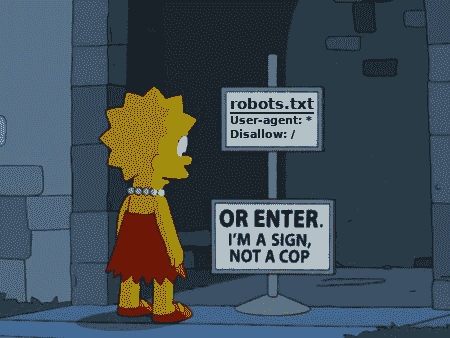
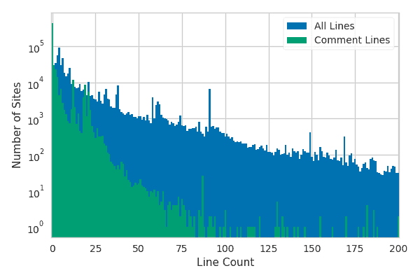
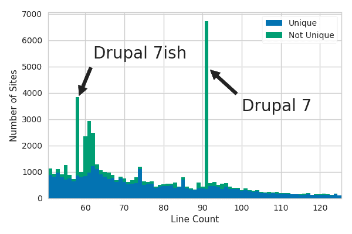
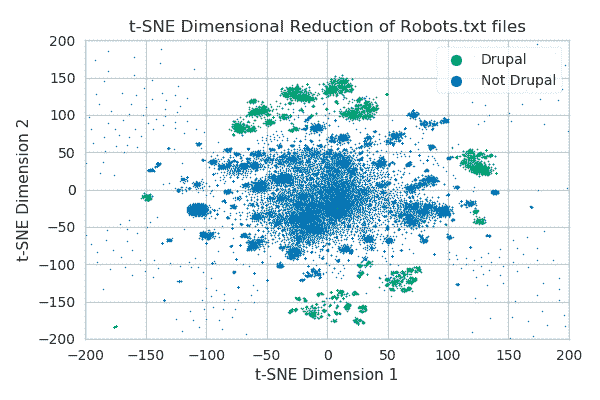
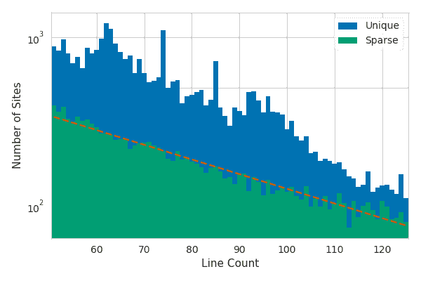

# 分析一百万个 robots.txt 文件

> 原文：<https://intoli.com/blog/analyzing-one-million-robots-txt-files/?utm_source=wanqu.co&utm_campaign=Wanqu+Daily&utm_medium=website>

# 一百万个 robots.txt 文件

这篇文章的想法实际上是从一个笑话开始的。我们在 [Intoli](https://intoli.com) 做了大量的网络搜集工作，我们每天都要处理`robots.txt`文件、过分热心的知识产权禁令等等。不久前，我在一个网站上遇到了一些问题，该网站有一个与他们的禁止政策完全不一致的`robots.txt`文件，我建议我们应该写一篇分析`robots.txt`文件的文章，因为这几乎是我们可以绝对肯定我们可以从任何域中抓取的*文件。我说的“建议”是指我把这个贴在了 Slack 上。*


我们讨论了一下，认为浏览大量的`robots.txt`文件，从用户代理、爬行延迟、路径等方面找出一些最常见的模式会有点意思。因此，我们设置了一个简单的 web scraper，从 Alexa Top 100 万网站下载`robots.txt`文件，并让它做自己的事情。当我们浏览数据时，我们最终发现我们*认为有趣的事情*实际上并不那么有趣！

很难在数据中找到“最常见”的东西，也很难看出许多`robots.txt`文件有着共同的起源。举个例子，无数的网站都使用 WordPress 自带的默认文件，几乎所有的内容都会出现在“最常见”的列表中。我们没有决定这篇文章不值得继续下去，相反，我们受到启发，更深入地挖掘数据，以了解数据集的一些更微妙的结构。

总的来说，分析结果比我们最初预期的要有趣得多。你可能以前看过类似的文章，但是我可以很有信心地说，我们把分析带到了另一个层次。我们将探索机器人排除策略的历史和发展，以及数据集中一些更微妙的结构组件。继续读下去，你很快就会知道更多关于`robots.txt`文件的事情，比你意识到的要多得多。

# 机器人.什么文件？

如果你正在阅读这篇文章，那么很有可能，你已经熟悉了[机器人排斥政策](http://www.robotstxt.org/)。它们的基本要点是，网站管理员，或者你想对他们使用的任何不太酷的术语，从他们服务器的根目录提供一个名为`robots.txt`的文件，该文件定义了机器人应该如何行为的一些准则。例如，[Intoli robots . txt 文件](https://intoli.com/robots.txt)就包含了这个文本。

```
# "We hold these truths to be self-evident,
#          that all bots are created equal."
#                      ~ Thomas Jeffersonbot
User-agent: *
Allow: *
Crawl-delay: 5

Sitemap: https://intoli.com/sitemap.xml 
```

`User-agent: *`指令用于表示以下指令适用于所有机器人。`Allow: *`意味着机器人可以自由访问他们想要的任何网址，而`Crawl-delay: 5`将请求速率限制在最多每五秒一次。`Sitemap: https://intoli.com/sitemap.xml`指向一个网站地图，它可以帮助机器人找到网站上的所有内容，而不需要通过链接爬行。任何以`#`开头的行都是评论，传统上用于模糊的幽默尝试，向 20 多岁的白人男性发出信号，这是一个“酷”的工作场所。

这就是你们可能已经知道的东西，但是它们有一些历史，这也是一种整洁。例如，科幻作家 Charles Stross [在 1993 年或 1994 年](http://www.antipope.org/charlie/blog-static/2009/06/how_i_got_here_in_the_end_part_3.html)试图学习 Perl 时无意中服用了 Nexor，从而引发了他们的创作。我喜欢这个故事的一点是它的非正式性。马丁·科斯特打电话给在电话中骚扰他的人，然后在 *www-talk* 邮件列表上建议进行机器人礼仪练习，讨论“万维网上的所有事情”,这真的让人想起了另一个时代。

你可能期望故事的下一步会涉及到某种标准化，但这实际上从未发生过。尽管通常被称为“机器人排除标准”，`robots.txt`文件充其量只是一个*事实上的*标准，即使这样，也不是所有的标准。1994 年提出的最初的、相对非正式的[提案仅涵盖了`User-agent`、`Allow`和`Disallow`指令的最基本组成部分。](http://www.robotstxt.org/orig.html)

Martijn 随后在 1996 年发布了更正式的[互联网草案(ID ),为行尾指示符、八位位组编码、缓存过期和其他细节增加了更明确的指导原则。那个 ID 甚至从未成为 RCF，更不用说互联网标准了，而且多年来对规范草案的遵守也是参差不齐的。它甚至在那份文件中说，“使用互联网草稿作为参考资料或引用它们而不是作为`work in progress`是不合适的。”](http://www.robotstxt.org/norobots-rfc.txt)

1996 年后的十年间，历史变得有些模糊。那个时期的许多新闻文章和博客文章已经不复存在了，而且，就我而言，我找不到任何关于`Crawl-delay`指令何时或如何被普遍使用的信息。当谷歌、雅虎和微软在 2006 年联合起来定义并支持网站地图协议时，标准化的下一步就开始了。然后在 2007 年，他们宣布[他们三个都会支持`robots.txt`文件](http://web.archive.org/web/20070702045114/http://www.ysearchblog.com:80/archives/000437.html)中的`Sitemap`指令。是的，来自一家前 1250 亿美元公司的博客的重要互联网历史片段现在只存在，因为它被 Archive.org 存档了。

这个松散的搜索引擎联盟在 2008 年再次走到一起，宣布他们都将支持一套共同的指令。直到今天，那篇博客文章可能是机器人排除政策有史以来最接近标准化的。它保证一致支持`User-agent`、`Allow`、`Disallow`和`Sitemap`指令，同时支持`$`和`*`通配符。

这一声明很有趣，部分原因是它让人们了解到搜索巨头在声明之前和之后处理指令的不同之处。值得注意的是，微软之前并不支持`Allow`指令或者使用`*`通配符。雅虎和微软都支持`Crawl-delay`指令，但是谷歌没有，事实上，拒绝同意它向前发展。*时至今日*，谷歌[仍然不支持`Crawl-delay`指令](https://developers.google.com/webmasters/control-crawl-index/docs/robots_txt)！

因此，即使在搜索巨头之间，也从来没有真正就文件中应该或不应该尊重什么达成过任何*完全的*一致。当你考虑范围更广的机器人时，甚至更少达成共识，这些机器人可以从大规模的互联网网络爬虫到浏览器扩展，这些浏览器扩展稍微增强和扩展了人类与网站的交互。任何称职的网站管理员都会告诉你，`robots.txt`文件很少被较小的网站抓取器所重视，但是这在较大的项目中也变得越来越普遍。

2017 年 1 月，苹果表示，如果谷歌机器人没有被明确禁止，它的 Applebot scraper 将[刮取任何允许谷歌机器人](https://support.apple.com/en-us/HT204683)使用的东西(换句话说，它基本上不会尊重`Disallow`对`User-agent: *`的指令)。同样，《时光倒流机》的导演马克·格雷汉姆宣布，Archive.org 将不再尊重《T2》的文件。他们应该吗？仅仅因为威瑞森决定他们不再希望历史雅虎博客档案被编入索引，雅虎在`robots.txt`文件中宣布的`Sitemap`指令就消失在时间之沙中，这真的有意义吗？



有点令人惊讶的是，它甚至相当好地确立了在美国没有法律义务遵循机器人排除政策。考虑到他们的历史和缺乏真正的标准化，也许*不应该是令人惊讶的*，但这毕竟是[的土地，“你每次访问一个网站都违反了版权法，因为你在你的计算机 RAM 中制作了未经授权的副本”](https://h2o.law.harvard.edu/collages/17668)(勇敢者的家园)。尽管如此，很明显文件只是列出了适当的礼节，除此之外别无其他。

我们在 [Intoli](https://intoli.com) 这里越来越注意到的一件事是，一种趋势是网站管理员制定神秘的规则来启动知识产权禁令，或将某些机器人列入白名单，而*甚至懒得在`robots.txt`文件中设置任何限制。*对他们来说，实施这种自动化限制当然是合理的，甚至可能是必要的，因为行为不端的机器人是如此普遍，但完全缺乏关于何种访问是可接受的沟通只会进一步降低机器人排除政策概念中仅存的一点神圣性。可悲的是，人们对`robots.txt`的信心似乎已经全面逐渐丧失；无论是 bot 还是网站运营商。

### Intoli 智能代理

如果你在做严肃的网络搜集，那么使用代理是必须的。我们的 [Intoli 智能代理服务](/beta/)可以轻松阻止 bot 缓解服务的拦截。您的请求通过干净的住宅 IP 智能路由，在那里它们很可能成功，失败的请求会自动重试，您甚至可以通过预装定制的远程浏览器发出请求，使其很难检测到您的刮刀。请在下面输入您的电子邮件地址，以便访问我们用于所有 web 抓取的相同工具！

# 获取数据

我们首先需要的是一个网站的大集合。有几个大名单在流传，其中最著名的可能是 [Alexa 的前一百万个网站](https://support.alexa.com/hc/en-us/articles/200449744-How-are-Alexa-s-traffic-rankings-determined-)。截至 2016 年 4 月 29 日， [Alexa 的网站声明这份名单可以通过 s3](https://web.archive.org/web/20160429064334/https://support.alexa.com/hc/en-us/articles/200461990-Can-I-get-a-list-of-top-sites-from-an-API-) 免费获得。

> 你也可以在 http://s3.amazonaws.com/alexa-static/top-1m.csv.zip 直接从 Alexa 免费获得全球前 100 万网站名单。免费的前 1，000，000 网站名单是基于全球 1 个月的平均流量排名。

这条消息已经被删除，但是数据仍然存在于`alexa-static` s3 目录中(尽管它可能在去年没有被更新)。

可以通过运行以下命令从 s3 下载和提取数据

```
# download and extract the Alexa top one million sites
wget http://s3.amazonaws.com/alexa-static/top-1m.csv.zip
unzip top-1m.csv.zip

# preview the top ten websites on the list
head  top-1m.csv.zip 
```

这将显示文件内容的峰值。

```
1,google.com
2,youtube.com
3,facebook.com
4,baidu.com
5,wikipedia.org
6,yahoo.com
7,google.co.in
8,qq.com
9,reddit.com
10,taobao.com 
```

你可以看到这是一个简单的 CSV，其中第一列是网站排名，第二列是裸域。为了收集所有这些域的`robots.txt`文件，我们只需为每个域向`http://{domain}/robots.txt`发出 HTTP 请求。

我的第一个想法是，应该可以并行处理这些请求，因为我们只需要访问每个服务器一次，因此阻塞应该不是问题。我已经准备好展示 python 闪亮的新`asyncio`特性，我编写了一个脚本来大量并行化请求，但是很快发现事情并不那么简单。web 服务器可能不关心流量，但事实证明，在 DNS 服务器开始质疑您的意图之前，您只能如此快速地查找域名！

在意识到我的错误后，我选择了简单，只是使用下面的脚本按顺序发出请求。

```
import json
import sys
from urllib import request

from tqdm import tqdm

output_filename = 'robots-txt.jl' if len(sys.argv) != 2 else sys.argv[1]

with open('top-1m.csv', 'r') as f_in:
    with open(output_filename, 'a') as f_out:
        for line in tqdm(f_in, total=10**6):
            rank, domain = line.strip().split(',')
            url = f'http://{domain}/robots.txt'
            try:
                with request.urlopen(url, timeout=10) as r:
                    data = r.read()
                    text = data.decode()
                    url = r.geturl()
            except:
                text = None

            f_out.write(json.dumps({
                'rank': int(rank),
                'domain': domain,
                'url': url,
                'robots_txt': text,
            }) + '\n') 
```

它非常慢，但是它完全避免了由于高容量导致的 DNS 查找失败的问题。

# 解析 robots.txt 文件

python——包括电池在内——实际上在`urllib.robotparser`中有一个[内置的`robots.txt`解析器](https://docs.python.org/3.7/library/urllib.robotparser.html)。`RobotFileParser`非常适合获取`robots.txt`文件，然后决定你的机器人是否被禁止访问某些路径，但除此之外，它的功能相对有限。在他们*最终*在 python 3.6 中添加了对`Crawl-delay`的支持后，它变得好多了，但是它仍然不支持站点地图。

`urlib.robotparser`有两个主要的替代品: [reppy](https://github.com/seomoz/reppy) 和 [robotexclusionruleparser](http://nikitathespider.com/python/rerp/) 。从实际目的来看，Reppy 似乎是一个很好的项目，但是它不太容易被破解，因为它是用 c++编写的。我决定用`robotexclusionruleparser`来代替，这样我可以更容易地添加功能。

子类化`RobotExclusionRulesParser`和添加一些额外的特性只需要几十行代码。我想添加的主要内容是注释解析，但是，我在那里做了一些其他的修改。也就是说，我修改了构造函数以更好地匹配 JSON 行数据文件的格式，添加了指示`robots.txt`文件不存在或包含 HTML 的`missing`和`html`字段，并添加了指示文件大小的`line_count`属性。

```
from robotexclusionrulesparser import RobotExclusionRulesParser, _end_of_line_regex

class RulesParser(RobotExclusionRulesParser):
    def __init__(self, domain, rank, url, robots_txt):
        super().__init__()
        self.domain = domain
        self.rank = rank
        self.url = url

        self.lines = []
        self.comments = []
        self.line_count = 0
        self.missing = False
        self.html = False

        self.parse(robots_txt)

    def parse(self, text):
        if not text:
            self.missing = True
            return
        elif '<html' in text or '<body' in text:
            self.html = True
            return

        super().parse(text)

        self.lines = _end_of_line_regex.sub('\n', text).split('\n')
        for line in self.lines:
            line = line.strip()
            self.line_count += 1
            if line.startswith('#'):
                self.comments.append(line[1:].strip()) 
```

然后就是遍历已经抓取的`robots.txt`文件，并将它们传递给解析器构造函数。

```
import json
from tqdm import tqdm

def load_robots_txt(filename='data.jsonl'):
    with open(filename, 'r') as f:
        for line in tqdm(f, total=10**6):
            yield RulesParser(**json.loads(line)) 
```

# 概述

查看数据的一个自然起点是计算一些汇总统计数据。使用我们之前定义的`load_robots_txt()`生成器，遍历数据很容易。

```
from collections import defaultdict

totals = defaultdict(int)
for robots_txt in load_robots_txt():
    if robots_txt.missing:
        totals['missing'] += 1
    if robots_txt.html:
        totals['html'] += 1
    if len(robots_txt.sitemaps) > 0:
        totals['sitemaps'] += 1
    totals['all'] += 1

print(totals) 
```

上面的代码会抽出一些关键数字。

```
{
    "all": 1000000,
    "html": 41186,
    "missing": 386536,
    "sitemaps": 231658
} 
```

在被请求的 100 万个`robots.txt`文件中，38.65%的文件返回了 404 或发生了其他错误。因为这个原因，我想把这篇文章改名为“分析 613，464 个 Robots.txt 文件”,但是它没有同样的名字。

有理由认为这些丢失的`robots.txt`文件中有一部分是由暂时性错误引起的，所以我对这些域进行了随机抽样，并重新请求了它们的文件。大约有 2.9%的站点在第二次请求时返回了有效的内容，因此运行所有这些站点预计会产生大约 11k 个额外的文件。这只会将有效文件的数据集扩展 1.8%左右，我认为不值得为如此少量的可用数据增加投入相对较大的时间。

在收到的有效响应中，有 41，186 个返回了似乎是 HTML 内容的内容。这些通常对应于将任何不匹配的 URL 转发到其主页而不是返回 404 错误的服务器。减去这些，我们剩下 572，278 个似乎是合法`robots.txt`文件的响应。对于接下来的所有分析，我们将只考虑那些有效响应不包含 HTML 的域。

我统计的最后一个数据是在他们的`robots.txt`文件中列出站点地图的站点数量。总数为 231，658 个，约占拥有有效`robots.txt`文件的网站的 37.8%。让我们通过移除域并查看站点地图文件最常见的位置来更深入地挖掘一下。

```
from collections import Counter
from urllib.parse import urlparse

sitemap_counter = Counter()
for robots_txt in load_robots_txt():
    sitemap_paths = map(lambda url: urlparse(url).path, robots_txt.sitemaps)
    sitemap_counter.update(sitemap_paths)

print(sitemap_counter.most_common(10)) 
```

| 站点地图路径 | 发生的事 |
| --- | --- |
| /sitemap.xml | One hundred and seventy-seven thousand nine hundred and sixty-four |
| /news-sitemap.xml | Eleven thousand one hundred and forty-seven |
| /sitemap_index.xml | Eleven thousand and forty-five |
| /SiteMap.aspx | Ten thousand one hundred and eighteen |
| /sitemap.xml.gz | Nine thousand six hundred and ninety |
| /网站地图 | Six thousand nine hundred and fifty-four |
| /index.php | Four thousand one hundred and eighty-seven |
| /动态站点地图. xml | Three thousand five hundred and thirty-three |
| /robots.txt | Three thousand five hundred and ten |
| /sitemapindex.xml | Three thousand and sixty-two |

我们可以看到，也许并不令人惊讶的是，`sitemap.xml`被用在了绝大多数出现站点地图的情况中。其他大多数都是这个主题的变体，还有几个，比如`SiteMap.aspx`暗示了动态生成的内容。有趣的是，`index.php`和`robots.txt`在列表中如此靠前，因为这两个似乎都没有包括`Sitemap`指令。



注释在`robots.txt`文件中相当常见，我很好奇是否会从中发现一些有趣的共性。不幸的是，最常见的评论大多相当无聊。大多数评论基本上都是样板文件，当人们从其他网站复制`robots.txt`的内容或查找模板时，这些文件就会被传阅。某些软件，如 [MediaWiki](https://www.mediawiki.org/) ，带有默认的`robots.txt`文件，然后被广泛使用。我将在后面更详细地讨论这个问题，上面的图实际上会回来发挥关键作用。

只有在我特别寻找的时候，我才能在评论中找到任何值得一提的东西。例如，在 Yelp 的`robots.txt`中，过滤“机器人不得伤害人类”显示了这一点:

```
# As always, Asimov's Three Laws are in effect:
# 1\. A robot may not injure a human being or, through inaction, allow a human
#    being to come to harm.
# 2\. A robot must obey orders given it by human beings except where such
#    orders would conflict with the First Law.
# 3\. A robot must protect its own existence as long as such protection does
#    not conflict with the First or Second Law. 
```

同样的笑话出现在 100 万个网站中的 58 个网站上(尽管公平地说，其中超过一半的网站是使用不同国家顶级域名的 Yelp)。我觉得有点好笑的是，[muenchnersonials . de](https://www.muenchnersingles.de)、 [stuttgartersingles.de](https://www.stuttgartersingles.de) 和 [wienersingles.at](https://www.wienersingles.at) 都在这 58 人之列。它们是由同一批人经营的，这可能不是什么秘密，但是有什么比在`robots.txt`文件中搜索阿西莫夫三定律更好的方法来了解它们呢？

我发现的关于`robots.txt`评论的最令人震惊的事情是，亵渎言论*极其*罕见。我认为这是一个找到对特定机器人感到沮丧的人的好方法，但是**只有九个**的文件在评论中包含“他妈的”一词。当我看到这么小的数字时，我真的仔细检查了我的代码，以确保没有错误。

我很高兴我搜索了亵渎，因为我找到了一个我特别喜欢的。这是在 videolan.org[拍《VLC》的人写的，内容如下。](https://videolan.org/)

```
# "This robot collects content from the Internet for the sole purpose of
# helping educational institutions prevent plagiarism. [...] we compare
# student papers against the content we find on the Internet to see if we
# can find similarities." (http://www.turnitin.com/robot/crawlerinfo.html)
#  --> fuck off.
User-Agent: TurnitinBot
Disallow: /

# "NameProtect engages in crawling activity in search of a wide range of
# brand and other intellectual property violations that may be of interest
# to our clients." (http://www.nameprotect.com/botinfo.html)
#  --> fuck off.
User-Agent: NPBot
Disallow: /

# "iThenticate® is a new service we have developed to combat the piracy
# of intellectual property and ensure the originality of written work for#
# publishers, non-profit agencies, corporations, and newspapers."
# (http://www.slysearch.com/)
#  --> fuck off.
User-Agent: SlySearch
Disallow: / 
```

我非常喜欢这个的原因是，它似乎是出于对机器人的原则性反对，而不仅仅是沮丧。这是我可以尊重的。

# 用户代理特定规则

现在，让我们看看`robots.txt`文件中的一些实际规则和指令。我们首先来看看 20 个最常被引用的用户代理，以及它们各自有多少相应的`Allow`和`Disallow`规则

| 用户代理人 | 总数 | 允许计数 | 不允许计数 | 允许/不允许 |
| --- | --- | --- | --- | --- |
| 媒体合作伙伴-谷歌* | Eighteen thousand nine hundred and twenty | Four thousand one hundred and fifty-two | Fourteen thousand seven hundred and sixty-eight | Zero point two eight |
| 谷歌机器人-手机 | Twenty-six thousand six hundred and twenty-five | Four thousand seven hundred and fifty-one | Twenty-one thousand eight hundred and seventy-four | Zero point two two |
| 谷歌机器人 | Three hundred and forty thousand one hundred and eighty-five | Thirty-eight thousand seven hundred and forty | Three hundred and one thousand four hundred and forty-five | Zero point one three |
| 媒体合作伙伴-谷歌 | Seventy-three thousand three hundred and seventy-six | Seven thousand eight hundred and seventy-nine | Sixty-five thousand four hundred and ninety-seven | Zero point one two |
| * | Six million six hundred and sixty-nine thousand three hundred and ninety-seven | Seven hundred and two thousand eight hundred and eighty-eight | Five million nine hundred and sixty-six thousand five hundred and nine | Zero point one two |
| Googlebot 图像 | Ninety-nine thousand four hundred and forty-four | Nine thousand six hundred and twenty-five | Eighty-nine thousand eight hundred and nineteen | Zero point one one |
| Mail.Ru | Twenty-three thousand one hundred and sixty-one | Two thousand two hundred and three | Twenty thousand nine hundred and fifty-eight | Zero point one one |
| AdsBot-Google | Nineteen thousand one hundred and sixty-three | One thousand two hundred and seventy-eight | Seventeen thousand eight hundred and eighty-five | Zero point zero seven |
| Yandex | Three hundred and eighty thousand nine hundred and forty-five | Twenty-two thousand seven hundred and twenty-eight | Three hundred and fifty-eight thousand two hundred and seventeen | Zero point zero six |
| bingbot | Sixty-seven thousand five hundred and sixty | Three thousand and twenty-six | Sixty-four thousand five hundred and thirty-four | Zero point zero five |
| ia_archiver | Twenty-five thousand five hundred and eighty-five | One thousand and ninety-three | Twenty-four thousand four hundred and ninety-two | Zero point zero four |
| 雅虎！大声地吃 | Eighteen thousand one hundred and eighty | Seven hundred and sixteen | Seventeen thousand four hundred and sixty-four | Zero point zero four |
| 百度地 | Twenty-nine thousand three hundred and thirty-nine | Nine hundred and sixty-eight | Twenty-eight thousand three hundred and seventy-one | Zero point zero three |
| msnbot 电视台 | Sixty-four thousand eight hundred and twenty-six | Two thousand and five | Sixty-two thousand eight hundred and twenty-one | Zero point zero three |
| 大声地吃 | Seventy-seven thousand seven hundred and forty-five | Two thousand two hundred and fifty-eight | Seventy-five thousand four hundred and eighty-seven | Zero point zero three |
| msnbot 电视台 | Eighteen thousand six hundred and seventy-four | Three hundred and ninety | Eighteen thousand two hundred and eighty-four | Zero point zero two |
| MJ12bot | Twenty-two thousand six hundred and seventy-eight | One hundred and twenty-one | Twenty-two thousand five hundred and fifty-seven | Zero point zero one |
| AhrefsBot | Twenty-four thousand and fourteen | Thirty-six | Twenty-three thousand nine hundred and seventy-eight | Zero |
| exabot 公司 | Eighteen thousand one hundred and ninety-four | Twenty-four | Eighteen thousand one hundred and seventy | Zero |
| adsbot-google | Forty-seven thousand three hundred and eighty-eight | Twenty-eight | Forty-seven thousand three hundred and sixty | Zero |

你可以看到，我已经按照`Allow`规则与`Disallow`规则的比率对这些规则进行了排序，以给出网站运营商如何看待不同机器人的一些近似值。由于通配符的使用，事情在现实中要复杂一些，但是看起来谷歌机器人确实比其他搜索引擎的机器人更容易被列入白名单。也许谷歌特权有它的限制，因为显然`MSNBot`通常被允许一个较小的抓取延迟。

| 用户代理人 | 中值爬行延迟 | 平均爬行延迟 |
| --- | --- | --- |
| msnbot 电视台 | Three | One hundred and thirty-three point two five |
| adsbot-google | Four | Four |
| Mail.Ru | Five | Forty-six point three six |
| 媒体合作伙伴-谷歌 | Five | Seventy-six point eight three |
| 谷歌机器人 | Five | Three hundred and eighty-two point eight two |
| 媒体合作伙伴-谷歌* | Ten | Twenty-nine point seven three |
| AdsBot-Google | Ten | Fifteen point nine seven |
| ia_archiver | Ten | One thousand and eleven point six nine |
| 谷歌机器人-手机 | Ten | Seventy-two point five one |
| bingbot | Ten | Ninety-six point seven six |
| 大声地吃 | Ten | Two hundred and sixty-eight point one five |
| Yandex | Ten | Thirty-two point two eight |
| * | Ten | One hundred and twenty-six point six six |
| Googlebot 图像 | Fourteen | One hundred and seventy-three point four seven |
| MJ12bot | Twenty | One thousand two hundred and thirty point six one |
| 雅虎！大声地吃 | Thirty | Sixty-seven point two seven |
| exabot 公司 | Thirty | Thirty-one point four seven |
| AhrefsBot | Thirty | One hundred and forty-one point one three |
| 百度地 | Thirty | One hundred and sixty-seven point nine two |
| msnbot 电视台 | Thirty | Three hundred and forty-one point six seven |

除了如果你把它大写为`msnbot`，那么它有一个明显更长的爬行延迟。哦，它是从 2010 年退役的[。从这些数据中你可以得出的一个最具体的推论是，实际上这些文件中有许多已经非常过时了。](https://en.wikipedia.org/wiki/Msnbot)

有足够多的异常值，平均值基本上没有意义，而且通配符和丢失爬行延迟也会引起一些微妙的问题。看表格很有趣，但这些确实需要持保留态度。

# 重复内容问题

我已经暗示过几次了，但是现在是时候深入研究了。有许多重复的`robots.txt`内容，这使得查看关于指令的汇总统计数据时很难避免结果严重偏离这一事实。这适用于我们已经看过的表格，也同样适用于我们可能感兴趣的大多数 T2 事物。

让我们看一个具体的例子来更清楚地说明这种效应是如何发挥作用的。说我们很好奇`robots.txt`里最常用的台词是什么。这很容易计算。

```
from collections import Counter

line_counter = Counter()
for robots_txt in load_robots_txt():
    line_counter.update(robots_txt.lines)

print(line_counter.most_common(10)) 
```

| 线条 | 发生的事 |
| --- | --- |
| "" | One million nine hundred and fifteen thousand three hundred and fifty-eight |
| "不允许:/" | Six hundred and ninety-three thousand five hundred and eight |
| "用户代理:* " | Five hundred and three thousand one hundred and nine |
| "#" | One hundred and sixty-four thousand and eighty-two |
| "不允许:/wp-admin/" | One hundred and twenty-one thousand one hundred and seventy-seven |
| "不允许:" | One hundred and eleven thousand seven hundred and fifty-two |
| "允许:/wp-admin/admin-ajax.php " | Ninety thousand nine hundred and eighty-five |
| "允许:/" | Eighty-nine thousand nine hundred and eighty-four |
| "不允许:/admin/" | Fifty-five thousand nine hundred and thirty-six |
| "不允许:/includes/" | Fifty-one thousand five hundred and ninety |

这些中的大多数并不特别令人惊讶，但是`Allow: /wp-admin/admin-ajax.php`呢？难道这看起来不奇怪，比`Disallow: /admin/`更常见吗？这条路本身有点像赠送品，但是快速搜索这条路会出现一张 [WordPress 标签](https://core.trac.wordpress.org/ticket/33156)上面写着

> 由于插件在前端使用 admin-ajax.php，我们应该添加
> 
> ```
> Allow: /admin/admin-ajax.php 
> ```
> 
> 到默认 robots.txt 阻止谷歌发出百万封邮件，请看这篇文章:[https://www . seroundtable . com/Google-warning-Google bot-CSS-js-20665 . html](https://www.seroundtable.com/google-warning-googlebot-css-js-20665.html)

你可能已经猜到了，那张票已经被关闭了。

这真的有那么重要吗？看你怎么看了。这些表格不一定是错的，它们只是以一种相当不透明的方式受到广泛传播的文件的严重影响。我个人认为，分开查看作为项目默认值继承的文件和新写入的文件的结果更有意义。至少，试图理清这些影响是一个有趣的挑战。

让我们回顾一下我们之前看到的行数分布。当时我还不想深入探讨其中的微妙之处，但你们可能已经注意到，分布中有一些微小的峰值，它们比统计噪声所能解释的要大得多。这些峰值是由来自多个站点的重复或至少相似的`robots.txt`文件引起的。让我们再看一下行数的分布，这次进一步放大，这样我们可以更清楚地看到一些峰值。



这次直方图也被分成两个堆叠的部分:`robots.txt`在多个站点上逐字出现的文件和在所有站点上唯一的文件。您可以看到，这个行数区域中的主要峰值似乎几乎完全是由非唯一文件造成的。我在谷歌上搜索了其中两个峰值的摘录，并追踪到默认的 Drupal `robots.txt`文件。一个是 Drupal 7.x 上的精确匹配，而标记为“Drupal 7ish”的文件似乎是同一文件的普通变体，其中删除了一大块`Allow`指令。

简单地对`robots.txt`文件的内容进行重复数据删除显然是朝着正确方向迈出的重要一步，但还有一些更微妙的影响无法消除。首先，有许多窄的峰值，比如行数为 74 和 85 的峰值，这些峰值不能归因于完全重复的文件。这可能是由模板化的`robots.txt`文件引起的，例如包含定制的站点地图或注释头。

也有相对较大的超出——比如 Drupal 7 主峰值右侧的一个，行数为 92——这可能是由于人们在默认的 Drupal 7 文件中添加了一些自定义行。为了识别和排除这些特定的文件，我们必须想出一些方法来识别它们是否基于默认的 Drupal 7 文件。一种方法是在每个`robots.txt`文件中寻找默认文件中存在的一些独特的文本，然后认为包含它的任何内容都是基于默认的。

这种方法的一个很好的候选字符串是介绍性注释:

```
# This file is to prevent the crawling and indexing of certain parts
# of your site by web crawlers and spiders run by sites like Yahoo! 
```

这似乎不太可能仅仅是偶然地逐字复制(不像许多爬行指令，它们往往更通用)。这可能对 Drupal 有用，但是其他框架呢？虽然 Drupal 很常见，有非常明显的峰值，但其他的峰值可能太大，无法识别或者隐藏在统计波动的背后。如果我们想识别一些不太明显的`robots.txt`模板，我们需要一个更通用的方法。

除了查找共享一个公共字符串的文件之外，下一步自然是简单地查找与*相似的*文件。所有基于 Drupal 默认设置的文件可能会共享很多相同的内容。我们还希望共享同一来源的任何其他文件集合也是如此。识别和删除任何相似文件的集群应该有效地给我们留下大部分是从零开始写的`robots.txt`文件。我们只需要决定如何定义*相似*和*集群*就可以做到这一点。

用于测量字符串相异度的常见度量是 [Levenshtein 距离](https://en.wikipedia.org/wiki/Levenshtein_distance)。Levenshtein 距离被定义为将一个字符串改变为另一个字符串所需的字符插入、删除或替换的最小数量。比如“mis **sa** llan **i** ous”需要三次替换才能变成“mis **ce** llan **e** ous”。因此，这两个字符串之间的 Levenshtein 距离为 3。正如你可能想象的那样，这种距离度量是拼写纠正器中常用的[。](http://norvig.com/spell-correct.html)

理论上，我们可以直接计算每对`robots.txt`文件之间的 Levenshtein 距离，但由于计算的复杂性，这实际上是不切实际的。对于两个字符串$a$和$b$来说，$a$的第一个$i$字符和$b$的第一个$j$字符之间的 Levenshtein 距离可以递归定义为

$ $ \ qquad \ operator name { \ mathcal L } _ { a，b}(i，j) = \begin{cases} \max(i，j) & \text{ if} \min(i，j)=0，\ \ min \ begin { cases } \ operator name { \ mathcal L } _ { a，b}(i-1，j)+1 \ \ \ operator name { \ mathcal L } _ { a，b}(i，j-1)+1 \ \ \ operator name { \ mathcal L } _ { a，b} \end{cases} $$

其中$\delta_{a_i b_j}$是定义为$a_i = b_j$时为$1$的[克罗内克 delta](https://en.wikipedia.org/wiki/Kronecker_delta) ，否则为$0$。这种方法的直接递归实现可能和$O(3^{\max\,{|a|,|b|}})$一样慢，因为每次求值都需要三次额外的递归函数调用。

通过更有效的算法，复杂性可以提高到$O(|a||b|)$但当字符串有数千个字符长时，它仍然非常慢。像 *8.29 年*慢。这是在我的电脑上使用$O(|a||b|)$算法的[高效 c++实现来评估所有距离对所需的时间。我想我等了很久才下载完所有的文件！](https://pypi.python.org/pypi/editdistance)

幸运的是，角色级别的距离对于我们在这里试图完成的事情来说可能是多余的。对默认`robots.txt`文件的大多数修改倾向于发生在行的级别，而不是字符的级别，因为人们通常添加或删除整个指令。除此之外，对于我们的目的来说，改变的行数实际上比字符数更有意义。例如，`Allow: *`和`Allow: /users/`的角色级别距离为 7，而`Allow: *`和`Allow: /longer/path/to/users/`的角色级别距离为 22。很明显，字符级的距离对路径长度有很大的影响，而直观地说，对于两个文件是否共享一个共同的原点来说，这个信息是多余的。

现在，我们已经完全确定了线级距离是更好的方法，而且我绝对不是事后合理化，让我们看看如何实际实现这一点。我们实际上根本不需要改变 Levenshtein 距离算法，我们只需要考虑每个文件中的行是离散的单元而不是字符。我们甚至可以直接这样做，唯一的小问题是计算$\delta_{a_i b_j}$的字符串比较会非常慢。

通过首先对行进行标记，距离计算可以大大加快，这样只需要比较整数而不是字符串。考虑到我们之前填充的`line_counter`对象，这相当简单。

```
import editdistance

# build the token map
line_to_int = {}
for i, (line, count) in enumerate(line_counter.items()):
    line_to_int[line] = i

# define tokenization functions
def tokenize_line(line):
    return line_to_int[line]

def tokenize_robots_txt(robots_txt):
    return list(map(tokenize_line, robots_txt.lines))

# compute the line-level Levenshtein distance between files
def robots_txt_distance(robots_txt_1, robots_txt_2):
    return editdistance.eval(tokenize_file(robots_txt_1), tokenize_file(robots_txt_2)) 
```

这是一个好的开始，但是如果我们想要计算所有的成对距离，那么首先标记所有的文件*是有意义的，这样我们就不必数千次地重新标记每个文件。*

```
import numpy as np

# restrict the files to the Drupal region of line counts
line_range = (51, 125)

# pre-tokenize all of the files
tokenized_files = []
for robots_txt in load_robots_txt():
    if line_range[0] <= len(robots_txt.lines) <= line_range[1]:
        tokenized_files.append(tokenize_robots_txt(robots_txt))

# compute the pair-wise distance matrix
distances = np.zeros([len(tokenized_files)]*2)
for i, tokenized_file_1 in enumerate(tokenized_files):
    for j, tokenized_file_2 in enumerate(tokenized_files):
        # the matrix is symmetric so only compute the upper diagonal
        if j < i:
            continue
        distances[i,j] = editdistance.eval(tokenized_file_1, tokenized_file_2)
        # copy over to the lower diagonal
        distances[j,i] = distances[i,j] 
```

您会注意到，我将文件限制为线长度在我指出 Drupal 峰值的绘图范围内的文件。这将我们考虑的文件数量减少到总数的大约 10%,从而将距离矩阵的内存使用减少到没有限制时的 1%。这样做让我可以把所有东西都保存在 RAM 中，但也让我们可以更仔细地研究这些 Drupal 峰值。完全没有合理化。

好了，我们已经测量了所有这些文件之间的相似性…现在做什么？这个巨大的距离矩阵编码了大量的信息，但是有太多的信息，它本身并没有太大的帮助。让我们从尝试将信息提炼为我们可以更容易想象和理解的东西开始。

当我们想到离散的项目和它们之间的距离时，我们可能最常想到它们存在于某个 N 维空间中，距离是标准的[欧几里德距离](https://en.wikipedia.org/wiki/Euclidean_distance)。当我们进行标记化时，我们有效地将`robots.txt`文件嵌入到 125 维空间中，但是该空间中的欧几里德距离是没有意义的，因为我们是如何沿着每个维度编码值的。如果我们希望以更有意义的方式可视化数据，那么我们需要将它转换到一个空间，在这个空间中，文件之间的欧几里得距离与 Levenshtein 距离更密切相关(我们特别选择 Levenshtein 距离，因为它以直观的方式准确地表示了不相似性)。换句话说，我们希望共享大量内容的文件彼此靠近，而真正不同的文件彼此远离。哦，就可视化而言，如果这个新空间的维度少于 125 个也没什么坏处。

我刚才描述的本质上是降维，有一种降维算法非常适合我们的特定用例:[t-分布式随机邻居嵌入(t-SNE)](https://en.wikipedia.org/wiki/T-distributed_stochastic_neighbor_embedding) 。这通常是更有效的降维算法之一，但在这种情况下，它是一个特别好的选择，原因有二:

1.  它不需要将初始数据嵌入到已经有意义的空间中。相反，它只关心点之间的成对距离。这些正是我们用 Levenshtein 距离计算出来的。
2.  它非常重视保存短距离结构，而不是长距离结构。我们主要对基于默认值的`robots.txt`文件簇感兴趣，所以我们根本不关心长距离结构。

因此，为我们的距离矩阵寻找低维 t-SNE 将允许我们可视化相似的`robots.txt`文件簇周围的结构。

该算法背后的基本思想非常简单:您本质上使用高斯核将成对距离转换为表示相似性的条件成对概率，然后尝试使用[学生-t 分布](https://en.wikipedia.org/wiki/Student-t_distribution)最小化这些概率与嵌入低维空间的点的成对概率之间的[库尔巴克-莱布勒散度](https://en.wikipedia.org/wiki/Kullback%E2%80%93Leibler_divergence)。Student-t 分布的较重尾部导致概率分布之间的差异对长距离结构相对不敏感。在每种情况下，您都可以轻松地使用高斯函数，并简单地忽略超过某个阈值的距离，这种想法只是为了优先考虑近距离结构。一个棘手的部分是选择内核的宽度，因为它需要适应数据的密度。这通常通过求解导致条件成对概率的预定义[困惑](https://en.wikipedia.org/wiki/Perplexity)的宽度来完成。

如果您关心内存和 CPU 的使用，还有一些实现细节也很重要。我使用了 [scikit-learn](http://scikit-learn.org/stable/modules/generated/sklearn.manifold.TSNE.html) 实现，它支持使用 [Barnes-Hut 算法](https://en.wikipedia.org/wiki/Barnes%E2%80%93Hut_simulation#Algorithm)来近似优化过程。这将$O(N^2)$的运行时间减少到＄o(n \ log(n))＄,其中＄n＄在我们的例子中大约是 100，000，并且*应该*将$O(N^2)$的内存使用减少到＄o(n)＄。直到最近，Scikit 实现实际上使用了密集矩阵表示而不是稀疏矩阵表示，这已经[成为一个公开的问题很久了](https://github.com/scikit-learn/scikit-learn/issues/7089)。我提到这一点是因为 Barnes-Hut 的内存使用将我的计算机推到了极限，我最终不得不编译托马斯·莫罗的部分完成的分支来使事情勉强适应。就在上周左右，[优化拉取请求](https://github.com/scikit-learn/scikit-learn/pull/9032)被接受，如果您使用`pip install scikit-learn==0.19b2`安装 scikit 的测试版，您现在可以利用稀疏矩阵的优势。

因此，没有进一步的麻烦，我们可以简单地运行

```
from sklearn.manifold import TSNE

tsne = TSNE(n_components=2, perplexity=30, metric='precomputed',
            method='barnes_hut', n_iter=10**5, verbose=2)
result = tsne.fit_transform(distances) 
```

找到我们的二维嵌入的`robots.txt`文件(经过许多小时和 16650 次迭代)。这种维度缩减的结果将允许我们最终可视化文件的结构！

当我把这幅图给乔治·斯穆特看时，他告诉我，他认为它看起来像上帝的脸，但我个人看不出有什么相似之处。



这基本上只是一个`result`阵列的直接散点图，在群集结构上放大了比例。基于 Drupal 的文件已经根据注释“Yahoo！”我们之前看到的。事实上，所有的 Drupal 文件都属于可识别的集群，这很好地证实了这些集群确实有意义。

请记住，这仅限于 51-125 行的范围，因此它与我们讨论 Drupal 峰值的图直接对应。我可以计算出该分布中可能有六七个我认为是独特峰值的特征，但是我们的 t-SNE 揭示了仅基于 Drupal 的集群就有几十个。这里总共有一百多个集群，我们不可能像最初检测 Drupal 那样检测到它们。

既然我们已经识别了这些集群，那么如果我们想像前面处理重复文件一样过滤掉它们呢？这主要是提出一个更严格的定义，说明作为集群的一部分意味着什么，然后将我们的分析限制在不满足该标准的文件上。一种相对简单的方法是估计不同位置的文件密度，只考虑稀疏区域的文件。

让我们使用高斯内核的[内核密度估计](https://en.wikipedia.org/wiki/Kernel_density_estimation)来尝试一下这种方法。大致基于 t-SNE 图中聚类的大小，我选择了 10 的标准差作为内核。然后，我引入了一个稀疏性约束，其中要分析的文件周围的局部密度不能超过它自己对密度的贡献的 110%。这是稀疏性的一个相当严格的定义，但是它应该确保我们最终得到的文件确实是非常独特的。



唯一和稀疏文件的行号分布向我们显示，几乎所有的局部结构都被稀疏约束消除了。如虚线所示，稀疏文件在该区域中似乎近似遵循指数分布。我不确定我们是否应该期望分布是指数的，但是与拟合的一致确实强调了局部结构的缺乏。

在这个图中需要注意的另一件重要事情是，稀疏性约束过滤掉的文件中，行数较低的文件比行数较高的文件多得多。该图是对数图，因此这是由大线数时两个分布之间的差距变窄所暗示的。这种效果是较短文件周围的密度自然较高的结果。考虑只有一行的文件的情况。每一个少于十行的文件都将在我们的内核宽度之内，并且本地的密度估计将是巨大的。我们可以合理地预期，没有文件会通过行数较少的稀疏约束。

这也不仅仅是密度估计的假象；对于那些较短的文件，密度本身确实更高。我们可以使内核宽度*和最大密度*自适应，但是对于较短的文件来说，基本上只有较少的信息。这些改进只是让我们的过滤器得到更少的误报，而不是更多的误报，而没有解决越短的文件越难以区分的根本问题。

我很想包含一些带有稀疏约束的更新表…但我不会。绝大多数的`robots.txt`文件都相对较短，我不认为有什么有意义的方法可以扩展我们在这里探索的方法来包含这些。我希望您仍然对我们在数据集中对结构和聚类的探索感兴趣，即使它没有产生基于模板过滤掉所有文件的银弹方法！

# 包裹

恭喜您，您已经到达了我们关于`robots.txt`文件的 8 部分系列的第 1 部分的结尾！开个玩笑，就这样……*暂时*。

正如我前面提到的，关于分析`robots.txt`文件的文章并不新鲜。我认为这是一个新的尝试。这给了我们一个机会去探索一些关于这些文件是如何产生的历史，以及真正挖掘我们数据集中隐藏的结构。在此过程中，我们还涉及了一些有趣的算法和分析技术。你还能要求什么？

和往常一样，[如果您正在寻求帮助以应对贵公司的数据挑战，请告诉我们！](/contact)我们的团队是网页抓取、数据基础设施和机器学习方面的创新专家。无论您的数据目标是什么，我们都可以帮助您实现！