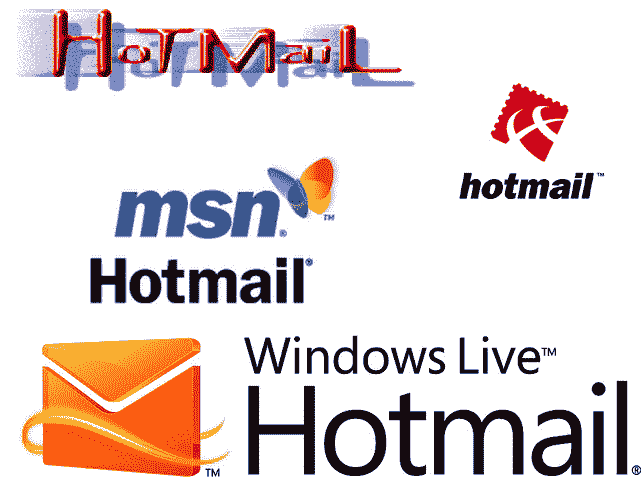
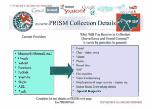

# Hotmail 如何永远改变了微软(和电子邮件)

> 原文：<https://arstechnica.com/information-technology/2017/12/how-hotmail-changed-microsoft-and-email-forever/?utm_source=wanqu.co&utm_campaign=Wanqu+Daily&utm_medium=website>

[Enlarge](https://cdn.arstechnica.net/wp-content/uploads/2017/12/hotmail.jpg) /

Hotmail 的众多生命。

肖恩·加拉格尔

20 年前的这个星期，1997 年 12 月 29 日，比尔·盖茨给微软买了一份价值 4.5 亿美元的圣诞礼物:一个位于桑尼维尔的名为 Hotmail 的公司。这次收购是当时最大的全现金互联网初创企业收购，微软由此进入了基于网络的电子邮件的新生世界。

Hotmail 最初由杰克·史密斯和萨比尔·巴蒂亚于 1996 年以“HoTMaiL”(参考万维网语言 HTML)的名义推出，最初并入微软的 MSN 在线服务。犯了错误。花了很多钱。品牌已更改。垃圾邮件越来越多。许多许多可怕的电子邮件签名产生了。

但在接下来的几年里，Hotmail 为所有基于网络的电子邮件服务设定了路线，开启了大众消费者免费电子邮件服务的时代。一路走来，Hotmail 推动了 Windows 本身的变化(特别是后来成为 Windows Server 的变化)，为操作系统进入数据中心奠定了基础。电子邮件服务将是微软迈向 Azure 云的第一步。

前微软高管 Marco DeMello，现任移动安全公司 PSafe Technology 的首席执行官，被任命为 MSN 的首席项目经理，负责管理 Hotmail 的整合，这是微软自己对美国在线的回应。在接受 Ars 采访时，德梅洛——2006 年离开微软之前，他一直担任 Windows 安全总监和 Exchange 产品经理——讲述了他如何在 1996 年 10 月受聘管理 MSN 后，被召到雷德蒙与比尔·盖茨会面。“他给了我和我的团队一个任务，基本上就是找到或创建一个微软能为全世界提供的免费网络电子邮件系统，”德梅洛说。

## 你有邮件

*   

     Original HoTMaiL login screen 

    

*   

    T2】

    

*   

    T2】

    

*   

    T4】更微软-是啊.

    

*   

    T3】

    Windows Live 登录,大约在 2005 年.

    

    

1996 年，网络仍在发展。几乎所有的个人互联网接入都是通过拨号服务，如 AOL、MSN、CompuServe 和 EarthLink。少数幸运者通过 ISDN 连接获得了早期的“高速”互联网服务，但许多公司甚至还没有将他们的公司电子邮件系统连接到互联网上。虽然有一些来自 ISP 的基于网络的邮件被集成到虚拟主机账户中，Lotus 也在 1994 年展示了 cc:Mail 的网络接口，Hotmail 和它的竞争对手 Rocketmail(后来成为 Yahoo Mail)是第一个提供免费的基于网络的电子邮件的公司，这些电子邮件是由广告资助的。到 1997 年，Hotmail 已经拥有 900 万用户。

“我提出了观点，很明显，”德梅洛说，“我们无法在比尔·盖茨指定的时间内建立自己的网络邮件服务。”购买现有的服务是唯一真正的选择——尽管在其他微软高管中不受欢迎，他们通常坚持“吃自己的狗粮”的政策

但最终，“比尔开了一张 4.5 亿美元的现金支票，”德梅洛回忆道。“我负责整合这个系统，并在微软内部进行扩展。”

## 供应商锁定

这一职责包括将运行在 Unix 上的软件——前端是 FreeBSD Web 服务器，后端是 SPARC 上的 Sun Solaris 整合到一个纯 Windows 环境中，并将服务迁移到 Windows 服务器上。

在 1997 年，Windows NT Server 还不能完成这项任务。虽然德梅洛的团队为 Hotmail 平台开发了一些 Windows 环境的界面，但“我们是 Windows Server 的客户，”他说，“一开始我们并不是很满意。”

*   

     Microsoft diagram of Hotmail web architecture before migrating the front-end of the service to Windows 2000\. 

    

*   

     After migration, add the active directory! 

    

尽管面临着立即将代码转移到 Windows 的压力，但 DeMello 说，“我们一直在探讨很多事情，从安全性到内存管理，一直到 TCP 网络堆栈本身，我们都在比较，‘这是我们从 Unix 得到的，这是我们从 nt 得到的，这就是为什么我们还不能迁移。’“不，我们还不能迁移。"

当 Sun 首席执行官斯科特·麦克尼利[经常拿微软的服务器操作系统开玩笑的时候，【T1]这可能是在微软高管的伤口上撒盐。将“不”变成“是”将花费](https://edition.cnn.com/TECH/computing/9911/18/comdex.mcnealy.idg/index.html)[三年时间](https://web.archive.org/web/20071108203351/http://www.securityoffice.net/mssecrets/hotmail.html#_Toc491601817)和 Windows 2000 Server 的开发。德梅洛的团队“当时与[【Windows NT 架构师戴夫】卡特勒和工作人员](https://arstechnica.com/gadgets/2008/03/past-present-future-file-systems/6/)合作，”德梅洛回忆道，“首先是可伸缩性部分——我们讨论的是互联网信息服务器、网络堆栈、TCP 堆栈和内存以及如何管理它们——还有直接从可执行进程访问本地文件夹的安全性。最终，卡特勒和他的团队成功了。

微软的服务器开发团队和 Hotmail 团队之间的这种关系将持续多年，特别是在 IIS、Windows 的 Web 和 Internet 服务组件的开发方面。DeMello 说:“我们会有测试 IIS 的版本——Hotmail 一直是一个测试平台。“咒语是，如果它通过了 Hotmail 测试，你可以把它给任何人——这成了对 IIS 的压力测试。”

当涉及到全球基于网络的服务的日常运营时，Hotmail 的运营给了微软“吃你自己的狗粮”的终极体验——德梅洛认为这种体验反映在微软今天如何运营 Azure 云上。“关于该做什么和不该做什么，这是一种无底的信息财富——最佳实践、最差实践、什么可行什么不可行，”他说，“从登录时的响应时间到如何处理大数据传输，无所不包。”

虽然迁移到 Windows Web 服务器的时间更早，但 Hotmail 的后端系统(数据库服务器和存储)直到 2004 年才开始迁移到 Windows Server 和 SQL Server。随着存储需求的增加，迁移变得越来越困难，因为帐户从一个数据库移动到另一个数据库以及在数据中心之间传播的速度是有限的。

Hotmail 也在 Office 平台上留下了印记——除了是 Outlook.com 的前身。Outlook 的第一个版本是在收购 Hotmail 后几周发布的，下一个版本——Outlook ' 98——必须进行调整才能与 Hotmail 兼容——这导致了一场协议之战。“Outlook 使用 MAPI(Exchange 的默认接口)作为协议，”德梅洛说，他将 TCP/IP 上的 MAPI 描述为“有史以来发明的最重的东西之一，所以我们当时不得不将其改为直接的 WebDAV。所以我们有几个问题，让我们这么说吧——哪种协议必须赢得协议战。”

## 经历的痛苦

 

[放大](https://cdn.arstechnica.net/wp-content/uploads/2017/12/prism.jpeg) /

哦，是啊，发生了这种事。

从 Solaris 到 Windows 的迁移花了三年时间才完成。虽然这次迁移基本上没有发生任何意外——德梅洛说，“比尔·盖茨从天而降的命令”是“‘你不能丢失一个邮箱’——但我们没有。”一路上仍然有些疼痛。

向上扩展以服务数百万用户意味着向上扩展数据中心以处理 Hotmail 不断增长的存储和计算需求。存储远不便宜。“我们实际上是在应对硬盘成本的飙升，”德梅洛说。“你必须记住，我们谈论的是从 1997 年到 2000 年……你仍然在为每兆字节支付高昂的费用——忘掉千兆字节吧。因此，基础设施成本本身就是一笔惊人的账单。”

这些数据中心既昂贵又耗电。“我记得当我们实际上已经完成了新的数据中心，这是建在博瑟尔[华盛顿]，”德梅洛说。“我们启动它进行测试——我们测试土星的第一天，我们在博瑟尔造成了停电。第二天早上，我不得不回复一位非常愤怒的市政官员。我们第二次成功了——没有停电。容量已经增加，每个人都做好了准备，并期待着城市被火焰吞噬，但这并没有发生。”

然后，在 1999 年夏天，Hotmail 出现了第一次重大安全漏洞。Hotmail 的每一个账户——当时大约有 5000 万个——都有可能被 Hotmail 服务器上的一个脚本漏洞暴露，该脚本允许使用相同的密码访问任何 Hotmail 账户:“嗯。”

利用这一漏洞的门户网站层出不穷，任何人只需输入目标帐户名称就可以访问邮箱。一些人声称，在微软修补漏洞之前，他们已经通过这个漏洞进入账户近两个月了。一些人认为这是 Hotmail 开发者留下的后门。

德梅洛不愿就此事发表评论。“我可以告诉你，但我必须杀了你，”他开玩笑说。但是他认为 Hotmail 总是把安全和隐私放在第一位——至少在世纪之交是如此。“我们在安全和隐私方面投入了大量精力和精力，”他说。“这不是事后的想法。我认为我们从头开始构建系统，重点关注安全性和隐私。”

德梅洛说，对 1999 年来说，这意味着要特别做两件事。“我们试图保护凭据并实施密码策略。我们希望非常坦率地告诉用户需要保护他们的密码，并明确表示电子邮件不是一种安全的媒介。在常见问题解答和 Hotmail 团队本身的交流中，我们警告不要通过电子邮件分享或发送任何个人或财务信息或安全信息。”

Hotmail 使用带 SSL 加密的安全 HTTP (HTTPS)来保护用户的登录凭证，微软强迫客户使用更复杂的密码——但服务的其余部分通过未加密的 HTTP 运行。“当时，仅仅是认证部分就要求我们运行硬件加速器，”DeMello 说。“而且成本非常高—每张卡要几千美元，无论您使用的是 Unix 还是 Windows Server，都必须运行它。当时，您无法通过 SSL 运行整个基础设施。”

随着运行服务器的 CPU 的发展，这种情况发生了变化——今天,“用直接的 HTTP 运行一些东西是不可思议的”, DeMello 说。

设立密码政策是为了防止客户使用太短的密码或(从 2011 年开始)[太常用的密码](https://arstechnica.com/information-technology/2011/07/hotmail-banning-common-passwords-to-beef-up-security/)。然而，Hotmail 的[密码长度限制为 16 个字符](https://arstechnica.com/information-technology/2012/09/secret-microsoft-policy-limited-hotmail-passwords-to-16-characters/)，所以这些密码的复杂程度是有上限的。

因此，虽然有人监听咖啡店的 Wi-Fi 网络可能不一定能够嗅探到密码，但仍有可能有人在登录后通过获取网络流量来读取您的 Hotmail 邮件。

## Hotmail 耻辱的心碎

来自谷歌 Gmail 和雅虎的竞争迫使 Hotmail 变得更好，但这也引发了一些奇怪的品牌重塑。在 2005 年 Windows Vista 发布时，微软试图让 MSN 变得更加“实时”，微软试图将其许多服务更名为“Windows Live”。Hotmail 被重命名为“Windows Live Mail”但是 Hotmail 用户显然被弄糊涂了，所以他们又把它改成了 [Windows Live Hotmail](http://www.zdnet.com/article/hotmail-windows-live-mail-windows-live-hotmail/) 。随着品牌重塑，微软开始全面重写 Hotmail 的前端系统，这些系统以前主要是 C++和 Perl 的原始 Solaris 代码的移植。用 C#和 ASP.NET 代码进行的重写，最终终结了 Hotmail 的 Unix 传统，不管是好是坏，让这项服务成为微软自己平台的一个展示窗口——让该公司走上了 Office 365 平台和 Azure 云的道路。

虽然 Hotmail 作为许多事情的试验场对微软来说很重要——也许作为一个收入来源不那么重要——但它也在某些方面获得了“互联网上所有不良事物的根源”的名声。多年来，Hotmail 用户一直是人们取笑和憎恨的对象。一位管理顾问公开建议[公司永远不要雇佣使用 Hotmail 的人。](https://www.linkedin.com/pulse/dont-hire-hotmail-users-other-tips-save-your-company-culture-kogan/)

Hotmail 是那些建立虚假交友档案的人的一次性账户之地。作为 HTML 电子邮件的先驱，Hotmail 用户是新兴网络钓鱼和偷渡式下载攻击的自然目标[。它的垃圾邮件过滤能力在最好的情况下也是值得怀疑的](http://smallbusiness.chron.com/report-phishing-msn-hotmail-email-account-61764.html)。具有讽刺意味的是，Hotmail 无法阻止垃圾邮件，这使得 Hotmail 帐户更有可能被作为垃圾邮件阻止——部分原因是邮箱已满导致的反弹。

因此，尽管 Hotmail 带来了一些相对好的东西，但我们没有理由哀悼它的逝去。Outlook.com 让人们更容易忘记过去糟糕的网络邮件时代……仍然有成千上万的人懒得选择不保留他们的 Hotmail.com 地址。