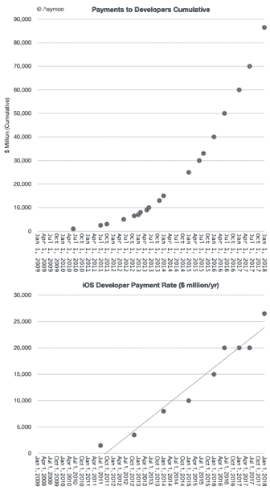
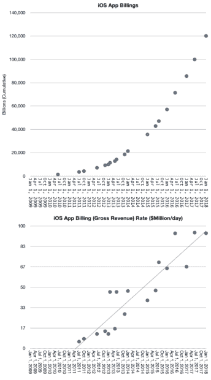
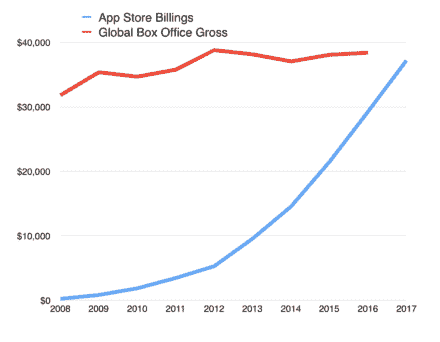

# iOS 经济，更新–asym co

> 原文：<http://www.asymco.com/2018/01/08/the-ios-economy-updated/?utm_source=wanqu.co&utm_campaign=Wanqu+Daily&utm_medium=website>

苹果在 App Store 上的[最新更新](https://www.apple.com/newsroom/2018/01/app-store-kicks-off-2018-with-record-breaking-holiday-season/)中报告称，2017 年 iOS 开发者收入 265 亿美元。一年前，这个数字是 200 亿美元。增长率约为 33%。向开发商支付的累计款项可计算为 865 亿美元。这一数额是在不到 10 年的时间里产生的，第一个 10 亿是在 2010 年 6 月支付的。

下图显示了累计付款的历史记录和相应的付款率(单位为美元/年)。)

请注意，这代表对开发人员的支付，而不是客户的支出。苹果保留大约 30%的收入。App Store 上的总支出增加了约 43%..在 App Store 上花费的相应数字如下所示。

一些观察结果:

*   开发商付款率现在超过 250 亿美元/年。我已经通过 Twitter 得到通知，这高于麦当劳公司 2016 年的收入。
*   今年，iOS 用户每天将花费约 1 亿美元购买应用程序。这是谷歌在 2012 年的 [AdWords 收入比率](https://searchengineland.com/google-bringing-in-100-millionday-via-adwords-says-study-137583)。
*   App Store 的支出一直在稳步上升，自 2011 年年中以来，每年增加约 50 亿美元。
*   应用是苹果服务的最大组成部分，并在 2017 年帮助该细分市场毛收入超过 570 亿美元，[超过财富 100 强水平](http://appleinsider.com/articles/17/08/01/apples-services-business-alone-now-the-size-of-a-fortune-100-company-beats-out-facebook)(扣除开发者支付)。

我以前做过比较，应用业务比电影产业大，比音乐产业大得多。)这是将 Android 收入和 iOS 收入合并为“应用收入”。

截至今年，仅应用商店一项就将超过全球票房收入。

当然，这只是对 App Store 规模的观察，而不是对从任何一种媒介中获得的利益或一种媒介对另一种媒介的可替代性的判断。值得注意的原因是，苹果应用商店和苹果服务正在成为世界上最大的企业之一。更重要的是，它的增长速度值得注意。

即使考虑到这一点，人们也应该记住，收入和支付给开发者的数字只是整个应用经济的一小部分。销售给最终用户的应用程序是 App Store 上所有应用程序的子集。不仅有免费的应用程序，还有许多应用程序是复杂服务的前端，以各种间接的方式货币化。

JD.com、脸书、Twitter、Linkedin、腾讯、YouTube、Pandora、网飞、谷歌、百度、Instagram、亚马逊、易贝、阿里巴巴、Expedia、Tripadvisor、Salesforce、优步、AirBnB 和数百家其他公司都是“免费”应用程序，实现了数千亿美元的互动，但这些都没有记录在 App Store 的收入数据中。顶级商业、通信和媒体公司的绝大多数活动现在都是通过移动设备进行的。

按照用户权重和他们的参与倾向，iOS 促成了大约 50%到 60%的移动经济活动。

基于移动服务的收入比率和 iOS 参与份额的假设，我估计 2017 年 iOS 上的经济活动约为 1800 亿美元。包括硬件销售在内，iOS 经济在 2017 年收入约为 3800 亿美元。

围绕增长率的其他假设表明，iOS 经济将在 2019 年实现半万亿的营收率。评估这一点，尤其是作为苹果内在价值的一部分，是一个挑战，但可能值得一做。这对基础业务的稳健性或可持续性有影响。