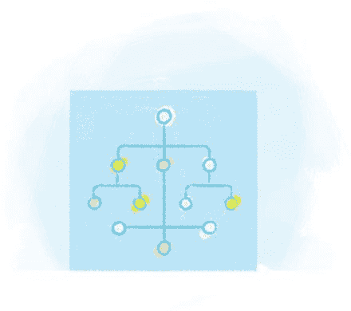
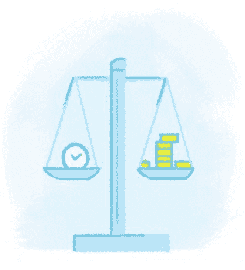

# 接受工作邀请的正确方式|设计师基金

> 原文：<https://designerfund.com/bridge/right-way-accept-job-offer/?utm_source=wanqu.co&utm_campaign=Wanqu+Daily&utm_medium=website>

所以你收到了一份工作邀请。恭喜你！这个角色正是你一直在寻找的，薪水有竞争力，福利待遇看起来很棒，你相信公司的使命，他们有现成的冷饮！你迫不及待地想签字——但你现在还不应该。

时不时地，我会看到一位设计师欣喜若狂地与一家公司签约，却在 6 个月后发现这份工作并不是他们所期望的。

人们可能很容易被一份工作的兴奋所吸引，或者离开旧雇主并停止找工作的解脱。但是紧急情况会导致短视的决策。如果你带着对新角色的错误期望签约，你可能会发现自己的处境比开始时更糟糕。仅仅几个月后就离职是一个双输的局面:你需要从头开始寻找，这可能会损害你的声誉，而你的雇主则损失了招聘和录用你的时间和其他资源。

怎么才能避免这种命运？这一切都归结于在**报价窗口**期间的尽职调查，即收到报价后接受报价前的几天。我通过[设计师基金的桥梁项目](http://designerfund.com/bridge)帮助设计师进入顶级科技公司，已经看到候选人收到数百份工作邀请。所以我分享了我的清单，每个设计师在签字之前都应该做些什么。

## 先来一句鼓励的话

在我们深入探讨这些技巧之前，我想承认，在聘用窗口期的尽职调查要求你向你的潜在雇主提出一些尖锐的问题，以及知道你需要什么。我认为候选人会出于以下几个原因避免这样做:

*   “等等，你能做到吗？”有些应聘者根本不知道工作机会是可以商量的，也不知道面试结束后继续提问是可以的。
*   “我很容易共事。”其他候选人希望以积极的关系开始这个角色，看起来容易相处，并表现出对这个机会的浓厚兴趣。所以他们会立即接受提议。
*   “我担心他们会取消提议。”我看到的最常见的是*基于恐惧的决策*。候选人担心，如果他们通过推后和要求额外的谈话给过程带来任何麻烦，公司会取消邀请。

这些设计师想走阻力最小的路，直接进入他们的新角色。但是，当额外的交谈为卓有成效的长期关系打下基础时，这是值得的。报价窗口是进行这些讨论的最后机会。此外，公司很少取消聘用，尤其是在健康的就业市场和良好的求职者与雇主关系中。一个雇主想要*你*，他们已经投资了你的招聘。在你所有的交流中保持礼貌，你会发现公司会很乐意参与。准备好接受第一个提示了吗？

## 签字前消除歧义(即使这意味着要进行艰难的对话)

在你签署一份聘书之前，确保你和你的潜在雇主对你的角色有相同的看法。捡起所有未被挖掘的石头，特别注意以下区域:

*   **角色和职责:**你的职责将如何与你的队友和跨职能部门的同事的职责重叠和交叉？
*   **头衔:**你的头衔是否与你的经验水平相符，是否与面试过程中讨论的内容一致？一旦你开始工作，就很难跳到更高的职位，所以聘用期是讨论职位相关问题的最佳时机。
*   **成功与回报:**3 个月、6 个月、12 个月的成功是什么样的？谁会评价你，他们会用什么标准？如何奖励成功，围绕奖金、股权更新和加薪的文化是什么？
*   晋升:你对晋升到下一个级别有什么期望？评估什么时候开始？

我曾经建议一位设计师，当她收到一家公司的录用通知时，她非常激动。这个职位对她的经验水平来说太初级了，但公司向她保证，如果她能在工作中证明自己，她可以晋升到高级职位。该提议的其余部分看起来很合适，但它遗漏了一个关键细节:*公司什么时候会考虑她的晋升？候选人认为这将是大约 6 个月，但只是为了确保，她问他们之前签署了要约。事实证明，该公司的想法是 2 年——完全不同的故事。一旦这个细节浮出水面，他们就能够在半年内解决一个可能成为交易破坏者的问题。*

## 关起门来考虑员工说的话

offer window 是一个很好的机会，可以让你与面试时没有机会见面的员工进行后续对话，比如关系密切的跨职能部门同事或你未来的经理。(确保在面试过程中至少有一次和老板面对面的机会)。对于早期阶段的公司，你可以考虑通过要求与公司的投资者或顾问交谈来进行“背景调查”。

你也可以对面试中遇到的员工提出后续问题。许多候选人只与招聘人员互动，但如果人们要求直接与面试官联系，一些对话会更有成效。

当你进行这些对话的时候，从字里行间体会公司的设计文化、层级、价值观和个性。(用[设计师在加入创业公司之前应该考虑的 5 个问题](https://medium.com/bridge-collection/5-questions-designers-should-ask-before-joining-any-startup-d22d83fa00#.flxrwxq8a)来揭开这些细节。)

特别注意语气，如果一名员工对他们的队友、你未来的项目或公司领导过于消极，就认为这是潜在工作环境问题的警告信号。员工在追求候选人时应该表现得最好。

例如，我的一位顾问设计师参加了一家初创公司的工程主管的面试，他随口说了一句“设计是项目的拦路虎”。这个评论是一个更大问题的征兆:工程团队和领导层不重视设计，它对那个初创公司几乎没有影响。相比之下，在另一家公司的面试中，候选人注意到一名工程师公开谈论与设计合作。这标志着一个更好的环境。

## 总协商

根据 2016 年 7 月[对全国 500 多名设计师的调查](https://www.comparably.com/culture/38/3/did-you-negotiate-your-salary?utm_source=socialshare&utm_campaign=insights&utm_medium=email)，只有大约**一半**的设计师协商了他们最近的薪水。

为你的价值谈判。可以使用 [LinkedIn 薪资](https://blog.linkedin.com/2016/11/02/introducing-linkedin-salary-unlock-your-earning-potential)、 [Glassdoor](https://www.glassdoor.com/index.htm) 、[比较](http://comparably.com)等工具，找到适合自己经验水平和所在城市的薪资基准。在你的雇佣条款中还有许多其他可协商的变量，包括股权、签约奖金和头衔，这些都可能影响未来的头衔。你也可以就一揽子计划的“软”方面进行协商，比如开始日期、时间表、搬迁津贴和通勤帮助。

(如果你希望加入一家初创公司，请查看[如何理解和协商你的初创公司薪酬](http://designerfund.com/bridge/how-to-understand-and-negotiate-your-startup-compensation/)以帮助平衡薪资和股权。)

当然，出价窗口并不是关于行使新获得的权力或利用谈判地位。这是一种微妙的平衡，既要提出自己的需求，又不能给公司开出“需求清单”(当然，如果在过程的后期你有一长串的需求，这个职位可能不太适合。)我建议你优先考虑你的愿望，只传达最重要的愿望。事实上，我见过一个有效的策略，候选人选择一个项目，然后说，“如果我们同意‘X’，我今天就签字。”

在工作谈判之前，一个有用的雇主视角是首轮资本的“[一个反直觉的创业补偿系统](http://firstround.com/review/A-Counterintuitive-System-for-Startup-Compensation/)”一些科技公司不会就薪酬进行谈判，以便创造公平的竞争环境，或者与他们公开或透明的薪酬结构保持一致。例如，Clef 对他们削减后的薪酬体系直言不讳，而且不会就薪酬进行谈判；查看他们的[工资和股权薪酬](https://github.com/clef/handbook/blob/master/Employment%20Policies/Salary%20and%20Equity%20Compensation.md)了解更多信息。

## 知道你的权利

公司经常会问你上一份工作的薪水是多少，这个问题你可能在面试开始时就遇到过。但它也可能在谈判过程中再次出现。

知道你不需要在面试或谈判中透露这个数字。事实上，马萨诸塞州[在 2016 年通过了一项法律](http://www.businessinsider.com/massachusetts-equal-pay-law-2016-8)，该法律规定，潜在雇主为管理谈判过程中的偏见而询问候选人过去的工资是非法的。包括加利福尼亚在内的其他州也提出了类似的法案。

查看像这样的资源[讨论](https://www.theladders.com/career-advice/How-to-Respond-to-the-Question-What-Are-Your-Salary-Requirements-Ask-Amanda/)和这篇[文章](http://www.businessinsider.com/massachusetts-equal-pay-law-2016-8)中关于如何处理这个问题的脚本。分享你的工资有时会阻碍你未来的薪酬，所以考虑将讨论转移到行业基准。当然，如果你愿意或者有益的话，你可以披露你过去的薪酬历史，但这是一种选择，而不是强制要求。

顺便说一下，在面试或谈判过程中，还有几个其他的个人细节你不需要在任何时候分享，比如你的年龄和婚姻状况。([点击此处查看完整列表。尤其是在初创公司，面试和后续讨论可能非常随意，就像和朋友聊天一样。但是你仍然不需要透露比你想要的更多。](http://www.businessnewsdaily.com/4037-illegal-interview-questions.html)

## 调整报价窗口(小心定时炸弹)

花点时间考虑你的提议，做最后的调查。至少，考虑一下，不管你多么兴奋地答应。

你可以通过与雇主沟通来管理你的工作机会。提出问题并发送更新，这样他们就知道你还没有“消失”一个好的经验法则是，除非经过讨论，否则做决定的时间不要超过一周，否则他们会怀疑到底发生了什么。家酿公司的[创业补偿指南](https://quip.com/HEB3Ah9dYD6o)有一个关于提供过程时间的章节，给雇主们一个可以期待什么的指南。

当心爆炸优惠，24 小时后过期。我们经常在技术上看到这些，如果你收到一封，考虑一下为什么公司会使用这种策略。这些雇主通常认为，当你进入录用阶段时，你应该准备好做出明智的决定，所以如果你在做出决定前需要更多信息，或者你正在等待另一家公司的录用通知，让他们知道。如果你要求延期，公司通常会很灵活，即使只是一天左右。无论你做什么，不要觉得被胁迫当场做出承诺。

睁大眼睛做出明智的决定。一旦你有了信心，就说好吧！我们希望你的尽职调查能为你建立一个长期的、互利的、相互支持的关系。