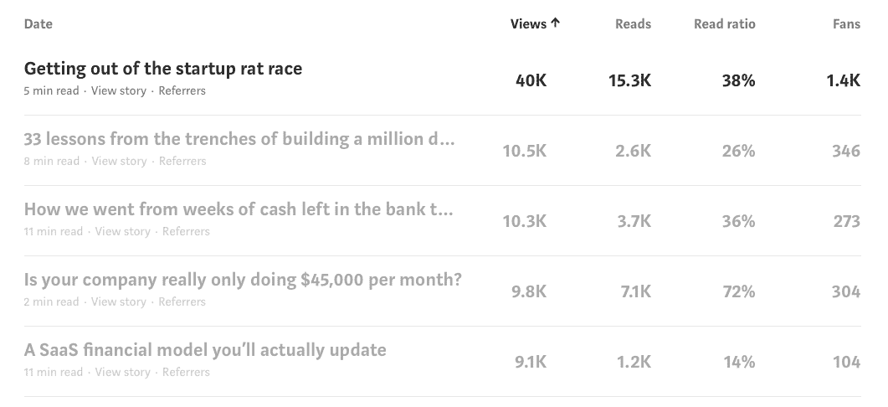
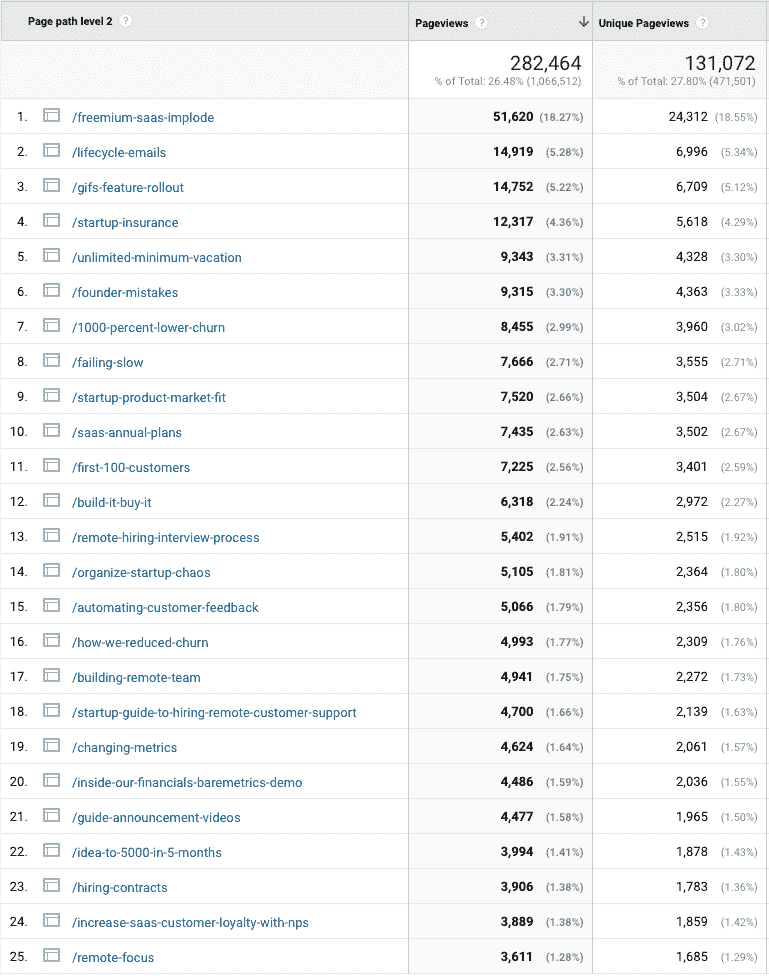

# 为什么我们从 Medium 回到我们自己的博客——bare metrics

> 原文：<https://baremetrics.com/blog/medium-back-to-blog?utm_source=wanqu.co&utm_campaign=Wanqu+Daily&utm_medium=website>

对于许多企业来说，在哪里发布信息已经成为一个艰难的决定。你读了这么多关于使用各种渠道来分发内容和增加流量的故事，很难知道什么行得通，什么行不通。尤其是 Medium，它已经成为创业内容领域的主要参与者，但它真的有那么伟大吗？

我当然被大量的流量和大量的赞(或者媒体现在称之为“粉丝”)所诱惑。但是，这如何转化为对业务有意义的东西呢？

这是我们的故事，讲述了我们如何使用媒体，哪些有效，哪些无效，以及经过几年的试验后，我们现在的策略是什么。

## 与内容营销一起成长

在 Baremetrics 之前，在我之前创办的公司，我涉足过内容营销。但不是高质量的东西……大规模生产的、花钱请人随便敲 500 个词的 SEO 关键字之类的东西。你可以想象，我什么也没得到。完全没有价值，全面的。

所以当我开始 Baremetrics 的时候，我知道我想以不同的方式做事。

我朝这个方向迈出的第一步实际上在我推出 Baremetrics 之前就已经开始了。我在推特上直播了很多 Baremetrics 的发布过程，并从一开始就非常开放地介绍了公司的运营情况。

早期，我决定将“透明度”作为业务的核心部分，无论是在我们的运营方式上，还是在我们的营销策略上。上线三个月后，我[公开了我们所有的号码](https://baremetrics.com/blog/inside-our-financials-baremetrics-demo)，从那时起，我开始分享我能想到的一切。

这就是我早期的全部内容营销策略:**分享一切**。

这种立场确实帮助博客迅速发展。我每周都发布我正在尝试的所有事情，它获得了相当大的势头，使博客成为人们定期查看并期待每周新内容的地方。

## 然后是媒介

大约两年后，我发现自己在 Medium 上阅读了大量内容，各种各样的企业都在将他们的出版物转移到 Medium 上(在我看来，其中最突出的是 [Basecamp 的 Signal v. Noise](https://m.signalvnoise.com/signal-v-noise-moves-to-medium-c8083ce19686) )。

我在我们自己的博客上发表了很多很多文章，取得了巨大的成功，但是 Medium 开始看起来像另一边的一些真正的绿草。不仅仅是从“哦，交通！”前景，但媒体也有一个相当活跃的社区，我自私地想要内啡肽热潮。

我真的不知道该如何处理。我们应该把博客上的每篇文章都转移到媒体上吗？我们是否向媒体发布新内容，然后再转贴到我们自己的博客上？从 SEO 重复内容的角度来看，我们如何在技术上处理这个问题呢？它会蚕食时事通讯的注册吗？

很多问题，但是很少有数据。不是因为人们没有做过，而是因为很多事情都是基于你的目标和你想从中得到什么。

## 开关

最初敲定向媒体转型的是我发布了一封来自投资者的电子邮件。这让我第一次尝到了成功的滋味。

我们的游戏计划是将所有新内容发布到我们的媒体出版物上，并将其设置在一个子域(baremetrics.com/blog)上。我们会保留旧的博客，然后在新内容创建时发布链接。我们也会慢慢地将过去的内容转移到媒体出版物上。

在 2017 年的大部分时间里，所有新的博客帖子都直接进入了 Medium。老实说，真的很愉快。在媒体上出版是如此的容易。格式化内容和上传图片基本上是零时间。这真的是我迄今为止最棒的网络出版体验。

我没有太注意数据。我只知道我们得到了很多赞和亮点，这引发了有意义的讨论，所以这感觉像是一场胜利。

## 再次猜测开关

在 Medium 上发布了大约一年后，我们自己的营销网站的流量(理所当然地)受到了冲击。时事通讯的注册量也在下降，总体而言，围绕 Baremetrics 内容的“讨论”明显减少了。

我意识到 Medium 在呈现内容方面确实很棒，但是它去掉了内容的*面*。它中和了所有内容，基本上是作者不可知的。这就像沃尔玛或亚马逊，你可以从数以千计的不同品牌中购买，但你很少真正知道你买的是什么品牌…你只知道“我从亚马逊买的。”

介质上的内容也是如此。当然，你可以看到作者是谁或它在什么出版物上，但最终你的收获是“我在 Medium 上读了这篇文章”，这不是我想要的。我想回到人们所说的“我在 Baremetrics 上读过这篇文章”上。

最重要的是，一篇给定的文章最终获得的浏览量并不令人印象深刻。至少不比我们自己的博客多多少/多多少(考虑到我们已经建立了一个不错的读者群)。

举个例子，我们在 Medium 上的热门帖子的总浏览量在 8-10k 之间(我们最好的帖子达到了 40k 左右，尽管这是一个异常值)。

在前 5 名之后，每篇文章的浏览量急剧下降到 500-1k。

而我们自己的博客，在此之前，基本上每篇文章的阅读量都是这个数字的数倍。

这些数字没有任何意义。是的，我可以在媒体上投入更多的内容，并试图建立更多的读者群。Basecamp 的人经常在他们的内容上获得 25 万以上的浏览量。但是从长远来看，这样做对 T2 的帮助最大。他们一直在四处摸索，试图找出如何让 Medium 可持续发展，我只是不相信他们会一直做对我们和我们的业务最有利的事情。

## 切换回来

现在我不想完全抛弃媒体上的发行。在那里，*联合*内容肯定会有一些好处。它本质上是另一个向人们展示我们内容的分发渠道。

因此，我们需要一个游戏计划，在不影响我们自己的读者群或搜索引擎优化工作的情况下，如何利用媒体作为分销渠道。

这个游戏计划包括两个主要部分。

### 删除自定义域

我们决定停止在 Medium 上使用“baremetrics.com/blog ”,并将所有这些 URL 重定向回“baremetrics.com/blog”上的相同内容。这个过程相对来说没有痛苦。

我提前把 Medium 中所有缺失的内容添加到我们自己的博客中，然后我设置了 301 重定向。我将“baremetrics.com/blog”指向我们在 WordPress 上运行的营销网站，使用神奇的[重定向插件](https://redirection.me)能够监控这些媒体重定向中的任何 404 错误，并立即从中创建必要的 301 重定向。

这里唯一的问题是，你必须给 Medium support 发电子邮件来删除自定义域名(这是我事先没有意识到的)，所以有大约 12 个小时的时间，Medium 上的所有文章都无法访问，因为 Medium 强制输入了不正确的 URL。

### 向媒体重新发布新内容

展望未来，我们仍将在媒体上发布，但有两大注意事项。

1.  我们将在两周后向 Medium 发布新内容(因此，从 SEO 的角度来看，最初发布的内容能够被巩固为主要来源)。
2.  我们将使用 Medium 的[导入工具](https://medium.com/p/import)来发布内容。Medium 掩盖了这一点，但它让我们在 Medium 上重新发布，并让他们将[规范 URL](https://support.google.com/webmasters/answer/139066?hl=en) 设置为你自己网站上的原始帖子。这是 SEO 方面的一大进步，因为它告诉 Google 你的原创文章是主要的，应该在搜索结果中优先显示。

通过这种方法，我们仍然拥有原始内容，获得作为主要来源的好处，并获得媒体的分发好处！

通过使我们自己成为原始的、权威的来源，我们能够长期控制整个经验*和对我们有利的*，而不是潜在的*短期胜利*到*中期利益*。**

## **你呢？**

**那你呢？当你建立内容和读者群时，什么对你有用？**