# 如何成为 T 型营销人员

> 原文：<https://blog.bufferapp.com/t-shaped-marketer?utm_source=wanqu.co&utm_campaign=Wanqu+Daily&utm_medium=website>

在成为营销人员之前，布莱恩销售保险。

阿尔弗雷德曾在军队服役。

Arielle 是一名健康教练。

我是一名体育记者。

现在看看我们！[我们是一个由八名 Buffer 营销人员组成的团队](https://buffer.com/about)，他们有着截然不同的背景和教育背景，每周总共带来 20，000 名 Buffer 注册用户。我们中的许多人无意或有意地陷入了市场营销。我们边走边学。

我们到底要去哪里？

好问题！我们从[免费营销课程](https://buffer.com/resources/social-media-classes/)和[丰富的教育内容](https://buffer.com/resources)中受益匪浅。然而，对于我们获得的技能或我们正在走的道路，我们并不经常有一个具体的愿景。

这和你的营销经验有共鸣吗？你有简单的方法来回答吗，**“当我们被要求成为‘T 型’营销人员时，这意味着什么？”**

自从我在营销团队中担任领导角色以来，我就成了向他人提出 T 形问题的人，所以似乎是时候弄清楚 T 形对 Buffer 的意义以及对 Buffer 以外的数字营销人员的意义了。这是我想到的。我喜欢你的想法！

(注意:这完全是我们在 Buffer 进行营销的特有方式。YMMV，尽管希望这对你和你的团队来说是一个好的起点。随意复制编辑！)

## 缓冲区的 T 型营销人员示意图

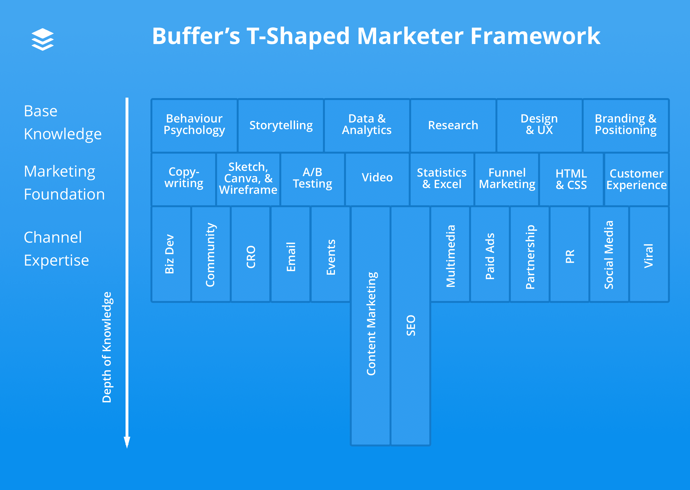

这就是我们在 Buffer 对 T 型营销人员的看法。如果你想为你的公司定制，请随意下载我们用来构建这个的[草图文件](https://www.dropbox.com/s/tdr0loxi2wtkvhd/T-shaped%20marketer%20framework%20-%20editable.sketch?dl=0)或 [Canva 模板](https://www.canva.com/design/DACQuL5OaYQ/CCIG5g3szGG4tgoExYjXwQ/view?utm_content=DACQuL5OaYQ&utm_campaign=designshare&utm_medium=link&utm_source=sharebutton)。

**一般来说，缓冲营销团队的每个人都会具备图中所列的所有基础知识和营销基础技能；此外，每个队友将选择至少一个他们是专家的主要渠道。**

下面会有更多的介绍，但是首先，我想解释一下 T 型身材的人的总体情况。

T 型人的概念来自于招聘领域，它描述了一个人给工作带来的能力——他们能力的**深度**和**广度**。“T”的垂直、上下主干代表一个人在一个或多个领域的深度，“T”的水平、左右主干代表一个人的广度。

> T 上的竖线代表单个领域相关技能和专业知识的深度，而横线代表与其他领域的专家进行跨学科合作以及将知识应用于自己专业领域之外的领域的能力。

“多面手”这个词经常被用来形容 T 型身材的人；虽然在我们 Buffer 的例子中，多面手是指拥有相对较短的垂直 T 型茎和非常宽的水平 T 型茎的人。

我们的 T 形营销人员图在很大程度上依赖于 Brian Balfour 在 2014 年用他的 T 形描述奠定的基础。在他的文章《成为客户获取专家》中，Brian 为人们如何提高他们的营销技巧描绘了一幅蓝图。布莱恩的研究基于一篇从《T2》中提炼出来的文章。如果你渴望了解更多关于 T 型营销者的知识，Brian 和 Distilled 的文章都是很好的起点。

## T 型营销人员的三个组成部分

如图所示，T 型营销人员的能力分为三个不同的部分:

1.  基础知识
2.  营销基础
3.  渠道专业知识

**基础知识**是那些无论你从事何种工作都非常适合你的非市场营销领域。

理论上，任何申请 Buffer 营销职位的人都应该具备这些能力，而当前营销团队中的任何人都应该首先关注这些领域的提升。这些基本能力确实会渗透到你需要的其他技能中。

营销团队中的每一个人都应该对所有基础知识箱感到舒适。

**营销基础**是对几乎所有营销渠道都有用的营销特定主题。

我们的清单并不完整。例如，Brian Balfour 的 2014 年模型将转化率优化(CRO)作为一项基本技能。我们并不期望团队中的每个人都具备 CRO 的基本技能(事实上，我们认为这是一个可以让你成为专家的渠道)。另外，Brian 提到了数据库查询。这对我们来说并不重要。你公司的营销基础很可能需要一些独特的技能。

营销团队中的每个人都应该对所有营销基础盒感到舒适。

**渠道专长**指受众和获取渠道。

这样的例子太多了，我们还在不断发现新的例子。例如，几年前，产品营销不是我们的渠道。现在，这对我们有好处。另一方面，有些领域，比如销售，我们在 Buffer 不做。

渠道专家的想法是,*某人将拥有一个或多个渠道，他们对这些渠道有很深的了解。*

## 当测试看起来像渠道专业知识中的 M:变体时

正如你可能亲身经历的那样，你的技能并不总是整齐划一，尤其是当你作为营销人员不断发展的时候。

T 型绝对只是一个框架。在我们的团队中，我们有各种各样的人，他们有各种各样的技能，都有不同的深度和广度。

在某些情况下，T 可能有三个不同长度的垂直干。(一个“m .”)

对其他人来说，它可能有一个非常非常深的茎。

如果有帮助的话，下面是我们当前团队在 T 型营销模型中的快速视图。

### 阿尔弗雷德，内容制作者

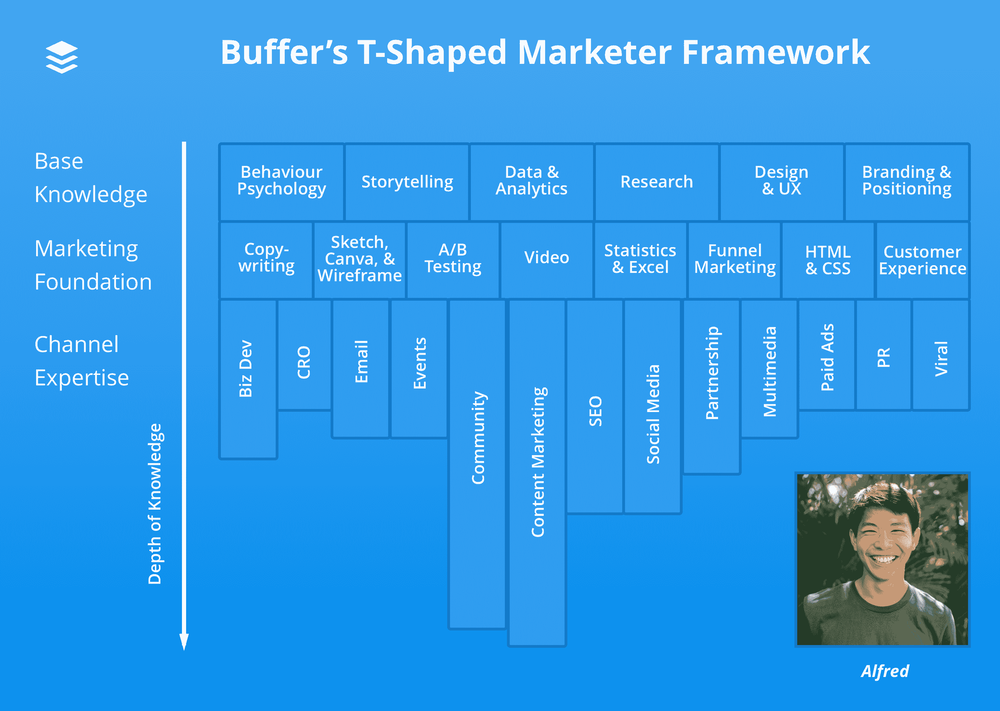

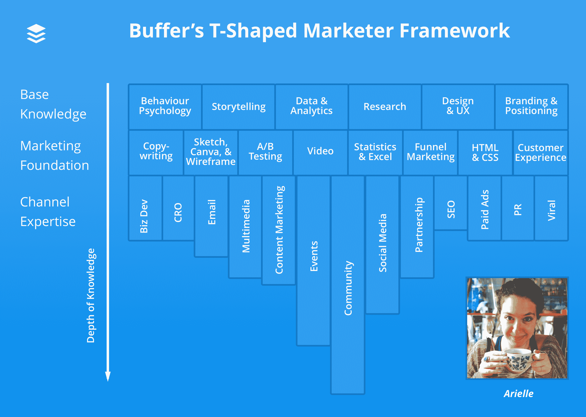

### Ash，执行主编

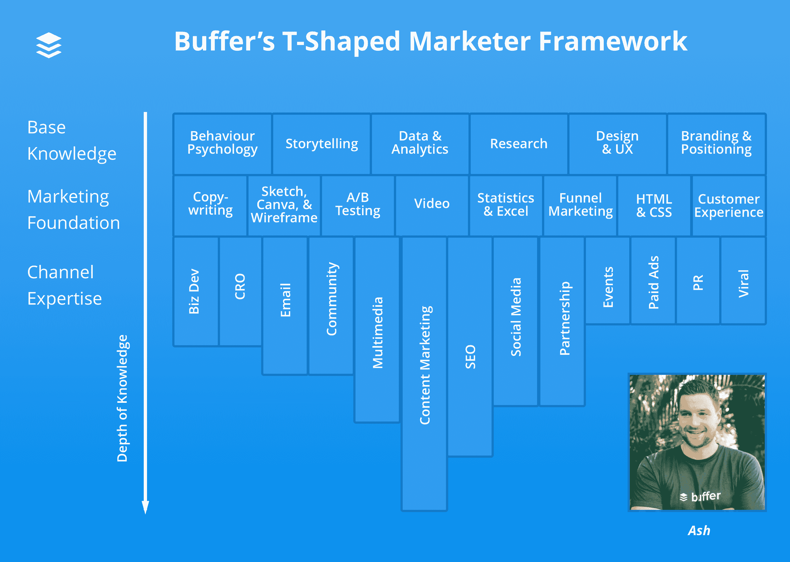

### 邦妮，忠诚营销人员

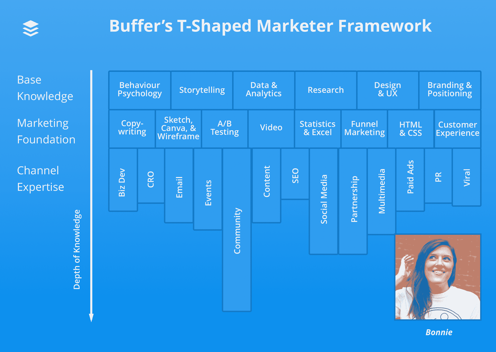

### Brian，数字营销策略师

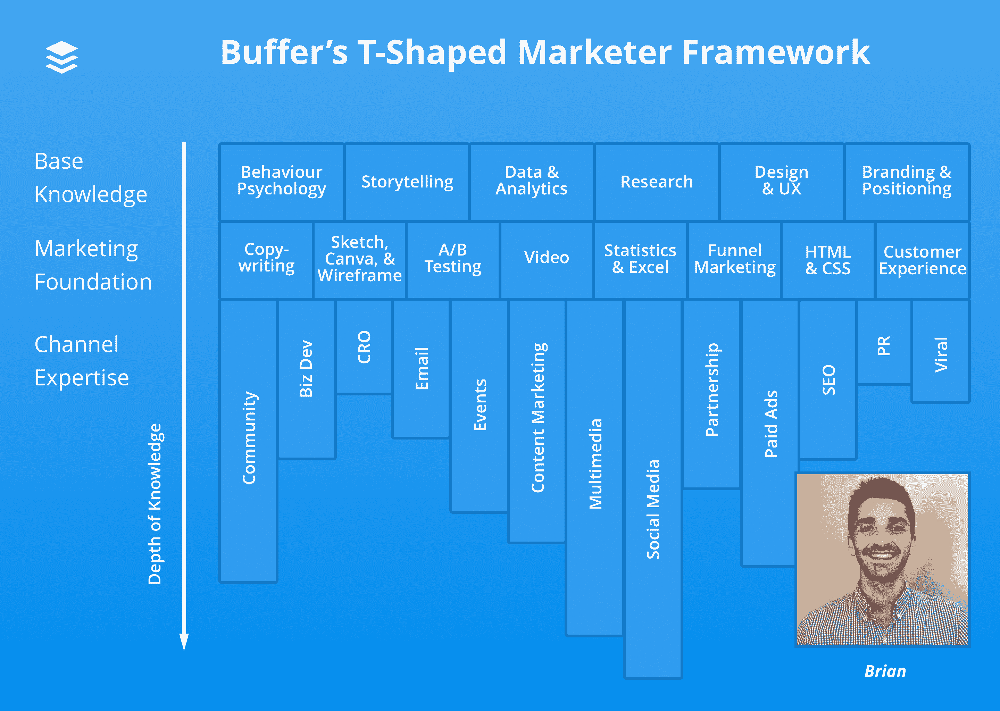

### 海尔利，公关和传播策略师

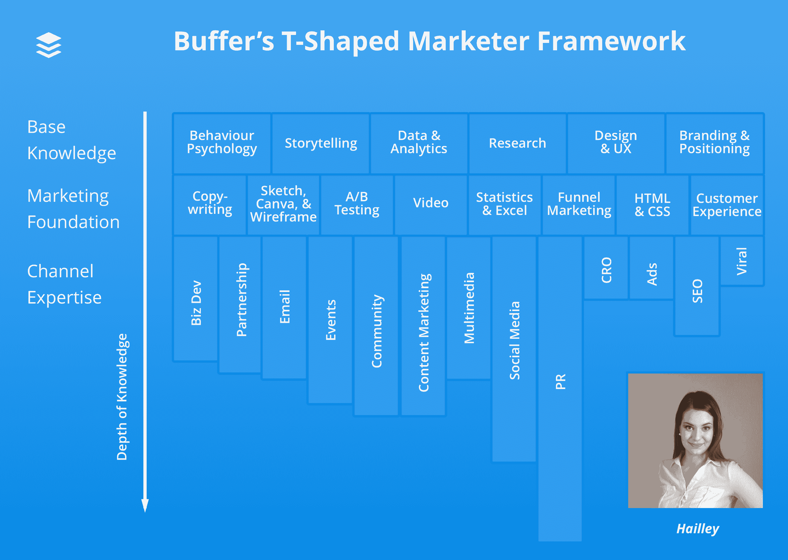

### 迈克，产品营销人员

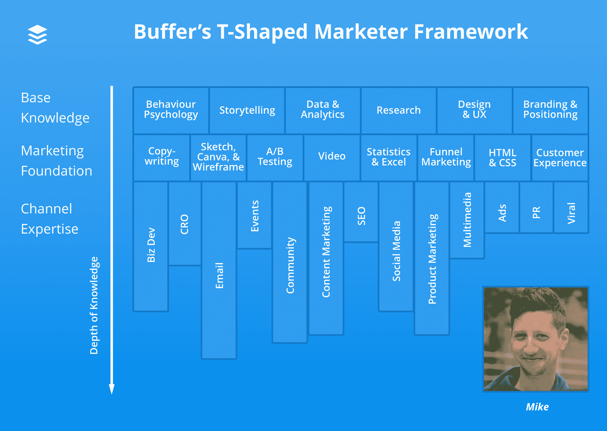

### 斯潘塞，增长型营销人员

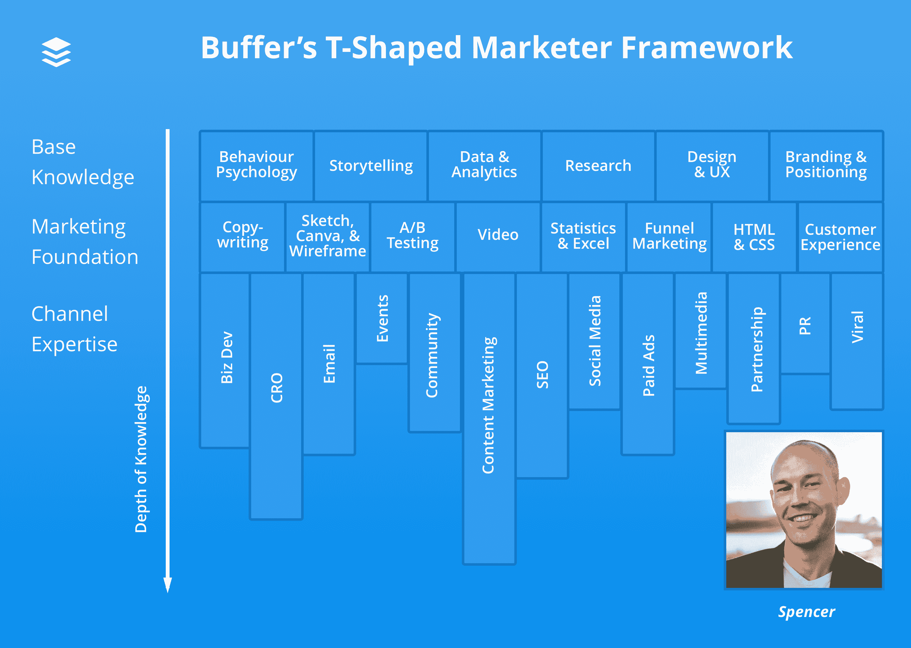

## 如何提升你的 T 型营销技巧

当然，一旦你知道自己作为营销人员的成长方向，接下来要问的问题之一就是如何到达那里。幸运的是，有大量的资源可以帮助你掌握任何营销技巧。这里有一些我们发现有用的资源，因为我们已经在缓冲 T 型营销人员的所有不同领域进行了升级。

### 基础知识

#### **行为心理学**

这方面的知识有助于你更好地理解人们为什么做他们正在做的事情——这是几乎任何工作都需要的技能，尤其是当你渴望理解人们为什么点击、喜欢、分享和购买的时候。

#### **讲故事**

我们认为讲故事和文案是不同的事情。讲故事是关于知道如何组织一个故事。文案是关于知道用正确的词语来表达叙述。

<iframe src="https://www.youtube.com/embed/xTM-AdrIpaE?feature=oembed" frameborder="0" allow="accelerometer; autoplay; encrypted-media; gyroscope; picture-in-picture" allowfullscreen="">VIDEO</iframe>

#### **数据和分析**

在你进入 Excel，Looker，SQL 等等的杂草之前。，有一个数据和分析的一般概念的基础是很重要的，这样你就知道什么是可以学习数据的，什么是好的数据分析。

#### **研究**

我们很幸运地在 Buffer 的客户开发部门做得很早，这帮助我们培养了一种研究文化。在具体的市场营销术语中，研究意味着与你的受众核实，了解他们的经历、问题和愿望。更一般地说，研究是让一个人的好奇心进入一个过程。

#### **设计和 UX**

我们不期望缓冲营销人员是设计专家(我们已经写了几篇文章承认我们离专业人士还很远)。相反，我们寻求的是一种有教养的设计眼光:你有好的品味吗？你能识别出导致高质量的设计元素吗？

#### **品牌和定位**

这个可能也适合“市场营销基础”，但我认为品牌是一个更大的概念。我们都有个人品牌(无论我们是否积极培育)。我们为新的工作和机会做好准备。这里有一个超越营销的基础知识。

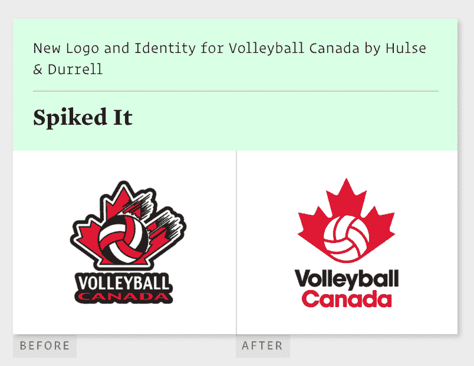

### 营销基础

#### **文案**

正如我上面提到的，文案是关于知道用最好的词来传达信息。

#### **草图、Canva 和线框**

这比“设计和 UX”的基础知识更上一层楼一旦你知道了设计的原则，你自己能创造出什么东西呢？Sketch 和 Canva 恰好是我们选择的工具。Photoshop 或其他软件可能对你的营销团队有意义。

#### **A/B 测试**

A/B 测试与转换率优化(CRO)有些相似，但我们将它独立出来，因为我们希望我们所有的营销团队都理解 A/B 测试背后的基本原理。首先，你有测试的心态吗？(换句话说，可能是“你有数据和增长思维吗？)其次，如果你考虑测试，你有能力将基本的科学测试带入你的专业领域吗？A/B 测试就像是我们科学测试的默认设置。

#### **视频**

对许多公司来说，视频本身就是一个渠道。对我们来说，视频是我们所做的社交媒体营销的一个重要组成部分，因此我们所有人都应该精通如何制作一个引人注目的视频，并在镜头前保持自信。

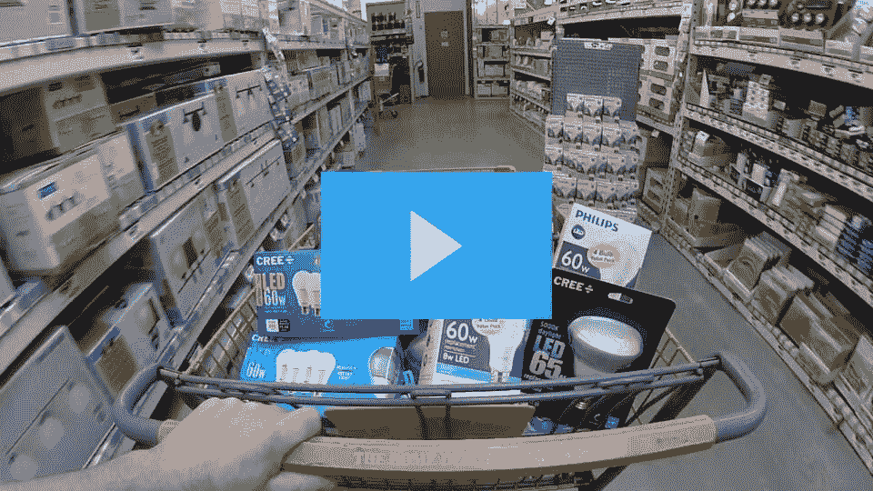

[羽绒和脏污 DIY 照明套件| Wistia 学习中心](https://wistia.com/library/down-and-dirty-lighting-kit?wvideo=08sepnnh2n)

#### **统计和 Excel**

这是超越数据和分析的下一步。我们希望团队中的每个人都能够整合一个可靠的电子表格来跟踪数字和目标。

#### **漏斗营销**

客户如何成为客户？这似乎是营销团队所有人都应该知道的事情，即使他们只对漏斗的一部分有特殊影响。

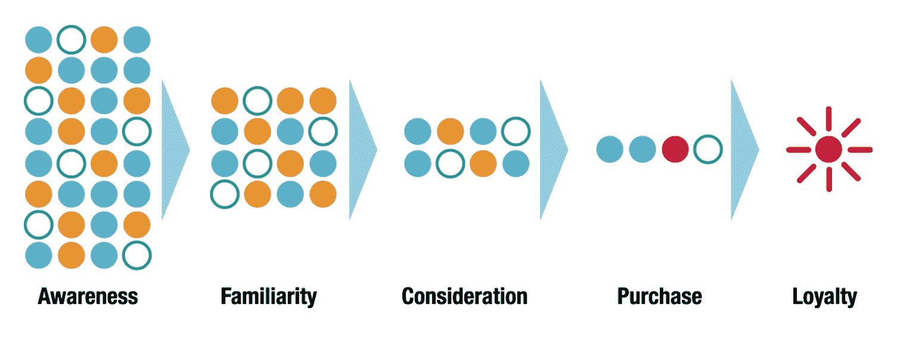

#### **HTML 和 CSS**

这种程度的代码知识可以在很多地方派上用场:博客文章、登录页面、电子邮件设计，等等。

*   社区:[堆栈溢出](http://stackoverflow.com/)
*   网址:[树屋](https://teamtreehouse.com/library)
*   提示:右键单击并选择“查看源代码”或“检查元素”来查看任何网站是如何构建的

#### **客户体验(CX)**

作为一家公司，CX 是 Buffer 的重要组成部分，这也是我们为营销团队强调这一点的原因。这可以从许多不同的方面来看:例如，跳进收件箱回答支持问题，或者思考潜在客户对发布、内容等的影响。

### 渠道专业知识

#### **商业发展**

业务发展是关键人物和公司的战略关系建设。例如，在 Buffer，如果你从事商业开发，你可能会与 Twitter、脸书、苹果 iOS 商店等网站的人建立联系。

社区是人与人连接的过程，公分母是 Buffer。

#### **CRO**

这也可以归类为漏斗底部营销。这里的目标是通过许多不同的途径来提高转化率:登陆页面、CTA、广告、内容等等。

#### **电子邮件**

电子邮件营销可能包括一次性活动、每日简讯、生命周期活动等等。除了擅长电子邮件的内容和转换，电子邮件专家还知道邮件送达的来龙去脉，电子邮件服务，以及其他许多电子邮件特有的技术细节。

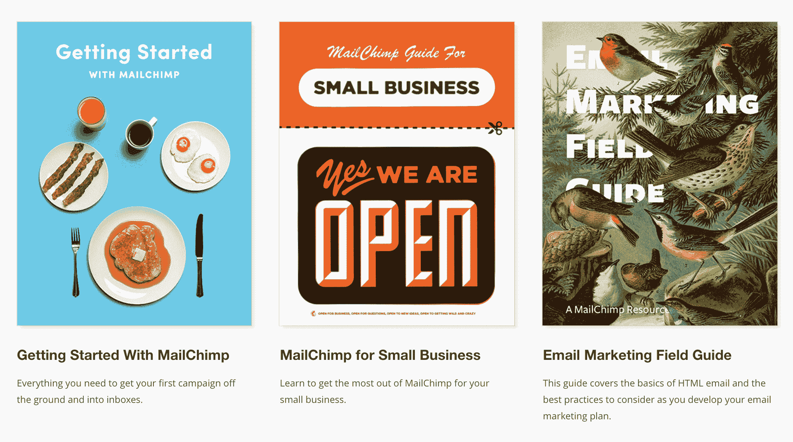

#### **事件**

活动专家可以做从聚会到会议的任何事情，并将活动成果与业务影响联系起来。

#### **内容营销**

内容营销主要是关于博客，尽管内容的真正定义延伸到你可能创造的任何东西。越来越多的“任何东西”似乎也适合放在博客上:视频、音频、幻灯片等等。

#### **SEO**

这与搜索引擎优化有关，包括内容/策略方面和技术方面。

对我们来说，多媒体频道专家展示了播客和视频制作的深厚技能。他们可以创建两种类型的媒体，并根据业务目标和现有内容制定多媒体策略。

#### **付费广告**

当我们谈论付费广告时，我们通常指的是社交媒体广告——脸书、Instagram、Twitter、Pinterest 等。然而，付费广告专家也可能擅长搜索引擎营销(SEM)、媒体赞助、横幅广告和展示广告。

#### **伙伴关系**

对于伙伴关系，我们将其定义为与同行公司建立互利关系的人，以推动营销目标。这是商业发展的另一种风格:商业发展更关注于必要的业务增长网络，而合作营销更关注于营销目标的特别合作。

#### **公关**

公关负责推动品牌的兴趣和提及率。在 Buffer，这包括媒体外联、入境公关、联合和沟通。

我喜欢加里·维纳查克把他的作品描述为云和尘土。他希望在最高战略层面和最具战术性的实地层面都能得心应手。对于展现社交媒体专业知识的人来说，这是真的。

#### **病毒式营销**

病毒式营销的结果是客户在为你销售你的品牌。有许多不同的杠杆可以实现这一点，不仅是推荐或忠诚度计划，还有对病毒式传播、心理学和网络效应的深刻理解。

#### **其他:国际营销、产品营销、移动营销。**

频道的清单可以一直列下去。我想到的其他几个例子包括国际营销(战略性地接触你的主要受众之外的受众)和移动营销(iOS、Android、应用程序等。).

## 关于培养技能和选择专长的建议

对于任何营销新手或对成为营销人员感到兴奋的人来说，我觉得像这样的框架有很大的潜力，不管是具体的盒子还是茎。

以下是我对职业发展的看法。

#### **1。数字营销人员的职业规划真的很难。**

事情变了。需求产生了。频道来来去去。最有价值的技能可能不是写作、视频或网络，而是简单的灵活性！

#### **2。平衡你喜欢什么，你擅长什么，你的团队需要什么。**

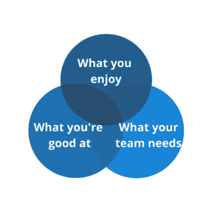

我们用这个文氏图来说明缓冲队友如何在团队中的角色之间移动。通常，我们会发现这三个因素的不同组合会促使人们去做一项工作。我建议在选择发展渠道时，将这些因素都考虑在内。

#### **3。在两个或两个以上的渠道上深入。**

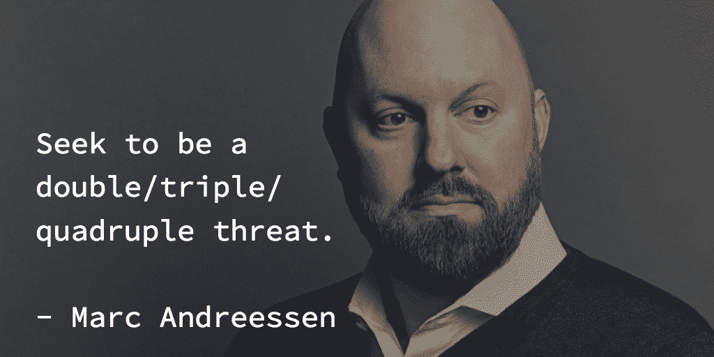

一项深层次的技能可能真的很有价值。我观察到的棘手问题是，大公司更看重深度。一个五人营销团队可能不需要一个主要贡献是搜索引擎优化的搜索引擎优化专家。一个五人营销团队需要一个能做好两个或更多渠道的人(并且能做得足够好)。

弄清楚你想加入的团队的规模，然后相应地培养你的技能。

#### **4。以罕见和不寻常的组合为目标。**

> 资本主义奖励既稀有又有价值的东西。你把两种或两种以上的“好东西”组合在一起，直到没有人拥有你的组合，让自己变得与众不同…

这是马克·安德森的一句名言，我很喜欢(在他的博客文章集中还有很多，你可以免费下载)。

你遇到过擅长付费广告和活动的人吗？内容和业务发展呢？那些是罕见的组合。当你在未来寻找工作时，将这些有些不同的技能结合起来，会使你的简历非常有吸引力。

#### **5。选择新兴渠道。**

布莱恩·鲍尔弗:

> 如果你刚刚开始你的数字营销职业生涯，并且还有很多年，我强烈建议你向新兴渠道倾斜。四年前，新兴渠道应该是脸书和内容营销。

今天的新兴渠道可能是数据、人工智能、客户体验和工程营销。如果你能在这些领域处于领先地位，当它们变得更广为人知时，你就处于有利地位。

## 轮到你了

我希望这篇关于 T 型营销人员的概述能帮助你找到你下一个需要学习的技能或者成长的方向。能听到你的想法真是太棒了！

*   你认为你的市场营销职业道路是什么样的？
*   你对我们的 T 形清单有什么要补充的吗？

*图片来源:[Unsplash](http://unsplash.com)T3】*

