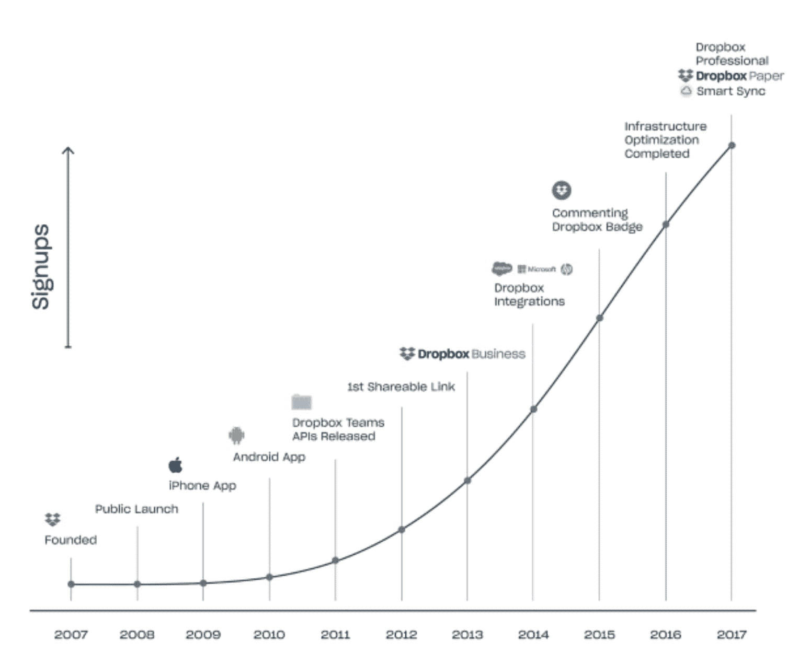
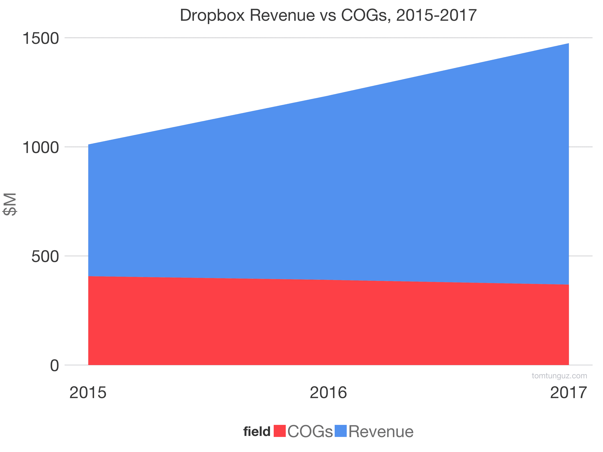
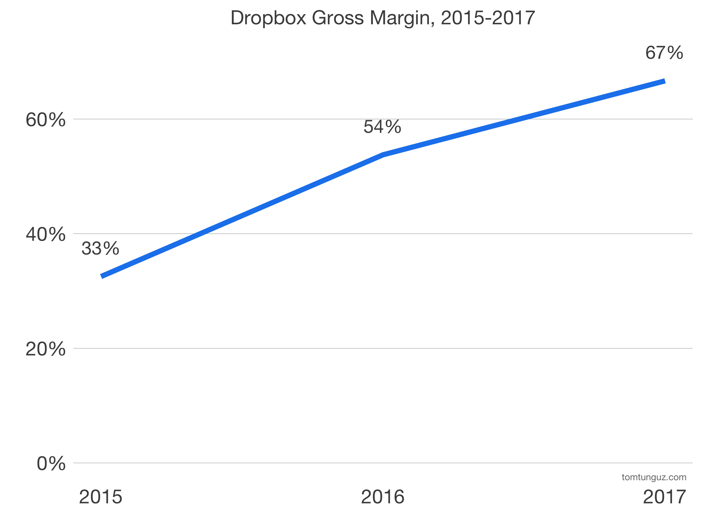
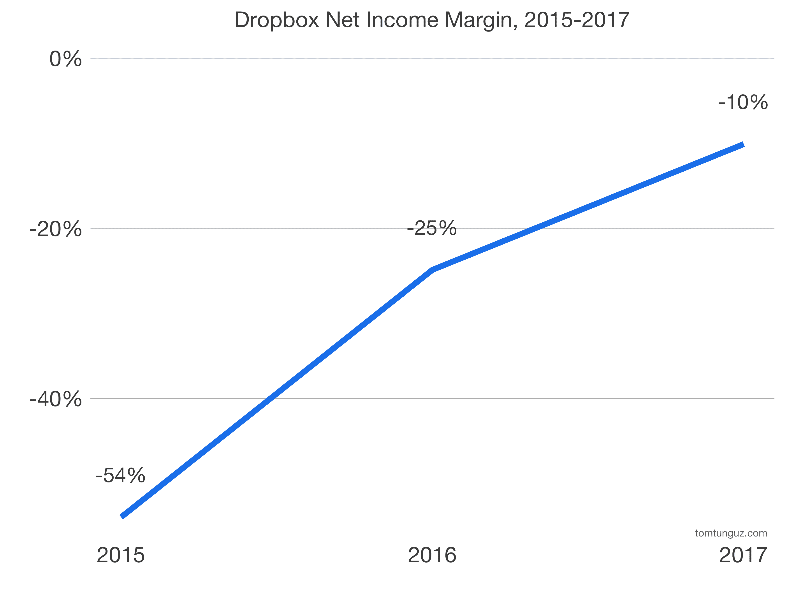
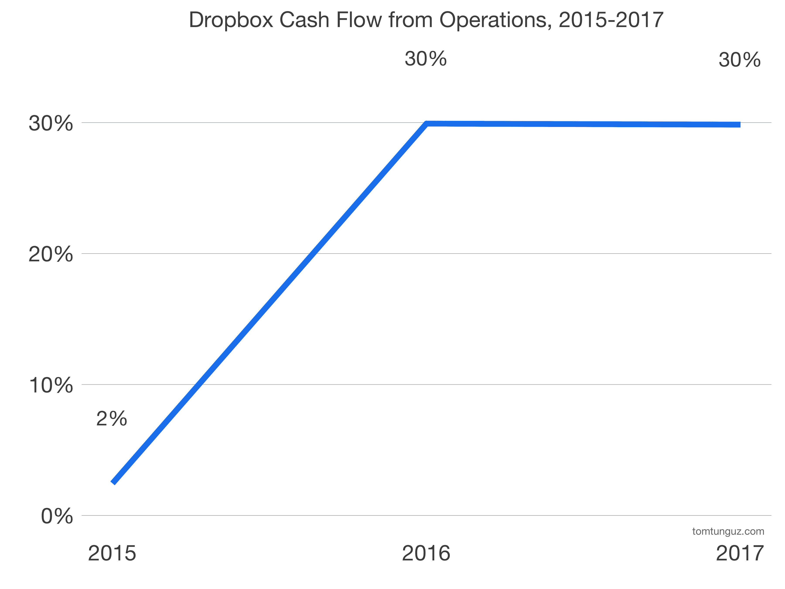
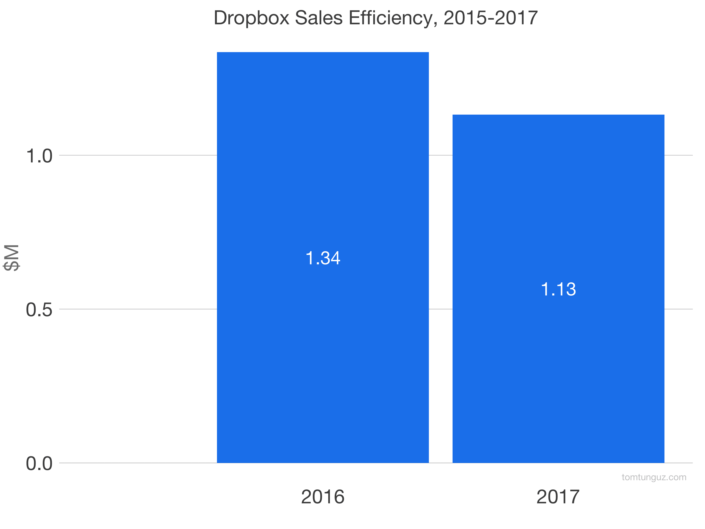

# Dropbox S-1 分析-免费增值之王

> 原文：<http://tomtunguz.com/dropbox-s-1/?utm_source=wanqu.co&utm_campaign=Wanqu+Daily&utm_medium=website>

[T2】](https://res.cloudinary.com/dzawgnnlr/image/upload/q_auto/f_auto/w_auto/dropbox_s_curve.png)

Dropbox 成立于 2007 年，是免费增值走向市场的缩影。在这段时间里，Dropbox 的用户从 0 增长到了 5 亿。2%的用户转为付费用户，平均每月支付 9.33 美元。90%的收入来自自助服务渠道——对于去年收入超过 100 亿 1B 的公司来说，这是一个惊人的数字。

[！[图片](  " width="500px"/ >](!%5B%5D(https://res.cloudinary.com/dzawgnnlr/image/upload/q_auto/f_auto/w_auto/https://res.cloudinary.com/dzawgnnlr/image/upload/v1531094342/DBX_revenue.png))

从 2015 年到 2017 年，Dropbox 的收入从 6.04 亿美元增长到 11 亿美元，年复合增长率为 35%。

[T2】](https://res.cloudinary.com/dzawgnnlr/image/upload/q_auto/f_auto/w_auto/DBX_cogs.png)

更令人印象深刻的是:该公司成功地将收入提高了近一倍，同时降低了每年在 COGs 上的支出。COGs 代表商品销售成本。存储着数十亿文件的 Dropbox 的图像、硬盘和存储是 COGs 的主要组成部分。

这种下降是由于用户政策的变化，影响了一年或更长时间不活动的用户，以及转向运营自己的数据中心而不是使用云提供商。

[T2】](https://res.cloudinary.com/dzawgnnlr/image/upload/q_auto/f_auto/w_auto/DBX_gm.png)

由于这些效率的提高，毛利润在这段时间内有了显著的提高。通用汽车同期增长了一倍，从 33%增长到 67%。尽管基础设施开销巨大，但 Dropbox 的毛利率正迅速接近 SaaS 公开数据的中位数 71%。

[T2】](https://res.cloudinary.com/dzawgnnlr/image/upload/q_auto/f_auto/w_auto/DBX_nim.png)

净收入利润率也接近公共中位数，目前为-10%。大多数 SaaS 公司都在这个范围内开展业务。

[T2】](https://res.cloudinary.com/dzawgnnlr/image/upload/q_auto/f_auto/w_auto/DBX_fcfom.png)

大规模免费增值的好处体现在运营指标的自由现金流上。2017 年，Dropbox 从 ops 中产生了超过 3 亿美元的自由现金流，过去两年一直保持着 30%的来自 ops 利润率的现金流。

[T2】](https://res.cloudinary.com/dzawgnnlr/image/upload/q_auto/f_auto/w_auto/DBX_se.png)

这种现金流直接来自企业的销售效率。据估计，Dropbox 的销售效率为 1.1，是所有公众中最高的，包括像 [Shopify](http://tomtunguz.com/shopify-s-1/) 这样的明星。与其他 SaaS 公司不同，Dropbox 在工程上的支出超过了销售和营销支出。通常，企业在 S & M 上的花费是两倍

| 田 | 箱子 | Dropbox |
| --- | --- | --- |
| 收入 | Three hundred and ninety-nine | One thousand one hundred and seven |
| 收入增长 | 32% | 31% |
| 毛利 | 72% | 67% |
| 净收入差额 | -38.1 | -0.1 |
| 来自运营部门的自由现金，百万美元 | -1 | Three hundred and thirty |
| 运营利润中的自由现金 | 0% | thirty percent |
| 预计销售效率 | Zero point four | One point one |
| MC/2017 修订版倍数 | Seven point nine seven | Seven point nine seven |
| 市值 | Three thousand one hundred and seventy-five | Eight thousand eight hundred and sixteen |

与 YCombinator 早期的竞争对手 Box 进行比较是不可避免的。该表总结了一些关键指标。

Dropbox 的收入是它的两倍多，但增长速度是它的两倍。这两家公司的毛利率大致相当。但 Dropbox 的净利润和来自运营利润率的自由现金流要高得多，这是因为自助式客户获取机制。Dropbox 在销售和营销支出方面的每美元毛利润是 box 的 2 倍。

假设 Dropbox 的市值与 box 相似，那么 Dropbox 的隐含市值约为 90 亿美元。然而，鉴于 Dropbox 的现金和销售效率，它应该会受益于更高的市盈率。Dropbox 是一家令人印象深刻的高效企业，体现了免费增值走向市场战略的战略优势。

披露:我在持有 Dropbox 股份的红点风险投资公司工作。