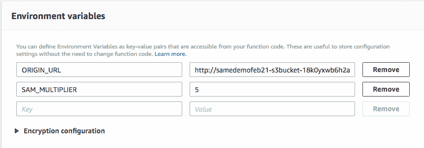
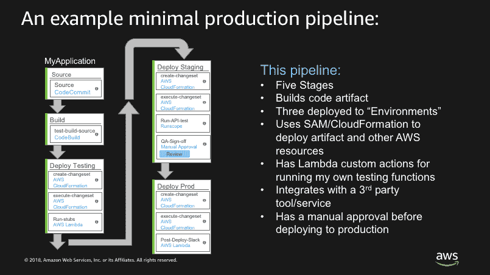
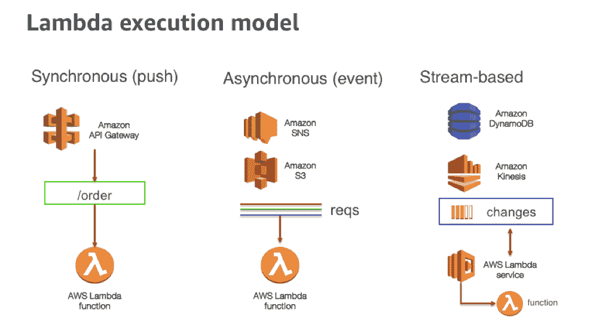
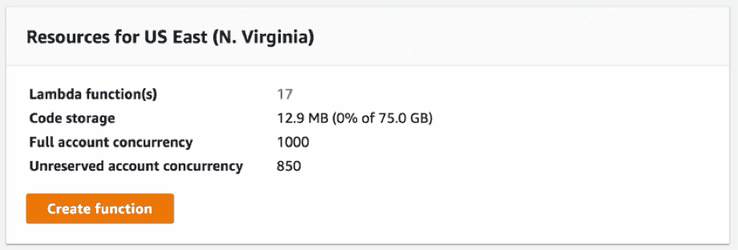
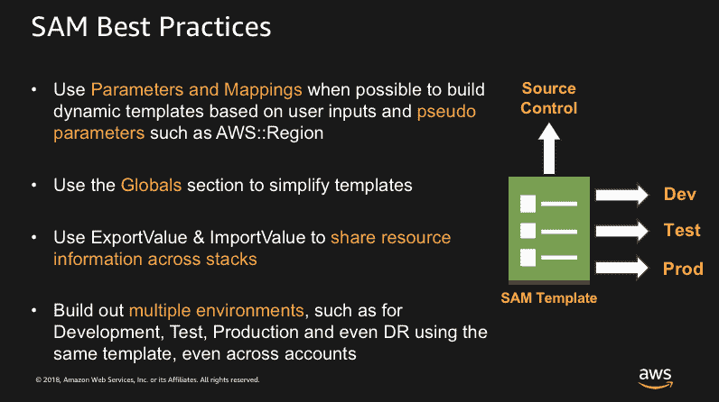
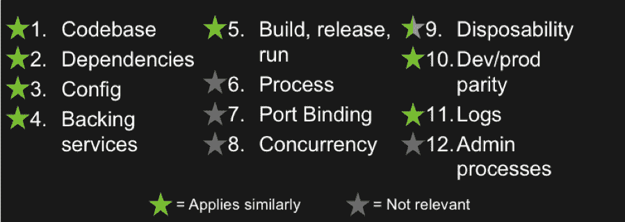

# 将十二因素应用方法应用于无服务器应用| AWS 计算博客

> 原文：<https://aws.amazon.com/blogs/compute/applying-the-twelve-factor-app-methodology-to-serverless-applications/?utm_source=wanqu.co&utm_campaign=Wanqu+Daily&utm_medium=website>

[十二要素应用](https://12factor.net/)方法是构建现代云原生应用的十二个最佳实践。在配置、部署、运行时和多服务通信等方面的指导下，十二因素模型规定了适用于各种用例的最佳实践，从 web 应用程序和 API 到数据处理应用程序。尽管无服务器计算和 [AWS Lambda](https://aws.amazon.com/lambda) 已经改变了应用程序开发的方式，但十二要素最佳实践在无服务器的世界中仍然适用。

在这篇文章中，我直接将十二要素方法应用于 Lambda 和 [Amazon API Gateway](https://aws.amazon.com/api-gateway) 的无服务器应用程序开发，并进行比较。

## 十二要素

正如您将看到的，许多这些因素不仅直接适用于无服务器应用程序，而且实际上是 AWS 无服务器平台的默认机制或功能。其他因素并不适合，我将讨论这些因素在无服务器方法中可能根本不适用。

### 一.代码库

[*版本控制中跟踪一个代码库，多个部署*](https://12factor.net/codebase)

一个通用的软件开发最佳实践是让您的所有代码都处于修订控制之下。这与无服务器应用程序没有什么不同。

对于单个无服务器应用程序，您的代码应该存储在单个存储库中，在该存储库中生成单个可部署的工件，并且从该存储库中部署该工件。这个单一的代码库还应该代表所有应用程序环境中使用的代码(开发、试运行、生产等)。).无服务器应用程序的不同之处可能在于构成“单个应用程序”的界限

这里有两条准则可以帮助您理解应用程序的范围:

1.  如果事件是共享的(比如一个通用的 Amazon API Gateway API)，那么这些事件的 Lambda 函数代码应该放在同一个存储库中。
2.  否则，将函数沿着事件源分解到它们自己的存储库中。

遵循这两条准则有助于您将无服务器应用程序的范围限定为单一目的，并有助于防止代码库变得复杂。

### 二。属国

[*明确声明并隔离依赖关系*](https://12factor.net/dependencies)

需要被多个函数使用的代码应该打包到它自己的库中，并包含在您的[部署包](https://docs.aws.amazon.com/lambda/latest/dg/deployment-package-v2.html)中。回到上一个关于 codebase 的因素，如果你发现你需要经常包含特殊的处理或者业务逻辑，最好的解决方案可能是尝试自己创建一个有目的的库。Lambda 支持的每种语言都有一个依赖/库模型，您可以使用:

*   Node.js: npm ( [docs](https://docs.aws.amazon.com/lambda/latest/dg/nodejs-create-deployment-pkg.html)
*   Python: pip ( [docs](https://docs.aws.amazon.com/lambda/latest/dg/lambda-python-how-to-create-deployment-package.html) )
*   Java: maven ( [docs](https://docs.aws.amazon.com/lambda/latest/dg/java-create-jar-pkg-maven-no-ide.html)
*   C#: NuGet ( [docs](https://docs.aws.amazon.com/lambda/latest/dg/lambda-dotnet-coreclr-deployment-package.html) )
*   去:去拿包( [docs](https://docs.aws.amazon.com/lambda/latest/dg/lambda-go-how-to-create-deployment-package.html) )

您将希望通过 CI/CD 过程来自动化这一点，我将在本文后面讨论这一点。

### 三。配置

[*存储环境中的配置*](https://12factor.net/config)

Lambda 和 API Gateway 都允许您使用每个服务运行的环境来设置配置信息。

在 Lambda 中，这些被称为[环境变量](https://docs.aws.amazon.com/lambda/latest/dg/env_variables.html)，是可以在部署或更新功能配置时设置的键值对。Lambda 然后使用该语言支持的标准 API(如 Node.js 函数的 process.env)使这些键值对对对 Lambda 函数代码可用。有关更多信息，请参见[编程模型](https://docs.aws.amazon.com/lambda/latest/dg/programming-model-v2.html)，其中包含了每种受支持语言的示例。 

Lambda 还允许您使用 KMS 加密这些键-值对，这样它们就可以用来存储秘密，比如 API 键或数据库密码。您还可以使用它们来帮助定义应用程序环境细节，例如测试或生产环境之间的差异，在这些环境中，您可能有 Lambda 函数需要与之交互的独特数据库或端点。您也可以使用它们来设置 A/B 测试标志，或者启用或禁用某些功能逻辑。

对于 API Gateway，这些配置变量被称为[阶段变量](https://docs.aws.amazon.com/apigateway/latest/developerguide/stage-variables.html)。像 Lambda 中的环境变量一样，这些是可供 API Gateway 使用或传递给 API 后端服务的键值对。Stage 变量对于根据访问 API 的 URL 向不同的后端环境发送请求非常有用。例如，一个配置可以同时支持 beta.yourapi.com 和 prod.yourapi.com。您还可以使用阶段变量将信息传递给 Lambda 函数，使其执行不同的逻辑。

### 四。后勤服务

[*将后台服务视为附属资源*](https://12factor.net/backing-services)

因为 Lambda 不允许您在执行函数时运行另一个服务，所以这个因素基本上是 Lambda 的默认模型。通常，您通过 HTTP 端点或 DNS 名称将任何数据库或数据存储作为外部资源进行引用。如前所述，理想情况下，这些连接字符串是通过配置信息传递的。

### 动词 （verb 的缩写）构建、发布、运行

[*严格分开构建和运行阶段*](https://12factor.net/build-release-run)

构建、发布和运行阶段的分离遵循持续集成和交付的开发最佳实践。AWS 建议，无论您正在构建什么类型的应用程序，都应该有一个 CI &CD 过程。对于无服务器应用程序，这没有什么不同。有关更多信息，请参见[为无服务器应用构建 CI/CD 管道(SRV302)](https://youtu.be/dCDZ7HR7dms) re:Invent 2017 会议。

最小管道示例(来自上面链接的演示)

### 不及物动词过程

[*作为一个或多个无状态进程执行 app*](https://12factor.net/processes)

这是 Lambda 设计中的固有特性，所以没什么好考虑的。Lambda 函数应该总是被视为无状态的，尽管它有可能在执行环境重用之间本地存储一些信息。这是因为不能保证与任何执行环境的相似性，并且存在执行环境在调用之间消失的可能性。您应该始终通过后备服务将任何有状态信息存储在数据库、缓存或单独的数据存储中。

### 七。端口绑定

[*通过端口绑定导出服务*](https://12factor.net/port-binding)

这个因素也不适用于 Lambda，因为执行环境不会向您的函数公开任何直接的网络。Lambda 函数不是通过端口调用，而是通过一个或多个触发服务或 Lambda 的 AWS APIs 调用。目前有三种不同的调用模型:

*   同步的
*   异步的
*   基于流的

每个都有独特的特点。更多信息，请参见[调用 Lambda 函数。](https://docs.aws.amazon.com/lambda/latest/dg/invoking-lambda-functions.html) 

### 八。并发

[*通过流程模型*](https://12factor.net/concurrency) 横向扩展

Lambda 的构建考虑了大规模并发性和规模。最近在这个博客上发表了一篇名为[管理 AWS Lambda 函数并发性](https://aws.amazon.com/blogs/compute/managing-aws-lambda-function-concurrency/)的文章，解释了对于一个无服务器应用程序来说，“规模的单位是一个[并发执行](https://docs.aws.amazon.com/lambda/latest/dg/concurrent-executions.html)”，这些都是由您的函数消耗的。

Lambda 会自动伸缩，以满足在您的函数中发送的调用需求。这与使用您自行管理的物理主机、虚拟机或容器的传统计算模式形成对比。有了 Lambda，您无需管理整体容量或应用扩展策略。

每个 AWS 帐户都有一个总的 [AccountLimit](https://docs.aws.amazon.com/lambda/latest/dg/API_GetAccountSettings.html) 值，该值在任何时间点都是固定的，但可以根据需要轻松增加。[截至 2017 年 5 月](https://aws.amazon.com/about-aws/whats-new/2017/05/aws-lambda-raises-default-concurrent-execution-limit/)，默认限制为每个 AWS 地区 1000 个并发执行。您还可以设置和管理保留的并发限制，它限制了一个函数可以拥有的并发量。它还从帐户可用的总容量中为给定的函数保留并发容量。 

### 九。一次性

 *关闭不适用于 Lambda，因为 Lambda 本质上是事件驱动的。调用直接绑定到传入的事件或触发器。

然而，启动时的速度确实很重要。当没有准备好执行应用调用的“预热”计算资源时，会出现初始功能执行延迟，即所谓的“冷启动”。在 [AWS Lambda 执行模型](https://docs.aws.amazon.com/lambda/latest/dg/running-lambda-code.html)主题中，它解释道:

设置执行上下文和进行必要的“引导”需要时间，这在每次调用 Lambda 函数时都会增加一些延迟。您通常会在 Lambda 函数首次被调用时或被更新后看到这种延迟，因为 AWS Lambda 试图在 Lambda 函数的后续调用中重用执行上下文。

[最佳实践](https://docs.aws.amazon.com/lambda/latest/dg/best-practices.html)主题涵盖了许多关于如何考虑您的功能性能的问题。这包括在哪里放置特定的逻辑，如何重用执行环境，以及如何通过为函数配置更多的内存来相应地增加函数可用的 CPU。使用 [AWS X-Ray](https://docs.aws.amazon.com/xray/latest/devguide/xray-services-lambda.html) ，您可以收集一些关于您的函数在执行过程中正在做什么的见解，并做出相应的调整。

### X.开发/生产平价

[*尽可能保持开发、试运行和生产的相似性*](https://12factor.net/dev-prod-parity)

随着持续的集成和交付，拥有独立的应用程序环境的实践是一个可靠的最佳实践，无论开发方法如何。能够在非生产环境中安全地测试应用程序是开发成功的关键。AWS [无服务器平台](https://aws.amazon.com/serverless/)内的产品不收取空闲时间费用，大大降低了运行多个环境的成本。您还可以使用 [AWS 无服务器应用程序模型](https://github.com/awslabs/serverless-application-model) (AWS SAM)，来管理您单独环境的配置。

SAM 允许您用大大简化的 [AWS CloudFormation](https://aws.amazon.com/cloudformation/) 语法来建模您的无服务器应用程序。有了 SAM，您可以使用 CloudFormation 的功能——比如[参数](https://docs.aws.amazon.com/AWSCloudFormation/latest/UserGuide/parameters-section-structure.html)和[映射](https://docs.aws.amazon.com/AWSCloudFormation/latest/UserGuide/mappings-section-structure.html)——来构建动态模板。与 Lambda 的环境变量和 API Gateway 的阶段变量一起，这些模板使您能够从单个模板部署多个环境，例如测试、阶段和生产。只要不使用非生产环境，Lambda 和 API Gateway 的成本就为零。欲了解更多信息，请参见 [AWS Lambda 应用与 AWS 无服务器应用模型](https://www.youtube.com/watch?v=1k3XqBA2hYM) 2017 AWS 在线技术讲座。 

### XI。日志

[*将日志视为事件流*](https://12factor.net/logs)

在一个典型的非无服务器应用程序环境中，您可能会关心日志文件、日志守护进程以及它们所代表的数据的集中化。幸运的是，对于无服务器应用程序来说这不是问题，因为平台中的大多数服务会为您处理这个问题。

使用 Lambda，您可以通过编写函数的语言的固有功能将日志输出到控制台。有关 Go 的更多信息，请参见[日志记录(Go)](https://docs.aws.amazon.com/lambda/latest/dg/go-programming-model-logging.html) 。其他语言也有类似的文档页面。您的代码输出的那些消息被捕获并集中在 [Amazon CloudWatch 日志](https://docs.aws.amazon.com/lambda/latest/dg/monitoring-functions-logs.html)中。有关更多信息，请参见[为 AWS Lambda](https://docs.aws.amazon.com/lambda/latest/dg/monitoring-functions-logs.html) 访问亚马逊 CloudWatch 日志。

API 网关提供了两种不同的获取日志信息的方法:

*   **执行日志**
    包括错误或执行痕迹(如请求或响应参数值或有效载荷)、自定义授权者使用的数据、是否需要 API keys、是否启用使用计划等等。
*   **访问日志**
    提供了记录谁访问了您的 API 以及调用者如何访问 API 的能力。您甚至可以根据需要定制这些日志的格式。

两者都可以在 CloudWatch 日志中找到。更多信息，请参见[在 API 网关](https://docs.aws.amazon.com/apigateway/latest/developerguide/set-up-logging.html)中设置 API 日志。

捕获日志并能够搜索和查看它们是一回事，但 CloudWatch 日志还让您能够将日志消息视为事件，并通过服务中的[订阅过滤器](https://docs.aws.amazon.com/AmazonCloudWatch/latest/logs/Subscriptions.html)对它们采取行动。使用订阅过滤器，您可以向 Lambda 函数发送与特定模式匹配的日志消息，并让它基于该模式采取行动。例如，假设您想要对违反特定规则的特定错误消息或使用模式做出响应。你可以通过 CloudWatch 日志、订阅过滤器和 Lambda 来实现。CloudWatch 日志的另一个重要功能是能够将日志信息[“透视”成 CloudWatch 中的指标](https://docs.aws.amazon.com/AmazonCloudWatch/latest/logs/MonitoringLogData.html)。有了它，您可以从日志条目中获取一个数据点，创建一个指标，然后在指标上发出警报以显示违反的阈值。

### 十二。管理流程

[*将行政/管理任务作为一次性流程运行*](https://12factor.net/admin-processes)

由于 Lambda 的设计，这是另一个不直接适用于它的因素。通常，您会将您的功能缩小到单一或有限的用例，并为应用程序的不同组件提供单独的功能。即使它们共享一个公共的调用资源，比如一个 API 网关端点和 stage，您仍然可以将单独的 API 资源和动作分离到它们自己的 Lambda 函数中。

## 七个半因素模型和你

正如我们已经看到的，考虑到一些小的差异，十二因素应用程序设计仍然可以应用于无服务器应用程序！下图强调了这些因素以及它们对无服务器应用程序的适用性:

注意:一次性仅适用于一半，正如本文所讨论的。

## 结论

如果您在过去几年中一直在为云基础架构构建应用程序，那么 12 因素方法应该看起来很熟悉且简单明了。但是，如果您是这个领域的新手，您应该知道无服务器应用程序的一般最佳实践和默认工作模式与我在这里讨论的内容有很多重叠。

严格遵循十二因素模型应该不需要太多工作。当您构建无服务器应用程序时，遵循这里列出的适用要点可以帮助您简化开发和任何相关的操作工作(尽管已经被 Lambda 和 API Gateway 等服务最小化)。十二因素方法也不是全有或全无。您可以只应用最适合您和您的应用程序的实践，并且仍然从中受益。* 