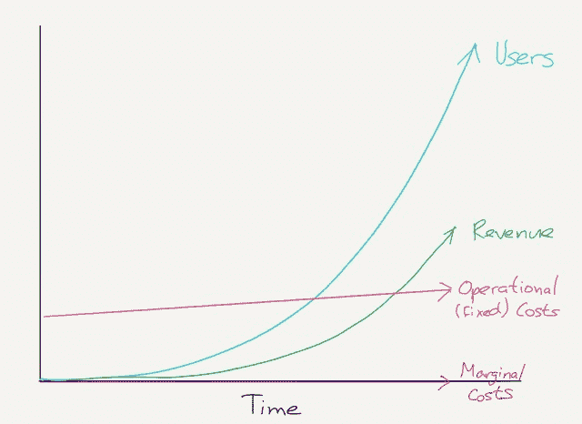
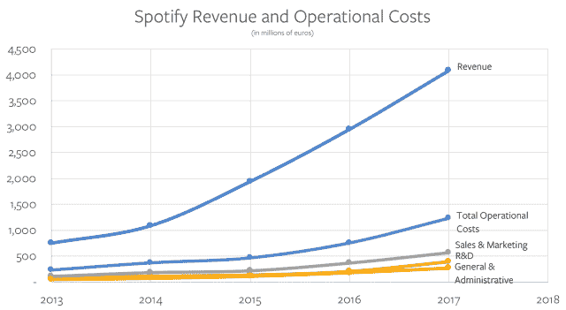
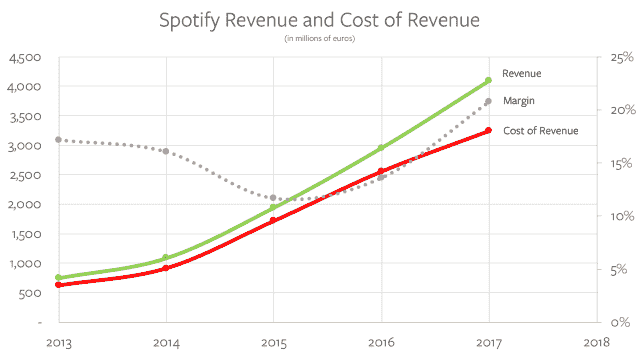
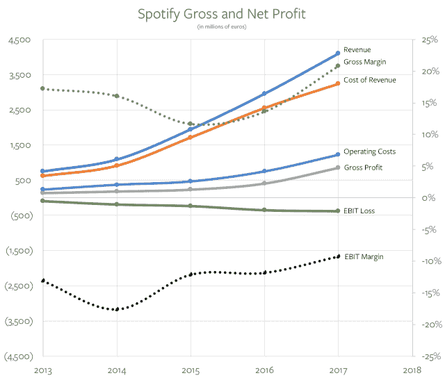
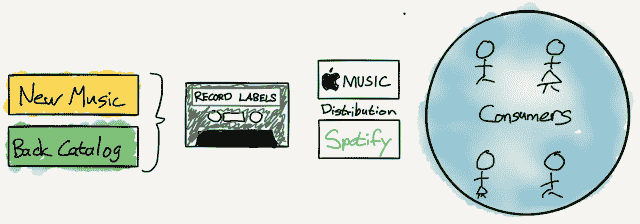
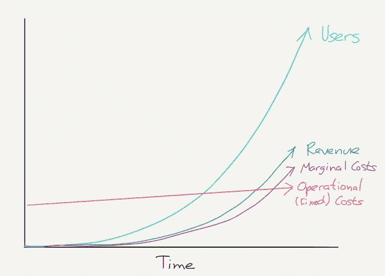

# 本·汤普森的《Spotify 的教训——战略》

> 原文：<https://stratechery.com/2018/lessons-from-spotify/?utm_source=wanqu.co&utm_campaign=Wanqu+Daily&utm_medium=website>

风险投资支持的初创公司的两种主要商业模式是面向消费者的公司的广告和面向商业的公司的软件即服务(SaaS)。在一个层面上，这些商业模式截然不同:前者免费赠送软件，希望说服第三方为用户付费；后者直接向部分用户收费。然而，两者的潜在经济学比你想象的更相似——事实上，两者都非常符合过去风险投资支持的创业公司。

#### 风险结果

毫不奇怪，硅谷是建立在硅基计算机芯片上的，硅谷风险投资也是如此。硅基芯片的边际成本极低——沙子很便宜！—但是巨大的固定成本:一方面是 R&D，另一方面是实际制造芯片的设备。虽然这两种成本存在于损益表的不同部分——后者是影响毛利率的收入成本，而前者是“线下”和仅影响整体盈利能力的运营成本——但接受风险投资的基本经济原理是相同的:预先投入大量资金来开发和制造产品，并利用最小的边际成本来增加产量。

你可以看到这种模式如何完美地转化为软件:边际成本甚至更低，更大比例的成本是研发。公司需要大量资金来启动，但那些成功的公司可以产生远远超过投资额的回报。今天的商业模式无疑就是如此。

以广告为基础的消费公司花费巨资在 R&D 建设吸引用户的产品，尽管通常不会在销售和营销上花费太多来获取用户；突破到支持广告所需规模的消费品公司依赖于病毒式网络效应。销售和营销支出的来源是讨好广告商；然而，所有公司中最有价值的消费者公司——[超级聚合商](https://stratechery.com/2017/defining-aggregators/)——也产生了同样的网络效应，使他们能够以可扩展的方式增加广告客户。

这产生了理想的风险投资结果:一家用户和收入增长远快于成本的公司。

[T2】](https://i0.wp.com/stratechery.com/wp-content/uploads/2018/03/Paper.stratechery-Year-One.341.jpg?ssl=1)

再说一次，这是可能的，因为边际成本极小——更多的用户不一定更贵。当然，固定成本会随着时间的推移而增长，但它们只是线性增长——在相对稳定的成本基础上赚取不断增长的收入是规模的定义。

SaaS 的企业也有类似的情况——最大的区别是收入来自用户，因此销售和营销费用都花在了获得上述用户上，而不是广告商，但最小的边际成本是共同的主线。

#### Spotify 的运营成本

在[SaaS](https://stripe.com/atlas/guides/business-of-saas)的生意中，[条纹图册](https://stripe.com/atlas)，[帕特里克·麦肯齐](https://twitter.com/patio11)提供的指南之一写道:

> 大致来说，利润率并不重要。大多数企业相当关心他们的销货成本(COGS)，即满足边际顾客的成本。虽然一些平台业务(如 AWS)有重要的成本，但在典型的 SaaS 公司，价值的主要来源是软件，它可以以极低的成本复制。SaaS 公司经常花费不到 5~10%的边际收入在提供基础服务上。
> 
> 这使得 SaaS 企业家几乎可以忽略他们单位经济学的每一个因素，除了客户获取成本(CAC 每个客户增加的营销和销售的边际支出)。如果他们快速增长，公司可以忽略每一项不与客户数量成正比的费用(即工程成本、一般和管理费用等)，假设合理的 CAC 的增长将超过分类账费用方面的任何费用。

换句话说，从长远来看，运营成本并不重要，这对 Spotify 来说是个好消息，Spotify 是一家风险投资支持的公司，具有明显的 SaaS 特征，上周[申请直接上市](https://www.sec.gov/Archives/edgar/data/1639920/000119312518063434/d494294df1.htm)。Spotify 在过去三年里每月活跃用户增加了 43%，收入在过去五年里增加了 448%；其固定成本在很大程度上与收入保持一致:

SPOTIFY 收入和固定成本(百万欧元)

|  | 收入 | R&D(年率%) | S&M(年率%) | G&A(年率%) | 总计(收入百分比) |
| --- | --- | --- | --- | --- | --- |
| Two thousand and thirteen | Seven hundred and forty-six | 73 (10%) | 111 (15%) | 42 (6%) | 226 (30%) |
| Two thousand and fourteen | One thousand and eighty-five | 114 (11%) | 184 (17%) | 67 (6%) | 365 (34%) |
| Two thousand and fifteen | One thousand nine hundred and forty | 136 (7%) | 219 (11%) | 106 (5%) | 461 (26%) |
| Two thousand and sixteen | Two thousand nine hundred and fifty-two | 207 (7%) | 368 (12%) | 175 (6%) | 750 (25%) |
| Two thousand and seventeen | Four thousand and ninety | 396 (10%) | 567 (14%) | 264 (6%) | 1,227 (30%) |

这看起来像是一家管理良好的 SaaS 公司:

[T2】](https://i0.wp.com/stratechery.com/wp-content/uploads/2018/03/Screen-Shot-2018-03-05-at-10.08.59-PM.png?ssl=1)

只有一个问题:Spotify 的边际成本。

#### Spotify 的边际成本问题

注意到 Spotify 有巨大的边际成本——具体来说，就是它支付给音乐行业的版税(不仅仅是唱片公司，还有歌曲作者和出版商)，这并不是什么突破性的分析。Spotify 的收入成本体现了这一点:

[T2】](https://i0.wp.com/stratechery.com/wp-content/uploads/2018/03/Screen-Shot-2018-03-05-at-10.08.16-PM.png?ssl=1)

Spotify [去年夏天与唱片公司](https://stratechery.com/2017/spacex-reuses-a-rocket-the-music-industry-winning-and-whining-spotify-universal-agree-to-new-deal/)谈判达成了新的协议，降低了版税，以换取有保证的用户增长和唱片公司独家发行 Spotify 付费唱片的能力；你可以看到 Spotify 利润率的提高反映了这些较低的费率。

#### Spotify 错失的利润潜力

然而，这正是问题所在:Spotify 的利润率完全受唱片公司的支配，即使在汇率变化后，该公司不仅没有盈利，其亏损还在增加，至少按绝对欧元计算是这样的:

[T2】](https://i0.wp.com/stratechery.com/wp-content/uploads/2018/03/Screen-Shot-2018-03-05-at-10.11.01-PM.png?ssl=1)

此外，Spotify 的收入成本似乎不太可能在短期内有很大改善:这些唱片协议至少要到明年才会生效，并且它们包括“最惠国”条款，这意味着 Spotify 必须让环球音乐集团、索尼音乐娱乐、华纳音乐集团和梅林(许多独立唱片公司的代表)，这些公司拥有 Spotify 上 85%的音乐(按流计算)，都同意集体降低费率。更糟糕的是，美国版权版税委员会刚刚增加了支付给歌曲作者的金额；Spotify 表示，这一变化并不重要，但肯定也不是朝着正确的方向。

这就剩下两个选择:

*   最明显的是，Spotify 可以尝试降低运营成本。然而，这比看起来要难，原因有二:首先，Spotify 已经是一家相当节俭的公司；例如，Dropbox[在同一周](https://stratechery.com/2018/the-dropbox-comp/)提交了 S-1，其 77%的收入用于运营成本，而 Spotify 只有 30%。
*   Spotify 可以在不增加运营成本的情况下增加收入。然而，如果它不能增加在 R&D 和营销上的支出，它将如何增加收入呢？非社交网络公司的典型模式是随着时间的推移，销售和营销的效率越来越低，这意味着它需要*增加*占收入的百分比，而不是减少(记住，Spotify 不能错过增长数字或版税上涨)。

还有一种可能性:Spotify 有一天可能会完全去掉这些标签——这个想法在概念层面上肯定是有意义的。从某种意义上来说，Spotify 是一个聚合者，因为它越来越多地控制着对音乐听众的访问，值得称赞的是，它已经通过对音乐发现和流行播放列表的控制展示了行使权力的能力。

问题是，正如我在[The Great unbinding](https://stratechery.com/2017/the-great-unbundling/)中所写的，音乐标签也被 Spotify 强化了:

> 与此同时，音乐产业，至少相对于报纸来说，在向互联网的转变中表现相对较好；虽然盗版将音乐唱片公司推向了苹果的怀抱，苹果将专辑与歌曲捆绑在一起，但流媒体却用捆绑经济回报了旧目录和新音乐的整合:越来越多的用户愿意每月支付 10 美元来访问一切，大大提高了每位客户的平均收入。其结果是，这个行业看起来与互联网时代之前非常相似:
> 
> [T2】](https://stratechery.com/2017/the-great-unbundling/)
> 
> 注意 Spotify 和 Apple Music 的力量有多小；两者都没有足够的用户基础来吸引纯粹基于经济学的供应商(艺术家)，部分原因是他们无法获得旧目录。与报纸不同，唱片公司建立了超越分销的整合。

Spotify 是一个令人印象深刻的产品和公司，首席执行官丹尼尔·埃克(Daniel Ek)和团队走到这一步值得称赞。然而，成为一个真正的聚合者意味着获得超越供给的力量；Spotify 没有这一点——该公司甚至无法控制其边际成本——而且很难看出利润来自哪里。

#### 来自 Spotify 的教训

与大多数零边际成本风险投资支持的公司相比，唱片公司的力量以及 Spotify 的边际成本与其整体收入之间的联系，无疑使 Spotify 成为一个独特的案例:

[T2】](https://i0.wp.com/stratechery.com/wp-content/uploads/2018/03/Paper.stratechery-Year-One.340.jpg?ssl=1)

不过，值得注意的是，Spotify 并不是唯一一家收入成本与总收入挂钩的知名初创公司——至少从某种角度来看是这样。在过去几年中，出现了第三种创业模式:所谓的共享经济，或资产即服务(AaaS)。当你花 10 美元乘坐优步或 Lyft 时，大约 7 美元归司机所有；当你在 Airbnb 上花 100 美元时，85 美元归房东， [1](#fn1-3099 "Minus service fees to cover payment processing") 等等。

明确地说，这并不是这些公司记账的必要方式:最上面的数字应该不包括支付给司机或主机等的费用。然而，当考虑这些公司应该如何管理时，情况与 Spotify 没有太大不同。具体来说:

*   AaaS 公司不能假设运营费用是“免费的”，因为总边际成本将吃掉总收入增长的很大一部分。
*   AaaS 公司应该将销售和营销支出集中在增加需求上，让需求拉动供给。用另一种方式来做——花费销售和营销来增加供应，希望吸引需求——可能在竞争中有意义，但这在财务上是一场灾难，因为该公司基本上是在增加成本(想象一下，如果 Spotify 支付数百万美元来讨好唱片公司！)
*   不能降低运营成本或以比销售和营销相对更快的速度增加收入的 AaaS 公司，将只能孤注一掷，完全消除边际成本。诚然，无人驾驶汽车或自有经营公寓可能都比摆脱唱片公司更可行，但就运营成本而言，变得更加自律似乎仍是更好的选择。

我仍然相信未来的一切都是服务，毫无疑问，为一切创建网络将需要大量风险资本。毫无疑问，资本将继续存在，因为一个网络一旦建成，绝对会带来可扩展的收入，这使得产生巨额利润成为必然。

为此，Spotify 肯定希望流媒体市场最终变得如此之大，以至于该公司按百分比计算的低毛利率最终变得很高；即便如此，这些利润也将来自卓越的运营和高效的客户获取，而不仅仅是顶线增长。

*我在[每日更新](https://stratechery.com/2018/could-spotify-be-netflix-calculating-spotifys-ltv-and-cac/)中写了这篇文章的后续。*

### *相关*