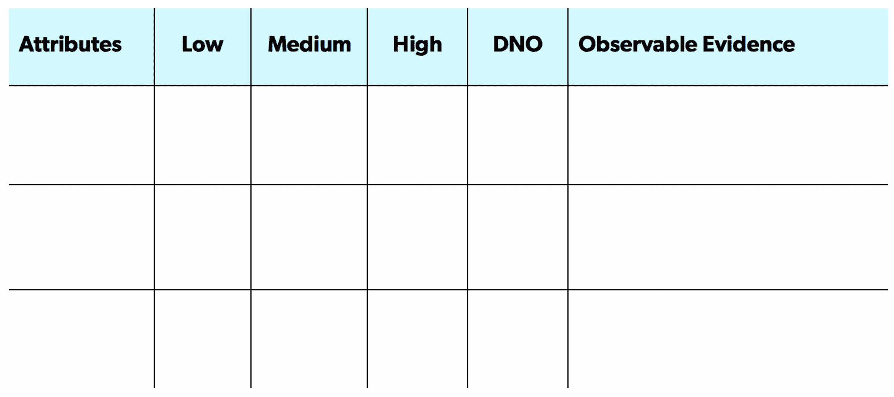

# 像开发产品一样开发你的招聘系统，以消除偏见，提高保留率|第一轮评估

> 原文：<http://firstround.com/review/develop-your-hiring-system-like-a-product-to-eliminate-bias-and-boost-retention/?utm_source=wanqu.co&utm_campaign=Wanqu+Daily&utm_medium=website>

丹·普皮乌斯是完美的谷歌人。六年来，他建立了仍然支持地图和 Gmail 的基础设施，并获得了公司梦寐以求的模范团队成员公民奖。据说，他是谷歌成功人士的典型。但他几乎从未被聘用过。

直到今天，皮尤斯都觉得他偷偷通过了他们的面试过程——以密集、多阶段的事情而闻名，后来在整个技术领域被嫁接和复制。在招募其他人的过程中，他也观察到了自己的误判(那些本可以做出惊人贡献的人)和误判(那些检查了所有学术和精英标准，但终究不是合适人选的候选人)。

因此，当他在 2012 年担任工程主管时，他希望建立一个不会有同样盲点的招聘系统。他和几个同事**一起着手建立一个抗脆弱的招聘流程**，它将适应新的信息，不会依赖于任何一个人，并且会随着时间的推移变得更加强大。

在这次独家采访中， **Pupius 分享了他是如何通过应用众所周知的产品开发机制**做到这一点的。由此产生的标题和招聘机器运作得如此之好，以至于[媒体在网上发布了它](https://medium.engineering/mediums-engineering-interview-process-b8d6b67927c4 "null")，鼓励其他公司将其分叉并成为自己的。如今，作为致力于培养健康、包容和创意组织的初创公司 [Range](https://www.range.co/ "null") 的联合创始人，普皮斯和他的团队正在打造他们自己的新流程，这是早期初创公司的理想选择，但也能够扩大规模。现在你也可以用他学到的东西来改变你的方法。

# 将产品开发应用于招聘

当从零开始创建一个招聘系统时，你实际上同时在构建两个产品: **1)** 流程本身和 **2)** 由此产生的团队。从这个角度来看，与候选人的每一次互动都必须有目的，产生你可以从中学习的数据，并符合你想要实现的更大愿景，普皮斯说。

以下是打造真正伟大产品的要素，以及如何将每个原则应用到招聘中:

**强烈的意图。**如果你是一名创始人，你的团队将是你优先考虑和奖励的产品——你用你的时间和注意力来奖励这些东西。投入时间把你的团队建设成一个令人惊叹的产品(大多数成功的企业家建议把 50%的时间花在招聘上)。

**清晰而引人注目的愿景。产品开发回避了这样一个问题:你希望世界变成什么样子？你希望它与目前存在的有什么不同？**招聘时，问:**你希望你的团队是什么样的？你希望它能够实现什么？**

**发展原则。**你需要价值观、信念和指导方针来塑造你实现愿景的方式。**对于招聘**，同样，你也应该拥有能帮助你做出正确决定的价值观，同时消除偏见。

**你可以测试的战术。**产品开发需要明确的日常行动，这些行动在你的原则指导下，与你的愿景背道而驰。它们是你对什么会产生好结果的最佳猜测；它们是可测量的，也是可迭代的。**在招聘**时，你的策略就是你如何与应聘者互动。它们应该是可测试和可改变的。

**有意义的测量。**您希望设定量化目标，表明您的愿景的进展，并让这些数据可见，为您的下一步决策提供信息。**在招聘**时，你要设定标准，衡量你是否在打造你想要的团队。稍后将详细介绍。

**有组织的迭代。**最好的产品在用户和开发人员之间有强大的反馈回路，推动产生积极影响的智能变化。同样，你希望根据反馈有意识地更新招聘流程。

**指定决策。**产品开发经常利用 [RACI 框架](https://en.wikipedia.org/wiki/Responsibility_assignment_matrix "null")来指派一个人负责决策，一个人负责，一个人贡献，一个人知情。**同样，在招聘**时，你需要一个最终负责对候选人做出最终决定的人。请注意，这通常不应该是最资深的人，而是负责确保招聘成功的人。你还想在招聘中营造一种不同意和承诺的氛围。

**以用户为中心。**就像你对任何产品的目标都是产品符合市场一样，你希望你的招聘流程适合所有候选人——即使他们没有被录用。他们是您的最终用户，最好的系统将是优化他们体验的系统。

**自动化潜力**。一旦你有了适合市场的产品，你的下一步就是尽可能的自动化。同样，**一旦你有了一个产生良好结果的招聘系统**，你就要创建清单、结构和协议，使它在你进入快速增长时可重复和可扩展。

如果你把以上所有的方法应用到建立你的招聘系统中，你最终会得到一份经过压力测试的剧本，你可以一遍又一遍地运行它。**重要的是，你想把你设计的系统记录在一个集中的、可共享的地方**。把它看作是一个活的文档，随着时间的推移，随着你了解的越来越多，它会发生变化。它不能只存在于你的创始团队的头脑中或某个废弃的维基页面上——它必须在每一次招聘中被使用和参考。

现在，让我们更详细地了解一个伟大流程的每个核心部分。

# 视力

许多创始人一开始对团队建设缺乏远见，这开启了一个薄弱的过程。他们认为说他们想建立一个“世界级的团队”或者“我想让我们列出所有拥有最佳文化的公司名单”就足够了他们可能会更详细:“我想要一个专注、努力的团队，他们从根本上相信我们的使命。”但是这些都不够好。模糊的愿景导致糟糕的战略。

你需要一个全面的定义，来定义在你的公司会成功的人的类型***。你的公司和你的使命有什么独特之处？建立这种类型的公司需要什么样的独特品质？问问你自己，这个愿景会排斥那些不合适的人吗？如果是的话，那说明这不是一句空话。***

*最重要的是，vision 需要将你的团队作为一个整体来考虑——一个单一的、连贯的产品。*

*就像构建一个功能集合的产品是行不通的一样，你也不想构建一个只是个人集合的团队，不管他们每个人有多优秀。*

*团队中的每个人都有自己的属性和能力，这些属性和能力必须协同工作，因此必须进行战略性的组合。*

*为了创造 Range 的人才愿景，创始团队一起徒步旅行。“我发现体育活动真的有助于激发创造力，在办公室之外可以帮助每个人更客观地看待自己，”普皮斯说。这种额外的反省对于接下来的事情是非常必要的。*

*他们以极其诚实的方式列出了团队中已经存在的特质和品质，指出了他们自己和对方的优势和劣势。这让他们能够确定他们需要什么样的人来弥补他们的不足并扩展他们的能力。例如，他们意识到他们很大程度上是一群直觉内向的人——他们真的可以从更注重过程的外向者那里受益。*

*他们最终的愿景不是一份声明，而是一份新员工在 Range 取得成功、巩固现有团队并随着更多人的加入保持平衡所应具备的特质、价值观和技能的清单。现在，每一个招聘过程都从每个人都参与审查这份名单开始，这样他们就会被提醒，他们有责任建立一个全面的、运作顺畅的整体。*

*选择一个可以快速表明你是否朝着你的愿景前进的指标也是明智的。例如，一旦你的公司成立超过一年，**保留**最有意义。如果你的过程是强有力的，有理由假设人们会很适合，对他们的影响感到满意，并长期参与。*

*因为他们还很早，所以 Range 团队选择了**提议接受率**作为他们的顶线指标，因为这显示了他们在流程早期筛选人员的能力。虽然你也希望有第二个衡量标准来让自己对更广泛的愿景负责，但有一个作为你的快速测温工具是非常有用的。*

# *原则*

*记录下你的愿景后，想想什么样的规则能让你达到目标。你希望适用于每位候选人的指导方针是什么？有哪些约束会迫使你更深入的思考？写下你认为的标准招聘/面试流程，然后问自己:*

*偏见可能从哪里引入？*

*在哪里以及为什么会做出糟糕的决定？*

*招聘流程中的人可能会有哪些盲点？*

*你在哪里以及如何可能没有发掘出对你的公司来说很棒的品质？*

*用你对这些问题的回答来创造并执行一套原则，这将帮助你找到你的愿景所描述的人。下面，Pupius 分享了他和他在 Medium 的团队(特别是招聘负责人 [Jeff Lu](https://www.linkedin.com/in/jlu983/ "null") 、工程总监 [Jamie Talbot](https://www.linkedin.com/in/majelbstoat/ "null") 和工程经理 [Jean Hsu](https://www.linkedin.com/in/jeanyhsu/ "null") )在招聘时观察到的情况，以及他们赖以运行高质量流程的原则。他现在在靶场应用了许多相同的想法。*

# *1.所有的判断都必须依赖于可观察到的证据。*

*招聘总是情绪化的。但是你需要尽可能多的移除它。一般面试官在 30 秒内就已经对一个应聘者形成了正面或负面的印象。他们要么立即与他们觉得相关的人联系，要么认为他们不相关的人不合适。这伤害了背景和思想的多样性。*

*为了防止这种情况，面试时要把重点放在你已经发展成为你的愿景的一系列品质和技能上。然后只考虑可观察到的行为，这些行为要么证明了它们，要么没有。候选人实际上说了什么，做了什么？他们在过去的角色和场景中表现如何？*

*如果你在一个招聘循环中，你不能用候选人的所作所为或所说的话来支持你的判断，那么它就不应该被计算或被分享。*

*最重要的是，这将让你的团队负责寻找正确的因素。如果在你的招聘循环中，有人分享了他们对候选人的直觉，他们应该被特别要求拿出证据来支持这种直觉。这样一来，可能影响他人想法的直觉，如果被公开，将会得到释放。*

*“过去有几次，我几乎因为一个明显的性格特征而错过了一个候选人，但一旦他们被录用并开始工作，就被证明是完全错误的，”普皮乌斯说。"将所有反馈与证据联系起来有助于避免这种情况."*

# *2.就你不会看到的数据达成一致。*

*很多创业公司借鉴了谷歌对血统的重视。普皮乌斯说，不要落入这个陷阱。相反，专注于一个人的背景，这将真正帮助他们在你的公司做好工作。**问问你自己:**哪些属性实际上不是很好的预测因素？一个人简历上的什么会激发推断和假设？把那些东西从桌子上拿走。*

*例如，在 Range，Pupius 和他的联合创始人明确表示，他们不会考虑人们上过什么学校、他们的成绩、以前的公司、他们认识谁等等。相反，他们只会寻找那些能让候选人在他们工作的早期阶段做好工作的技能和经验。*

# *3.为应聘者提供几种成功模式。*

*要组建一个全面发展的团队，你不应该只提供一种方法让候选人在你的过程中成功。如果你对每个人都进行相同的面试，你将会错过那些才华横溢的人，他们只是没有得到合适的机会去展示自己。*

*例如，对于技术招聘，这意味着为每个候选人提供多种选择来展示他们的相关能力:白板、编程练习、设计练习、在几天内构建一个应用程序并将其展示给招聘团队、到办公室给初级员工做技术讲座等。*

*想想一个优秀的雇员必须具备的技能。候选人向你展示他们的所有方式是什么？让他们选择如何进行。*

# *4.将团队组成放在首位。*

*你招聘的每一个角色都有几个方向。就像一条多叉的岔路。“假设你需要一名后端工程师，”普皮乌斯说。“它可能有三种方式:1)一个相对独立的高级工程师，他将快速成长；2)一个有潜力成为你的首席架构师的人，作为 IC 提供技术指导；或者 3)一个天生的领导者，他最终可能接管工程团队。你的选择将开启一系列全新的担忧和可能性。”*

*为了确保你总是选择正确的岔路口，你希望在任何给定的时间都有一种团队组成的感觉。(根据经验法则，尽可能多地了解人们的职业抱负也是很好的，这样你就可以了解并预测组织内的变动。)这里只是几个围绕构图原则的例子:*

*对于每个特定的发展阶段，您都希望设定一个高级员工与初级员工的指导比例。“这样，你就不会因为非常资深的人很有才华，就过早地向他们推销不适合他们的角色。”*

*基于您的主要挑战和目标的多面手与专家的比例。*

*1:1 的男女比例，将性别多样性放在首位。*

*虽然这些组成目标可能会改变，但它们应该在多个季度保持不变，以有效地保持团队朝着正确的方向发展。每当你有一个角色要扮演时，你放在地上的每一个木桩都将有助于指导你选择哪条路线。有时他们可能会暗示你根本不需要新员工。“理想情况下，这个原则会让你更仔细地思考所有不同的做事方式。”*

# *5.招聘经理是决策权威。*

*寻求对候选人的共识会陷入僵局，并不可避免地破坏你的招聘过程。普皮乌斯建议创立一个原则来打破这种局面。在你的流程中指定一个人负责根据所有提供的证据做出最终决定。这个人成为招聘经理是有道理的——毕竟，他们将与这个人最密切地合作。*

*然而，这本身是不够的。你还需要在招聘过程中准备好不同意和承诺。就像你会要求工程和设计团队支持一个由产品经理决定的功能一样，你希望任何不是一致支持候选人的人都致力于为他们的成功做准备。*

# *策略*

*你设置招聘和面试流程的方式取决于你自己的愿景和原则。这可能因公司而异。对于早期或较小的创业公司，Pupius 建议只分三个阶段开始:*

*评定*

*使生效*

*出售*

*在你开始之前，**考虑创建一个图表**，在左侧列出你正在寻找的所有属性和技能。穿过顶部，有等级:低，中，高和没有观察(DNO)，以及一个评论字段，草草记下导致该等级的具体证据(候选人过去说过或做过的实际事情)。这鼓励每一位面试官专注于重要的信息，提出挖掘这些数据的问题，并实时捕捉他们的想法。*

**

*为了有助于评分，列出构成你对团队愿景的属性/价值观/品质。用 1-2 句话陈述每一句话对你和你公司的意义。然后，在此基础上，给出一个候选人可能表现出的可观察到的行为的例子，以证明他们具有该属性。您可以将属性分组到不同的类别中，这样会更加容易。靶场团队将它们分成了标有使命/价值观、团队合作和阶段的几个类别。这里有一个简单的例子:*

***使命/价值观:**他们寻找的几个属性之一是**人文主义** —即候选人必须相信人类的善良，经理应该主要是帮助他们的报告成长和提高的教练(与公司的使命相关)。对于这一属性，可观察到的**行为**可能是他们谈论指导团队中的更多初级成员。*

***团队合作:**他们在这里寻找的 10 多种属性之一是**系统思维**——即设计适合更大软件系统不同方面的产品的能力。**可观察到的行为**这是一个在不同抽象层次思考的候选人，他曾经为系统内部流程设计过软件。*

***阶段:**这个桶对于创业公司评估尤为重要。这里寻找的三个属性之一是**对不确定性的舒适度** —即候选人是否在过去的公司或项目存在高度不确定性的情况下执行过。**可观察到的行为**是在没有完整信息的情况下，他们在某件事情上取得了重大进展。*

*有了这个标准，你可以开始你自己版本的以下阶段(这是 Range 的粗略组织):*

# *评定*

*为招聘经理和潜在的候选人提供一次咖啡或非正式的会面，让他们互相认识。*

*衡量这个人是否适合这家公司，特别是如果他们有风险投资，他们现在所处的阶段。非常不同的人适合早期、成长期和晚期公司。*

*讨论薪酬预期。*

*如果招聘经理认识认识候选人的人，他们可能会做一个初步的幕后渠道。*

# *使生效*

*1 对 1 的面试，面试对象是将与被聘用的角色一起工作或互动的人。这些应该深入到你使用图表寻找的属性、技能和品质。*

*两个团队成员的协作时间，以评估问题解决情况，并模拟彼此的实际工作体验。*

*技能评估(这是向候选人提供多种选择的地方)。*

*深度引用。*

# *出售*

*团队有机会向候选人推销这项工作为什么有趣。*

*你可能会让投资者给候选人打电话，鼓励他们并接近他们。*

*你邀请候选人加入团队进行娱乐或社交，以作为完整的人相互了解。*

*如果在评估阶段，很明显候选人在你的图表上的任何一个属性上得分很低，你就不应该把它们传递下去。但是验证阶段是最重要的。Pupius 分享了一些最佳实践，以确保你搞定它:*

*坚持行为面试。询问人们过去的表现或处理情况的方式会给你很大的暗示。在 Medium，有一个指定的**职业历史面试**，他们会按时间顺序浏览候选人的简历，并问他们类似的问题。*

*一个非常有用的问题是，“**你向谁汇报，那个人会如何描述你的优势？你的弱点？**“如果你对他们做过的每一份工作都问这个问题，你就会看到他们的优势是如何演变的。也许他们的弱点后来变成了优势。你对学习曲线有很好的感觉。此外，当以这种方式表达时，人们不会像排练过的那样回答问题，他们可能会直接引用过去的绩效评估以确保他们是准确的，他们可能会比其他人更好地描述自己。也要记住这一点，以便进行背景调查——按照时间顺序，通过与前任经理的交谈，拼凑出某人的优势是如何随着时间的推移而变化的。*

*我宁愿雇佣懂得不多但展示出强大学习曲线和成长心态的人。*

*提前把你的标准发给候选人，这样他们就知道他们会得到怎样的评估。 Medium 开始为工程候选人这样做，并看到了非常积极的影响。“人们进来时感觉有所准备，就像他们为考试做了准备，而不是害怕突击测验，”普皮斯说。“这完全改变了谈话的基调和他们的舒适度。你不会从紧张不安的人身上得到任何东西。”这也是一个非常积极的信号，表明你的文化在内部是多么透明。*

***设置跟踪以快速校准新的面试官。**如果你的面试官不认同他们在寻找什么以及他们如何提问，这些都不会奏效。确保这一点可以消除变数，让候选人有一个平等的竞争环境。*

*Medium 有效地做到了这一点:在让人们自己进行面试之前，他们必须跟随更有经验的同事两次。然后他们会在他们要引导的地方做两个反向阴影，但是同事会看着(当然是以一种不尴尬的方式)。之后，他们会进行坦率的讨论，由经验更丰富的面试官提供反馈，并解释他们为什么以某种方式做事。如果你有一家年轻的公司，马上让人们跟随你去建立你的潜在面试官队伍。*

# *尺寸*

*记住，你建立的招聘流程的“最终用户”是候选人。因此，虽然留住人才可能是你的首要指标，但更直接的衡量指标是求职者的经历。*

*Pupius 建议尽快利用你的招聘漏斗。像[杠杆](http://lever.co "null")和[温室](http://greenhouse.io "null")这样的公司现在让这变得容易了。但是需要立即跟踪的重要事项是:*

*有多少候选人进入你的漏斗，来自哪里？*

*在接受或拒绝一个提议之前，他们在哪里退出？他们给出了什么理由？*

*人们移动的速度有多快？如果有的话，是什么阻碍了他们？*

*你的成交率是多少？当人没落的时候，为什么？*

*有什么人口趋势吗？*

*每周，你都希望你的招聘经理审查这些分析，并假设 **a)** 正在发生什么，以及 **b)** 如何让事情变得更好。在早期，创始人应该参与这些会议。**特别是，首席执行官应该尽可能长时间地掌握招聘指标。**之后，招聘经理应该与你的招聘主管和他们职能部门的负责人会面，他们最终应该负责团队的指标。*

*在 Medium，他们注意到几乎所有进入漏斗的候选人都是推荐人。他们想知道为什么没有太多的进货，重新考虑他们采购的地方，并解决了这个问题。如果没有定期审查，你将无法做出这些高杠杆的改变。*

*最重要的是，普皮乌斯在 Medium 的团队会跟进候选人——包括那些获得聘用的人和那些没有获得聘用的人——以获得他们的反馈。*

*他说:“你希望所有没有得到这份工作的候选人仍然对你的公司和你的流程有一个非常好的印象。”“世界很小。名声在外。你希望他们希望自己已经得到了这份工作——希望如此之多，以至于他们仍然会告诉朋友去申请。”*

*他们向所有候选人(被雇佣的和未被雇佣的)询问了以下一系列问题，旨在测试招聘过程中以用户为中心的感觉如何:*

*你和招聘人员/招聘经理一起工作的总体体验如何？*

*你被问到的问题是否有助于测试你与该职位相关的技能？*

*你有没有任何关于 Medium 的问题没有得到回答？*

*你觉得过程和文化是包容的吗？*

*你觉得我们的过程公正地评估了你吗？*

*你希望被问到什么问题？*

*面试官让你感觉舒服并帮助你通过这个过程了吗？*

*他们通过这些调查收集的反馈导致他们调整问题、候选人选项等。它还指出了随着时间的推移，团队中最强和最弱的面试官是谁，这样他们就可以把最好的面试官变成其他人的教练。*

*Pupius 始终看到的一件事是，在整个过程中继续以用户为中心是如何产生最大影响的。有时，招聘经理会在没有被选中的候选人之后跟进说，“嘿，我很高兴把你和其他正在招聘的优秀人才联系起来，我尊重他们。”这得到了非常积极的结果，影响了他们对整个体验的看法。*

*因为以一种有意义的方式来衡量员工的忠诚度需要时间，所以你可以每季度和每年检查一次，以确保那些成功通过的人对结果感到同样的快乐和满意。Pupius 还建议对有 NPS 成分的员工进行季度脉动调查——人们会向朋友推荐在你的公司工作吗？*

# *循环*

*发布的最终标题 Medium 是基于测量的大量迭代的结果——Medium 的工程总监 Jamie Talbot 做出了巨大的努力。例如，许多直接的学习表明需要更多的面试官校准。*

*为了从迭代中获得最大收益， **Pupius 建议批量反馈，并在 sprints** 中接近它。为了使 Medium 系统化，他们会对从所有候选人那里收集的反馈进行季度回顾。首先，他们会查看哪些面试官是新调整的，以了解绩效评级。然后，他们会作为一个小组决定实际需要改变什么，以创造更好的体验，并朝着正确的方向发展。*

*他们不会将变更视为一堆大杂烩，而是将它们按优先顺序分成主题批次。例如，如果对内利益是最紧迫的问题，他们会同时处理围绕它的所有行动项目。下一季度，他们可能会采取接近的利率，等等。每次围绕一个主题进行迭代是很有帮助的，这样他们就可以将新的数据和反馈归因于特定的变更。Pupius 和他的团队发现这样每季度可以获得更多的学习。轻松的约束允许他们实现更多的目标(他是约束理论的粉丝是有原因的)。*

*最终，这是你应该尽早最大化的:单位时间内的学习。初创公司有机会在进入快速增长的黄金时期之前完善招聘流程。明智地使用这个窗口，不仅要找出什么有效，还要以简单、直接的方式进行微调和记录。就像你正在做的每件事一样，结果可能会改变——但它能带来的变化令人震惊。如果你想要一个成功的产品——组建一个这样的团队。*

**感谢**[Jeff Lu](https://www.linkedin.com/in/jlu983/ "null")**、Medium(现 Reddit)前招聘负责人**[Jean Hsu](https://www.linkedin.com/in/jeanyhsu/ "null")**、Medium 前工程经理(现领导力教练)贡献了他们的回忆和策略。**