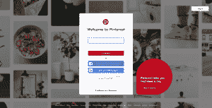
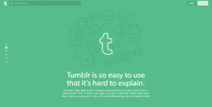
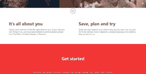

# 你主页的四种流量类型

> 原文：<http://caseyaccidental.com/the-four-types-of-traffic-to-your-home-page/?utm_source=wanqu.co&utm_campaign=Wanqu+Daily&utm_medium=website>

每个创始人最喜欢的项目是重新设计他们的主页。这是向所有客户介绍你的公司、品牌、使命、希望和梦想。至少，你认为是。当你分析你的实际业务时，你可能会发现大多数新客户并不是从你的主页开始的。如果你做的是付费获取，他们可能会登陆为这些广告设计的特定登陆页面。如果你是通过社交流量或搜索引擎优化来增长，大多数人会选择特定的内容。典型的成长团队对这种冲动的反应是，主页不是一个高优先级，他们应该在登录页面或内容页面上工作这是正确的。但是一些企业的主页仍然是流量的主要来源。你必须了解什么类型的交通是为了重新设计它不完全是浪费时间。我将谈论这些类型的流量是什么，如何识别它们，以及基于你的混合流量你可以追求什么类型的设计。

**流量类型#1:想要登录**
的人在参与度很高的网站上，主页的大量流量来自已经是客户并想要登录的人。在这种情况下，您的目标是尽可能方便地登录，或者通过类似 Google Smart Lock 的东西自动登录。更好的是，如果你能确保你永远不会注销你的客户，那么他们永远不会看到这个页面，并立即回到产品中。脸书、Pinterest 和 Tumblr 就是很好的例子。
 
当脸书在前面和中间注册时，它有一个用于登录的顶部导航栏，那是光标开始的地方。

Pinterest 有一个统一的注册和登录字段，上面有一个友好的行动号召，只说继续。它还有一个专门的登录按钮，供搜索者使用。
 
Tumblr 的前面和中间有一个登录按钮，相当于注册按钮。

优化登录时的指标是登录转换率。这个可能比你想象的要难算。我们来做一个例子。假设有 10，000 人访问你的主页。2000 次登录。假设这一页上又有 500 人注册。你的登录转化率是 2000/(10000–500)= ~ 21%。你实际上不知道剩下的 7500 个没有登录或注册的人是不是去注册或登录的。如果您有 cookie 数据，您可以检查它们是否曾经登录过，这可能会给出如何对它们进行分段的线索。如果您没有这些数据，您会认为他们是在那里登录的。如果可能的话，永远不要让人们退出登录。帮助他们登录的最好方法是让他们一直登录。像[谷歌智能锁](https://get.google.com/smartlock/)这样的工具也很有效。

**流量类型#2:想要注册的人**
有人直接来到你的主页，并不是因为他们在浏览器中随意输入。他们已经有了一些背景。一个朋友告诉他们这件事，他们读到一篇文章，或类似的东西。这些人中的许多人已经被说服并想要注册，而主页的工作就是避开他们的方式并使之尽可能容易。一般来说，网站通过在表单的前面和中间放置一个标志来做到这一点，并使表单非常容易填写。你可以看到脸书和 Pinterest 在这方面做得非常好。如果你看上面的图片，脸书的注册表单是右对齐的，Pinterest 的是前面中间的。没有什么会让你分心去注册。

优化注册时的衡量标准是注册转化率。它类似于登录转化率，只是用 signup 而不是 logins 作为分子，并用分子减去 logins。给定上面的相同数字，你的注册转化率是 500 / (10，000–2，000) = ~6%。你实际上仍然不知道剩下的 7500 名没有登录或注册的人是否是来注册或登录的。所以，保守地说，你假设他们是来报名的。

**流量类型#3:想了解更多的人**
直接来到你主页的人和不是现有用户的人可能会有很大的出入。有些人可能想像上面一样快速注册，但其他人只是想了解更多。更好的是，他们不愿意在了解这个网站是否适合他们之前给你他们的信息。对于这些用户来说，理想的情况是看到免费的预览。如果需要个人信息来展示一个令人信服的产品，那么主页就出售价值而不是展示价值，或者要求过滤标准而不要求个人信息。Tumblr、Pinterest 和脸书都以不同的方式解决这类用户。如上例所示，脸书将脸书的解释靠左对齐。Pinterest 和 Tumblr 创建了一个单独的行动号召，以了解更多信息，从而引发专门的“了解更多信息”体验。Pinterst 有一个红色的按钮，上面有一个如何工作的按钮，Tumblr 在页面底部有一个可点击的绿色栏，询问“Tumblr 是什么？”。两次点击都会滚动显示这些产品的用途。
Tumblr:
T5T7】

[T2】](https://secureservercdn.net/50.62.195.160/q3u.d9b.myftpupload.com/wp-content/uploads/2018/03/Tumblr-Homepage-3.png)

[T2】](https://secureservercdn.net/50.62.195.160/q3u.d9b.myftpupload.com/wp-content/uploads/2018/03/Tumblr-Homepage-4.png)

[T2】](https://secureservercdn.net/50.62.195.160/q3u.d9b.myftpupload.com/wp-content/uploads/2018/03/Tumblr-Homepage-5.png)

T3】Pinterest:

[T2】](https://secureservercdn.net/50.62.195.160/q3u.d9b.myftpupload.com/wp-content/uploads/2018/03/Pinterest-Homepage-3.png)

**流量类型#4:持怀疑态度的人**
第四种类型的新用户会访问你的主页。就是这个人听说了，但是很怀疑。吸引这些用户的最好方法是让他们尽可能长时间地免费使用产品。你通常会遇到这些用户，他们的产品渗透得很好，很晚才接触到大多数人或落后者。谷歌是一个很好的例子，它让你不用注册就能体验产品的价值。
[T6】](https://secureservercdn.net/50.62.195.160/q3u.d9b.myftpupload.com/wp-content/uploads/2018/03/Google-Homepage.png)

你可以从上面的例子中看到，公司试图在页面上同时面对多个受众。在某些情况下，根据页面的活跃程度，他们可以将你明确地归入其中一组。Gibson Biddle 有一篇很棒的文章,讲述了网飞是如何针对这些不同类型的用户以及这些用户对他们品牌的理解来改进他们的设计的。

—
当你在制作你的主页时，你应该首先确定它是最重要的工作页面。对于许多网站来说，他们的登陆页面是更多人了解产品的地方。当你在你的主页上工作的时候，想想这四种受众，哪一种是你真正需要优化的，以及你是否能容易地细分和处理其他不是你主要关注的群体。此外，随着受众和品牌认知度的变化，一定要重新审视这些决策。

*目前正在听碧波儿的 [Mind Bokeh。](https://open.spotify.com/album/4VXEMU4mlHvP5Zb8M83wM2?si=Pt6HYmbcTjGbrCcep_OWcA)*