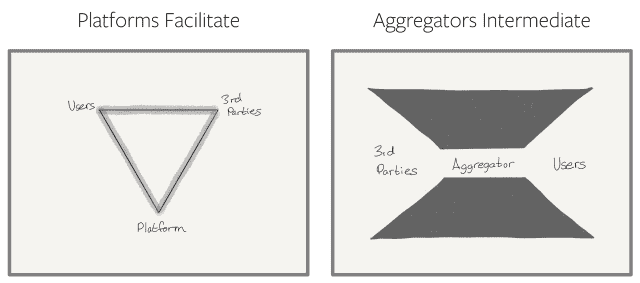
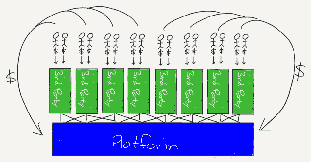
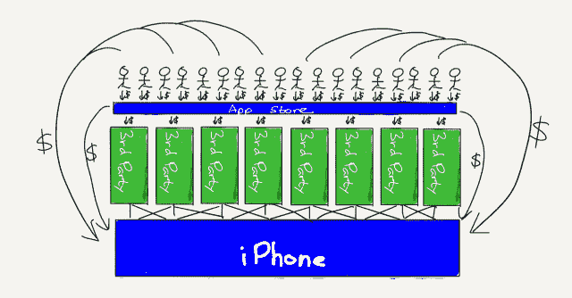

# 开发人员的成本——本·汤普森的战略

> 原文：<https://stratechery.com/2018/the-cost-of-developers/?utm_source=wanqu.co&utm_campaign=Wanqu+Daily&utm_medium=website>

昨天看到了三个开发者相关的公告，两个来自苹果，一个来自微软。前者是苹果年度全球开发者大会主题演讲的一部分:

*   下个月将满 10 岁的 iOS 应用商店每周有 5 亿访客，截至本周晚些时候，开发者的收入将超过 1000 亿美元。
*   明年的某个时候，开发者将能够使用 iOS 用户界面框架(称为 UIKit)为 Mac 编写应用程序。

与此同时，微软在三年内第二次通过大规模收购超过了苹果的基调。来自[公司的新闻稿](https://news.microsoft.com/2018/06/04/microsoft-to-acquire-github-for-7-5-billion/):

> 微软公司(Microsoft Corp .)周一宣布，已达成收购 GitHub 的协议，GitHub 是全球领先的软件开发平台，超过 2800 万名开发人员在这里学习、分享和合作，以创造未来。两家公司将携手合作，让开发人员在开发生命周期的每个阶段实现更大的成就，加速企业对 GitHub 的使用，并将微软的开发工具和服务带给新的受众。
> 
> 微软首席执行官塞特亚·纳德拉表示:“微软是一家开发者至上的公司，通过与 GitHub 联手，我们加强了对开发者自由、开放和创新的承诺。“我们认识到我们在本协议中承担的社区责任，并将尽最大努力帮助每一位开发者构建、创新和解决世界上最紧迫的挑战。”
> 
> 根据协议条款，微软将以 75 亿美元的微软股票收购 GitHub。

开发商真的很贵！

#### 平台开发者共生

在过去的几个星期里，特别是在比尔·盖茨线下，我一直在探索聚合器和平台之间的差异；虽然聚合器通常收获已经生产的内容或商品，但开发者利用平台创造全新的东西。

这导致了开发人员和平台之间的共生关系:从技术角度来看，平台为开发人员提供了构建新体验所必需的基本构建模块(即应用程序接口，或 API ),从市场角度来看，这些新体验为客户提供了首先购买平台或升级平台的理由。

应用程序推动底层平台采用的程度当然会有所不同；不足为奇的是，相对于开发者而言，该平台的盈利潜力以一种相关的方式变化。例如，传统的 Windows 只提供很少的终端用户功能；让它如此有价值的是所有基于其开放平台构建的应用程序。

这里的“开放”意味着两件事:第一，Windows API 可供任何人构建，第二，开发者直接与最终用户建立关系，包括付费。这催生了许多大型软件公司，并于 2003 年在 Windows 上创建了一个平台:Valve 的 Steam。

Valve 意识到的是，玩一款游戏只是整体客户体验的一部分；发现和购买游戏的体验也很重要，安装和升级过程也是如此。此外，这些客户痛点也是开发人员的痛点；例如，开发 Steam 的最初动力是让玩家一起升级的困难，这对于玩家在线竞争的游戏来说是必不可少的。尽管 Valve 是一家私营公司，从未公布过 Steam 的收入数字，但有报道称，该平台每年创收数十亿美元。

尽管如此，与 iOS 应用商店相比还是相形见绌:苹果采用了 Steam 的应用商店理念，并将其与平台整合，因此 iOS 用户和开发者别无选择，只能使用苹果拥有和运营的分销渠道，这带来了各种限制和成本，准确地说是 30%。

苹果之所以能够做到这一点，首先是因为底层产品 iPhone 和 iPad——激发了独立于应用程序的需求。苹果拥有开发者赚钱所需的用户。

第二，App Store，就像之前的 Steam 一样，确实是一种更好的体验，推动了最终用户更多的下载和购买。这意味着为 iOS 开发不仅仅是因为用户数量，还因为这些用户愿意购买比在其他平台上更多的东西。

第三——这也适用于 Steam——App Store[极大地降低了开发者的准入门槛](https://stratechery.com/2013/friction/)；这导致了更多的应用，吸引了更多的用户，从而导致了更多的应用，既锁定了应用作为竞争优势，也确保了没有一个应用拥有过大的权力(让苹果可以自由地[通过法令](https://www.theverge.com/2018/5/24/17392470/apple-rejects-valve-steam-link-app-store-ios-game-steaming)限制类似 Steam 的竞争对手)。

#### 苹果的平台公告

这就构成了我上面提到的两个苹果公告。从 iOS 开发者获得 1000 亿美元的消息开始:这意味着苹果已经获得了大约 400 亿美元，而且利润非常高。

此外，苹果的绝大多数声明都是关于与这些开发者的竞争:宣布的第一款新应用 [Measure](https://www.macrumors.com/2018/06/04/apple-ar-measuring-app/) 应该会立即淘汰商店中唯一明显有用的增强现实应用。苹果还宣布了一个新的播客应用程序，用于手表、更新新闻、股票和语音备忘录应用程序，唯一的第三方演示是关于最大的软件公司之一 Adobe 将如何支持苹果首选的 3D 图像格式。为什么不呢！拥有所有这些高价值用户意味着，无论如何，在 iOS 上，开发者是廉价的。

然而，Mac 是一个不同的故事:平台远小于 iPhone 仍然有许多高质量的独立软件供应商支持 Mac，这证明了开发者能够与客户建立跨越数年和多次交易的直接关系是多么有价值。尽管如此，Mac 应用程序的数量，如果不是朝着错误的方向发展，肯定不会以任何有意义的方式增长，这似乎是一个毫无疑问的问题；没有足够的用户来吸引开发者。

这意味着苹果的方法必须与 iOS 有很大不同:苹果没有向开发者发号施令，而是宣布它正在进行一个多年项目，以使 iOS 应用程序更容易移植到 Mac 上。从某种意义上说，这是苹果为 Mac 应用付费；不，钱不会流向开发者，但是苹果公司自愿承担了更大部分的移植工作。当你没有足够多的用户时，开发者的花费会高得多。

#### GitHub 的成本

尽管如此，无论苹果构建这个移植框架的成本是多少，它肯定比微软为 GitHub 支付的 75 亿美元要少得多。话又说回来，乍一看，可能不太清楚比较的意义在哪里。

回到 Windows:微软几乎不用做什么就能说服开发者在这个平台上进行开发。事实上，即使在微软的反垄断问题最严重的时候，开发者仍然以压倒性的优势青睐该平台，原因很明显:所有用户都在那里。换句话说，对于 Windows 来说，开发者是廉价的。

如今情况不再是这样了:Windows 仍然是企业和游戏的重要平台(尽管令微软懊恼的是，Steam 在这方面获得了大量平台利润)，但该公司在移动领域没有平台，在云计算领域排名第二。此外，第二的位置很大程度上取决于引导现有的企业客户使用云计算；目前还不清楚为什么会有新公司或开发商选择微软。

这是考虑收购 GitHub 的背景:由于缺乏一个拥有足够多用户来吸引开发者的平台，微软不得不通过高级工具直接“收购”开发者，现在有了 GitHub，一个具有大量网络效应的高级云产品。问题是，在没有用户杠杆的情况下，以这种方式收购开发者成本非常高；很难想象 GitHub 能产生这样的收入来证明这个收购价格的合理性。

不过，GitHub 的收入并不是重点；微软有充足的收入。它还有一个潜在的致命弱点:没有基于用户的平台。相反，微软押注于独立于平台的开源、基于云的应用程序将在未来占据越来越大的份额，并且公司有机会通过直接为开发人员提供卓越的用户体验而不是简单地对他们施加影响来赢得未来。

顺便说一下，这正是为什么微软是 GitHub 的最佳收购者，GitHub 是一家已经筹集了 3.5 亿美元风险资本的公司，可能不会成为一个独立的实体。任何拥有大量用户平台的公司都会发现很难抵制使用 GitHub 作为杠杆的诱惑；另一方面，纯粹专注于企业的公司，如 IBM 或 Oracle，会试图榨干公司的每一点利润。

微软想要什么就更模糊了:它想成为开发者的朋友，很大程度上是因为它没有其他选择。从长远来看，特别是随着 Windows 继续衰落，公司将会在一个没有看门人的世界中投入更多，在这个世界中，开发工具和云通过更好的优点而不是通过能够利用用户来获胜。

然而，这正是微软不得不付出如此多的原因:直接购买比利用杠杆要昂贵得多，而利用杠杆可以产生同等甚至更好的效果！—以少得多的投资获得回报。

### *相关*