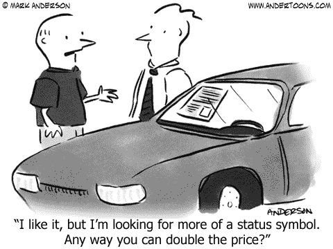
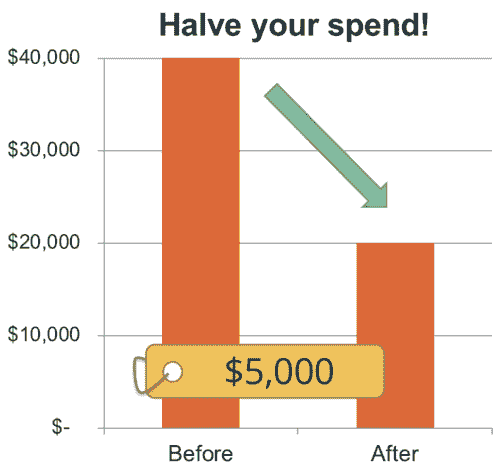
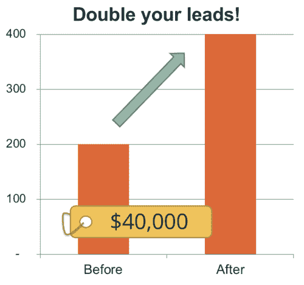

# 重新定位产品如何让你的价格翻 8 倍

> 原文：<https://blog.asmartbear.com/more-value-not-save-money.html?utm_source=wanqu.co&utm_campaign=Wanqu+Daily&utm_medium=website>

[T2】](https://www.andertoons.com/car/cartoon/3220/i-like-it-but-im-looking-for-more-of-status-symbol-any-way-you-can-double-price)

定价通常更多的是关于定位和感知价值，而不是关于成本分析和[难以令人信服的投资回报率计算器](https://blog.asmartbear.com/roi-selling.html)。

因此，重新定位可以让你收取比你想象的多很多倍的费用。以下是方法。

你创造了一个名为 DoubleDown 的营销工具，它使 AdWords 活动的成本效率翻了一番。你听到了正确的说法——作为一名营销人员，你可以产生同样的影响，同样数量的转化，同样质量的销售线索，但只需*当前广告支出的一半*。精彩！谁不想要更高的投资回报率。

这个工具能卖多少钱？显然，你不能收取客户在 AdWords 上节省的钱，否则最终结果是根本没有节省。比方说，你可以收取 25%的储蓄，仍然会找到许多愿意的客户。

对于每月在 AdWords 上花费 40，000 美元的特定客户来说，您的销售宣传应该是这样的:

[T2】](https://blog.asmartbear.com/wp-content/uploads/2018/05/HalveYourSpend.png)

太棒了！Demand Gen 的副总裁将能够向《CMO》吹嘘，即使在支付 DoubleDown 的费用后，她每月也为公司节省了 15，000 美元，而你每月则赚了 5，000 美元。大家都很开心！

现在让我们来看看为什么同样的产品你实际上可以收取八倍的价格。

营销人员只有一个最高目标:增长。甚至像品牌、活动和公关这样的间接营销也有支持增长的长期目标。对 DoubleDown 的客户来说，这是直接的:通过 AdWords 创造商机来实现增长。

成长比成本更有价值。要了解原因，请考虑以下两种情况:

1.  CMO 向首席执行官汇报:我今年能够降低 20%的成本。首席执行官很高兴。首席执行官的后续问题是:我们将如何利用这些节省来实现更快的增长？
2.  CMO 向首席执行官汇报:我今年实现了 20%的增长，但我们也为此多花了 20%的成本。首席执行官在欢声笑语中挥舞着拳头。公司的价值呈非线性增长。额外的收入增长超过了产生它的额外营销成本。首席执行官的后续问题是:我们如何确保这种情况在明年再次发生？

对于一个企业来说，更快的增长比节省成本更有价值 10 倍。

这一见解为我们指出了双倍下注的另一种方法。不是为了同样的增长花更少的钱，而是花更多的钱来创造更多的增长。

具体来说，以目前每月花费 40，000 美元的客户为例，假设该客户每月从这笔花费中产生 200 条优质销售线索。销售宣传的变化如下:

> 你现在每条线索支付 200 美元，每月产生 200 条线索。使用 DoubleDown，您可以*将您生成的销售线索数量*增加一倍，但每条销售线索的成本仍然是 200 美元:

[T2】](https://blog.asmartbear.com/wp-content/uploads/2018/05/DoubleYourLeads.png)

关键是:客户愿意花 40，000 美元来创造 200 条线索，因此也乐意花 80，000 美元来创造 400 条线索。这 80，000 美元中有多少是给 AdWords 还是给 DoubleDown 并不重要。关键不是“在 AdWords 上省钱”，而是“以相似的单位成本创造更多的增长。”

在“省钱”宣传中，价值是 20，000 美元，客户需要保留 75%的价值创造。而在“创造增长”宣传中，价值是 40，000 美元，客户很乐意将创造的价值 100%支付给供应商。**无论是创造的价值数量，还是客户愿意支付的价值百分比，与“省钱”宣传相比,“增长”宣传要高出*倍*。**

所以下次你想把你的产品设计成一种“节省时间”、“省钱”或“更有效率”的方式时…**不要！**

相反，弄清楚你的产品如何以你的客户已经衡量价值的方式创造价值，并将你的产品定位为实现*和*的一种方式。