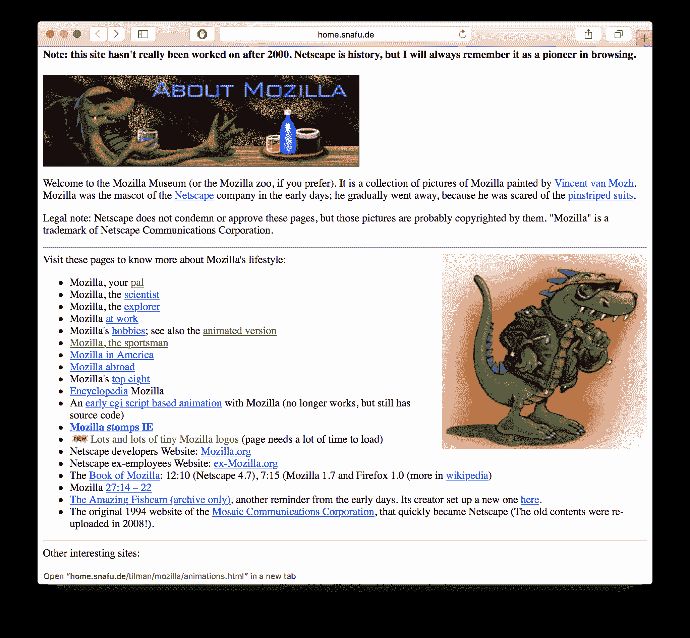
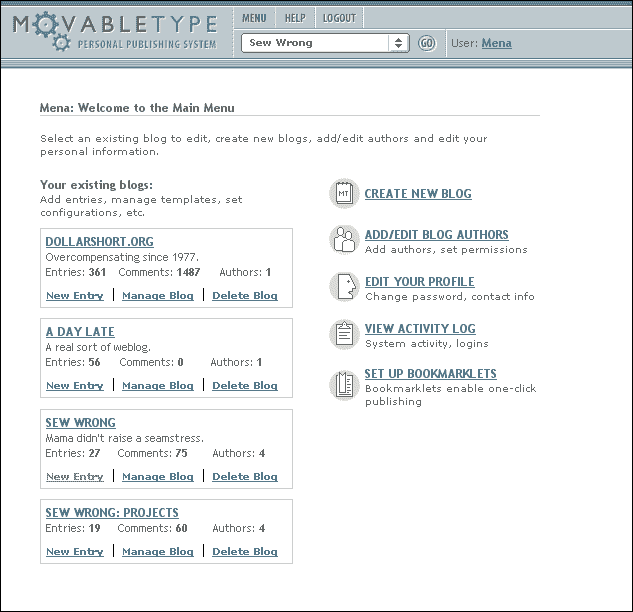
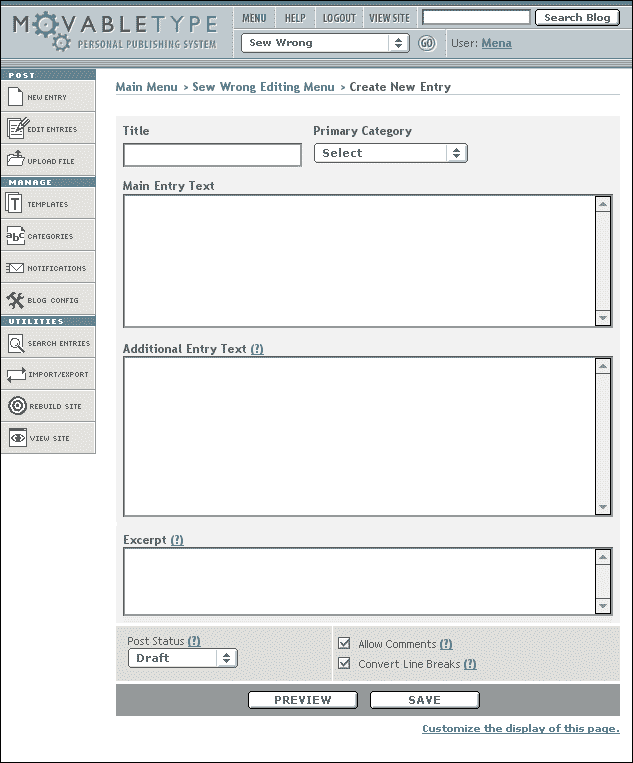
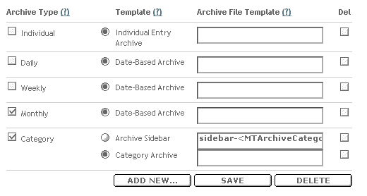
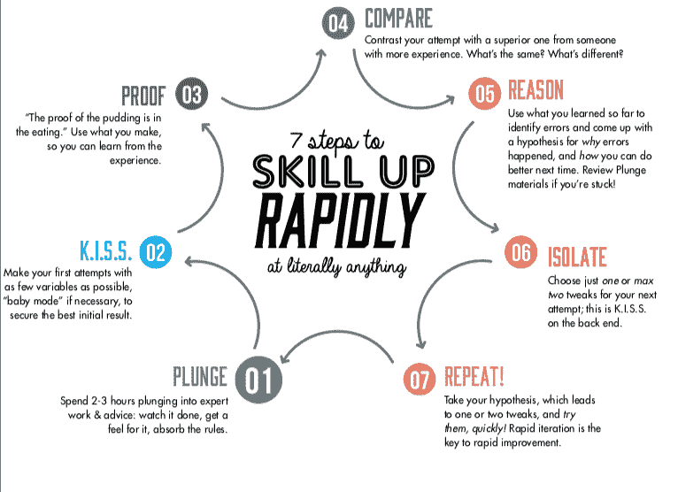

# 博客如何打破网络——堆砌砖块

> 原文：<https://stackingthebricks.com/how-blogs-broke-the-web/?utm_source=wanqu.co&utm_campaign=Wanqu+Daily&utm_medium=website>

我第一次上网是在 1993 年，那时候网络上有一个大写字母——事实上是三个——远在讽刺伸展它的腿和解开它的法兰绒衬衫之前。回到你可以真正说你在网上冲浪的时候。

多年来，每次登录网站，我做的第一件事就是下载网景公司的**酷的东西**。

“酷”自称是了解新出现的酷网页的最佳途径……遍及*全球* *互联网*。有一段时间，确实如此。

那时，网络是如此之小。小到可以想象一个人可以维护每个站点的列表。

使用 1 帧/分钟的网络摄像头监视另一个大陆上的咖啡机，或者点击一个不起作用的红色大按钮，这真的是既新奇又酷。

那时候，我们没有平台、订阅源、社交网络或者……博客。

我们有*个主页*。

背景是灰色的。字体，Times New Roman。链接可以是任何颜色，只要它是中等的蓝色。酷孩子没有视差滚动…但他们有水平标尺 gif。

假设你知道一些标签，创建一个新的网页大约需要一分钟。

没有要配置的数据库。没有要安装的脚本。没有插件，没有安全补丁。没有饼干。没有 iframes，没有 web 优先的脚本语言，没有 web 应用。

我们手工制作了每一个新页面。当我们有不止一个网页*页面*时，我们手工构建导航*。我们手工管理我们的目录表。我们拿出计算器来为我们的图像地图编码边界。我们简单地讨论了“超链接”*

 *当我们更新一个页面时，我们打了一个小小的“新！”上面有图案。

而不是-新链接？你点击了它们，它们就变成紫色了。

没有两个主页是相同的。肯定没有内容管理系统这样的东西。但这并不意味着主页内容没有得到管理。

一个组织良好的主页是个人和职业自豪感的标志——即使它只是一些有趣的 gif 图片，或者如何制作最好的土豆枪的说明，或者沙鼠基因的自制研究。

日期并不那么重要。内容持续时间更长；它变少了。旧的内容也保留在视图中，因为主要的隐喻是目录表而不是 T2 的日记条目。

每个有主页的人都成了事实上的业余参考馆员。

显然，这并没有持续多久。

⌘

94 年，一个名叫贾斯汀·霍尔的大学生摆脱了目录格式。他每天都在自己主页的顶部添加内容，并在每个部分的标题上注明日期。他分享一切:从他发现的有趣联系到他的性和毒品实验。

贾斯汀的链接成为第一个每日*网络日记*。

那时候它们被叫做……网络日记。(网志这个名字是几年后出现的，因为他们的一些作者远离了极其私人的话题。)

大多数日记都是作为一个独立的部分存在的，链接自相关日记作者的常规个人主页。日记条目要么都是内联内容，就像贾斯汀的一样，要么是从索引页面单独链接的。

但是这是一个大的偏离:这些条目，无论是内嵌的还是链接的，都不是按照内容、重要性或类别来组织的。

它们总是按时间倒序排列。

日记看起来是这样的:

它们就像网络本身一样，古怪而高度个性化，风格上常常带有忏悔色彩。这一切都是那么微秒。

但是它不是很受欢迎。

⌘

当 jjg 在 1999 年初整理他的“网络日志”列表时，只有 23 个。那不是错别字:二十三，网上二十三个网络日志，啊啊啊啊。毫无疑问，他错过了许多人——那时已经有一大群人活过，也死过，包括我的——但是通过什么样的乘数呢？五个？十次？所以大概有 230 个网络日志？

根据 Eatonweb 的数据，到 2000 年末，仍然只有 1285 人。当然，同样的披露也适用于这些数字，但说真的…

“网络日志”的世界很小。

当然，早期的网络本身是相当排外的:首先，你必须在线，然后你必须知道 HTML，这还不够，你还必须有一个托管账户，并知道如何使用它。没有一条康庄大道。每个想成为网民的人都不得不开辟自己的道路。

但是个人主页比博客多成千上万。

主页有一种永恒的品质，它是关于一个主题或一个人的有趣、有用或相关的事物的索引。你没有为了追求新鲜感而每天重装一个主页。(这就是网景公司的《什么是酷》的目的！)

按时间顺序排列的内容占少数。

当时的互联网主要由学者、专业人士和大学生组成。不是每个人都有每天发表他们的焦虑诗歌、性爱录像或冲浪习惯的欲望；另一个限制超时空内容的因素是它所需要的时间和能量。写日记是*一项非常繁重的工作。首先，你必须有话要说，然后写，编辑，格式化，添加剪贴画，编辑你的 index.html，编辑任何上一页/下一页链接，检查这些链接，最后，上传文件。*

这是无聊，乏味，复杂的。

当 Blogger 和 Livejournal 在 1999 年出现时，这一点没有改变——与 jjg 的 23 人名单是同一年。两者都没有立即取得成功。对于习惯了自由格式 HTML 的先锋来说，它们有限的功能和缺乏控制令人恼火。

⌘

第一次真正的运动发生在 2001 年。就在那时，一项发明问世了，它将彻底改变全球人们分发书面内容的方式:

活字。

不，不是那个。这一个:

MT *不是*第一个促进快速网络发布的工具，但它是第一个*强大的*工具，吸引了那些爱好者、自己动手的人和网络猴子。

它也是第一个基于网络的 CMS，你可以免费下载，安装，并在你自己的网络主机上运行。

这是所有手工劳动的第一个可行的替代品。它使得更新一个*博客*变得容易。而不放弃完全的控制。

这是许多网民接触过的第一个 CMS，包括我自己。

像许多早期的网络日记爱好者一样，我关注着一个叫 Mena Trott 的人的冒险和沉思。她的美元空头已经开始看起来像你的基本博客:功能，可服务，没有虚饰，在一个页面上有很多帖子，因为*螺旋手工制作所有这些不同的文件*。基本上，它很丑。

要做那么多艰苦的工作*和*让它发光发热，实在是太多了。

但是有一天它变得很漂亮。

和流线型。

如此简约！

这令人震惊。就像你一生都住在一个普通的杂乱的房子里，在普通的无聊的郊区，周围都是普通的人，他们有自己普通的杂乱的房子，然后有一天，醒来发现自己在一期《建筑文摘》上。

*人可以这样生活吗？*

我能这样生活吗？

答案就在那里，在清新流畅的页面底部，有一个小小的徽章——还记得徽章吗？ —窃窃私语:

> 由活字驱动

言外之意很明显:这种无忧无虑的美丽可以是你的。

谁能抗拒？

⌘

从技术上讲，活字印刷术并不是一场革命。它不像今天的 CMSes 那样是一个实时的网络应用程序；它没有提供动态内容。一点也不花哨。

它所做的只是利用 Perl 脚本的能力来完成我们过去都是手工完成的工作:输出静态 HTML 文件。

然而，从文化角度来看，这是毁灭性的。

突然之间，人们不再创建主页或网页，而是在网页的表单域和文本区域中编写网页内容。

突然，*没有建造*他们自己的系统，而是在一号内部*工作。*

一个别人建立的系统。

哦，当然，你可以*定制你的活字网站。你所要做的就是编写模板程序。这比 HTML 更难，但对于那些已经维护了自己网站的人来说，并不是很难。如果你不能自己编程，那么，你可以复制和粘贴代码片段。似乎整个(小小的)博客圈都在分享他们的最爱。*每个人的日历边栏！**

只有一个问题…

这是个陷阱。

那些小侧边栏日历是诱饵。

⌘

问题的关键在于:当一件事很容易时，人们会做得更多。

当你手工制作你的整个网站，从头到尾，你开始于一个无限可能的世界。你可以完全按照你喜欢的方式定制你的内容，并按照你喜欢的任何方式组织它。你所做的每一个设计决定都代表着大致相同的工作，因为，不管怎样，你都必须手工完成。无论是倒序条目还是整齐的目录。你不妨做你想做的。

但是一旦你有了一个操作起来毫不费力的工具——*但是只能以特定的方式*——每一个偏离标准的选择都代表着巨大的成本。

这就是活字印刷蚕食博客世界的原因。

主页制作突然变成了一个经济学问题:

1.  使用系统的默认格式:零工作。
2.  根据你的格式定制系统:比纯 HTML 要多得多的工作

一旦提供了一条阻力最小的道路，谁又有精力一路坚持下去呢？

队形

这更容易——更快！——从字面上理解就是随着*时间*的流动……

⌘

活字是由每天写新日记的博客作者设计的。前者盲目地遵循那个函数。这种格式非但无助于组织或管理自由形式的内容，反而很死板:标题、类别、条目。除了单个条目本身，您只有四种页面类型选择:每日(chrono)、每周(chrono)、每月(chrono)和令人惊讶的通配符类别。

但是在分类档案里，文章是按日期排列的。自动地。不需要或不允许人工输入。

就这样开始了按时间排序的时代。

或者，我喜欢称之为:

克罗诺斯统治着我周围的一切。

⌘

活字没有*只是*扼杀了博客定制。

它(和它的竞争对手)积极地扼杀了其他形式的网络产品。

非日记作者——那些拥有老式学校图书馆员风格主页的人——就像博客作者一样想要那些超级酷的边栏日历。他们被简单易用的诱惑所诱惑。因此，尽管他们没有写日记，他们还是投入时间和精力迁移到这个新平台。

他们很快发现超时空流是个不错的仆人，但却是个可怕的主人。

土豆枪女孩和沙鼠遗传学的家伙发现他们不想*要*写*更新*。这说不通。他们的网站应该仍然是一个目录，一个参考工具，一个奇怪的有点发霉的个人图书馆…新的“帖子”格式根本不适合他们想要做的事情。感觉要求很高，很压抑。

但是他们已经换了。他们已经花费了所有的时间、精力和乐观。要切换回来，他们必须从头再来一遍。当然，这只会更糟，因为他们必须完全从头开始建设新(旧)站点。他们没有工具来塑造它。

一旦你尝到了轻松更新的滋味，就很难再手动操作了。

所以他们没有。

成千上万的同龄人也没有。这简直不值得。惯性太强了。

旧的网络，酷的网络，怪异的网络，手工组织的网络…都死了。

该死的逆年表偏见——一旦被召唤到创造中，它就永远饥饿着——寻找下一个受害者。Myspace。脸书。推特。Instagram。最重要的是 Pinterest。今天，这些社交出版工具开始抵制倒序排序；他们引入了算法排序，根据个人和群体的历史，不是根据发布的时间，而是根据受欢迎程度或预期的互动来显示内容。现在的控制比以往任何时候都要少。

不再有古怪的主页。

不再有业余研究图书馆员了。

这一切都要归功于一个古怪的软件，它是为了减轻一小部分观众的痛苦而制作的。

这一点都不酷。

### 那是从更多的地方来的

我们每周三都会发电子邮件，告知来自我们企业、学生和研究的最新见解。将您的电子邮件放入下面的框中，我们会将新内容直接发送到您的收件箱中！

绝对没有垃圾邮件。我们尊重您的电子邮件隐私。随时退订。万岁。*