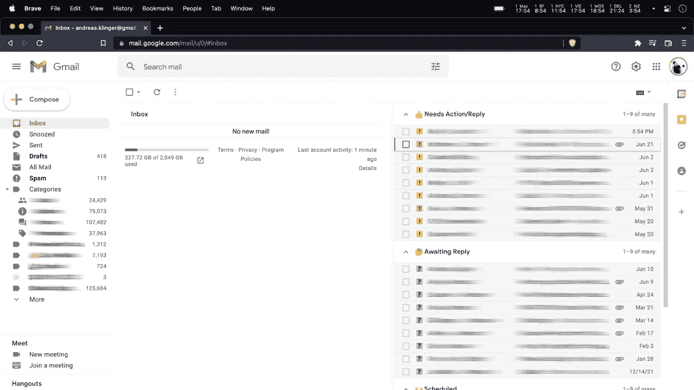
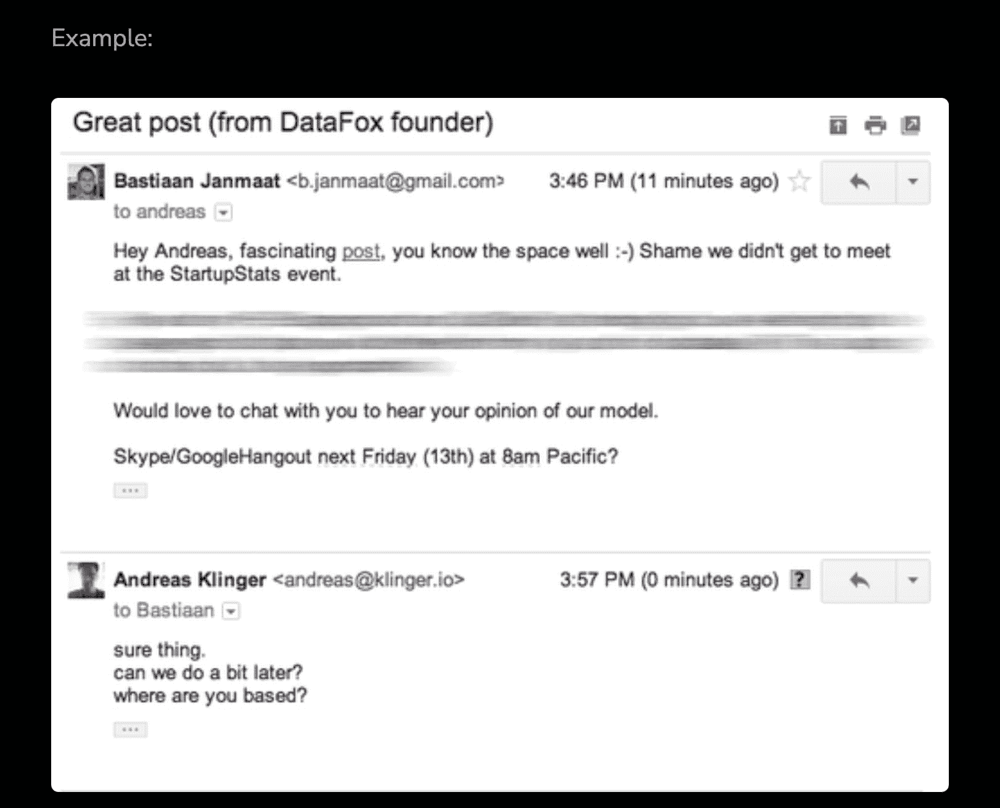
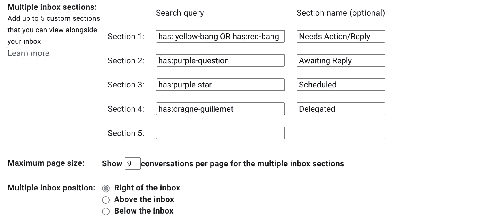

# 如何更有效地使用| Andreas Klinger

> 原文：<http://klinger.io/post/71640845938/dont-drown-in-email-how-to-use-gmail-more?utm_source=wanqu.co&utm_campaign=Wanqu+Daily&utm_medium=website>

# 如何更高效地使用 Gmail

2013 年 12 月 30 日 8 分钟阅读量 339，670 次

这是对我的原始帖子(早在 2013 年)的高度更新，仅在过去几个月就有超过 30 万的浏览量🤯

希望这次更新有所帮助！

仍然是真的:没有插件，没有插件，只是更好的 Gmail 体验。

* * *

我通常会写关于**[【Angellist】](https://klinger.io/posts/angellist-is-the-nasdaq-of-our-generation)****[初创公司](https://klinger.io/posts/startup-mentoring-sessions-how-to-be-a-decent-maybe-even-good-startup-mentor)****[创始人](https://klinger.io/posts/the-founders-lie-about-comfort-zones)****[未来](https://klinger.io/posts/why-the-future-needs-a-brandname)** 尤其是 **[指标](https://klinger.io/posts/a-primer-on-startup-metrics-which-analytics-tool-to-pick)** 的博客，但我已经向这么多人展示了这种“生活黑客”，所以我认为值得自己写博客。希望有用。

如果你很难在 Gmail 中掌控你的电子邮件，你可以试试我的设置。我很难忘记并相信我——我很容易分心。

## **这是我自 2010 年以来使用 Gmail 的方式**

*   GTD-
*   一个易于管理的，通常是**空的收件箱**在左边
*   方框 1 -所有“待办事项”
*   方框 2 -所有“等待回复”的电子邮件
*   方框 3 -所有“授权”电子邮件
*   方框 4 -与会议、航班等相关的所有电子邮件
*   **全部通过 0 个插件完成，仅使用标准 gmail 功能**

**使用这种设置很难丢失概览**

我甚至无法想象以其他方式使用 gmail。没当回事。我看到那些混乱的优先收件箱标签收件箱系统，我很害怕。害怕谷歌有一天会强迫我使用这些功能。

Btw:这种方法并不特别新颖。我在 2010 年的 LeWeb 上从一个人(忘记名字了)那里学来的，在一篇名为“Gmail Ninja”(找不到链接)的博客文章中提到过。

## **我如何管理日常工作**

*   一封电子邮件进来了
*   立即处理那些你能处理的
*   其他标记为待办事项(方框 1)
*   如果您想在回复时跟踪他们，您可以将他们标记为“等待回复”或“已委托”(这样您就可以快速找到他们并进行跟进)
*   确保存档所有电子邮件
*   现在你左边的收件箱是空的
*   所有重要的东西都在特殊的盒子里，右边的那个

### 这里有一个例子:

*   收到一封邮件
*   能够立即回复(如果我没有时间，我会把它标记为黄色的 bang (Todo))
*   我回答道
*   标有“等待回复”(问号)
*   存档电子邮件
*   这封邮件已经不在我的收件箱里了，而是在我右边的“等待回复列表”里
*   他的回复会进入我的收件箱(我们从立即回复或标记为行动开始)
*   存档-收件箱零

**就是这样！你完了。**

希望工作流程对你有所帮助。

## 感兴趣吗？-设置大约需要 15 分钟…

…但可能会永远改变您使用电子邮件的方式；)

简单来说，就是:

1.  设置多个收件箱
2.  决定你的特别明星
3.  将特殊的星星链接到您的新收件箱
4.  启用收件箱布局
5.  到达零收件箱

### 1.设置多个收件箱

1.  转到设置
2.  选择多个收件箱
3.  另外:将布局切换到“紧凑”

### 2.决定你的特别明星

1.  前往设置>通用
2.  向下滚动到星星
3.  添加您想要使用的星星

我使用:

*   **待办事宜的黄色图标**
*   **重要待办事项的红色图标**
*   对于我期待或等待回复的电子邮件，问号。(这样我可以跟进)
*   **橙色 Guillemet** (双箭头)代表我委托给某人但期望完成的电子邮件。(这样我可以跟进)
*   **紫色星星**用于任何安排好的会议、航班、活动门票、电话或任何与活动相关的我可能需要快速找到的东西。

### 3.将特别的星星链接到你的新收件箱(也就是添加过滤器)

1.  前往设置>多个收件箱
2.  为您的收件箱添加所需的过滤规则
3.  选择‘收件箱右侧’——选项在底部**(！)**

这是所有明星名字的备忘单:

*   有:红星
*   有:橙色星
*   拥有:绿色之星
*   拥有:蓝星
*   拥有:紫星
*   有:红帮
*   has:orange-guillemet
*   有:黄色-bang
*   has:绿色-检查
*   有:蓝色信息
*   有:紫色-问题

注意:你还可以通过添加 OR、AND 或其他任何你可以在搜索中使用的东西来进行更复杂的过滤。我用 OR 来表示重要的和非常重要的事情。

**使用 Gmail？**我建议使用普通的黄色星号表示“待办事项”。这样你至少可以在手机上标记 todos。不幸的是，其他功能将无法正常工作，因为 Gmail 应用程序不支持它们。

### 4.启用收件箱布局(又名取消标签；) )

这部分有点烦人——基本上，你需要禁用 Gmail 的很多花哨的默认功能。如果在您完成指南后，新的多收件箱布局没有出现在您的收件箱中，您可能错过了此处的某个步骤。

前往设置>收件箱

*   切换到“默认”
*   关闭任何关于选项卡的配置
*   关闭任何关于优先级、重要邮件或过滤器的配置
*   **现在重新加载**

### 5.第一时间到达零收件箱

让我猜猜你现在有很多邮件或者？第一次有几千。

你需要从“几千封邮件”变成“零收件箱”。这需要现在就开始。别担心，其实挺容易的。

1.  浏览邮件的前两三页。
2.  用 todo 图标标记所有待办事项(在我的例子中是黄色的 bang)。
3.  每一个你有最后一封电子邮件的线程，用你的等待回复图标(在我的例子中是问号)来标记等待回复。
4.  对于你的委托和事件电子邮件也是如此。

看完前两三页后，你仍然觉得没有什么(仍然)重要的东西——大胆行动吧...

1.  单击全选(左上角的复选框)
2.  确认你真的是指所有的 6523 封邮件
3.  点击存档

现在你的收件箱应该是零，你的右边区域应该是满的。

## 额外收获:更多 GMAIL 工作流程提示

如果你喜欢上面的建议，你可能也会对我的其他 Gmail 工作流程提示感兴趣:

### 自动过滤收到的电子邮件

我很确定你会收到许多时事通讯、群组等。

*   取消订阅你不需要的
*   过滤你只需要搜索的内容(我这样做是为了关注者的更新等)
*   过滤所有可以自动处理的东西(例如，我所有的发票都有一个标签，我所有的商业发票都有一个标签，然后转发给我的助理，他会用它来记账)

到目前为止，我已经有超过 100 个过滤器，只有在我真的需要看的时候，我才会看到新邮件。

### 键盘导航

*   在设置中启用快捷方式
*   [学习它们](https://href.li/?https://support.google.com/mail/answer/6594?hl=en&ctx=mail)
*   最重要的 **y** 存档， **r** 回复， **a** 回复全部， **s** 明星

### 自动推进

*   在“设置”>“高级”中启用“自动前进”,这样你可以在早上快速浏览新邮件

### 将您的电子邮件帐户合并为一个

*   去他妈的多次登录
*   将所有电子邮件提取到您的主要 gmail 帐户
*   确保使用“smtp”功能，以避免电子邮件被“代表”发送

*   选取总是从您收到邮件的电子邮件回复
*   如果你的私人和工作邮件都在同一个收件箱里，这是个理想的选择

### 标签 vs 明星

有几个人提到，建议用标签代替明星。标签可在移动应用程序和其他应用程序中访问。

就我个人而言，我更喜欢星星，因为它们更容易接近。但是，如果你正在寻找一种方法，让同样的工作流程也可以在你的手机上访问，标签可能是解决方案。

## **就这样。**

我希望这个工作流程对你的帮助就像它对我和我展示的几个人的帮助一样多——如果你想要[请发这篇文章](https://twitter.com/intent/tweet?text=Nice%3A%20%22Don%27t%20drown%20in%20email!%20How%20to%20use%20Gmail%20more%20efficiently.%22%20an%20awesome%20step-by-step%20guide%20by%20%40andreasklinger%20http%3A%2F%2Fbit.ly%2F1hPZ618&source=webclient)。如果你有任何进一步的问题或建议如何改进我的工作流程，也可以随时在 twitter 上打电话给我: [@andreasklinger](http://twitter.com/andreasklinger)

在那之前，lifehack 这个星球，

安德列亚斯

