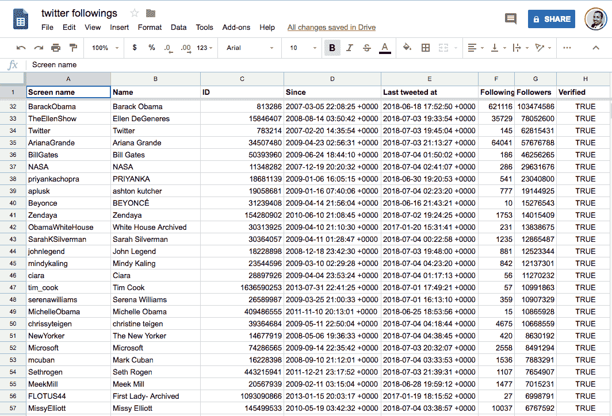

# 放开所有人

> 原文：<https://anildash.com/2018/07/13/unfollowing-everybody/?utm_source=wanqu.co&utm_campaign=Wanqu+Daily&utm_medium=website>

在这一点上，注意到社交媒体通常是有毒的和有压力的并没有什么新奇的。但即使抛开这些担忧，我们的社交网络也不是我们通常认为需要维护或保养的东西，即使我们定期更新我们数字生活的所有其他方面。

本着做必要维护的精神，我最近做了一件我想了很多年的事情:在 Twitter 上取消关注所有人。现在，这种决定奇怪地令人担忧；许多人将他们在社交媒体上的关注关系视为一种地位，而不仅仅是信息在人与人之间流动的标志。但我决定假设我联系的人知道我不关注每个人并不是出于个人原因，而只是对在一个网络上有超过 5000 个账户与我分享信息的巨大噪音的回应。

**更新:** Julius Tarng 开发了一个非常受欢迎、非常迷人的小故障应用程序，名为 [Tokimeki Unfollow](https://tokimeki-unfollow.glitch.me/) ，它可以帮助你清理你的时间线，并使你轻松取消关注任何没有给你带来快乐的账户。如果你不想做一堆科技的东西，一定要用这个！

* * *

## 我是如何做到的

好吧，如果你不是程序员，这部分可能会有点怪，但我想我会解释一下这个过程，以防有人想重复。

几年前，Twitter 曾经有一个命令行界面，用于对帐户执行批量或自动操作。过了一段时间，他们放弃了它，所以 Erik Berlin 为 Twitter 的高级用户创建了一个新的命令行工具，[简称为“t”](https://github.com/sferik/t)。它是用 Ruby 写的(一种我基本上能读但不能写的语言)，所以如果你按照[几个简单的设置步骤](https://github.com/sferik/t#dependencies)，它很容易运行。

正如 Erik 在文档中提到的，你需要在你的账户上设置一个[新的 Twitter 应用](https://apps.twitter.com/)，并获得允许`t`工具在你的 Twitter 账户上执行操作的凭证。(注意:我在更新和认证时出现了一些错误；对`t`所依赖的一个 ruby 库进行[编辑](https://github.com/sferik/twitter/issues/878#issuecomment-349718252)立即修复了这个问题。)

## 这个计划

那时，我想遵循几个简单的步骤。这些对我来说花了一点时间，因为我在 Twitter 上关注了 5000 多人，但如果你关注的人数更合理，这些步骤都不会超过几分钟。这是我的计划:

1.  将我关注的所有人复制到一个 [Twitter 列表](https://help.twitter.com/en/using-twitter/twitter-lists)，这样我仍然可以在我所有设备上的 Twitter 应用程序中访问他们，并且如果我想的话，我仍然可以随时查看我的旧时间表。
2.  将我关注的所有人存档到一个电子表格中，这样我就可以对他们进行分类，并根据地理位置或他们有多少关注者或他们是否经过验证进行过滤——基本上是在决定关注谁时可能感兴趣的任何标准(或*不关注*)。
3.  实际上，不要关注任何人，重新开始。

事实证明，这些步骤中的每一步都非常简单。

### 将您的所有关注复制到列表中

如果你想备份你所有的追随者，你只需要做一个列表，然后填充它。你可以在大多数常规的 Twitter 应用程序中制作列表，但在命令行中制作很简单:键入`t list create following-`date "+%Y-%m-%d"``制作一个以当前日期命名的列表，这样你就可以很容易地记住这是一个你今天关注的人的列表。您可以非常容易地理解这里的`t`语法——像`list create`这样的命令是不言自明的。

接下来，我们有一个稍微复杂一点的命令，将您的所有追随者复制到新列表中；您将转储出一个您关注的每个人的列表，然后通过管道输入另一个`t`命令将他们添加到您的新列表中。它是这样工作的:`t followings | xargs t list add following-`date "+%Y-%m-%d"``。(如果你像我一样，你会在午夜左右做所有这些事情，日期会在中途改变，你应该只输入当前日期，而不是使用`date`变量。)

就是这样！现在你已经有了一个所有关注者的列表，如果你在你的 Twitter 客户端应用程序中浏览这个列表，你应该会看到和你的常规时间表完全一样的东西。但是，请注意，Twitter 列表对于超过几千个粉丝的人来说效果并不好。我的 5000 多名粉丝花了几个小时才出现在名单上，在此期间，对名单上有多少人的统计往往是不正确的。

### 将您的关注归档到电子表格中

一般来说，这是一件有趣的事情，如果你喜欢对你的社交网络数据进行分割的话。通过允许完整数据的“长格式”导出，支持导出关于你的关注者的大量数据，而不仅仅是他们的名字和 Twitter 账号。你可以得到一些信息，比如他们在 Twitter 上有多少收藏夹(赞)，他们的账户是什么时候创建的，他们关注了多少人或者被多少人关注了。令人沮丧的是，Twitter 不再让这种数据导出变得容易，包括那个人是否关注*你*；这需要额外的查询。

您将使用 CSV(逗号分隔值)作为将数据导出到电子表格的格式。还有好消息！`t`原生支持。所以您的命令看起来应该是这样的:`t followings -l --csv > followings.csv`，它基本上是说“以长格式将我的 followings 导出到一个名为‘followers . CSV’的 CSV 文件中。”一旦你这样做了，你就可以在 Excel 或 Google Sheets 中点击几下打开它，一切都准备好了。

spreadsheet of people I used to follow on Twitter

当我跟踪的所有人都在一个电子表格中后，我就可以按他们有多少追随者或追随者，以及他们的最后更新进行排序，我发现了一些已经去世的朋友，他们的账户已经休眠了多年，或者是那些相关性已经过期的笑话账户，或者是小网络中的安静声音，它们被淹没在我每天听到的许多其他声音的喧嚣中。我发现这一部分真的很值得一试，并决定少关注一些拥有庞大关系网和广泛影响力的人。

### 居然不跟！

然后，到了重头戏的时候了:实际上，不要关注任何人。我不认为这对其他人来说是什么大问题，但试图运行一个取消关注每个人的单一过程让我反复遇到 Twitter 的速率限制，他们试图阻止任何应用程序在太短的时间内对你的帐户执行太多的操作。最后，我写了一个简单的脚本来批量取消跟随，然后暂停几分钟，再重新开始。

但是有了一个更合理的网络，取消关注每个人的命令非常简单:

`t followings | xargs t unfollow`

它会突突地响几分钟，然后就完了！你不再跟踪任何人了。除了它可能看起来和你一样。

> 很多人注意到我的粉丝数不是 5，或者你看到了我关注的不正确的名单。这是一个被称为“最终一致性”的设计的产物，Twitter 和其他分布式系统用它来帮助扩展。[https://t.co/FGzQ9qR0SG](https://t.co/FGzQ9qR0SG)T2】2018 年 7 月 5 日

在我的例子中，我的粉丝数在*天*是错误的，并且一直显示非常不准确的信息，比如坚持说我在关注迈克·彭斯的一个官方账户。(不用说，情况从来不是这样。)所有这一切都要归功于一个名为[最终一致性](https://en.wikipedia.org/wiki/Eventual_consistency)的架构决策，这有助于 Twitter 扩展到其庞大的规模，但在处理异常情况方面做得不好，比如能够立即看到刚刚取消关注数千个账户的人的正确粉丝列表。

尽管如此，事情还是做了。我重新推荐了几个重要的账号(我的家庭、 [@Glitch](https://twitter.com/glitch) 和 [@Prince](https://twitter.com/prince) ，准备重新开始。

## 经验教训

已经一周半了，嗯...Twitter 更令人愉快。我选择了几个每天关注的账户(大多数是我以前关注过的，有些对我来说完全是新的)，这带来了很大的不同。另一方面，在我取消关注所有人之后，大约有 100 人似乎也取消了对我的关注，我希望如果我之前关注过他们，他们不会觉得有义务回报我。(也可能是一周内有多少人不关注我，我不知道。)

最直接的好处之一是，当新闻中发生可怕的事情时，我不会看到数十人无休止、重复地对此做出反应。事实证明，我不介意了解时事，但看到许多我关心的人在坏消息发生时经历痛苦或悲伤，这让人很难过。我想优化意识，但不是情绪压倒。

就这一点而言，我也基本上没有重新允许任何新闻账户或“官方”企业账户。我需要知道的关于主要头条的任何事情都会通过其他渠道浮出水面，甚至只是 Twitter 的其他部分，所以我不需要看到媒体公司的社交媒体更新，这些媒体公司的整个经济模式是基于给我足够的压力来点击他们的网站。

类似地，我把更多的注意力放在了艺术家、活动家和那些写我着迷的东西的人身上——王子、芒果、城市交通等等。这给我的生活带来了更多的快乐，写这些其他话题的人给我想关注的事情提供了更多的灵感。奇怪的是，鉴于我的工作是一家科技公司的首席执行官，我关注*的科技人要少得多，除了我自己，几乎没有科技公司的账户。尽管如此，自从做了这个改变后，我几乎没有错过任何重要的事情。*

## 算法正在学习

我最感兴趣的是自从我换了网络之后，Twitter 上的推荐内容和账户是如何变化的。以前，我的 Twitter 应用程序中的许多推荐标题或特色推文都来自“技术风险投资”等类别；现在，他们更可能是关于“气候变化”或“喜剧演员”，而不是棒球内部的技术谈话。

不太好的一面是，Twitter 仍然暗示我关注几乎全是男性的账户，而且绝大多数美国白人都有经过验证的 Twitter 账户。这对我来说很奇怪，因为我[现在关注近 100 个账户](https://twitter.com/following)，他们基本上是我一直感兴趣的种族、性别和地理的混合。我原本希望 Twitter 的跟随建议算法至少能像它的内容建议算法一样具有适应性，并希望它能更新到不符合通常特权模式的账户。(我仍然关注许多验证过的账户，但其中一些是由于我刚刚意识到的一个奇怪现象，即我的许多朋友都验证过账户。你看，妈——我是大城市精英！)

### 接下来呢

我不知道这一切意味着什么；显然，自从社交网络存在以来，我就一直在思考它的设计、影响和最佳利用。我强烈认为，我们应该有意识地使用我们的网络，甚至花数年时间开发工具来鼓励这一点，尽管主要社交网络的企业利益排除了围绕鼓励更健康地使用其平台建立业务。

但是我很高兴做出了一个关于管理我的网络的有意识的决定，并且我哀叹这需要相当高水平的技术知识才能做到这一点。我第一次[写 Twitter](https://anildash.com/2007/02/14/consider_twitte/) 的时候，它只有几个月大，我谈到了它的前景，并预测 Twitter 将采用@messaging，并适应其社区发明新行为的其他方式。其中一些发生了，但是当然大多数高级用户(和易受攻击的用户)想要的东西从来没有被创造出来。

我也写了很多关于在社交媒体中拥有一个大网络的独特之处，比如 [Twitter 早期建议关注哪些账户](https://anildash.com/2009/12/29/life_on_the_list/)(包括我的账户！)以及[拥有一个名人的社交网络](https://medium.com/message/nobody-famous-37790cb4d014)却没有真正出名是什么感觉。我想了很多关于[为什么我在各种网络上“喜爱”(或喜欢)这么多东西](https://anildash.com/2011/06/09/all_in_favor/)。我还希望人们能够更广泛地思考社交网络的设计与我们如何看待自己以及我们如何看待社会地位的关系，最好的例子就是围绕在推特上被验证的巨大社会焦虑。

最后，我回到了几年前我写的文章，当时我第一次决定停止转发男性微博(这种做法我已经坚持了大约五年):

> 如果你愿意，试着留意你分享、放大、验证和推广给别人的是谁的声音。

这仍然是非常重要的一点，对于这个列表，我只想补充一点:也要注意你追随的人。有时不要害怕重新设定和重新开始。

