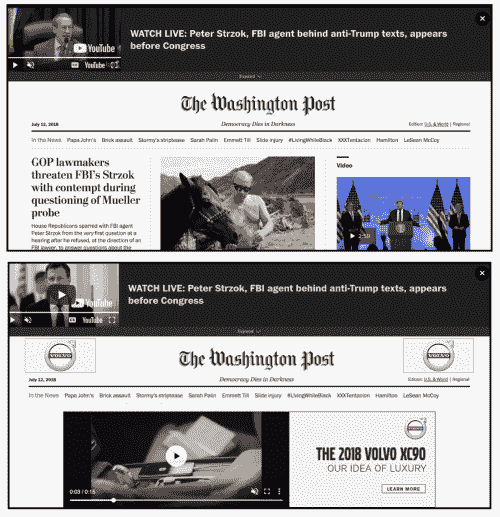
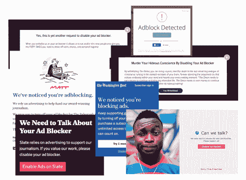
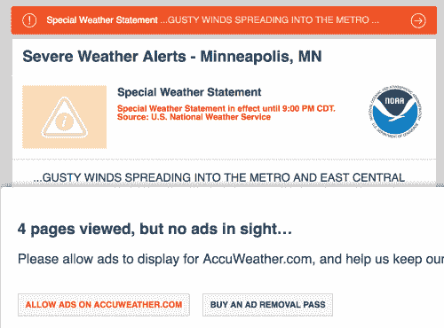

# Adblock 羞辱的兴起-社会学图像

> 原文：<https://thesocietypages.org/socimages/2018/07/12/the-rise-of-ad-shaming/?utm_source=wanqu.co&utm_campaign=Wanqu+Daily&utm_medium=website>

如果你走过一个城市，没有抬头看任何广告牌，广告商会对你大喊大叫吗？一座标志性建筑的所有者会因为你“偷”走了一处美丽的风景而让他们失去生计而感到羞耻吗？这听起来很荒谬，你可能还记得[班克斯的一句病毒式引用(改编自肖恩·特贾拉奇的原创作品)](http://tumblr.austinkleon.com/post/19194337959)，把这个想法撕得粉碎。

但是数字广告呢？如果你用软件屏蔽广告，互联网看起来会很不一样。长时间使用它，你会忘记一个用户为了阅读或观看任何东西而不得不费力地阅读多少垃圾内容。

当然，屏蔽广告削减了在线出版物的主要支持来源。最近，许多人采取了一种新的方法来阻止他们的用户屏蔽广告:老式的羞耻和内疚。

我们可以就为在线内容付费的道德问题进行一次重要的对话，但这些弹出窗口给我印象最深的是一些关于羞辱策略的核心社会学问题:为什么是在这里，为什么是现在？

长期以来，社会科学家已经看到了互联网接入不平等如何加剧社会不平等的“数字鸿沟”。研究还表明，数字鸿沟不仅仅是接入的问题；从这些早期的访问经历中，人们学会了以不同的方式使用互联网。从设计的角度来看，社会学家 Jenny Davis 和 James Chouinard 也写了关于[的启示理论](https://static1.squarespace.com/static/5265b993e4b08e763cbf59cd/t/59a88e37ccc5c5a040c5a9c6/1504218680501/davis2017.pdf):技术请求、要求、允许、鼓励、劝阻和拒绝用户不同行为的方式。

Yes, you can see the important weather alert, but first…

对一些人来说，互联网是丰富和代理。花尽可能多的时间来解决你的问题，如果事情没有解决，让世界屈从于你的意志！抓取开源软件或写一个脚本来自动化这些无聊的东西！如果公共汽车晚点或出租车繁忙，打开你选择的应用程序来叫车！对其他人来说，这些选择并不那么显而易见。如果你不得不长途跋涉去图书馆，注册一个有时间限制的计算机访问，互联网可能看起来没那么有用，也没那么免费，至少乍一看是这样。

这些想法有助于我们理解广告屏蔽羞辱的最大问题:“软”障碍、延迟和情感诉求正试图改变那些已经在学习寻找和使用屏蔽软件以使互联网更好地为他们服务方面占了上风的人的行为。大卫·班克斯在 2015 年的《半机器人学上写的关于这个[的文章展示了权力斗争在起作用:](https://thesocietypages.org/cyborgology/2015/09/23/full-communism-is-the-ultimate-ad-blocker/)

> 广告拦截器不应该被视为一种自私的技术。这是一个社会主义的大棒——迫使懒惰的资本家寻找新的和创造性的方法来使他们的创造可持续发展。广告拦截器是用户不得不对抗快速赚钱需求的少数工具之一，因为它扰乱了容易追踪的注意力的可预测性。

现在，像内疚和羞耻这样的情感诉求是出版公司失败后的下一步。挑战在于，负罪感和羞耻感需要更大的社区责任感，才能让人们感受到它们的影响，我不确定弹出窗口除了会成为一个障碍之外，还会成为什么。

这并不是说网络广告本身就有好坏之分，数字时代艺术家和作家的薪酬问题是一个严重的问题。但是除了这些考虑之外，直接看网页设计试图塑造我们在线互动的方式可以更好地让我们准备好看到社会世界的规则是如何被挑战和改变的。

*[Evan Stewart](https://www.evan-stewart.com/) is an assistant professor of sociology at University of Massachusetts Boston. You can follow him on [Twitter](https://twitter.com/EvanStewart23).*