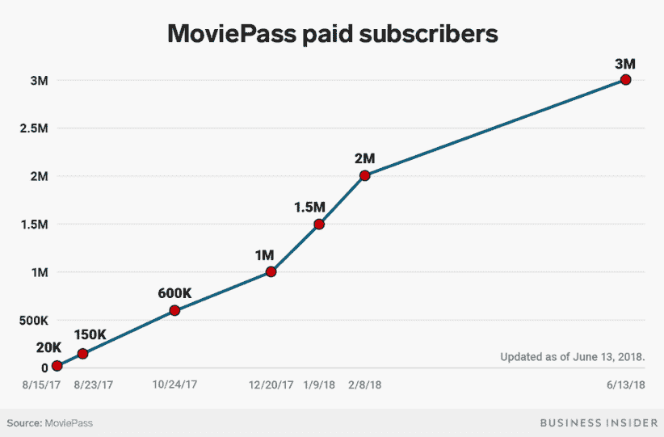
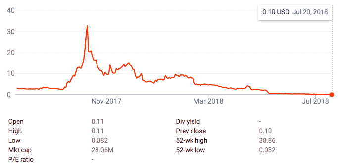

# MoviePass、AMC 和电影订阅货币化媒体时代

> 原文：<http://monetizingmedia.com/moviepass-amc-and-the-era-of-cinema-subscriptions/?utm_source=wanqu.co&utm_campaign=Wanqu+Daily&utm_medium=website>

AMC 娱乐公司上个月宣布了一项 19.95 美元/月的订阅服务,名为 AMC Stubs A-List，供电影观众每周在其影院观看最多 3 部电影(Stubs 是他们的奖励计划)。这对于 AMC——世界上最大的连锁影院——来说是一个巨大的试验，尤其是因为它的首席执行官 Adam Aron 一直对 MoviePass 非常不满，movie pass 在去年 8 月将其价格从 50 美元/月降至 10 美元/月后，引发了人们对订阅影院套餐的兴趣，自那以来，订阅用户从 2 万增加到 300 多万。

MoviePass 的使命是“颠覆”电影业，它的会员资格非常便宜，任何人都可以轻松加入。该公司有负面的单位经济效益(即使每月去看一部电影的订户也会赔钱)，但它表示，它将产生其他收入来源，如广告、向电影制片厂出售数据、制作自己的电影，以及说服连锁放映商给它一部分食品和饮料收入(阿伦表示，AMC 永远不会同意这一点)。

movie pass 的增长率导致其控股公司 Helios & Matheson Analytics 在纳斯达克交易的股票从一年前的 3 美元上涨到 2017 年 10 月的 38 美元，但不断加深的亏损已经赶上:其股票目前的交易价格为 0.10 美元(2600 万美元市值)。Helios & Matheson 首席执行官 Ted Farnsworth 声称，他们将在未来几年内再筹集 12 亿美元的股权和债务融资，以扩大内部电影制作部门，到 2018 年底将实现现金流为正(假设他们有 500 万订户)。

### 订阅电影票有意义吗？

如果您有经常性的购买频率(价格大致相同)，并且您可以为客户的忠诚度提供额外的好处，而这些好处是他们无法从一次性交易中获得的(如节省成本、改善体验、社区成员感等)，订阅通常是有意义的。).对一个企业来说，优势在于获得一个客户(CAC)的成本相对于他们的终身价值(LTV)来说很低，因为他们一直在付费，而你不必每次都针对他们进行营销活动；定期付款周期中可预测的财务状况；以及更深入的客户参与(通常花费更多，收集的数据更多)。

我们进入“订阅经济”已经有几年了，公司似乎正在测试为消费者使用的每一种产品和服务进行订阅的想法:衣服、清洁产品、葡萄酒、晚餐、航班、冥想、音乐、视频、书籍、看病等等。几乎每个媒体公司似乎都推出了订阅视频点播服务或订阅会员层来阅读文章。消费者现在习惯了订阅各种各样的东西，现在有机会将它们捆绑在一起进行联合促销，从而获得新客户(如 Spotify x Hulu，售价 12.99 美元)。

为了设置电影票预订的背景，让我们考虑一些关于美国和加拿大电影观看情况的统计数据[1]:

*   **2017 年，四分之三(76%)的 2 岁以上人口**至少去看一次电影，平均每年去看 5 次电影。更具体地说，12%的人每月去一次或更多，53%的人每月不到一次，但每年多次，11%的人每年去一次，24%的人从不去。
*   **一半(49%)的门票收入**来自那些每月或每月以上的游客，其中大多数(57%)年龄在 12-38 岁之间。
*   **大约一半的连锁展商收入**来自特许经营，但特许经营的利润率要高得多，所以一旦顾客进门，很大一部分利润来自他们的消费。
*   **票房总收入**2002 年为 15.7 亿英镑，近年来下降至 2017 年的 12.4 亿英镑(1992 年以来最低)。*但是*这 124 亿张门票的销售额达到了 111 亿美元(继 2016 年和 2015 年之后的第三高)。这也是主题公园和职业体育赛事的两倍。
*   **连锁参展商正在提高票价** (2017 年平均价格:8.97 美元)和优惠价格，以弥补顾客的减少，并投资于使电影院成为一种“优质”体验，提供皮革躺椅、高端食品服务、影院内供应的酒精等。他们需要从经常看电影的影迷身上榨取更多的钱。

即使价格合理，包月也不会改变那些从不去电影院或一年只去一次电影院的消费者。这可能会吸引一大批一年看几次电影的人，将他们的出席率提高到大约每月一次……订阅为他们提供了足够的节省和额外津贴，当他们去的时候，他们决定尝试一下，然后选择更多地去看电影，因为他们有它(或者选择不取消它，即使他们错过了一两个月)。

当然，月租电影对两类人最有吸引力，他们可能会立即看到节省:那些已经每月去一次的人和那些已经每月去多次的人。每月的参加者已经有了去电影院的习惯，这是一项常见的活动，所以免费订阅可以让他们第二次去电影院，这将使他们中的许多人每月的频率增加到 1 倍以上(如果不是在门票上，就在优惠上花更多的钱)。

电影爱好者每月多次去电影院，既省钱又能通过订阅获得特殊津贴。当然，这些人是 AMC 和其他公司的最大受益者——他们已经购买了大量的门票和优惠——因此大幅减少他们为门票支付的费用可能会对业务造成不利影响。

**这就是为什么分层订阅模式是有意义的**如果这种商业模式是可持续的。通常，在实施消费者订阅模式时，开始时只有一个层以保持简单，然后随着时间的推移添加其他层以获取(并提供)更多价值给不同的客户群。MoviePass 和 AMC 目前有一个适合所有人的订阅，但市场至少有两个层次。基本层应该是吸引人们每月去一次或两次的价格。这是关于用一个显而易见的价格(像<10 美元/月的两张票)来扩大月客户市场，引发快速的规模，转化那些每年只去看几次电影的人的有意义的百分比。也许它被限制在高峰时段(例如漫威电影的首映之夜)或 IMAX 上使用。

第二层应该是电影爱好者；他们每月在电影院花费 30 多美元也没问题，他们渴望的可能是特殊津贴和社区，而不是门票上的大幅折扣……这对参展商来说也是明智之举。这里的目标是进一步加深他们的参与，提出新的产品供他们消费，并动员他们成为福音传播者。这一层应该为每月第三张及以后的门票提供一定比例的折扣，或者提供更高价格的全时段观看服务，包括高峰时段和 IMAX 电影，提供额外的优惠和观看补贴，优先购买首映夜门票，包括在线或离线电影讨论组，鼓励带朋友来，等等。

### 电影通行证的问题是

让我们把 MoviePass 看作一个市场:一边是消费者，另一边是电影院，消费者可以选择他们想从哪个电影院买票。创业市场通过一边聚集消费者需求，另一边聚集卖家(或服务提供商)来获得采用和强大的市场地位。这种模式在分散的市场中非常盛行，许多中小型公司相互竞争。因为初创公司已经在一方聚集了大量的消费者，所以公司必须参与进来，否则这些消费者就会被引向竞争对手。这就是市场对供应方的影响力，随着时间的推移，市场利用这种影响力来压缩供应商的利润(将节省的成本转嫁给消费者，同时将一些中间商收入囊中)。MoviePass 通过赔钱的门票预订来聚集消费者需求，然后希望利用这一点来迫使参展商削减他们的特许收入，给他们门票折扣等。它可能会将其产品分成多个层次，尽管管理层表示，他们甚至在长期内都没有这样做的打算。

这里的问题是，MoviePass 实际上并没有对参展商产生多大的影响，因为这是一个相当集中的市场。北美的夫妻店影院所剩无几(尤其是放映好莱坞大片而非印度电影的影院)。三家公司——AMC Entertainment(由中国大连万达拥有)、Regal(由英国 Cineworld 拥有)和 Cinemark——在美国电影市场占有 50%的市场份额，并且每年都在增加(此外，它们在主要的大都市地区拥有更大的主导地位)[2]。在加拿大，一家连锁影院拥有 78%的市场份额[3]。每个个人消费者只有很少几个电影院，距离他们很近，可以放映主要电影……可能是 AMC、Regal 和 Cinemark(或只是 Cineplex)的某种组合。如果消费者决定去看电影，他们很可能会去其中一家——movie pass 没有太大的权力引导他们去其他地方。看电影是一种线下体验，所以全国各地有成千上万的小连锁店与 MoviePass 合作对任何特定的消费者都无关紧要；唯一重要的是离他们最近的几家电影院。

**主要参展商可以提供他们自己的订阅服务**，因为他们拥有展会(即他们是垂直整合的)，所以可以为会员提供更多额外待遇:AMC 提供 10%的优惠，升级到最大的爆米花/饮料尺寸，以及座位和优惠的优先排队。他们还可以捕捉电影观众的额外离线数据，如他们在特许经营店买了什么，他们和谁在一起，他们的情绪和外表(使用计算机视觉)等。并利用所有的客户数据来改善现场体验(迎宾员用名字欢迎你，用一次点击提前点你常用的食物/饮料，等等。).此外，通过拥有线上和线下的客户互动，参展商就有了数据来销售更好的有针对性的广告，从而弥合线上和线下的体验。

### MoviePass 会怎么样？

最终，MoviePass 缺乏财务基础，无法让大型贷款机构或股权投资者提供其宏伟计划真正需要的资金支持。我认为 MoviePass 将继续烧钱，并最终被大型参展商(AMC，cinework，Cinemark)或 SVOD 播放器(亚马逊，网飞)收购，他们可以立即利用其订户基础和用户数据。

与大多数大股东或董事会必须竞争是否接受交易的初创公司不同，MoviePass 的控股公司是公开交易的。因此，如果一个收购要约基于该股一段时间以来的交易价格非常高，公司领导层如果不认真考虑(并有充分的理由拒绝)，就会面临股东诉讼。

### 这只是开始。

AMC 和其他顶级参展商链提供的订阅服务如果定价和分级明智，对各方都有吸引力，它们将加速参展商市场的进一步整合(就像 SVOD 服务在电影/电视领域引发的整合一样)，因为每个人都希望其订阅包含任何给定城市的热门影院。消费者自然每人只能订阅一部电影，因此，确保他们对一家主要连锁影院的长期忠诚度，而不是竞争对手，将是参展商的重中之重。

此外，这些订阅将从电影票扩展到其他离线娱乐产品。面对影院上座率的长期下降，这是连锁放映商已经在朝着的方向前进……有远见的连锁放映商正在重新设想自己，不再是看电影的公司，而是周末晚上和朋友一起做什么的公司。一些连锁店正在整合虚拟现实游戏，其他的正在使用他们的一些剧院进行电子竞技比赛，如果你决定呆在家里，一些有 TVOD 电影出租，等等。(Cineplex 正在做所有这些，甚至更多)。通过扩大会员范围，将电影院以外的活动包括进来，他们可以吸引更多每年只去看几次电影的人来报名。在我看来，这里最大的机会是创建线下娱乐体验的亚马逊 Prime 会员……这是一个涵盖广泛活动的节省成本的捆绑包，对很大一部分成年人来说报名参加是显而易见的。这是我所期待的发展方向。

* * *

*资料来源:* 【1】[美国电影协会主题报告 2017](https://www.mpaa.org/wp-content/uploads/2018/04/MPAA-THEME-Report-2017_Final.pdf)
【2】美国银幕市场份额，由此而来 [NYT 文章](https://www.nytimes.com/interactive/2016/03/07/business/media/amc-biggest-movie-theater-chain.html)
【3】加拿大 Cineplex 市场份额，由其[投资者关系](http://irfiles.cineplex.com/investors/factsheet/2016_Q4_Investor_Fact_Sheet_FINAL_r.PDF)