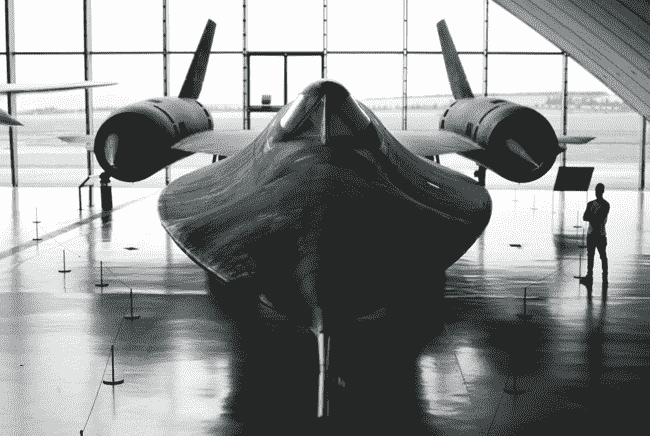
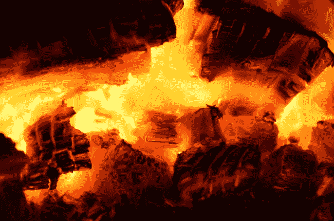

# 追求生产极简主义——brandur.org

> 原文：<https://brandur.org/minimalism?utm_source=wanqu.co&utm_campaign=Wanqu+Daily&utm_medium=website>

据报道，冷战期间在洛克希德工作时，凯利·约翰逊发明了 [KISS](https://en.wikipedia.org/wiki/KISS_principle) (“保持简单，笨蛋”)；这一原则清楚地表明，系统应该设计得尽可能简单。

虽然复杂性从来都不是任何项目有意识的设计目标，但是当追求新功能或引入新组件时，它会自然出现。KISS 鼓励设计师通过将简单性作为目标来积极抵消这种力量，从而生产出更易维护、更可靠、更灵活的产品。在喷气式战斗机的情况下，这可能意味着一架可以在战场上用很少的工具和在紧张的战斗条件下修理的飞机。

在他任职期间，洛克希德的臭鼬工厂将生产像 U-2 和 SR-71 这样的飞机；他们以卓越的工程设计而闻名，留下了我们今天仍在回味的遗产。

The famous SR-71, one of the flag ships of Lockheed's Skunk Works. Very fast even if not particularly simple.

我们中的许多人追求工程领域的工作，因为我们在智力上很好奇。技术很酷，新技术更好。我们想用大家都在谈论的东西。

我们的新闻来源、聚会、会议，甚至对话都偏向于那些正在积极开发或大力推广的闪亮新技术。安静地坐着并且很好地工作的老组件消失在背景中。

随着时间的推移，技术不断增加，但很少被移除。如果任其发展，已经存在了足够长时间的生产栈会变成一个杂乱无章的拼凑物，将世界上的一切都结合在一起。这种影响是危险的:

*   更多的部分意味着更多的认知复杂性。如果一个系统变得太难理解，那么错误或操作失误的风险就会增加，因为开发人员在没有理解所有交织在一起的问题的情况下就进行了修改。

*   一旦投入生产，就没有什么是完美无缺的。堆栈中的每一个组件都是失败的候选，如果规模足够大，*总会有一些东西*失败。

*   随着技术的发展，工程师将会成为各行各业的行家里手，但却什么都不精通。如果出现了特别严重的问题，可能会更难诊断和修复，因为很少有专家能够深入研究。

即使知道这一点，扩展我们工具的本能也很难抑制。说服通常是我们工作的核心能力，我们可以用同样的力量说服自己和我们的同事，让他们相信现在就将新技术纳入我们的堆栈是至关重要的。这种基于 Go 的高可用性关键/价值存储将使我们的正常运行时间和故障恢复能力达到新的高度。该实时事件流将实现一个不可变的分类账，它将成为整个平台的基础基石。这一迷人的新容器编排系统将易于部署和扩展到新的水平。在许多情况下，退后一步，冷静思考片刻，就会发现它们的使用可能会被保留，直到它们被很好地审查，并且很好地理解它们将如何适应当前的架构(以及它们将取代什么)。

发明家 r·巴克明斯特·富勒(R. Buckminster Fuller)在他的著作《通往月球的九条锁链》(1938 年出版)中描述了 ***蜉蝣化*** 的想法:

> 用越来越少的资源做越来越多的事情，直到最终你可以什么都不用做。

它建议在保持投入不变的情况下，通过不断提高系统的效率来提高生产性产出。我将这一点投射到技术上，意思是构建一个可扩展到更多用户和更多活动的堆栈，而支持它的人员和基础架构保持不变。这是通过构建更健壮、更自动化、更不容易出问题的系统来实现的，因为它们固有的复杂性增长的趋势已经被理解、利用和逆转。

在很长一段时间里，我们在 Heroku 有一个非常大和非常渴望的短暂化目标。我们都知道的普通应用平台被称为“用户空间”，而支持它的内部基础设施被称为“内核空间”。我们希望在内核中分解内核，并将其一部分一部分地移动到它支持的用户空间中运行，实际上是重建 Heroku，以便它本身在 Heroku 上运行*。在蜉蝣化的最终表现中，内核会逐渐变小，直到完全消失。它所包含的专门组件将会被淘汰，我们将会剩下一个完全统一的堆栈。*

现实？大概不会。有用吗？是的。即使达不到一个令人难以置信的宏伟目标，也会让你有所收获。

以下是 Heroku 历史上极简主义和昙花一现在实践中的一些例子:

*   跟踪所有应用程序、用户、版本、配置等的核心数据库。曾经是它自己特殊的雪花托管在一个定制的 AWS 实例上。它最终被合并到 Heroku Postgres 中，成为与其他客户数据库一起管理的又一个节点。

*   在可能的情况下，整个产品都报废了。例如,`ssl:ip`插件(为应用程序提供 SSL/TLS 终止)曾经在自己的专用服务器上提供和运行，当通过 Amazon 获得更好(更便宜)的 SSL 终止选项时，它就完全停止使用了。有了 SNI 现在广泛的支持，`ssl:endpoint`最终也会步其后尘。

*   所有非短期数据都被移出 Redis，因此为内部应用程序处理持久数据的唯一数据存储是 Postgres。这有一个额外的好处，即堆栈能够容忍 Redis 宕机并保持在线。

*   在误入生产多语言的歧途后，Scala 编写的最后一个组件退役了。使用的编程语言越少，意味着整个系统越容易操作，越容易被更多的工程师操作。

*   处理 Heroku orgs 的组件最初是作为自己的微服务运行的。最终很明显，我们的微服务扩展曾一度有些过分热情，因此为了简化操作，我们将一些服务放回了中心。

为了表彰拆除或替换旧技术的努力，我们创造了一个仪式，象征性地将废弃的组件加入一个名为[燃烧派对](/fragments/burn-parties)的火焰中。在某些情况下，花在这些项目上的时间和精力会和运输新产品一样多，甚至更多。

At Heroku, we'd hold regular "burn parties" to recognize the effort that went into deprecating old products and technology.

在生产中实践极简主义主要是认识到问题的存在。实现这一点后，缓解措施很简单:

*   ***淘汰旧技术。*** 有什么新的东西被引进了吗？寻找机会淘汰大致相当的旧技术。如果你打算把卡夫卡放进去，也许你可以用退休的兔子或 NSQ 来逃避。

*   ***建立通用的服务约定。*** 标准化一个数据库、一种语言/运行时、一个作业队列、一个 web 服务器、一个反向代理等。如果没有，那么尽可能少地标准化*。*

**   ***偏爱简洁，减少活动部件。*** 尽量保持一个系统中事物的总数很小，这样才容易理解和操作。在某些情况下，这将是一种妥协，因为稍微不太适合某项工作的技术可能必须重复使用，即使有新的技术在技术上更适合。

    *   不要在新技术首次发布的那一天，甚至是那一年使用它。 让别人来审查它，找到 bug，并做稳定它的工作，这样可以节省自己的时间和精力。如果它没有获得一个重要的社区来支持它的未来，那就永远避开它。

    *   ***忌定制技术。*** 你写的软件就是你要维护的软件。永远。当有一个得到很好支持的公共解决方案同样适用(甚至几乎同样适用)时，不要屈服于 NIH。

    *   ***使用服务。*** 你安装的软件就是你要操作的软件。从它被激活的那一刻起，某人将从他们的时间表中抽出固定的时间来执行维护、解决问题和安装升级。当有公共服务可以做得更好时，不要屈服于 [NHH(不在这里主持)](/fragments/not-hosted-here)。* 

 *这并不是说新技术应该*永远不要*被引入，但它应该以理性的防御来完成，并以批判的眼光来看待它将如何适应一个演进的(并且有希望不断改进的)架构。

法国诗人和先驱飞行员安托万·德·圣埃克苏佩里曾就此说过:

> 似乎完美不是在没有什么可以添加的时候达到的，而是在没有什么可以拿走的时候。

Nothing left to add. Nothing left to take away.

我们大多数人都可以从更简单、更保守、更直接的建筑中受益。只有通过协调一致地建立一个稳定的、几乎完全可操作的最小堆栈，我们才能最大限度地发挥我们推进新产品和新想法的能力。

**文章**
追求极简主义的制作

**发表于**
2017 年 5 月 10 日

**地点**旧金山

在推特上找到我 **[@brandur](https://twitter.com/brandur)** 。

评论和讨论请发至 **[黑客新闻](https://news.ycombinator.com/item?id=17675243)** 。

我做错了吗？请考虑[发送拉取请求](https://github.com/brandur/sorg/edit/master/content/articles/minimalism.md)。

照片由 **[本哈林顿](https://www.flickr.com/photos/i-am-mclovin/14601998033/)**【SR-71】**[罗宾杰伊](https://www.flickr.com/photos/learnscope/5032942270/)** (燃烧的火的余烬) **[Md .阿尔阿明](https://www.flickr.com/photos/alamin_bd/22969073683/)** (船与天空)。分别由-NC-ND 2.0、BY-SA 2.0 和 CC 2.0 根据知识共享协议授权。* 