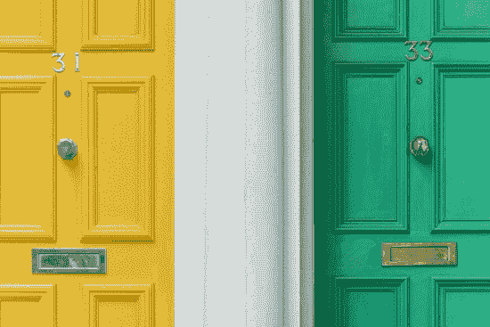

# 没有正确的决定

> 原文：<https://www.raptitude.com/2018/07/right-decision/?utm_source=wanqu.co&utm_campaign=Wanqu+Daily&utm_medium=website>

我有时会在重大采购上停滞不前，甚至长达数月。如果我找不到合适的打印机或跑鞋(至少对我来说)，我通常会去收集更多信息。

我查了更多的评论。我征求了一些朋友的意见，他们似乎不那么担心买鞋或买打印机。大部分时间我只是让时间流逝。

几年前，在一个月需要但没有购买打印机后，我发了一条类似这样的微博，“所以我想买一台打印机，但不知道从哪里开始……有什么建议吗？”

过了一会儿，我的好朋友内特回应道，“这是购买打印机的方法:你去商店买一台打印机。”

我做到了，我不得不承认他的策略至少和我通常的三个月沉思一样有效。我选择了他们的一台打印机。它可以打印。

所以我最终得到了正确的打印机，但当时我觉得我只是运气好。我不知道这是正确的选择，我只是做了一些事情。这是一个经过衡量的风险，碰巧得到了解决。

生活中的许多压力和困难都归结于做出大大小小的决定，而且这些决定从未停止过。什么是正确的决定？修旧车还是买新车？继续工作还是辞职去做自由职业者？剪短你的头发或者重新整理你的头发？而选择之前需要有多大的自信？

做对了感觉真好。我们都有这样的感觉，我们为这个特殊的日子选择了正确的酒店房间，或正确的职业道路，或正确的电影。

我们也知道一种明确无误的感觉，那就是做出了错误的选择:法学院是一个错误；“时髦而舒适”的 Airbnb 原来是一个可以俯瞰永久交通堵塞的壁橱；海鹰[在应该跑](https://www.washingtonpost.com/news/sports/wp/2015/02/02/worst-play-call-in-super-bowl-history-will-forever-alter-perception-of-seahawks-patriots/?noredirect=on&utm_term=.8a4359cc88e4)的时候过去了。

不管一个决定是否正确，生活还是要继续。如果是正确的，那太好了。如果是错误的，至少你学到了一些危险信号。

最近，我接触到一个绝妙的想法:没有正确的决定。

没有正确的决定，从来都没有。我们一直在努力寻找合适的回应，合适的服装，合适的浴室瓷砖，合适的电影，这一切都是徒劳的。

我们确实做出了选择，而且这些选择确实会产生后果。但是有一个“正确”的想法只是我们告诉自己的一个故事。

选择可以是合理的，也可以是不合理的。它们的结果可能出人意料地有益，也可能出人意料地有害。但是没有绝对正确的行动路线，只有一系列可能的行动路线——而每一种行动路线都有一个庞大的、无止境的后果网。

假设你为你的新产品选择了一个你认为合适的名字。在不同的一天，在不同的心情下，你可以选择不同的名字，也相信这是正确的。无论你选择哪个名字，也许 18 个月后，当你在销售中挣扎时，你可能会决定你的选择实际上是错误的。一年后，当你解决了这个问题，你再次相信你选择的名字是正确的——你只是选错了广告公司。

这只是一个故事。可能有更好和更差的选择，但没有正确的选择。

然而，我们仍然在处理我们的许多困境，就好像在某个地方有一个正确的行动路线，我们迫切需要找到它。也许我们只能艰难地发现是什么，但正确的选择会以某种方式显现出来。

但它从来没有真正做到过。即使事后，当我们带着后果生活时，我们也不知道什么是正确的选择。我们只知道我们是喜欢我们现在的位置还是不喜欢我们现在的位置。

当然，你可以把你现在的处境归因于你曾经做过的几乎任何一个决定——选择产品名 A 而不是 B，抛弃你的高中恋人，搬到海边，和瘾君子而不是预科生在一起，最近几年起得不够早。到底哪些是对的，哪些是错的？这是一个毫无意义的声明，除了可能在以后用作修辞，责备我们自己或其他人。

这似乎是语义上的区别。好吧，没有“正确”的选择，但显然还是有更好和更差的。

但这很重要。试图做出明智、充分知情的选择和试图做出正确的选择之间有很大的区别。

首先，这意味着收集更多的信息永远不会揭示正确的选择。更多的信息*可能*会有帮助，但是没有足够的东西——在某些时候，需要一个飞跃，然后，你仍然不知道什么是最好的。我可以研究打印机十年。如果我得到了一个哑弹，我仍然会认为这是一个“错误”的选择。

第二，正确选择的概念意味着我们选择的结果以某种方式清晰地联系在一起，并与其他任何事情隔离开来。你选择选项 A，得到结果 x。

但是选择和结果并不是一一对应的，就像游戏中的门一样，每一扇门都隐藏着奖励或惩罚。每一个行动都会引发无尽的连锁反应，这些连锁反应通常是有益的和有害的，短期的和长期的，有意的和无意的，已知的和未知的。

你选择在家工作会让你有更多的通勤时间(肯定是好的)，更多的家庭时间(好的)，但也会让你和伴侣的关系更紧张(不好的)，更难得到足够的锻炼(不好的)，谁知道还会发生什么。每一种影响都会以看得见和看不见的方式永远影响你生活的其他部分。

然而，我们倾向于认为我们可以孤立地看待一个困境，确定正确的反应，并执行它，就像我们在台球桌上排队击球一样。

放弃正确决策的想法并不意味着放弃使用我们最好的判断。但是，认识到把*、*做对，从任何有意义的意义上来说，都是一个不可能的目标，这是一种巨大的解脱。

我认为它是这样运作的:你会做一百万个决定，每个决定都会以你几乎不知道的方式塑造你和其他人的生活。你会有令人惊讶的成功和令人惊讶的失败。你会给自己太多的荣誉。那你会死的。

比任何决定或其后果更重要的是你*倾向于*做出的*各种*决定背后的动机。多年来应用的原则有一致的、可追踪的轨迹。

你可能会也可能不会带着良好的意愿做出选择。你可能会也可能不会从你的选择中学习。你可能会走运，也可能不会。但是你永远不会把事情做对。所以让你自己解脱吧。

***